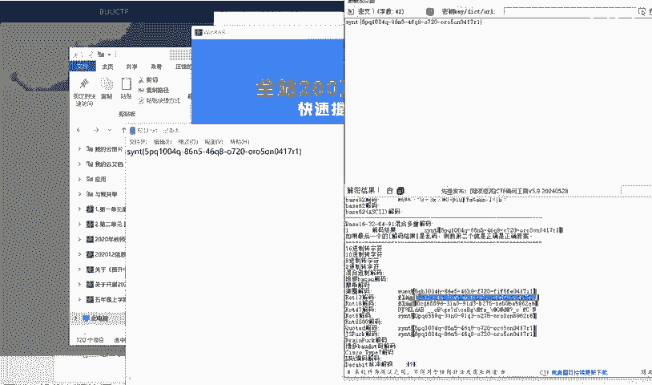
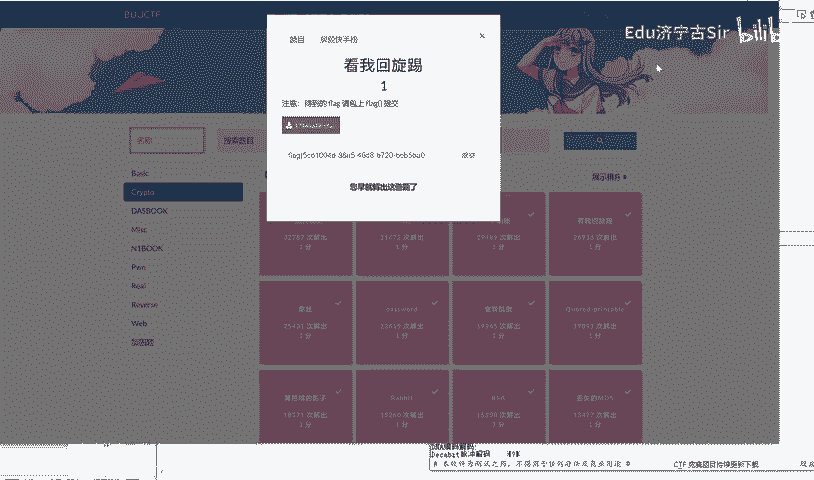

# BUUCTF-Crypto：P1：看我回旋踢 🔄

在本节课中，我们将要学习如何解决一道名为“看我回旋踢”的BUUCTF密码学题目。这道题的核心是识别并应用一种经典的替换密码。

## 概述

题目提供了一个加密后的字符串，我们需要找出其对应的明文。根据经验，这种简单的字符替换通常与凯撒密码有关。凯撒密码是一种移位密码，每个字母在字母表上向后或向前移动一个固定数值进行替换。

## 分析密文

首先，我们观察题目给出的密文。密文为：`synt{5pq1004q-86n5-46q8-o720-oro5on0417r1}`。

从格式上看，它类似于flag的常见格式 `flag{...}`，但开头的 `synt` 明显是加密后的 `flag`。这提示我们，整个字符串可能经过了统一的字符移位处理。

## 应用凯撒密码

凯撒密码的加解密过程可以用一个简单的公式表示。

**加密公式**：`C = (P + K) mod 26`
**解密公式**：`P = (C - K) mod 26`

其中：
*   `C` 代表密文字母
*   `P` 代表明文字母
*   `K` 代表移位的偏移量
*   `mod 26` 表示对26取模（对应26个英文字母）

为了破解它，我们需要找到偏移量 `K`。一个常见的方法是尝试所有可能的偏移量（1到25），这种方法称为暴力破解。

## 尝试偏移量

上一节我们介绍了凯撒密码的原理，本节中我们来看看如何找到正确的偏移量。

我们可以手动计算，也可以使用工具。已知密文开头是 `synt`，而正确的开头应为 `flag`。让我们比较第一个字母：
*   密文 `s` 在字母表中是第19位。
*   明文 `f` 在字母表中是第6位。

计算偏移量：`K = s - f = 19 - 6 = 13`。偏移量13是凯撒密码中一个非常经典的偏移，也称为ROT13。

因此，我们可以确定加密使用的偏移量就是13。在ROT13中，加密和解密是相同的操作，因为移位两次13（共26）会回到原字母。

## 解密获取Flag

以下是使用偏移量13对密文进行解密后的结果：

我们将 `synt{5pq1004q-86n5-46q8-o720-oro5on0417r1}` 每个字母应用ROT13解密：
*   s -> f
*   y -> l
*   n -> a
*   t -> g
*   花括号内的数字和连字符保持不变。

最终得到的明文为：`flag{5cd1004d-86a5-46d8-b720-beb5ba0417e1}`。

## 总结

本节课中我们一起学习了如何解决一道基于凯撒密码的CTF题目。我们首先通过密文格式推测加密算法，然后通过对比已知部分（如`flag`）计算出具体的偏移量（K=13），最后应用ROT13解密得到了最终的Flag。对于简单的字符替换密码，观察格式和尝试常见偏移量是有效的解题方法。