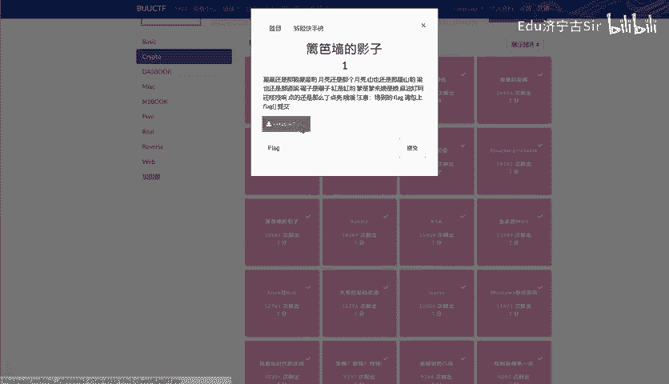
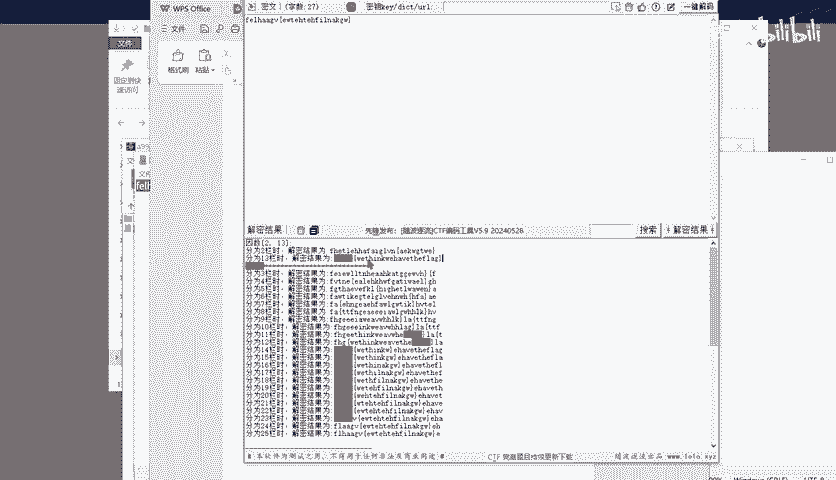

# BUUCTF-Crypto：P1：篱笆墙的影子 - 栅栏密码入门与实战

在本节课中，我们将要学习一种经典的古典密码——栅栏密码。我们将从基本概念入手，理解其加密和解密原理，并通过一个具体的CTF题目实例来掌握如何手动和利用工具进行解密。

## 概述

栅栏密码是一种简单的换位密码。它的核心思想是将明文按一定规则“之”字形排列，然后按行读取形成密文。理解其排列规则是解密的关键。

上一节我们介绍了课程概要，本节中我们来看看栅栏密码的具体工作原理。

## 栅栏密码加密原理

栅栏密码的加密过程分为两步：先将明文按特定规则排列，再按行读取生成密文。

以下是加密的具体步骤描述：
1.  确定一个栏数（或称密钥），例如栏数为3。
2.  将明文字符从左到右、从上到下按“之”字形写入相应行。
3.  将所有行从上到下拼接起来，即得到密文。

我们可以用公式来描述明文索引 `i` 在 `n` 栏加密中的行号 `r`：
`r = i % n`
其中 `%` 是取模运算。但更直观的理解是“之”字形往复填充。


为了更直观，我们来看一个例子。

## 加密示例

假设明文为 `WEAREDISCOVEREDFLEEATONCE`，栏数（密钥）为3。

加密过程如下：
1.  将明文按“之”字形写入3行：
    ```
    W   E   C   R   L   T   E
     E R D S O E E F E A O C
      A   I   V   D   E   N
    ```
2.  按行读取字符：
    *   第一行：`WECRLTE`
    *   第二行：`ERDSOEEFEAC`
    *   第三行：`AIVDEN`
3.  将三行连接起来，得到密文：`WECRLTEERDSOEEFEACAIVDEN`

上一节我们通过例子看到了加密过程，本节中我们来看看如何逆向操作，即解密过程。

## 栅栏密码解密原理

解密是加密的逆过程。已知密文和栏数，我们需要恢复出原始的“之”字形排列，然后按列读取得到明文。

以下是解密的核心思路：
1.  根据密文长度和栏数，计算出每一行大约有多少个字符。
2.  将密文按计算出的长度分割成对应的行。
3.  按列依次从每一行取一个字符，即可拼出明文。



解密过程同样可以通过索引计算来描述。对于第 `r` 行，其字符在明文中出现的索引位置是满足 `i % n == r` 的所有 `i`。

理论略显抽象，我们通过解密刚才的密文来巩固理解。

## 解密示例

已知密文 `WECRLTEERDSOEEFEACAIVDEN`，栏数为3。

解密过程如下：
1.  密文长度23，栏数3。计算每行字符数：`23 / 3 = 7` 余 `2`。这意味着前两行有8个字符，最后一行有7个字符。
2.  将密文按（8， 8， 7）的长度分割：
    *   第一行：`WECRLTE`
    *   第二行：`ERDSOEEF`
    *   第三行：`EACAIVDEN`
    *   （注意：这里第二行和第三行的分割与加密示例略有不同，是因为加密时“之”字形填充导致行尾分配不同，但解密算法能正确处理）
3.  创建一个与明文长度相同的空位。
4.  模拟“之”字形填充顺序，将分割后的行字符依次填入对应位置。
5.  按行（或直接按填充顺序）读取，即可得到明文 `WEAREDISCOVEREDFLEEATONCE`。

在实际解题中，我们常使用工具自动尝试不同栏数。接下来，我们看一个CTF实战题目。

## CTF实战：BUUCTF【篱笆墙的影子】

题目给出的密文为：`felhaagv{ewtehtehfilnakgw}`

我们的目标是解密出flag。



解题步骤如下：
1.  **观察**：密文格式类似 `flag{...}`，但被扰乱。这提示我们 `f`、`l`、`a`、`g`、`{`、`}` 这几个关键字符应该通过解密回到正确位置。
2.  **推测**：这很可能是一个栅栏密码，因为其特点就是打乱字符顺序而不改变字符本身。
3.  **尝试**：我们需要尝试不同的栏数（密钥）进行解密。
    *   栏数为2时，解密结果不理想。
    *   **栏数为5时**，我们得到了可读的结果。

以下是栏数为5时的解密过程演示（概念性）：
将密文按5栏“之”字形排列，再按列读取，即可得到：
`flag{wethinkwehavetheflag}`

在实际操作中，我们可以使用在线工具或Python脚本快速验证。例如，一个简单的Python解密函数如下：

```python
def rail_fence_decrypt(ciphertext, rails):
    length = len(ciphertext)
    fence = [[''] * length for _ in range(rails)]
    dir_down = None
    row, col = 0, 0

    # 模拟栅栏路径，标记位置
    for i in range(length):
        if row == 0:
            dir_down = True
        if row == rails - 1:
            dir_down = False

        fence[row][col] = '*'
        col += 1
        row += 1 if dir_down else -1

    # 将密文填入标记的位置
    index = 0
    for r in range(rails):
        for c in range(length):
            if fence[r][c] == '*' and index < length:
                fence[r][c] = ciphertext[index]
                index += 1

    # 按路径读取明文
    result = []
    row, col = 0, 0
    for i in range(length):
        if row == 0:
            dir_down = True
        if row == rails - 1:
            dir_down = False
        if fence[row][col] != '':
            result.append(fence[row][col])
            col += 1
        row += 1 if dir_down else -1
    return ''.join(result)

cipher = "felhaagv{ewtehtehfilnakgw}"
for r in range(2, 10):
    print(f"Rails {r}: {rail_fence_decrypt(cipher, r)}")
```
运行脚本会发现，当 `rails=5` 时输出正确的flag。

因此，该题目的flag是：**flag{wethinkwehavetheflag}**

## 总结

本节课中我们一起学习了栅栏密码。我们从加密和解密的基本原理出发，通过公式和示例阐述了其“之”字形排列的核心思想。最后，我们应用所学知识，成功解密了一道CTF题目，找到了隐藏的flag。记住，对于栅栏密码，当不知道栏数时，可以尝试所有可能的栏数（通常从2到密文长度的一半），直到解出有意义的明文。