# CTF密码学入门：P1：猪圈密码解析与实战

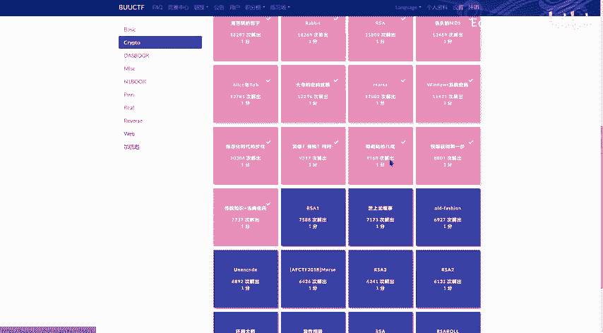

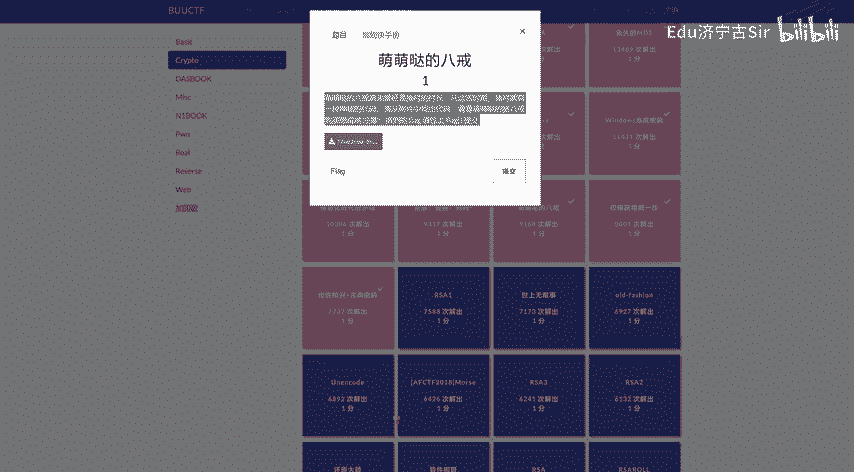

在本节课中，我们将学习一种名为“猪圈密码”的古典密码，并通过一道来自BUUCTF平台名为“萌萌哒的八戒”的题目进行实战演练。我们将了解其基本原理、识别方法以及解密步骤。

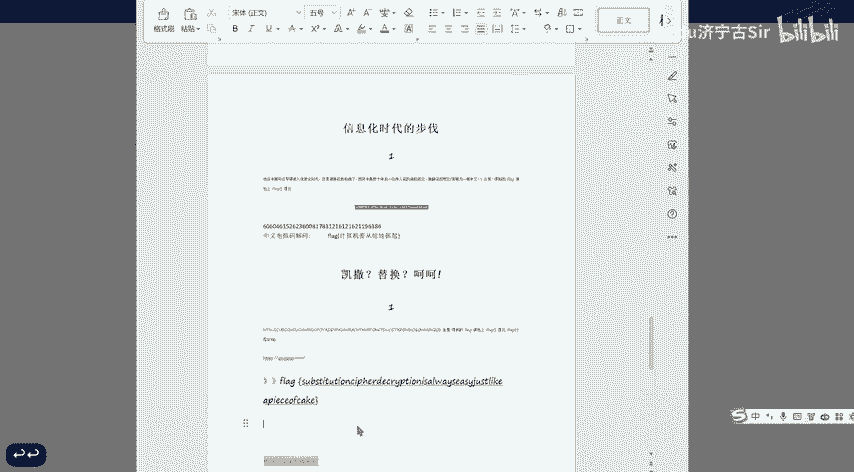

## 猪圈密码简介

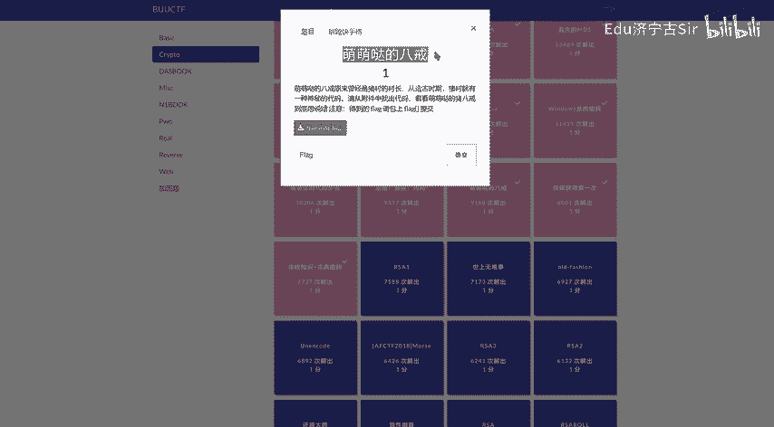

猪圈密码是一种使用简单图形替代字母的密码。其核心思想是将字母表映射到特定的网格或“猪圈”图案中。

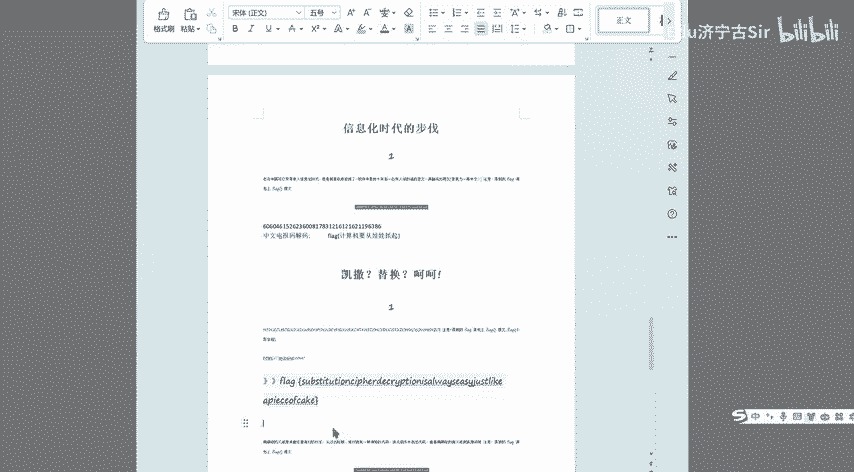

## 题目分析与识别

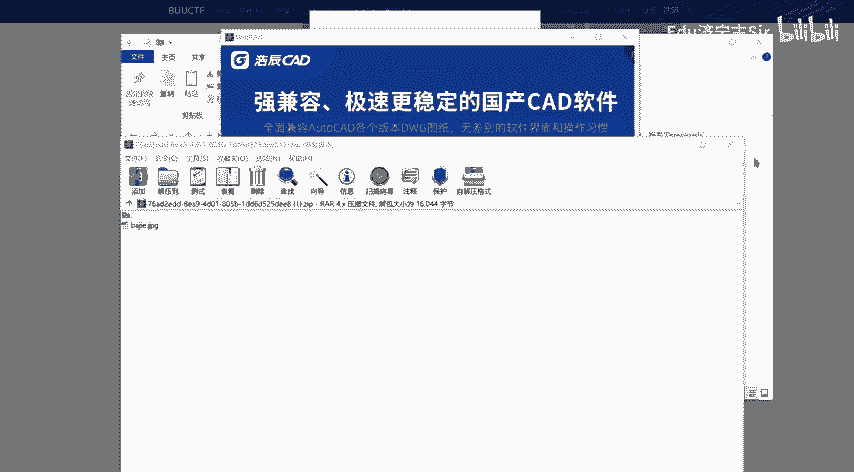

上一节我们介绍了猪圈密码的基本概念。本节中我们来看看如何识别题目中使用的密码。

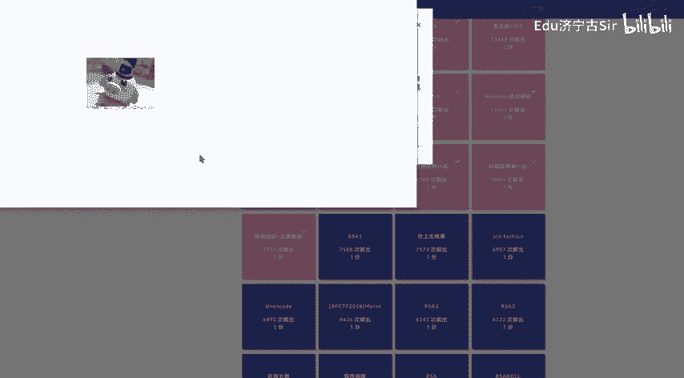

题目给出了一张包含神秘图案的图片。这些图案由线条和点构成，排列在网格中。观察这些图案，可以发现它们与猪圈密码的典型符号非常相似。

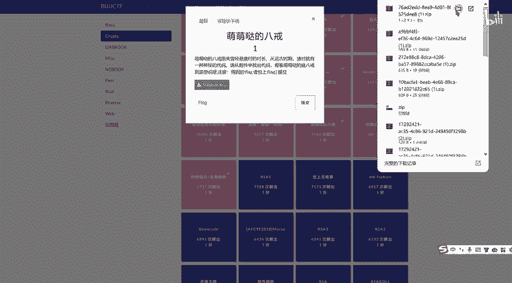

## 解密过程详解

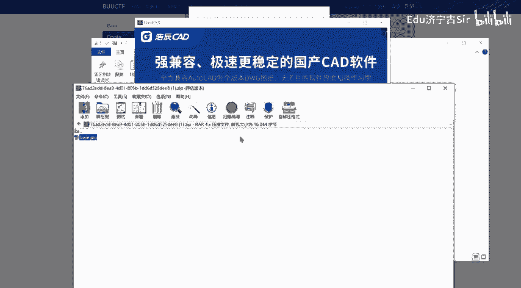

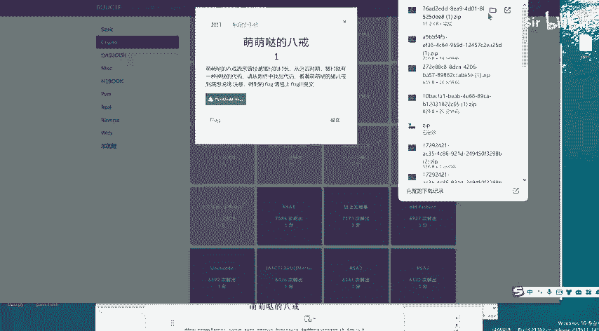

识别出密码类型后，下一步就是进行解密。以下是解密的具体步骤。

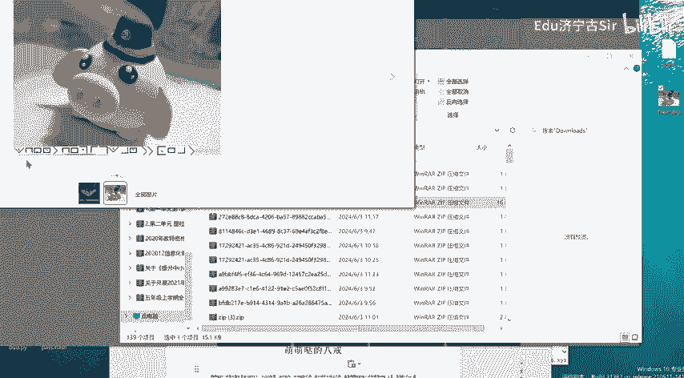

首先，需要找到标准的猪圈密码对照表。猪圈密码通常将26个英文字母映射到特定的网格符号中。

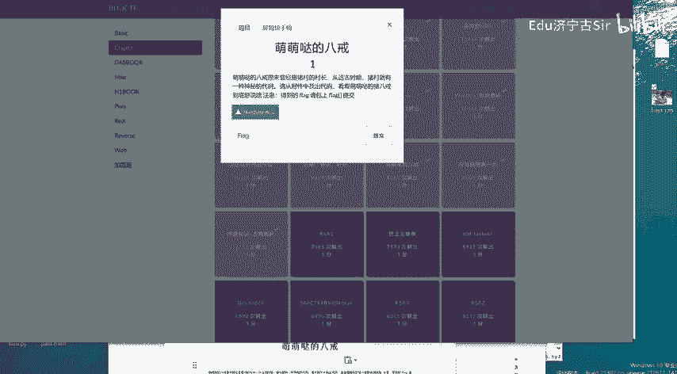

以下是猪圈密码的一个常见对照表示例（部分）：
*   **A**：一个左上角带点的方格
*   **B**：一个右上角带点的方格
*   **C**：一个左下角带点的方格
*   **D**：一个右下角带点的方格
*   **E**：一个左右两侧带点的方格
*   …（其他字母依此类推，有不同变种）

然后，将题目图片中的每一个图案，按照对照表逐一翻译成对应的英文字母。

这个过程需要耐心。将翻译出的字母组合起来，就得到了明文信息。在本题目中，解密后得到的句子是：**`when the pig want to eat`**。

## 总结与回顾

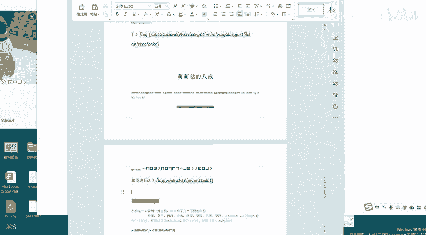

本节课中我们一起学习了猪圈密码。我们首先了解了它是一种基于图形替换的古典密码。接着，我们通过一道CTF题目实战，学会了如何根据图案特征识别猪圈密码，并利用对照表完成解密，最终得到了flag相关的明文信息。掌握这类古典密码的识别与破解，是CTF密码学入门的重要一步。