# CTF Pwn入门：P1：连接靶机与获取Flag 🚩

在本节课中，我们将学习如何连接到CTF比赛的Pwn题目靶机，并使用`nc`命令获取Flag。这是CTF竞赛中最基础的操作之一。

## 概述

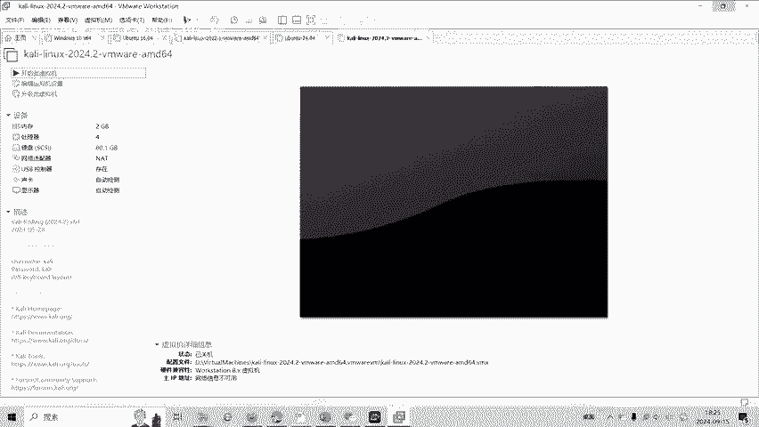

题目“签个到吧”是一道签到题，主要目标是让选手熟悉如何连接到远程靶机。题目提供了一个靶机地址，但该地址无法通过网页直接访问。我们需要使用网络工具`nc`（Netcat）来建立连接。


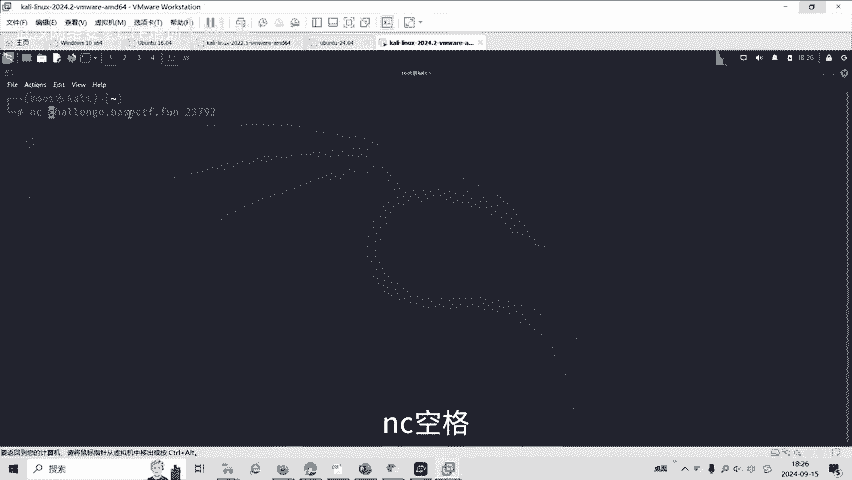

## 连接靶机

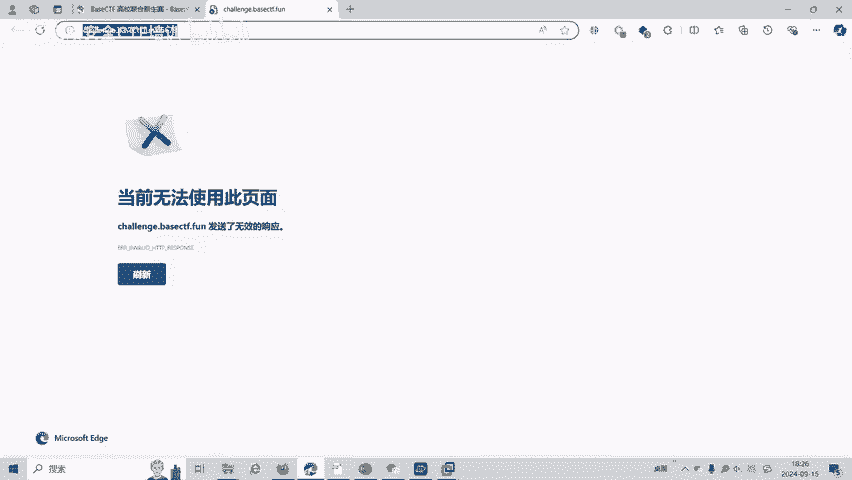

上一节我们介绍了题目的基本目标，本节中我们来看看如何使用`nc`工具进行连接。

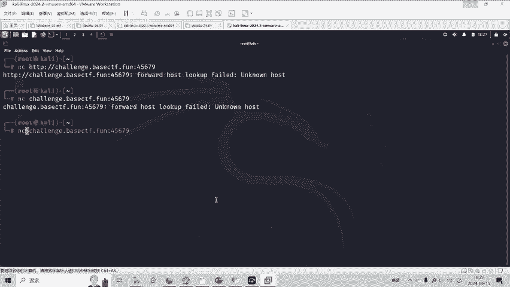

题目给出的靶机地址格式通常为：`IP地址:端口号` 或 `域名:端口号`。这个地址不能直接在浏览器中打开。

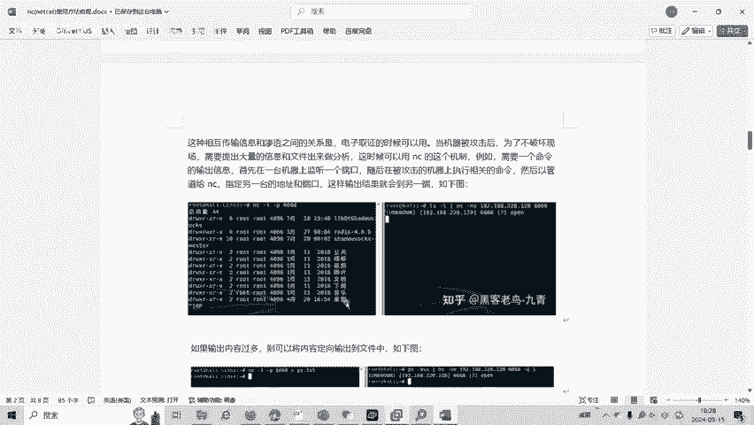

我们需要在命令行中使用`nc`命令。`nc`是一个功能强大的网络工具，可以用于读取和写入网络连接。

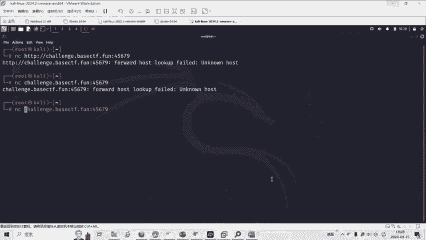

以下是使用`nc`连接靶机的基本命令格式：
```bash
nc <靶机地址> <端口号>
```

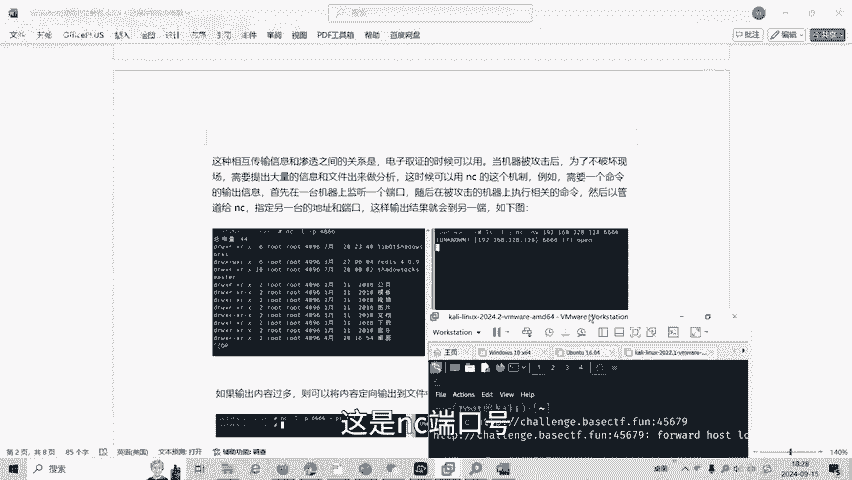

具体到本题，我们将靶机地址和端口号作为参数传递给`nc`命令。

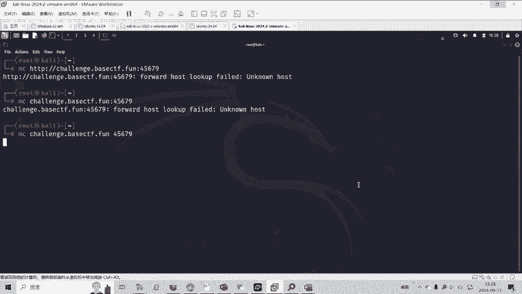

## 获取Flag

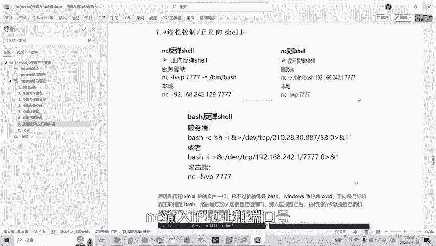

成功连接靶机后，我们便进入了一个交互式环境。通常，我们需要在连接后的命令行中执行一些命令来寻找Flag。

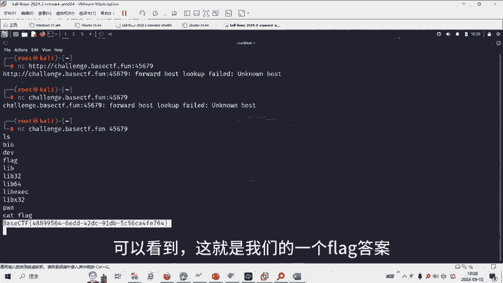

在本题目中，连接后我们发现自己处于服务器的根目录`/`下。常见的做法是使用`ls`命令查看当前目录下的文件。

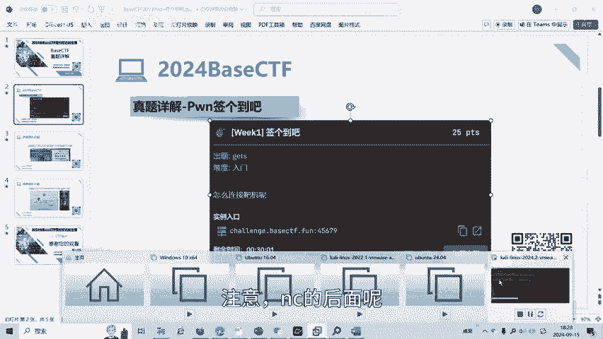

以下是连接后可以执行的命令示例：
```bash
ls
cat flag
```

执行`ls`命令后，我们发现当前目录下存在一个名为`flag`的文件。接着，我们使用`cat flag`命令来读取该文件的内容，显示出的字符串就是本题的Flag答案。

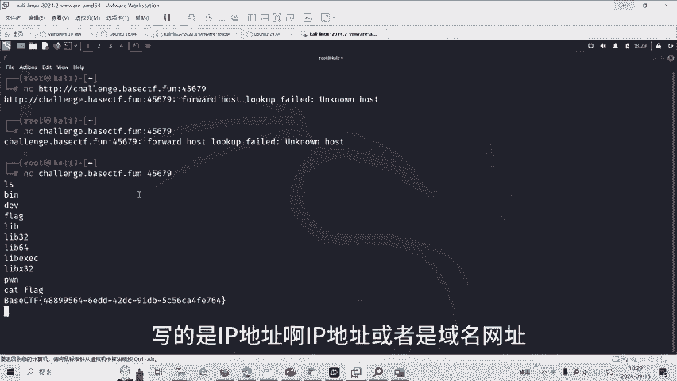

## 核心要点总结

本节课中我们一起学习了CTF Pwn题目的基础操作。

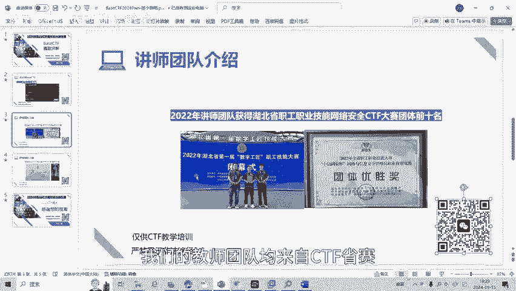

1.  **使用`nc`连接**：掌握`nc <地址> <端口>`的命令格式是连接远程靶机的关键。
2.  **交互与探索**：连接成功后，在命令行环境中使用如`ls`、`cat`等基本Linux命令来探索服务器并寻找Flag。
3.  **获取Flag**：找到包含Flag的文件（通常是`flag`或`flag.txt`），并使用`cat`命令读取其内容。

通过这道简单的签到题，我们完成了从连接靶机到获取Flag的完整流程。这是解决后续更复杂Pwn题目的第一步。