# CTF Web安全：P1：MD5强弱比较、真实碰撞与扩展攻击详解 🔐

在本教程中，我们将详细解析一道涉及MD5哈希函数多种攻击手法的CTF Web题目。我们将学习如何绕过MD5的强比较（`===`）和弱比较（`==`），利用工具生成MD5真实碰撞，并最终通过长度扩展攻击获取Flag。内容力求简单直白，适合初学者理解。

---

## 题目概述与初始分析

题目提示涉及MD5的强弱比较和长度扩展攻击。首先，我们需要通过POST方式传递参数 `apple` 和 `banana`。

第一个判断语句使用**强比较**（三个等号 `===`）。在PHP中，MD5函数处理数组时会返回 `NULL`。因此，如果传入两个不同的数组，它们的MD5值（均为`NULL`）在强比较下会相等。

**绕过方法**：
```php
apple[]=1&banana[]=2
```
执行后，我们成功绕过了第一个条件。

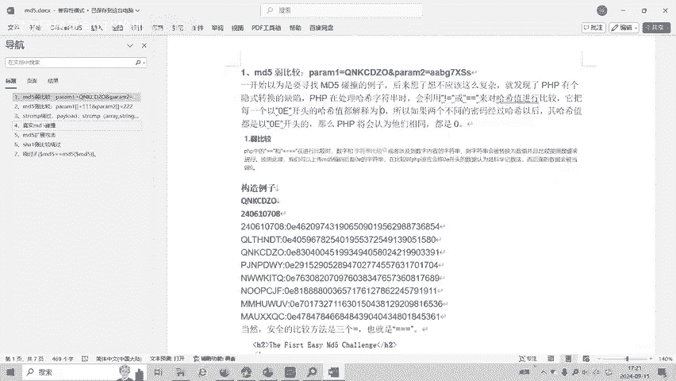

---

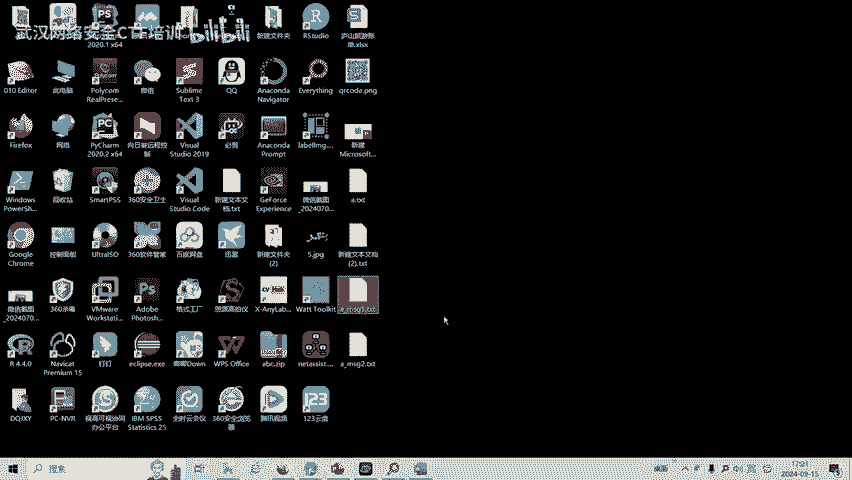

## 绕过MD5弱比较

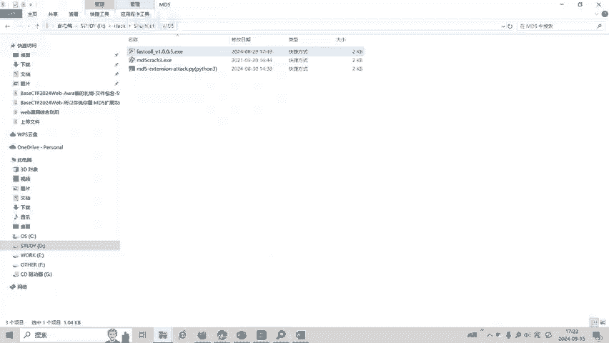

上一节我们绕过了强比较，本节中我们来看看第二个条件：**弱比较**（两个等号 `==`）。

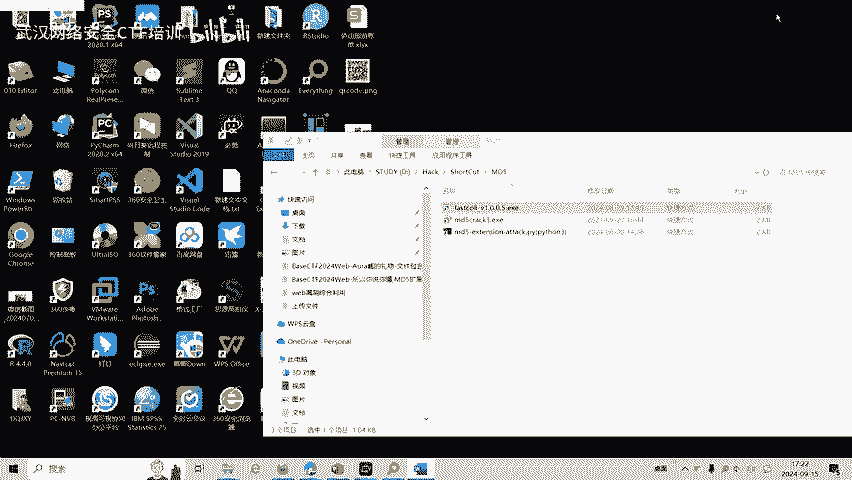

在PHP弱比较中，字符串若以 `0e` 开头，其后均为数字，则会被科学计数法解释为 `0`。因此，我们需要找到两个不同的字符串，它们的MD5值都以 `0e` 开头。

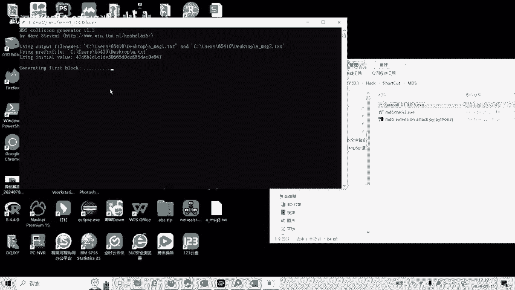

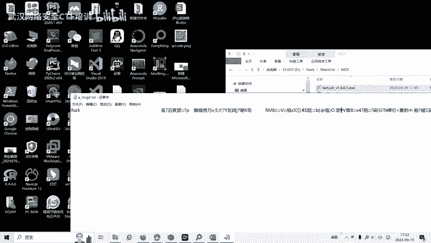

**已知的碰撞对示例**：
- `apple=240610708` 的MD5值为 `0e462097431906509019562988736854`
- `banana=QNKCDZO` 的MD5值为 `0e830400451993494058024219903391`

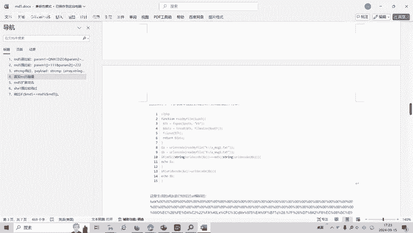

**绕过方法**：
```php
apple=240610708&banana=QNKCDZO
```
这两个值不相等，但它们的MD5值在弱比较时都被视为 `0`，因此条件成立。

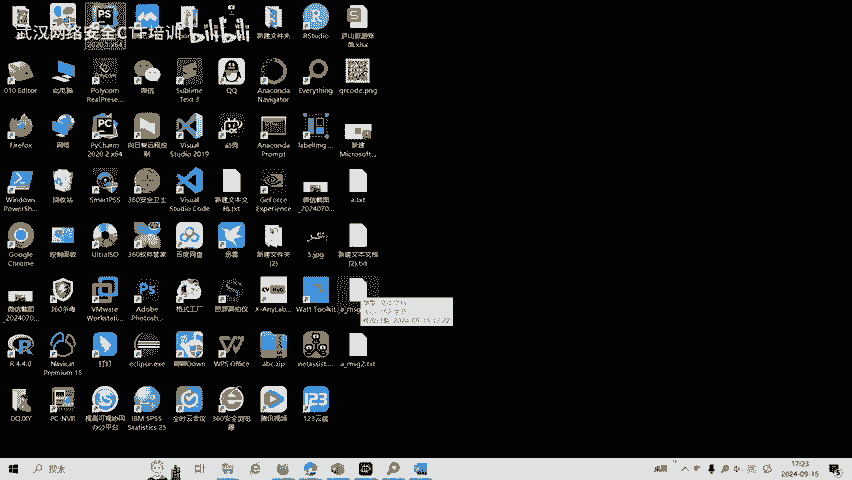

---

## 生成MD5真实碰撞

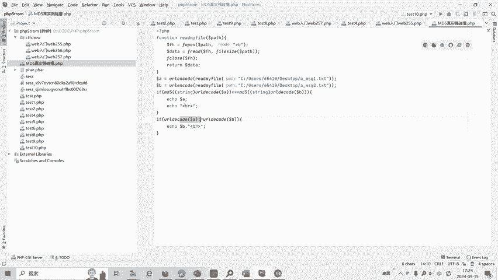

我们已绕过弱比较，现在面临第三个挑战：要求 `apple` 和 `banana` 不相等，且被转换为字符串对象（不能是数组），但它们的MD5值必须严格相等。

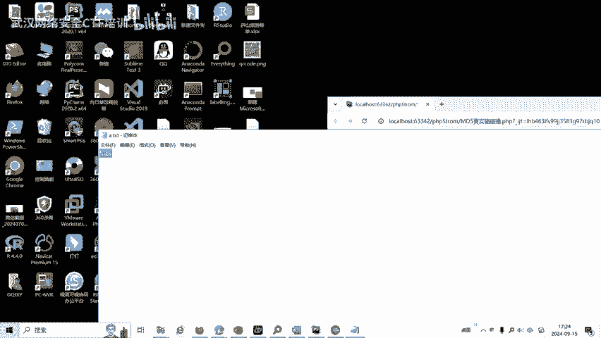

这就需要用到 **MD5真实碰撞** 攻击。我们可以使用 `fastcoll` 这类工具来生成两个开头相同但内容不同的文件，使它们的MD5值完全相同。

以下是操作步骤：
1.  准备一个初始文件（例如内容为 `a`）。
2.  使用 `fastcoll` 工具生成两个碰撞文件 `msg1.bin` 和 `msg2.bin`。
3.  这两个文件内容不同，但MD5哈希值相同。

由于生成的二进制文件包含不可见字符，我们需要将其进行URL编码后才能通过POST传递。可以使用Python脚本完成读取和编码工作。

**示例Python代码**：
```python
import urllib.parse
with open('msg1.bin', 'rb') as f:
    data1 = f.read()
with open('msg2.bin', 'rb') as f:
    data2 = f.read()
apple = urllib.parse.quote(data1)
banana = urllib.parse.quote(data2)
print(f"apple={apple}&banana={banana}")
```
将脚本输出的参数值进行提交，即可绕过第三个检查点。

---

## 实施MD5长度扩展攻击

成功绕过所有前置检查后，我们进入了题目的核心部分。代码生成了一个48字节（96字符）的随机字符串 `$reno`，并显示了它的MD5值。

最终挑战是：我们需要提交一个参数 `name`，其最后5个字符必须是 `admin`，并且 `$reno` 与 `name` 连接后的字符串的MD5值，要等于我们提交的另一个参数 `code` 的值。

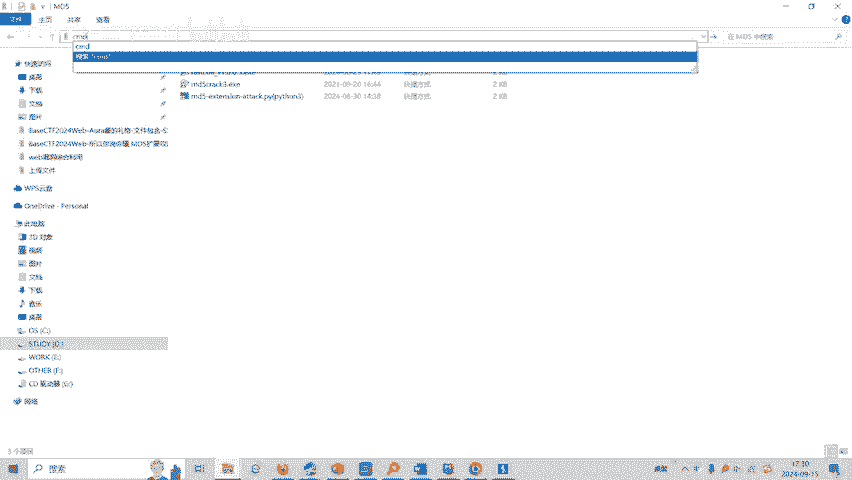

我们已知：
1.  `$reno` 的原始内容（96个字符）。
2.  `$reno` 的MD5哈希值。
3.  需要让 `name` 以 `admin` 结尾。

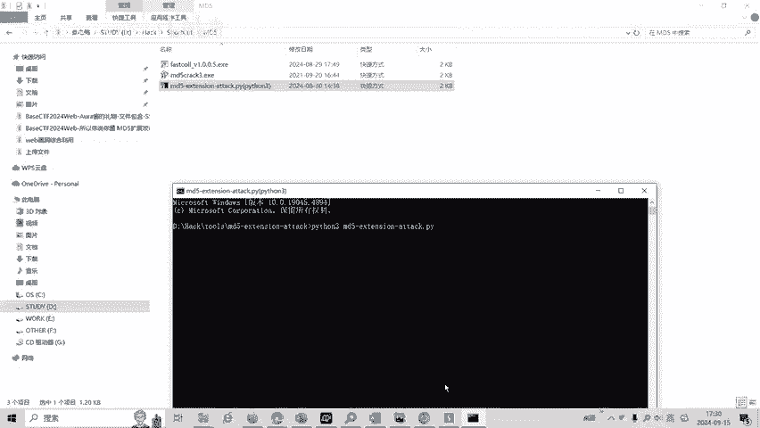

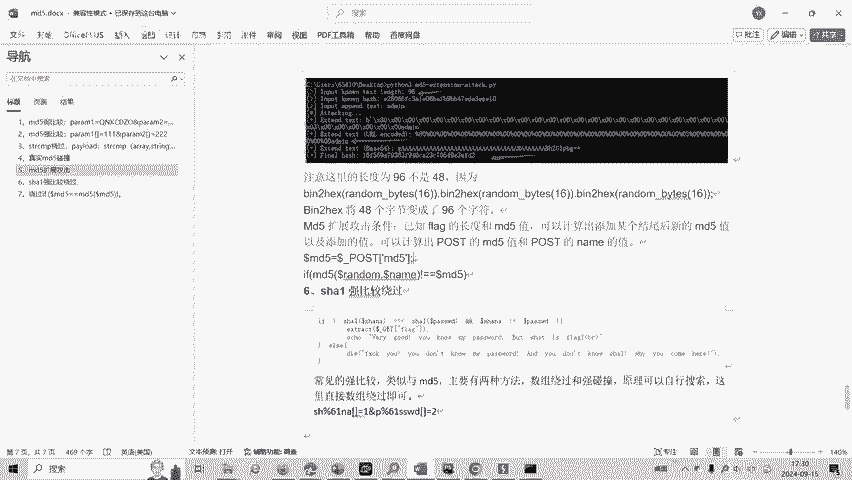

这正好符合 **MD5长度扩展攻击** 的条件。该攻击允许我们在已知原始消息及其MD5值、但不知密钥的情况下，推算出“原始消息+填充位+任意附加消息”的新MD5值。

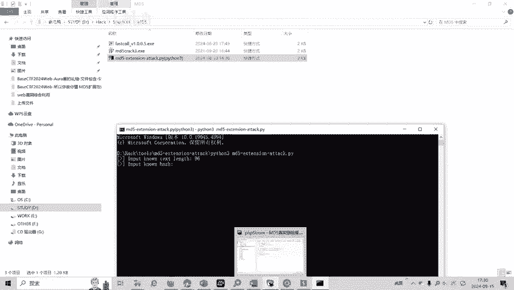

我们可以使用 `hashpump` 工具来完成此攻击。

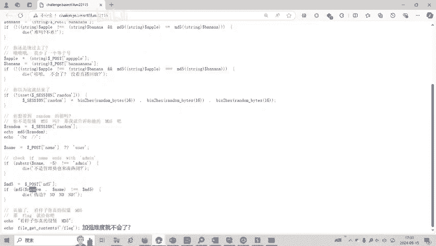

**攻击命令示例**：
```
hashpump -s 【已知的$reno的MD5值】 --data 【$reno的96字符】 -a admin -k 48
```
参数说明：
- `-s`: 已知的原始哈希值（MD5）。
- `--data`: 原始数据（`$reno`）。
- `-a`: 要附加的数据（`admin`）。
- `-k`: 原始数据的**字节长度**（48字节）。

命令执行后会输出两个结果：
1.  新的完整数据（即 `$reno` + 填充位 + `admin`），这就是我们应该提交的 `name` 参数值。
2.  对应的新MD5哈希值，这就是我们应该提交的 `code` 参数值。

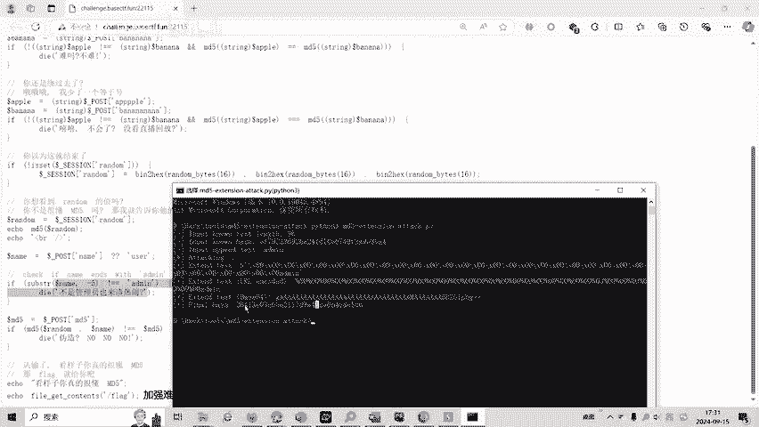

将计算得到的 `name` 和 `code` 值通过POST提交，即可成功通过所有验证，获得本题的Flag。

---

## 总结与延伸

本节课中我们一起学习了MD5在CTF题目中的多种攻击手法：

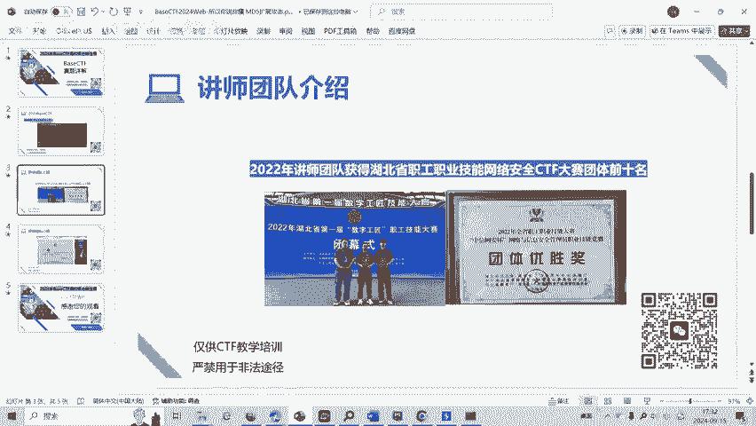

1.  **强比较绕过**：利用MD5处理数组返回`NULL`的特性。
2.  **弱比较绕过**：利用`0e`开头的哈希值在科学计数法下被解释为`0`的特性。
3.  **真实碰撞攻击**：使用`fastcoll`等工具生成两个MD5值相同但内容不同的数据。
4.  **长度扩展攻击**：在已知原消息长度和哈希值时，可推算出添加填充及新数据后的哈希值。

这些知识点是Web安全中哈希函数常见的考点。理解其原理并掌握相关工具的使用，对于CTF竞赛和深入理解密码学应用都大有裨益。