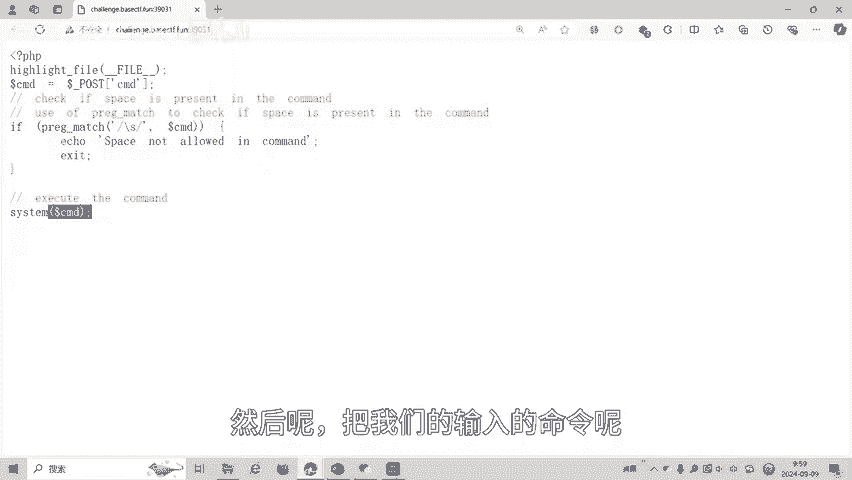
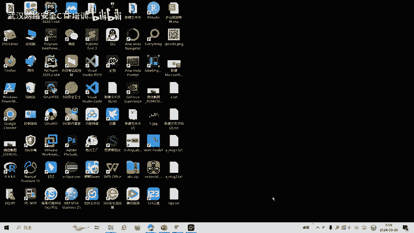
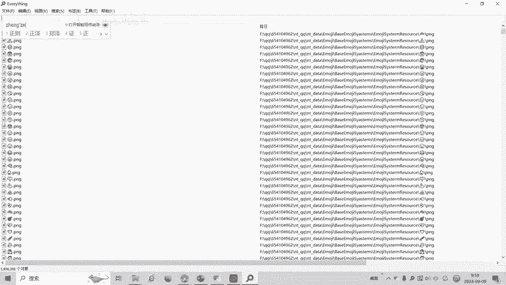
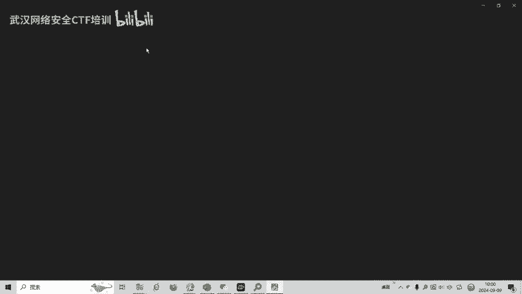

# CTF Web入门：命令执行中的空格绕过技巧

在本教程中，我们将学习一道CTF（Capture The Flag）Web题目，其核心是绕过命令执行中对空格的过滤。我们将分析题目逻辑，理解过滤原理，并掌握一种有效的绕过方法。

## 题目背景与分析

上一节我们介绍了CTF比赛的基本概念，本节中我们来看看一道具体的Web题目。题目来自BaseCTF2024高校联合新生赛，涉及外部命令执行漏洞，并设置了空格过滤。

题目提供了一个PHP代码片段，其核心逻辑如下：
```php
$CMD = $_POST['CMD'];
if (preg_match('/\s/', $CMD)) {
    die("Space not allowed in command.");
}
system($CMD);
```
代码通过POST请求接收`CMD`参数，并使用`preg_match(‘/\s/’, $CMD)`进行检测。这里的`\s`是一个正则表达式元字符。



`\s`的含义是匹配任何空白字符，包括：
*   空格
*   制表符 (`\t`)
*   换行符 (`\n`)
*   回车符 (`\r`)

如果用户输入的命令中包含任何上述空白字符，程序就会输出“Space not allowed in command.”并终止。只有通过检测的输入，才会被传入`system()`函数中执行。



## 空格绕过方法



理解了过滤规则后，本节我们来看看如何绕过对空格的检查。关键在于，在Linux的Bash shell中，有多种方式可以替代空格来分隔命令参数。



以下是几种常见的空格替代方法：
*   **使用`${IFS}`变量**：`IFS`（Internal Field Separator）是shell的内部字段分隔符，默认值包含空格、制表符和换行符。使用`${IFS}`可以替代空格。
*   **使用重定向符`<`或`<>`**：例如，`cat<flag.txt`。
*   **使用花括号`{}`扩展**：例如，`{cat,flag.txt}`。
*   **使用变量替换**：例如，先定义`X=$’\x20’`（十六进制20是空格），然后使用`cat$Xflag.txt`。

在本题目提供的解法中，使用了`${IFS}`配合花括号的方式成功绕过了过滤。

## 解题实战演示

现在，我们将应用上述绕过方法进行实战解题。

首先，我们尝试一个包含空格的正常命令`ls /`，会被拦截。接下来，我们使用绕过技巧。我们的目标是列出根目录下的文件，并读取`flag`文件。

以下是解题步骤：
1.  使用`ls${IFS}/`命令列出根目录。这里`${IFS}`替代了空格，成功绕过过滤，系统执行了`ls /`。
2.  发现根目录下存在`flag`文件后，使用`cat${IFS}/flag`命令读取其内容。这里同样用`${IFS}`替代了`cat`和`/flag`之间的空格。

通过这两步操作，我们无需使用空格字符，就成功执行了系统命令并获取了flag，完成了题目挑战。

## 总结与延伸

本节课中我们一起学习了CTF Web题目中一种常见的命令执行绕过技巧——空格绕过。


我们首先分析了题目代码，理解了使用`\s`进行空格过滤的原理。然后，我们学习了`${IFS}`这个Bash环境变量可以作为空格的替代品。最后，我们通过实战演示，使用`ls${IFS}/`和`cat${IFS}/flag`成功绕过过滤并获取了flag。

掌握各种字符的绕过方法是Web安全中命令执行漏洞利用的基础。除了`${IFS}`，你还可以尝试本节提到的其他方法，并思考如何绕过对更多特殊字符（如斜杠、点号等）的过滤。不断练习和探索，是提升CTF技能的关键。