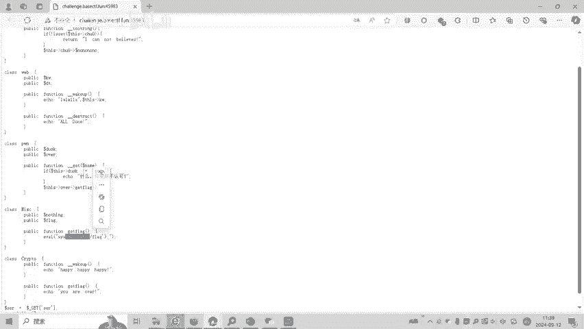
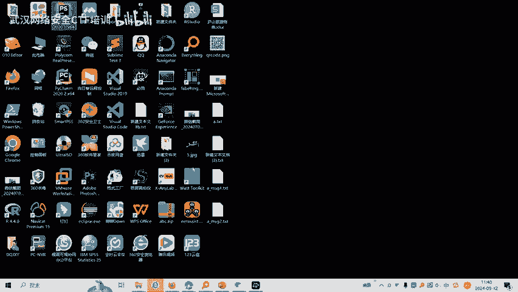
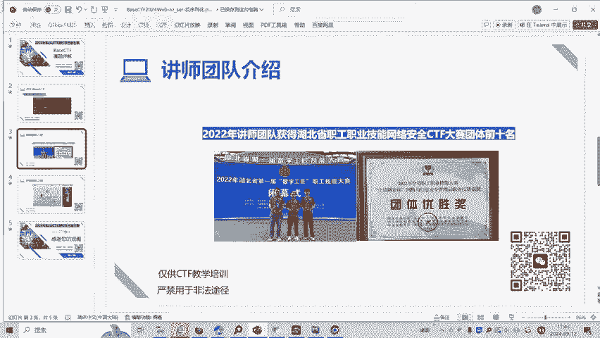

# CTF反序列化入门：P1：BaseCTF2024 Web-ez_ser 题解 🧩

在本节课中，我们将要学习一道CTF（Capture The Flag）竞赛中的Web反序列化入门题。我们将详细解析题目代码，理解反序列化漏洞的触发链，并最终构造出能够获取flag的序列化字符串。

---

## 题目概述

题目名为“ez_ser”，是一道关于PHP反序列化漏洞的入门题。我们的目标是利用代码中的反序列化功能，触发一系列魔术方法，最终执行能够读取flag的命令。

## 代码结构与漏洞入口

首先，我们来看主程序。它通过GET请求接收一个名为`ser`的参数，并将其值进行反序列化操作。

```php
$ser = $_GET['ser'];
unserialize($ser);
```

这里的`unserialize`函数就是漏洞的入口。当它处理我们传入的序列化字符串时，会触发对象中特定的魔术方法。

## 核心逻辑与魔术方法链

上一节我们介绍了漏洞入口，本节中我们来看看整个利用链是如何串联起来的。我们的最终目标是执行`Miss`类中的`get_flag`方法，因为它能读取`/flag`文件。

然而，直接触发`get_flag`并不容易。我们需要通过一系列魔术方法的接力调用：

1.  **`__wakeup`**： 反序列化时首先触发。
2.  **`__toString`**： 当对象被当做字符串处理时触发。
3.  **`__get`**： 当访问对象中不存在的成员变量时触发。
4.  **`__call`**： 当调用对象中不存在的方法时触发。

以下是整个攻击链的详细步骤：

**步骤 1：从 `__wakeup` 到 `__toString`**
在`Web`类中，`__wakeup`方法里有一行代码：`echo $this->k;`。如果`$this->k`是一个对象，PHP会尝试将其当作字符串处理，从而触发该对象的`__toString`方法。因此，我们需要让`Web`对象的`k`属性指向一个具有`__toString`方法的对象（例如`RE`类）。

**步骤 2：在 `__toString` 中触发 `__get`**
在`RE`类的`__toString`方法中，代码尝试访问`$this->l0l0l0`。然而，在`RE`、`Web`、`Pwn`、`Miss`、`Cp1`这些类中，都没有定义名为`l0l0l0`的成员变量。访问不存在的属性会触发`__get`魔术方法。

**步骤 3：在 `__get` 中触发 `__call`**
在`Pwn`类中，`__get`方法被定义。它检查`$name`是否为`“get”`。如果是，则返回`$this->over`对象。我们的目标是让`$this->over`成为一个`Miss`对象，这样下一步就能调用到它的方法。

**步骤 4：在 `__call` 中执行目标方法**
当`__get`返回了一个`Miss`对象后，`RE::__toString`中的代码`$this->l0l0l0->no();`将继续执行。这相当于调用`Miss`对象的`no()`方法。但`Miss`类中没有`no()`方法，因此会触发`Miss`类的`__call`方法。在`__call`中，如果被调用的方法名是`get_flag`，它就会执行读取flag的命令。



## 构造利用链（POC）



理解了逻辑链后，我们现在来构造具体的利用代码（Proof of Concept）。我们需要按照链的顺序，实例化并连接各个对象。

以下是构造POC的步骤：

1.  创建终点对象`$d`，它是一个`Miss`类的实例。
2.  创建`$c`，一个`Pwn`类的实例。将其`over`属性设置为`$d`（即Miss对象），以确保`__get`返回的是Miss对象。
3.  创建`$b`，一个`RE`类的实例。将其`l0l0l0`属性设置为`$c`（即Pwn对象）。注意，虽然`RE`类没有这个属性，但在序列化字符串中我们可以强制声明它，以触发`Pwn::__get`。
4.  创建起点对象`$a`，一个`Web`类的实例。将其`k`属性设置为`$b`（即RE对象），以触发`RE::__toString`。

```php
// 假设所有类都已定义
$d = new Miss(); // 最终目标
$c = new Pwn();
$c->over = $d;    // 使 Pwn::__get 返回 Miss 对象

$b = new RE();
$b->l0l0l0 = $c;  // 触发 Pwn::__get

$a = new Web();
$a->k = $b;       // 触发 RE::__toString

// 生成 payload
$payload = serialize($a);
echo $payload;
```

运行上述代码，将得到一串序列化字符串。将这个字符串作为`ser`参数的值发送给题目服务器，即可触发完整的漏洞链，最终在服务器端执行`Miss::get_flag()`，从而获取flag。

## 总结



本节课中我们一起学习了一道CTF反序列化入门题。我们分析了以下关键点：
1.  **漏洞入口**：`unserialize`函数。
2.  **利用链**：`__wakeup` -> `__toString` -> `__get` -> `__call`，通过精心控制对象的属性将它们连接起来。
3.  **最终目标**：让`Miss`类的`__call`方法执行，从而运行读取flag的系统命令。
4.  **构造Payload**：按照利用链反向实例化并组装对象，最后序列化起点对象得到攻击字符串。

掌握反序列化漏洞的关键在于理解各个魔术方法的触发条件以及如何通过对象属性将它们构造成一条可用的攻击链。