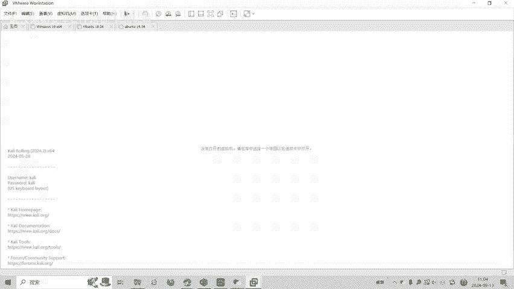
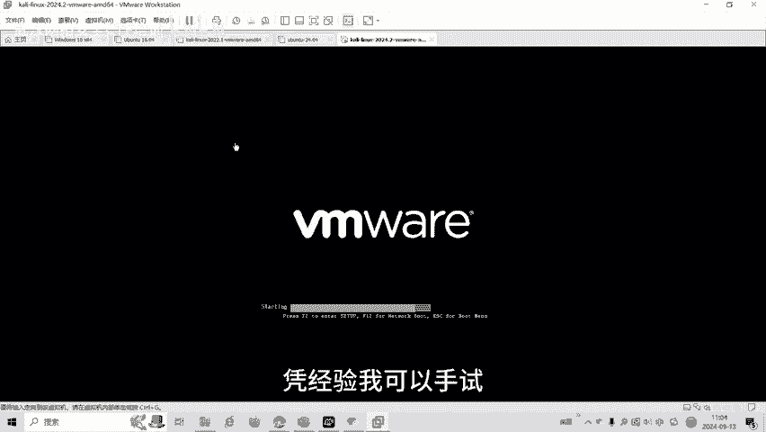
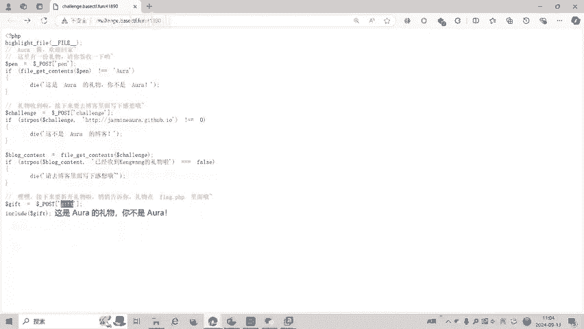
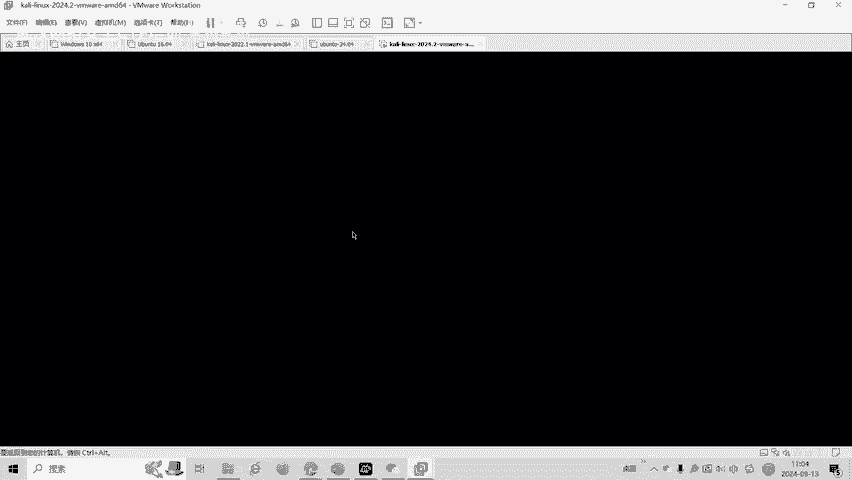
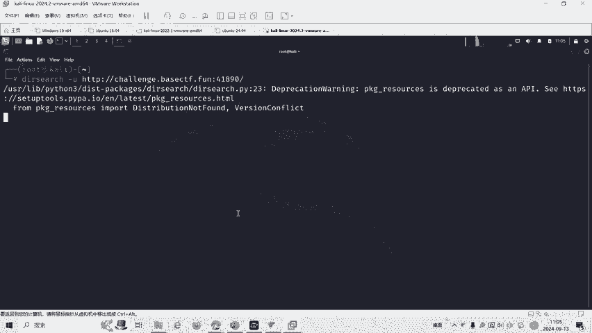
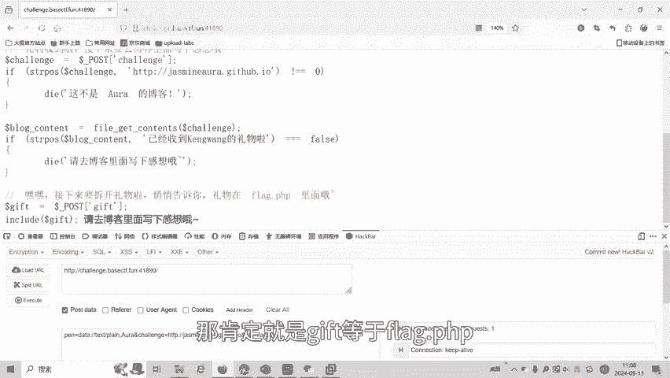
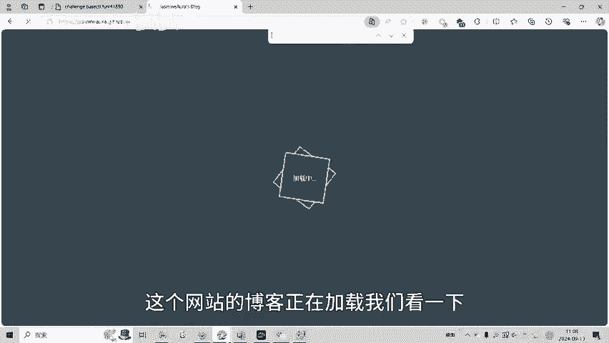
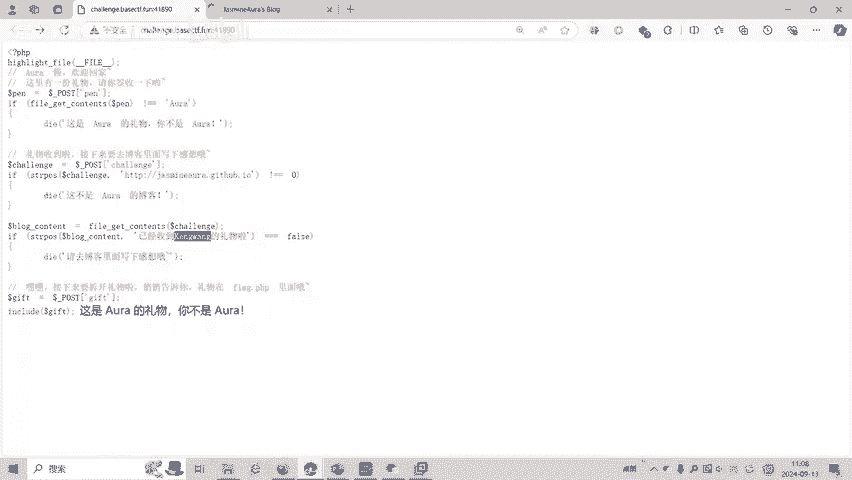
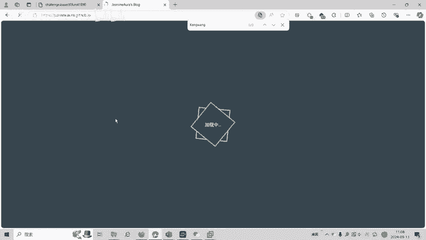

# CTF入门教程：P1：Aura酱的礼物 - 文件包含与SSRF实战

在本节课中，我们将学习一道来自BaseCTF2024的Web赛题“Aura酱的礼物”。这道题综合考察了文件包含、伪协议利用以及SSRF（服务器端请求伪造）漏洞绕过等多个知识点。我们将一步步拆解题目逻辑，并学习如何利用这些技术获取最终的Flag。

## 题目概述与代码分析

首先，我们来看题目的核心逻辑。题目给出了一个PHP源代码片段，其中包含三个关键的条件判断。

```php
// 条件一：检查POST参数‘pen’的内容
if (file_get_contents($_POST[‘pen’]) !== “Aura is my waifu”) {
    die();
}

// 条件二：检查POST参数‘qianli’的字符串起始位置
if (strpos($_POST[‘qianli’], “https://qianli.com”) !== 0) {
    die();
}

// 条件三：检查访问‘qianli’网址返回的内容
$blog = file_get_contents($_POST[‘qianli’]);
if (strpos($blog, “已经收到Aura的礼物”) === false) {
    die();
}

// 最终文件包含点
include $_POST[‘gift’];
```



上一节我们介绍了题目的整体结构，本节中我们来详细看看每个条件的具体含义和绕过方法。



## 第一关：利用Data伪协议绕过文件内容检查



第一个条件要求我们通过POST传递一个参数 `pen`。`file_get_contents` 函数会读取这个参数指向的内容，并检查其是否等于字符串 **“Aura is my waifu”**。

这里的关键在于，`file_get_contents` 不仅可以读取本地文件，还可以通过PHP支持的伪协议（如 `data://`）来直接嵌入数据。因此，我们无需寻找一个存有该字符串的文件，可以直接构造数据。



以下是构造 `pen` 参数的方法：
```
pen=data://text/plain,Aura is my waifu
```
这样，`file_get_contents` 读取到的就是指定的文本，从而成功通过第一个检查。



## 第二关：字符串起始位置验证

第二个条件检查POST参数 `qianli` 的值是否以 **“https://qianli.com”** 开头。`strpos` 函数返回子字符串首次出现的位置，如果为0则表示从开头匹配。

这个条件相对简单，我们只需要让 `qianli` 参数的值以这个网址开头即可。例如：
```
qianli=https://qianli.com/anything
```
后面可以跟任意路径或参数，只要开头正确就能绕过。

## 第三关：SSRF漏洞与内容欺骗

第三个条件是本题的核心难点。程序会去访问我们提供的 `qianli` 网址，并检查返回的网页内容中是否包含字符串 **“已经收到Aura的礼物”**。

我们首先尝试直接访问 `https://qianli.com`，发现其博客页面中并不包含该字符串。因此，我们需要让服务器访问一个包含该字符串的页面。

这里就涉及到SSRF漏洞的利用。我们的目标是让服务器访问它自己（即题目服务器）的源代码，因为源代码里必然包含这个用于检查的字符串。但是，`qianli` 参数又必须以 `https://qianli.com` 开头。

一个常见的SSRF绕过技巧是使用 `@` 符号。在URL中，`@` 用于分隔认证信息，其后的部分才是实际要访问的主机。因此，我们可以构造如下Payload：
```
qianli=https://qianli.com@127.0.0.1/
```
这个URL的意思是，以 `qianli.com` 作为用户名（通常被忽略），实际访问的目标是 `127.0.0.1`（即本机）。这样，服务器就会去请求自己的Web服务。

## 最终关：文件包含与PHP伪协议读取Flag



成功绕过前三关后，程序会执行 `include $_POST[‘gift’];`。这是一个典型的文件包含漏洞。通常在这种比赛中，Flag文件名为 `flag.php`。



我们尝试直接包含：
```
gift=flag.php
```
但页面可能没有回显（因为flag可能被定义在变量中，没有直接输出），或者文件路径不对。



这时，我们需要使用文件包含的另一个强大功能——结合PHP伪协议。`php://filter` 协议可以让我们以Base64编码的形式读取文件源码，从而绕过直接执行或不可见的问题。



以下是读取 `flag.php` 源码的Payload：
```
gift=php://filter/convert.base64-encode/resource=flag.php
```
服务器会执行包含操作，并将 `flag.php` 的内容进行Base64编码后输出。我们拿到这段Base64字符串，解码后就能看到文件完整的源代码，从而找到Flag。

## 解题步骤总结

以下是完整的解题步骤列表：

1.  **第一关**：使用 `data://` 伪协议传递指定字符串。
    *   `pen=data://text/plain,Aura is my waifu`

2.  **第二关**：确保 `qianli` 参数以指定网址开头。
    *   `qianli=https://qianli.com@127.0.0.1/`

3.  **第三关**：利用 `@` 符号进行SSRF绕过，让服务器访问自身。
    *   同上一步，该Payload同时满足第二、三关的要求。

4.  **最终关**：利用 `php://filter` 伪协议读取Flag文件。
    *   `gift=php://filter/convert.base64-encode/resource=flag.php`

将以上参数通过POST方式提交给题目服务器，即可获得经过Base64编码的Flag文件内容，解码后得到最终Flag。

## 课程总结


本节课中，我们一起学习了一道综合性的CTF Web题目。我们回顾一下核心知识点：

*   **文件包含**：`include` 或 `file_get_contents` 函数的不当使用可能导致漏洞。
*   **PHP伪协议**：
    *   `data://`：用于直接嵌入数据，绕过文件读取。
    *   `php://filter`：用于读取文件源码（特别是经过编码），常用于获取不直接回显的文件内容。
*   **SSRF（服务器端请求伪造）**：利用服务器发起内部网络请求。我们学习了使用 `@` 符号来绕过某些URL前缀限制的技巧。
*   **解题思路**：逐步分析代码逻辑，识别每一层的过滤条件，并运用相应的技术进行绕过，最终串联起完整的攻击链。

通过这道题，我们不仅掌握了这些独立漏洞的利用方法，更学会了如何将它们组合起来解决复杂的实际问题。希望你能将这些知识运用到未来的CTF挑战中。