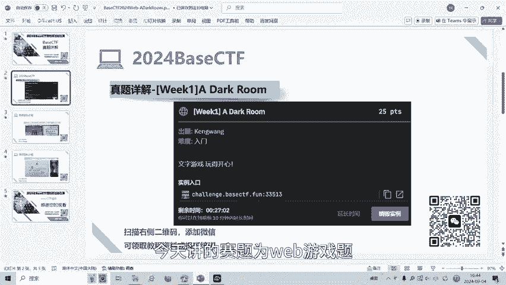
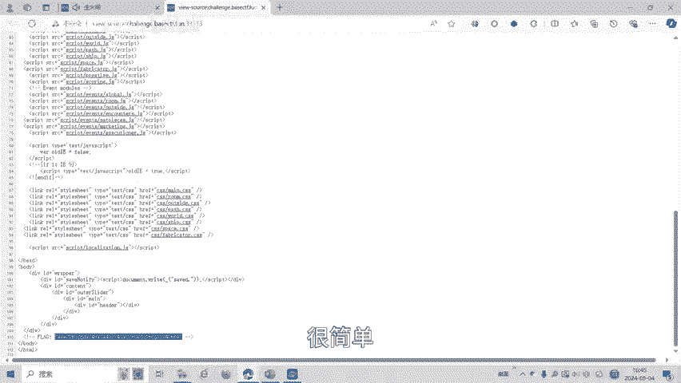
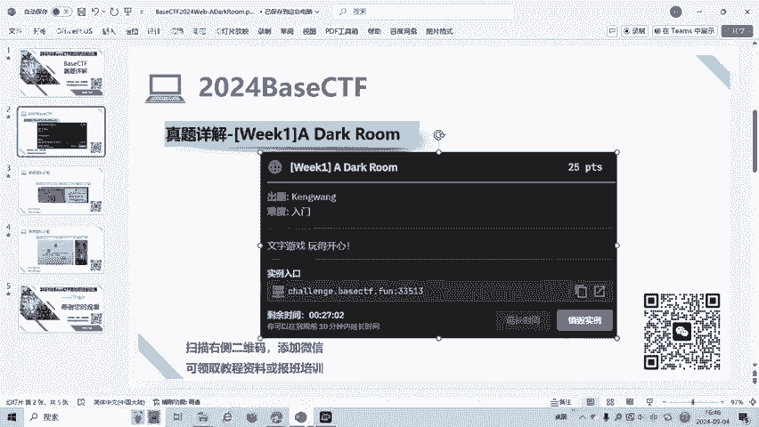
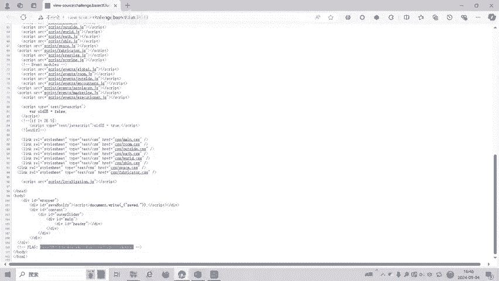

# CTF入门教程：P1：Web游戏类题目基础解法 🎮

在本节课中，我们将学习如何解决CTF（Capture The Flag）竞赛中常见的Web游戏类题目。我们将以一道名为“A Dark Room”的模拟游戏题为例，讲解其核心解题思路与步骤。这类题目通常将Flag隐藏在网页源代码或游戏脚本中，考验选手的信息搜集与代码审计能力。

## 题目背景与环境

上一节我们介绍了CTF中Web题目的基本类型，本节中我们来看看一个具体的游戏类题目实例。



题目“A Dark Room”呈现为一个在线的文字冒险游戏界面。玩家可以通过点击按钮（如“Gather Wood”、“Stoke Fire”）来推进游戏进程。


## 核心解题思路

对于Web游戏类题目，一个通用且首要的步骤是检查网页的源代码。因为Flag可能直接以注释形式写在HTML中，或者游戏逻辑（通常由JavaScript编写）本身包含了Flag信息。

以下是解题的核心步骤：

1.  **查看网页源代码**：在游戏页面右键点击，选择“查看网页源代码”或使用快捷键 `Ctrl+U`。
2.  **搜索关键词**：在源代码中搜索如 `flag`、`ctf`、`base` 等可能的关键词。
3.  **审查JavaScript文件**：如果游戏逻辑复杂，Flag可能隐藏在引用的 `.js` 文件中。需要找到并分析这些文件。

## 实战演练：寻找Flag

现在，我们将上述思路应用到“A Dark Room”这道题目中。

首先，按照步骤在游戏页面右键并选择查看源代码。在打开的源代码页面中，我们进行仔细搜索。





很快，我们可以在源代码中发现Flag。它通常被包裹在特定的标记中，例如 `base{...}`。





在这个例子中，Flag直接明文放置在HTML注释里，因此解题过程非常直接。解题的关键代码逻辑可以抽象为以下伪代码：

```python
# 模拟解题过程
def find_flag_in_web_game(url):
    page_source = get_page_source(url) # 获取网页源代码
    if “base{” in page_source: # 搜索Flag格式
        flag = extract_flag(page_source) # 提取Flag
        return flag
    else:
        # 若未在HTML中找到，则需进一步分析JS文件
        js_files = find_js_files(page_source)
        for js in js_files:
            analyze_js_file(js)
```

## 总结与延伸


本节课中我们一起学习了CTF Web游戏类题目的基础解法。我们了解到，面对此类题目，首要任务是**检查网页源代码**，因为出题人常常将Flag直接放置于此。解题流程可以总结为 **“右键 -> 查看源代码 -> 搜索关键词”**。

这道“A Dark Room”题目是一个简单的入门示例，旨在帮助初学者建立基本的解题直觉。在更复杂的题目中，Flag可能需要通过分析JavaScript游戏逻辑、与游戏进行特定交互或修改游戏数据才能获得。





通过掌握这些基础技巧，你已经迈出了CTF Web挑战的第一步。继续练习和探索，你将能够解决更具挑战性的题目。


