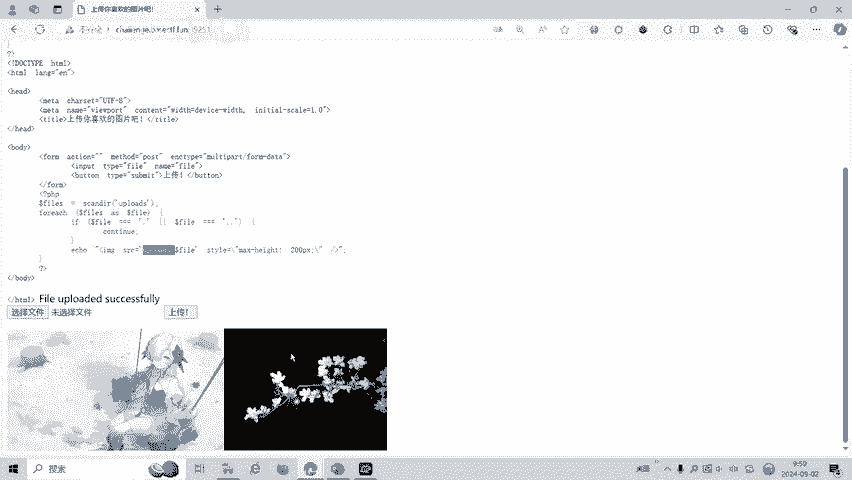
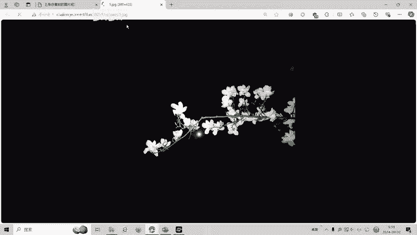
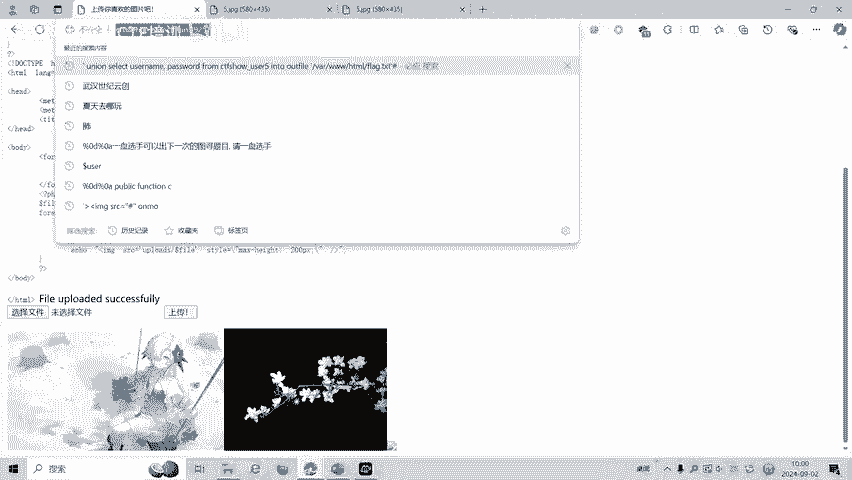
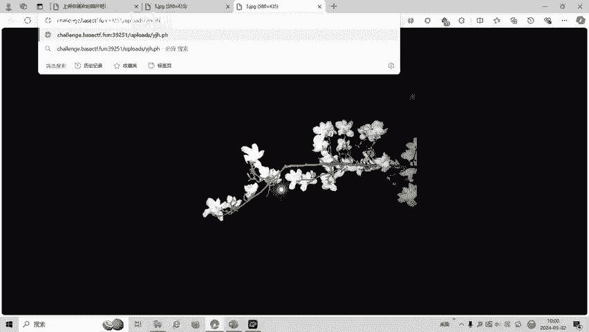
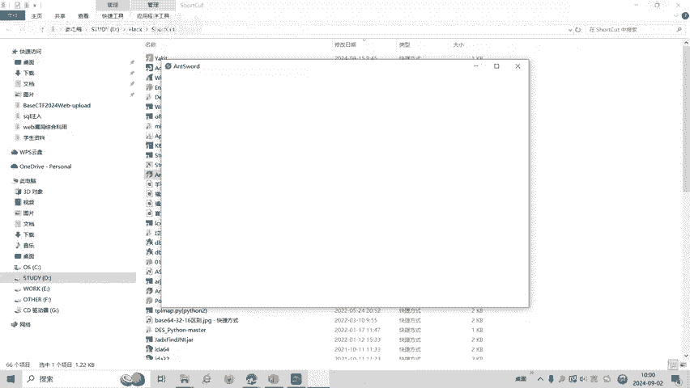
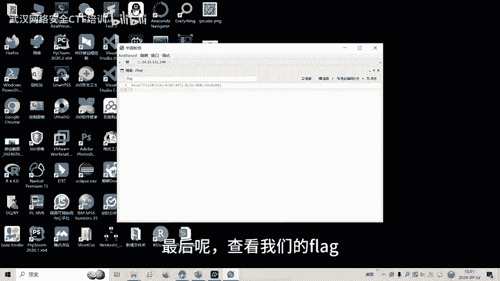
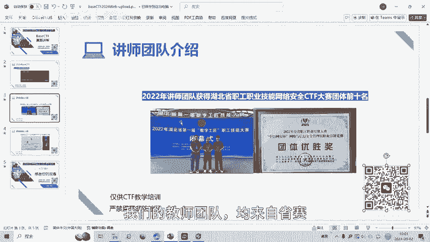

# CTF入门：文件上传漏洞基础与实践：P1：初识文件上传漏洞

在本节课中，我们将学习CTF（Capture The Flag）比赛中一种常见的Web安全漏洞——文件上传漏洞。我们将通过一道名为“upload”的CTF赛题，了解其基本原理、利用方法以及如何获取目标服务器上的敏感信息（即Flag）。

## 概述

文件上传功能是Web应用中常见的交互方式，允许用户将本地文件传输到服务器。如果服务器对上传的文件未进行严格的安全检查，攻击者就可能上传恶意文件（如Webshell），从而控制服务器。本节课将通过一道简单的CTF题目，演示如何利用文件上传漏洞。

## 题目环境与初步测试

首先，我们面对的是一个文件上传页面。题目要求我们选择一个文件进行上传。按照常规思路，我们先尝试上传一张普通图片。

上传成功后，页面提示文件已保存至服务器的 `upload` 文件夹下。这表明上传功能基本正常。





*（上传成功的图片文件）*





*（服务器上保存的文件名）*

## 核心攻击：上传Webshell

上一节我们确认了文件上传功能可用。本节中我们来看看如何利用此漏洞。在CTF文件上传题目中，常见的攻击方式是上传一个Webshell（即“一句话木马”）。

以下是一个典型的PHP一句话木马代码：

```php
<?php eval($_POST['shell']); ?>
```

这段代码的含义是：执行通过POST方法传递的、名为 `shell` 的参数中的PHP代码。这里的 `shell` 就是我们连接Webshell时需要使用的密码。



我们将这段代码保存为 `shell.php` 文件，然后通过题目页面上传。

## 连接与利用Webshell



文件上传成功后，我们需要验证Webshell是否生效并利用它。我们使用一个名为“蚁剑”的Webshell管理工具进行连接。

以下是连接步骤：
1.  在蚁剑中添加一个新的数据。
2.  URL地址填写我们上传的Webshell文件路径，例如 `http://目标地址/upload/shell.php`。
3.  连接密码填写我们代码中定义的 `shell`。
4.  点击测试连接。


*（上传Webshell文件）*





*（直接访问Webshell文件显示空白，这是正常现象）*


*（使用蚁剑成功连接到服务器）*



连接成功后，我们便获得了目标服务器的文件管理权限。接下来，我们可以在服务器文件系统中寻找本题的Flag。


*（在服务器上找到Flag文件）*

## 总结

本节课中我们一起学习了文件上传漏洞的基础利用流程。我们首先测试了正常文件上传功能，然后构造并上传了一个简单的PHP Webshell（一句话木马），最后利用客户端工具（蚁剑）连接Webshell，成功获取了服务器上的Flag。



这个案例展示了未加防护的文件上传功能所带来的严重安全风险。在实际安全测试或CTF比赛中，遇到文件上传点，可以优先尝试上传Webshell进行测试。当然，现实中的防护措施会复杂得多，我们将在后续课程中学习如何绕过各种安全限制。


*（课程结束）*