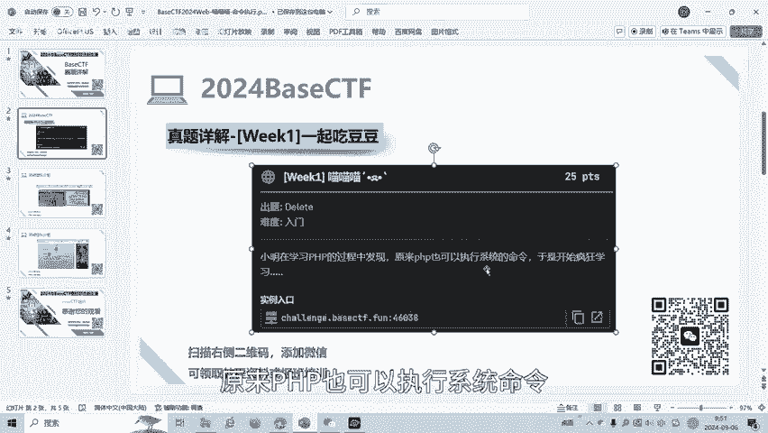
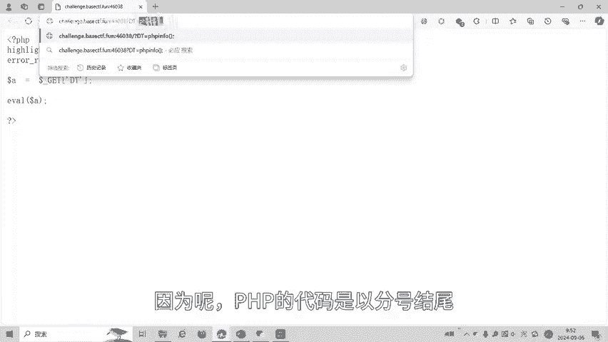
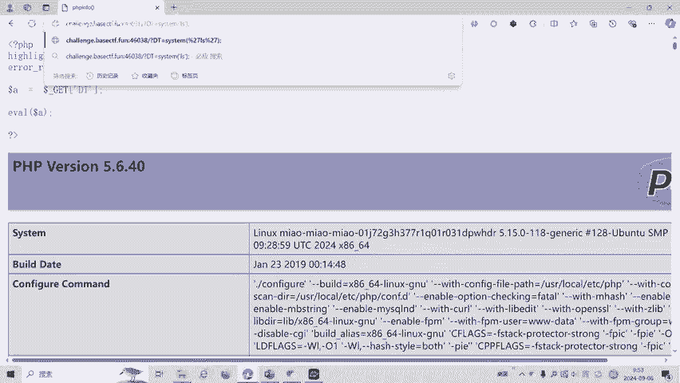
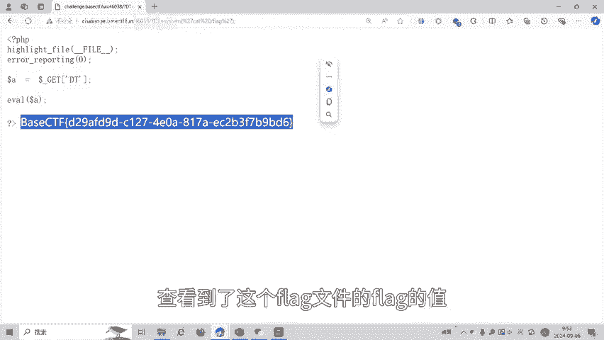

# CTF入门教程：命令执行漏洞初探：第1章：PHP代码执行与利用

在本节课中，我们将学习CTF（Capture The Flag）比赛中一种常见的Web漏洞类型——命令执行。我们将通过一道模拟赛题，了解PHP中危险的代码执行函数，并学习如何利用它来获取服务器上的敏感信息（即“Flag”）。

## 概述：什么是命令执行漏洞？

命令执行漏洞是指攻击者能够通过Web应用，直接或间接地在服务器操作系统上执行任意命令。这通常是由于应用程序对用户输入处理不当，将输入内容拼接到了系统命令中，或者像我们即将看到的，使用了危险的代码执行函数。



## 代码执行函数 `eval()`

上一节我们介绍了命令执行漏洞的基本概念，本节中我们来看看一个具体的危险函数：`eval()`。

`eval()` 是PHP中的一个语言构造器，它的作用是将字符串作为PHP代码来执行。这意味着，如果开发者将用户可控的数据直接传入 `eval()` 函数，攻击者就可以注入任意PHP代码。

其基本语法可以表示为以下代码：
```php
eval( $code_string );
```
其中，`$code_string` 是一个字符串类型的变量，该字符串中的内容会被 `PHP` 解析器执行。

## 实战演练：分析漏洞代码

理解了 `eval()` 的危险性后，我们来看一道模拟赛题。题目提供了一个存在漏洞的PHP代码片段。



该代码的核心逻辑如下：
1.  通过 `GET` 方式接收一个名为 `cmd` 的参数。
2.  将参数的值赋值给变量 `$a`。
3.  使用 `eval()` 函数执行变量 `$a` 中的字符串内容。

用代码描述这个漏洞点：
```php
$a = $_GET[‘cmd’]; // 从用户输入获取数据
eval($a); // 危险！直接执行用户输入的字符串
```
这段代码意味着，我们通过URL传递的任何内容，都会被服务器当做PHP代码执行。

## 利用漏洞获取信息



在确认存在代码执行漏洞后，我们的目标是找到并读取服务器上的Flag文件。以下是常见的探索步骤：

首先，我们需要尝试执行一些基本的PHP函数来测试漏洞是否可用。例如，使用 `phpinfo()` 函数来查看服务器信息。
```
?cmd=phpinfo();
```

接着，为了在服务器上执行系统命令，我们可以使用 `system()` 函数。我们先查看当前目录下有哪些文件。
```
?cmd=system(‘ls‘);
```

如果当前目录没有发现Flag文件，我们需要查看系统的根目录。通常Flag可能存放在根目录 `/` 下。
```
?cmd=system(‘ls /‘);
```



最后，当我们发现根目录下存在名为 `flag` 的文件时，使用 `cat` 命令查看其内容，即可获得Flag。
```
?cmd=system(‘cat /flag‘);
```
通过以上步骤，我们成功地利用了 `eval()` 函数造成的代码执行漏洞，层层深入，最终读取到了目标Flag。

## 总结与安全建议

本节课中我们一起学习了命令执行漏洞的一个经典案例——PHP `eval()` 函数的滥用。我们了解到：

1.  **核心漏洞**：`eval()` 函数直接执行用户输入的字符串，导致代码注入。
2.  **利用过程**：通过注入 `system()` 等能够执行系统命令的PHP函数，从而在服务器上列出目录、读取文件。
3.  **关键思路**：在CTF中，遇到此类漏洞，思路通常是“测试命令执行 -> 探索目录结构 -> 定位并读取Flag文件”。


对于开发者而言，**绝对不要**将用户可控的数据直接放入 `eval()`、`system()`、`exec()` 等函数中。必须对用户输入进行严格的过滤和校验。对于学习者，理解这些漏洞的原理是构建安全防御意识的第一步。

> 注：本教程仅用于网络安全知识学习，请勿用于非法攻击。所有实践应在合法授权的靶场环境中进行。