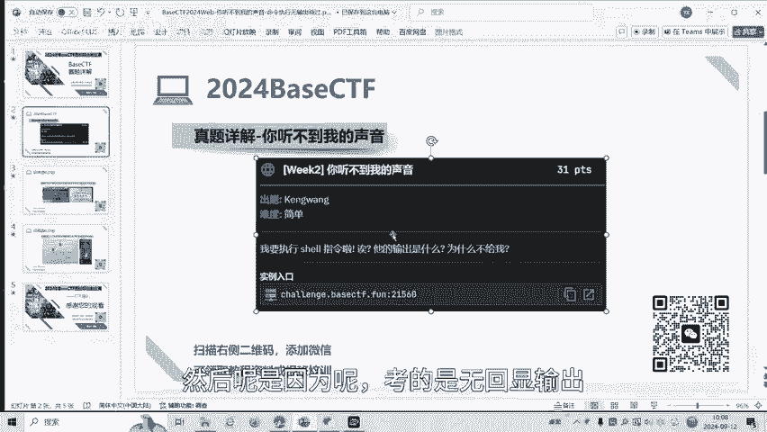
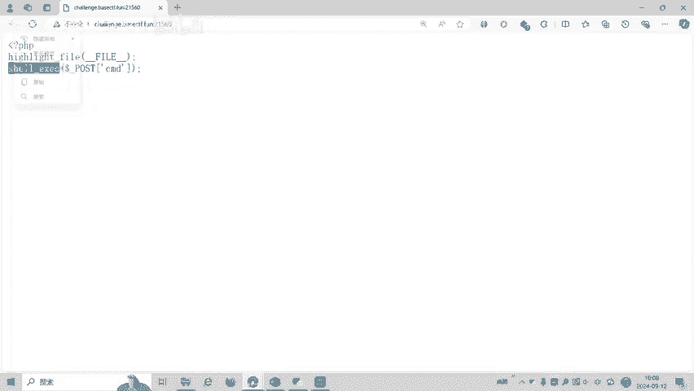
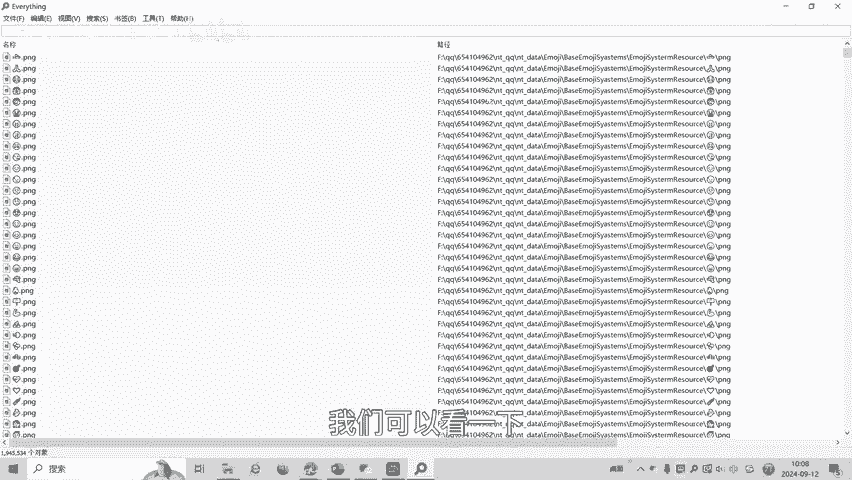
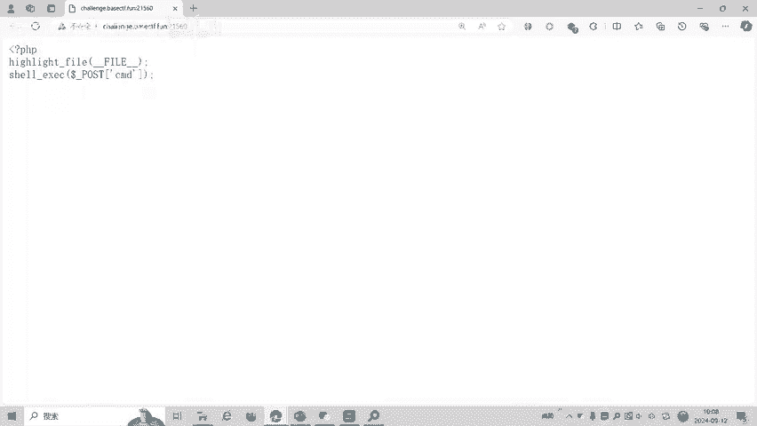
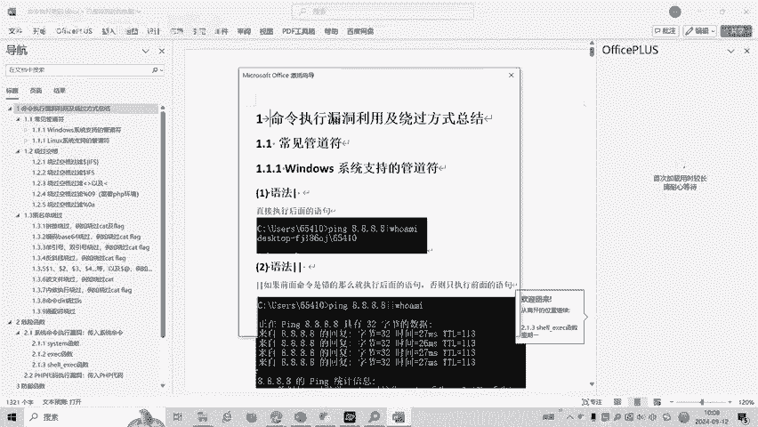
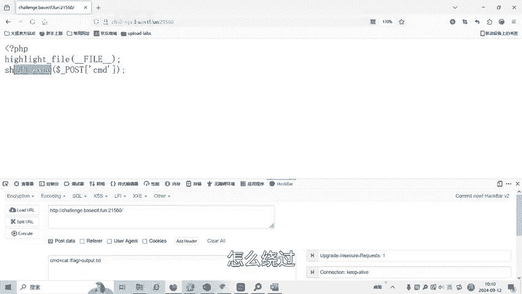
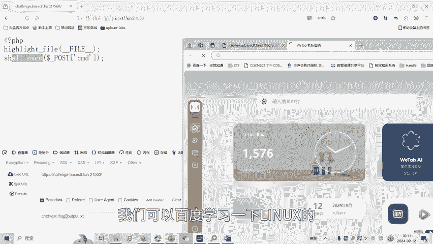
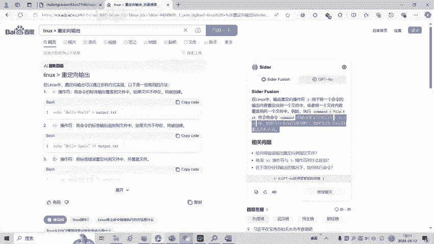
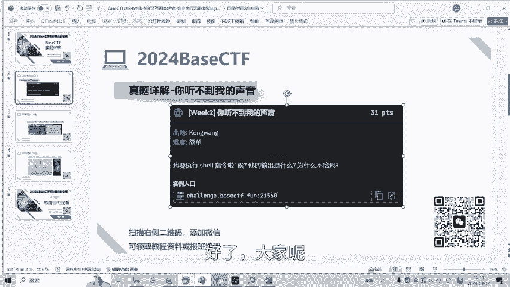
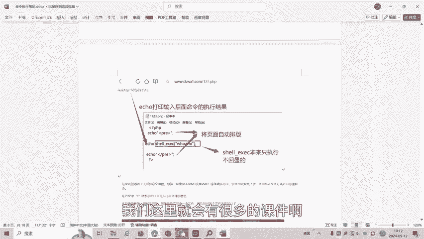

# CTF教程：命令执行漏洞：无回显输出绕过

在本节课中，我们将学习CTF比赛中一种常见的Web漏洞——命令执行漏洞，并重点探讨当命令执行没有回显输出时，如何利用Linux的重定向操作来绕过限制，获取执行结果。

## 赛题背景与概述



本次分析的赛题来自BaseCTF2024高校联合新生赛，题目名为“你听不到我的声音”。这是一道典型的命令执行漏洞题目，其核心挑战在于，虽然可以执行系统命令，但命令的执行结果不会直接显示在网页上，即“无回显输出”。我们的目标就是找到方法，绕过这个限制，读取到命令执行的结果。



## 漏洞代码分析



题目关键代码调用了PHP的 `shell_exec()` 函数。这个函数的特点是，它会执行给定的系统命令，并将输出作为字符串返回，但**不会自动将结果打印到标准输出（例如网页）**。





**代码示例：**
```php
$output = shell_exec($_POST['cmd']);
// $output 包含了命令执行的结果，但代码没有将其输出到页面。
```

通常，在存在命令执行漏洞的题目中，开发者可能会使用 `echo` 或 `print` 等函数将 `$output` 的内容显示出来。但本题没有这样做，导致我们无法直接看到命令执行的结果，例如执行 `ls` 或 `cat` 命令后的文件列表或文件内容。

## 绕过思路：Linux输出重定向

既然命令的结果无法直接回显，我们可以利用Linux系统的特性，将命令的输出“重定向”到一个我们可以访问的文件中。

核心思路是使用Linux中的 **`>`（大于号）** 操作符。这个操作符的作用是将一个命令的标准输出重定向到一个文件中。

**基本语法：**
```
command > filename
```
*   `command`：要执行的命令。
*   `>`：重定向操作符。
*   `filename`：目标文件名。如果文件不存在，则创建它；如果文件已存在，则覆盖其原有内容。

## 解题步骤详解

以下是利用输出重定向绕过无回显限制的具体步骤。

首先，我们尝试列出当前目录下的文件，但结果不会显示。

**初始尝试（无回显）：**
```
cmd=ls
```



为了看到结果，我们使用 `>` 将 `ls` 命令的输出保存到一个Web目录下的文件中，例如 `output.txt`。



**利用重定向：**
```
cmd=ls > output.txt
```
执行此命令后，`ls` 的结果会被写入到 `output.txt` 文件中。接着，我们只需要通过浏览器访问 `http://题目地址/output.txt`，就可以看到当前目录的文件列表了。

接下来，我们需要寻找flag文件。通常需要查看根目录或其他目录。

**查看根目录：**
```
cmd=ls / > output.txt
```
访问 `output.txt` 后，我们发现了根目录下存在 `flag` 文件。



最后，我们需要读取flag文件的内容。



**读取flag文件：**
```
cmd=cat /flag > output.txt
```
再次访问 `output.txt` 文件，即可获得本题的flag，成功解题。


## 核心概念总结



本节课我们一起学习了针对无回显命令执行漏洞的绕过技巧。关键点在于理解并应用Linux的**输出重定向**操作符 `>`。

**核心公式：**
```
任意系统命令 > 网站可访问路径下的文件名
```
通过这个操作，我们将原本看不到的命令执行结果，存储到了服务器上的一个文件中，然后通过Web请求直接读取该文件，从而间接获取了输出信息。

这是一种基础且重要的技巧，在CTF比赛和实际安全测试中遇到类似限制时，可以灵活运用。掌握Linux系统的基本命令和流重定向操作，对于网络安全学习至关重要。