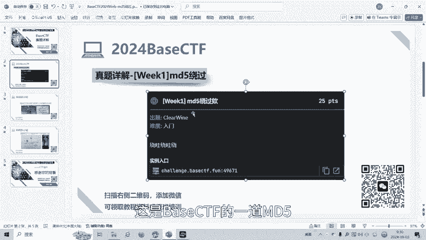
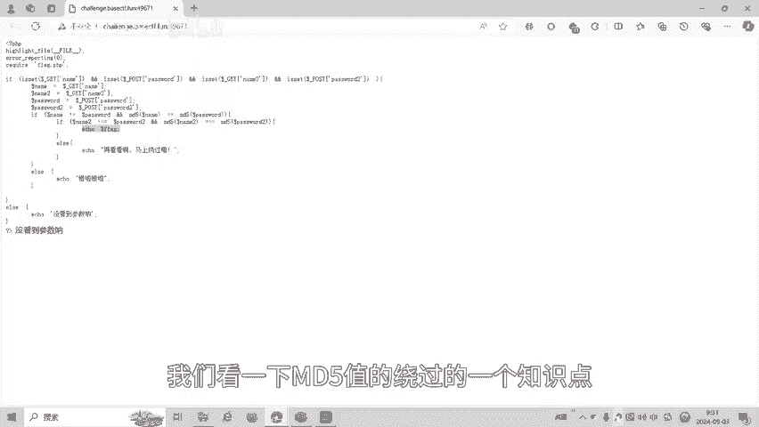
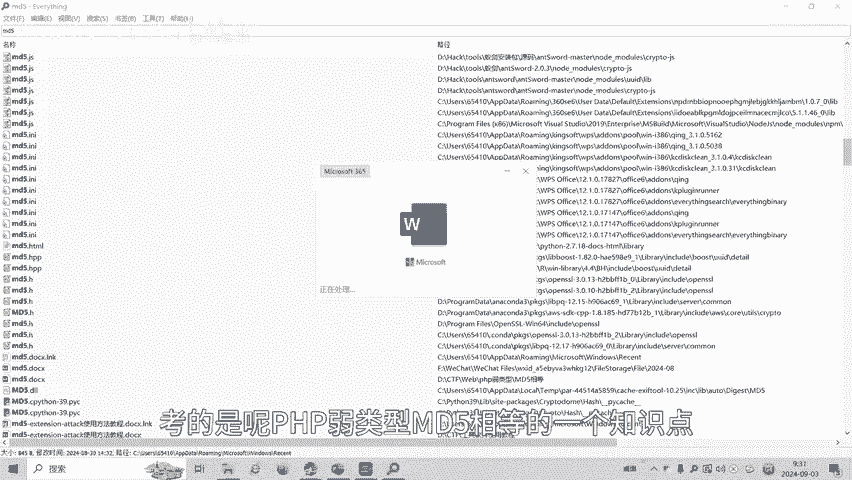
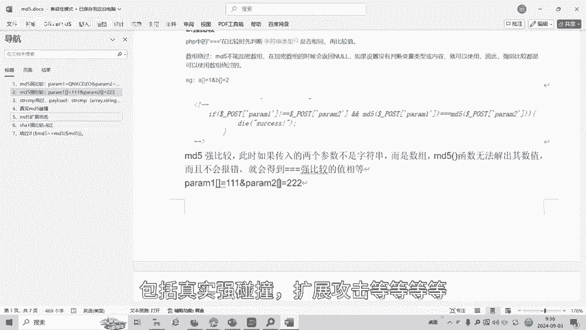
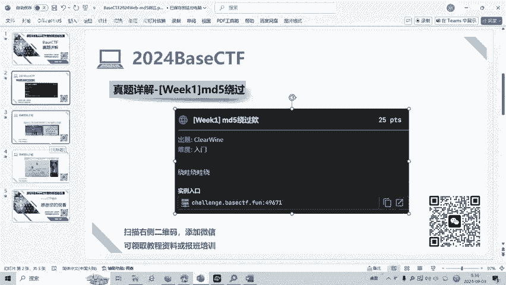

# CTF入门：P1：MD5强弱比较绕过 🚩

在本节课中，我们将学习CTF（Capture The Flag）比赛中Web安全方向的一个常见考点：MD5哈希函数的强弱比较绕过。我们将通过一道来自BaseCTF2024的赛题，详细解析其原理和解题步骤。

## 题目概述

题目要求通过GET方式传递四个参数：`name`、`password`、`name2`、`password2`。需要满足以下两个条件：
1.  `name`与`password`的值不相等，但它们的MD5哈希值需满足**弱相等**比较。
2.  `name2`与`password2`的值不相等，但它们的MD5哈希值需满足**强相等**比较。

当两个条件都满足时，程序才会输出`flag`。

## MD5弱比较绕过

上一节我们了解了题目的基本要求，本节中我们来看看如何实现第一个条件：MD5弱比较绕过。

在PHP中，弱比较使用两个等号（`==`）进行。当比较涉及字符串和数字时，PHP会尝试将字符串转换为数值。一个关键特性是，如果一个字符串以“0e”或“0E”开头，后面全是数字，PHP会将其视为科学计数法表示的0。

因此，在MD5弱比较中，如果两个不同的字符串经过MD5计算后，得到的哈希值都是以“0e”开头的纯数字字符串，那么PHP会认为它们都等于数字0，从而判断两者相等。

以下是满足此条件的经典字符串示例：
*   `QNKCDZO` 的MD5值为 `0e830400451993494058024219903391`
*   `240610708` 的MD5值为 `0e462097431906509019562988736854`

我们可以构造Payload进行测试。例如，在URL中传递参数：
`?name=QNKCDZO&password=240610708`

此时，虽然`name`和`password`的值不同，但它们的MD5哈希值在弱比较（`==`）下会被判定为相等。

## MD5强比较绕过

成功绕过弱比较后，我们进入第二个关卡：MD5强比较绕过。

强比较使用三个等号（`===`），它要求比较的两个值不仅内容相同，其**数据类型**也必须完全相同。对于字符串，直接寻找两个不同内容但MD5值完全相同的字符串（即MD5碰撞）非常困难，但我们可以利用PHP中`md5()`函数的一个特性。

当`md5()`函数的输入参数是一个**数组**时，函数会返回`NULL`并产生一个警告。在比较中，两个`NULL`值在强比较下是相等的。

因此，绕过强比较的方法是将参数设置为数组。在HTTP请求中，可以通过给参数名添加方括号`[]`来传递数组。

以下是构造的Payload示例：
`?name2[]=a&password2[]=b`

这样，`name2`和`password2`都被传递为数组。`md5(name2)`和`md5(password2)`都会返回`NULL`，使得`NULL === NULL`成立，从而满足强相等条件。

## 完整解题步骤

结合以上两个知识点，完整的解题Payload如下：

1.  为满足第一个条件（弱比较），我们使用一对已知的MD5“0e”碰撞字符串。
2.  为满足第二个条件（强比较），我们将参数设置为数组。

构造最终的GET请求URL：
`http://靶机地址/?name=QNKCDZO&password=240610708&name2[]=a&password2[]=b`

发送此请求后，即可同时通过两个`if`判断，从而获得`flag`。

## 知识扩展

MD5绕过在CTF中还有其他形式，例如：
*   **真实强碰撞**：利用MD5算法的漏洞，找到两个不同的内容但哈希值完全相同的二进制串。
*   **扩展攻击**：在已知原始消息和其MD5值的情况下，能够在后面附加任意数据并计算出新的有效MD5值。

这些是更深入的知识点，在后续的学习中可能会遇到。

## 课程总结

本节课中我们一起学习了CTF中MD5强弱比较绕过的核心技巧。
*   **弱比较（`==`）绕过**：利用PHP类型转换特性，使用哈希值为“0e”开头的字符串，使其在比较时被当作数字0处理。
*   **强比较（`===`）绕过**：利用`md5()`函数对数组参数返回`NULL`的特性，通过传递数组使比较双方都为`NULL`，从而满足强相等条件。

掌握这些基础原理是解开许多Web安全题目的关键。