# BugKu-Web-程序员本地网站：P1：本地访问绕过与请求头伪造 🚀

在本节课中，我们将学习如何解决一个名为“程序员本地网站”的Web安全挑战。这个挑战的核心是绕过“仅允许本地访问”的限制，我们将通过分析请求和修改HTTP请求头来实现目标。

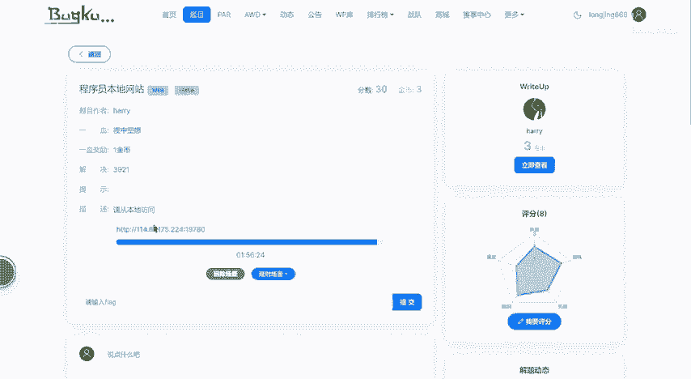

## 概述

题目页面提示“请从本地访问”，这意味着服务器检查了访问者的IP地址，只允许来自本地（即`127.0.0.1`）的请求。直接访问页面不会有任何内容显示，这提示我们需要通过技术手段伪造本地访问的身份。

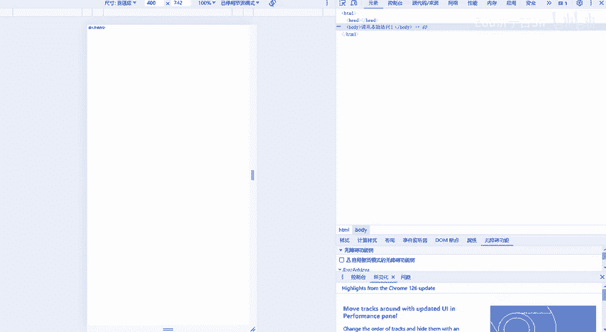

上一节我们介绍了题目的基本要求，本节中我们来看看具体的解决步骤。

## 解题步骤详解

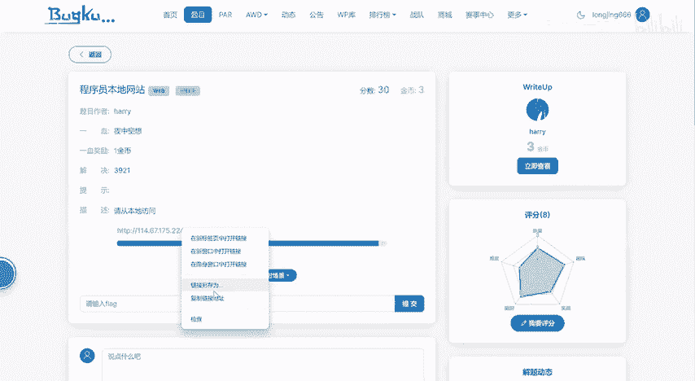

以下是解决此挑战的关键步骤。

### 1. 使用代理工具抓包

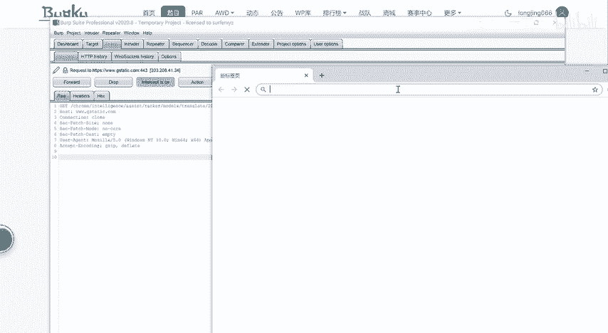

首先，我们需要使用一个代理工具来拦截和分析浏览器发送的HTTP请求。这里使用的是Burp Suite。

*   **启动代理**：打开Burp Suite，确保其代理监听功能已开启。
*   **配置浏览器**：将浏览器的代理设置为Burp Suite的监听地址（通常是`127.0.0.1:8080`）。为了方便，可以直接使用Burp Suite内置的浏览器。
*   **访问目标URL**：在配置好代理的浏览器中，访问题目给出的网址。

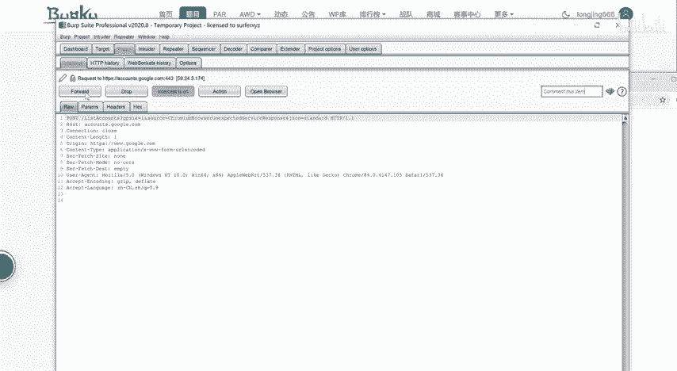

### 2. 拦截并分析请求

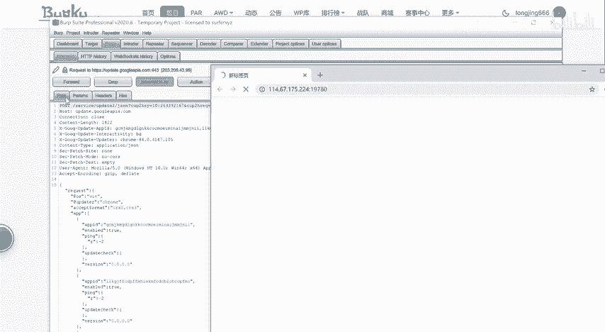

成功访问后，Burp Suite的Proxy模块会拦截到浏览器发出的HTTP请求。

```http
GET / HTTP/1.1
Host: example.com
User-Agent: Mozilla/5.0...
...
```
我们需要仔细查看这个请求的原始内容。题目提示考察了“X-Forwarded-For”请求头，这是一个常用于指示客户端原始IP的HTTP头。

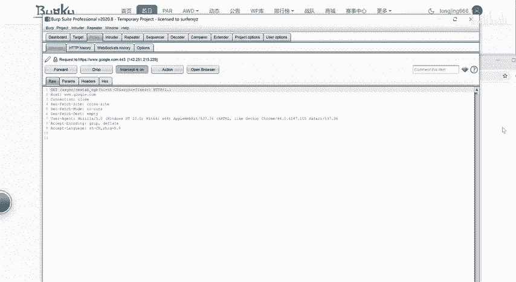

### 3. 修改请求头以伪造IP

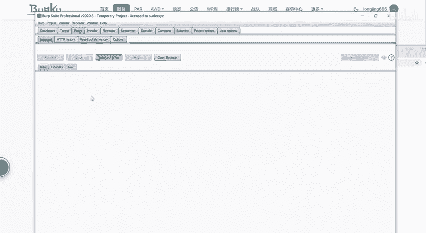

服务器很可能通过检查`X-Forwarded-For`请求头来判断请求是否来自本地。为了绕过检查，我们需要修改这个请求头。

*   在Burp Suite的拦截界面，找到`X-Forwarded-For`请求头。
*   如果该头不存在，则需要手动添加一行。
*   将该头的值设置为本地回环地址：`127.0.0.1`。

修改后的请求头应类似如下：
```http
X-Forwarded-For: 127.0.0.1
```

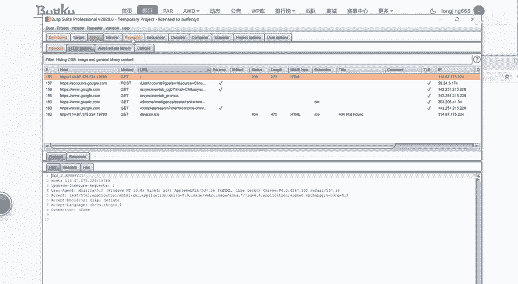

### 4. 发送修改后的请求

修改完成后，点击“Forward”按钮，将伪造了本地IP的请求发送给服务器。

### 5. 获取Flag

服务器在接收到伪装成本地的请求后，便会返回正常的页面内容，其中就包含了本题的Flag。

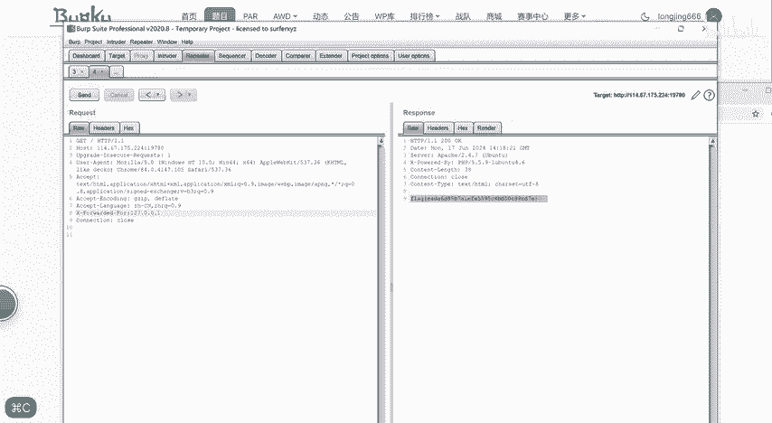

## 核心概念与总结

本节课中我们一起学习了如何利用HTTP请求头伪造来绕过IP限制。

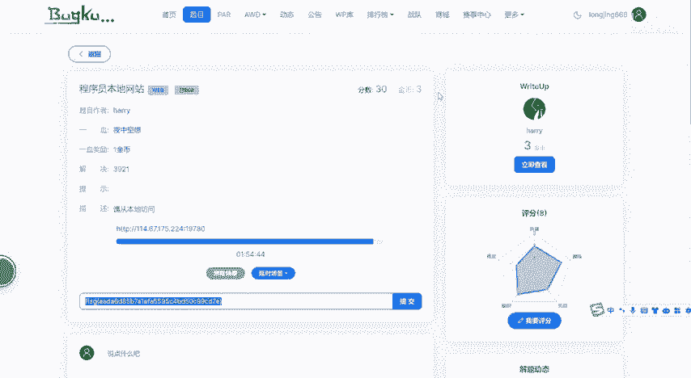

*   **核心概念**：`X-Forwarded-For` 是一个事实标准的HTTP请求头，格式为 `X-Forwarded-For: client_ip`。它通常被代理服务器用来传递原始客户端的IP地址。在本挑战中，服务器错误地信赖了这个可由客户端控制的值，导致了安全绕过。
*   **解题关键**：通过代理工具拦截HTTP请求，并修改或添加 `X-Forwarded-For: 127.0.0.1` 请求头，从而欺骗服务器，使其认为请求来自本地。

通过这个简单的练习，我们理解了不可信的用户输入（包括HTTP请求头）可能带来的安全风险，以及如何在CTF挑战中应用这一知识点。