# 网络安全：P13：CSRF漏洞原理、利用与防御

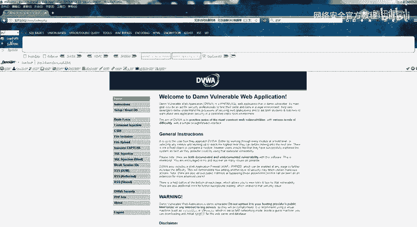

在本节课中，我们将要学习CSRF（跨站请求伪造）漏洞。我们将从漏洞的基本概念开始，逐步了解其成因、攻击方式，并学习如何寻找和防御此类漏洞。课程内容力求简单直白，确保初学者能够理解。

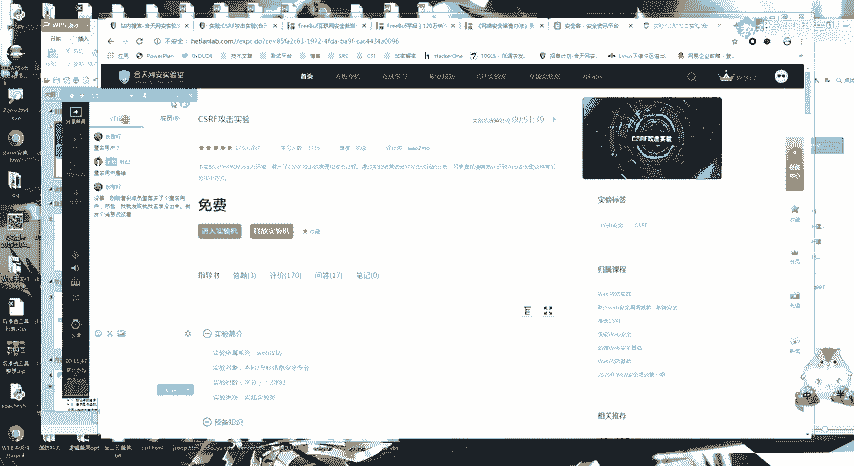

## CSRF漏洞简介 🎯


上一节我们介绍了课程概述，本节中我们来看看CSRF漏洞的基本定义。

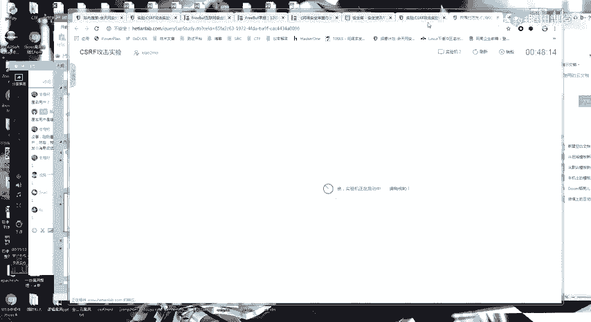

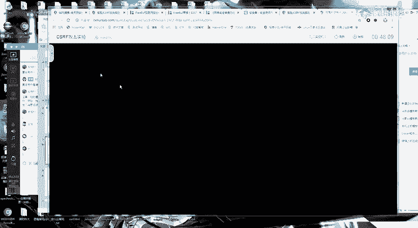

CSRF全称为Cross-site request forgery，即跨站请求伪造。其核心含义是：攻击者诱导已登录目标网站的用户，在不知情的情况下执行非本意的操作。

一个典型的攻击流程如下：
1.  用户登录受信任的网站A，并在浏览器中生成认证Cookie。
2.  用户在没有登出网站A的情况下，访问了恶意网站B。
3.  网站B中包含了针对网站A的恶意请求代码。
4.  用户的浏览器会携带网站A的Cookie，自动执行该恶意请求，从而在用户不知情下完成攻击者设定的操作（如修改密码、转账等）。

## CSRF漏洞成因与攻击方式 ⚙️

理解了CSRF是什么之后，本节我们来分析其产生的根本原因和常见的攻击手法。

CSRF漏洞的成因主要基于以下几点：
*   网站完全依赖浏览器自动携带的Cookie来识别用户身份。
*   关键操作（如增、删、改）的请求参数可以被攻击者完全预测和伪造。
*   用户访问的恶意页面能够向目标网站发起请求。

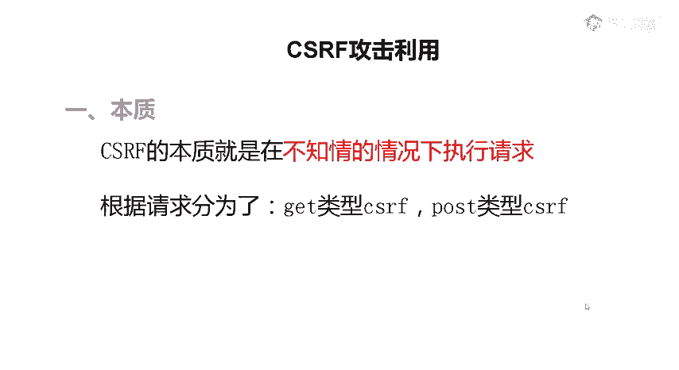

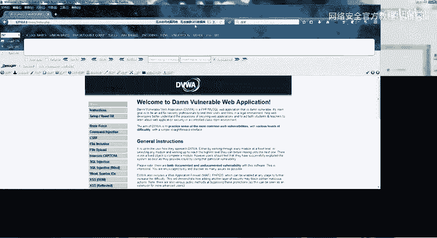

根据请求方法的不同，CSRF攻击主要分为两种类型：

以下是GET型CSRF攻击示例：
```html
<!-- 攻击者构造的恶意页面 -->

```
当用户访问该页面时，浏览器会自动加载图片，从而向`target.com`发起一个修改密码的GET请求。

以下是POST型CSRF攻击示例：
```html
<!-- 攻击者构造的恶意表单页面 -->
<body onload="document.forms[0].submit()">
  <form action="http://target.com/transfer" method="POST">
    <input type="hidden" name="to" value="hacker_account" />
    <input type="hidden" name="amount" value="10000" />
  </form>
</body>
```
该页面在加载时会自动提交表单，向目标网站发起一个转账的POST请求。

## 如何寻找CSRF漏洞 🔍

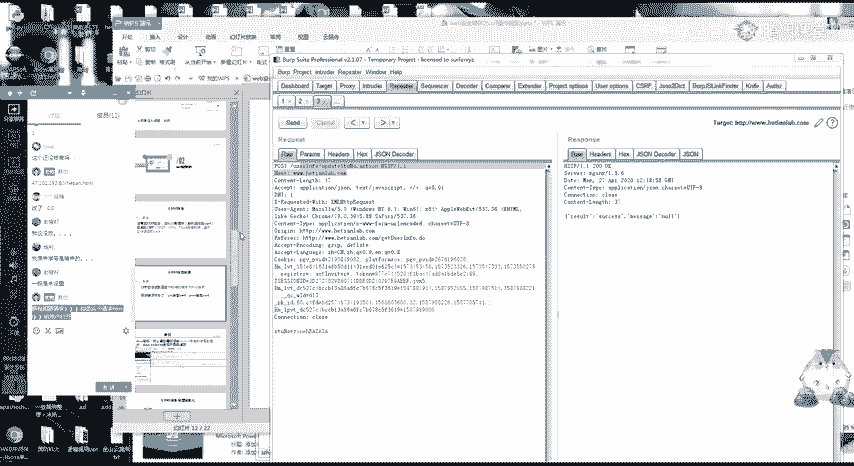

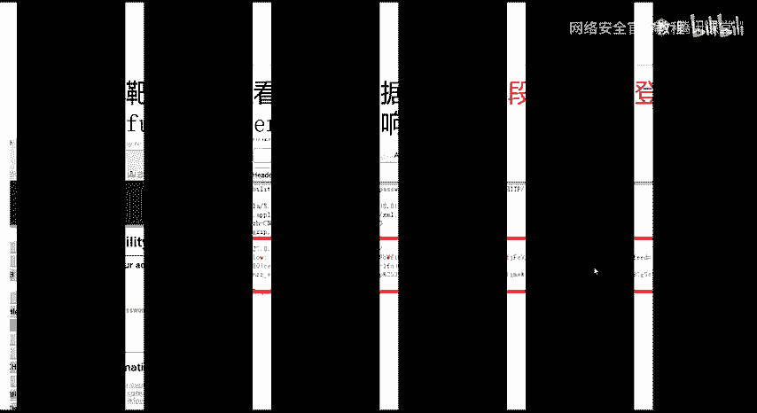

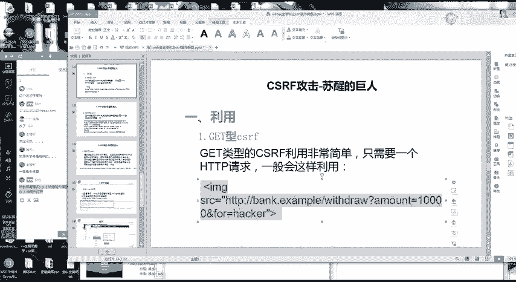

知道了攻击方式，本节我们学习如何在实际测试中发现CSRF漏洞。

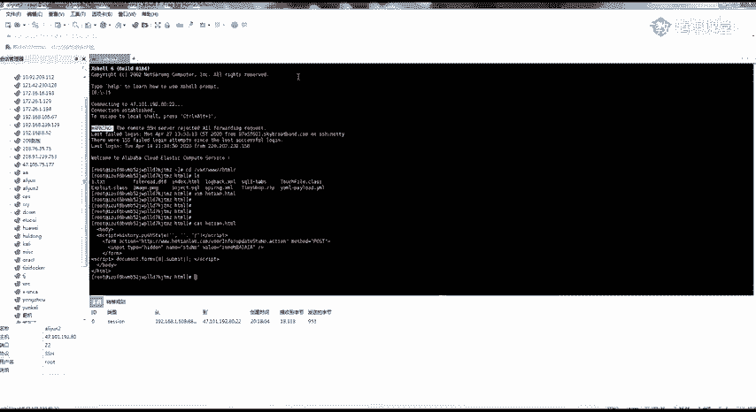

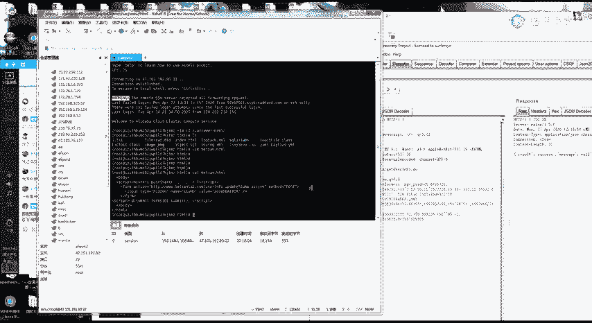


寻找CSRF漏洞的关键在于分析应用程序的请求数据包。你需要判断该请求是否容易被伪造。

以下是判断请求是否可能存在CSRF漏洞的核心步骤：
1.  使用Burp Suite等工具拦截一个正常的业务请求（如修改资料、添加用户）。
2.  重点检查请求中是否存在不可预测或随机的参数，常见的防御参数包括：
    *   **Token（令牌）**：一个随机的、与会话绑定的字符串，例如 `csrf_token=abc123def456`。
    *   **Referer（来源）**：用于检查请求是否来自本站点，例如 `Referer: https://target.com/safe_page`。
    *   **自定义Header**：如 `X-Requested-With: XMLHttpRequest`。
3.  尝试在重放请求时，删除或修改这些参数。如果删除后请求依然能成功执行，则很可能存在CSRF漏洞。

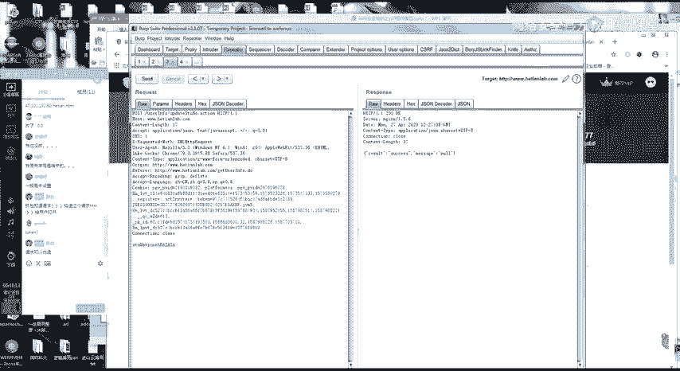

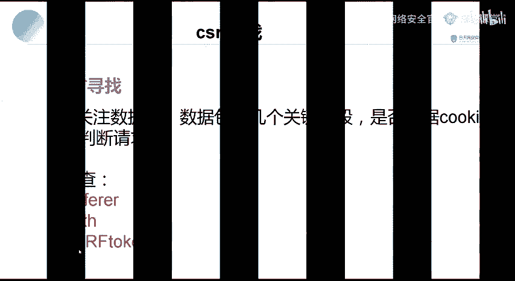

**核心判断逻辑**：如果请求中的所有参数（除Cookie外）都是攻击者可以预先知晓或构造的，那么这个请求就存在CSRF风险。

## CSRF漏洞的防御 🛡️

了解了攻击原理和发现方法后，本节我们探讨如何有效防御CSRF攻击。

开发者在设计系统时，应采用以下一种或多种措施来防御CSRF：

以下是几种有效的CSRF防御策略：
*   **使用Anti-CSRF Token**：这是最有效的防御方法。为每个用户会话生成一个随机、不可预测的Token，并将其嵌入表单或请求参数中。服务器在处理请求时，必须验证该Token的有效性。
*   **验证Referer字段**：检查HTTP请求头中的Referer字段，确保请求来源于本站点。但需注意，Referer可能被某些浏览器或插件禁用，且存在被篡改的风险。
*   **使用自定义请求头**：对于AJAX请求，可以添加自定义的HTTP头（如`X-Requested-With`），因为浏览器同源策略限制了跨域请求自定义头。
*   **设置Cookie的SameSite属性**：将Cookie的`SameSite`属性设置为`Strict`或`Lax`，可以限制Cookie在跨站请求中被发送，从而从源头遏制CSRF攻击。

## 总结 📝

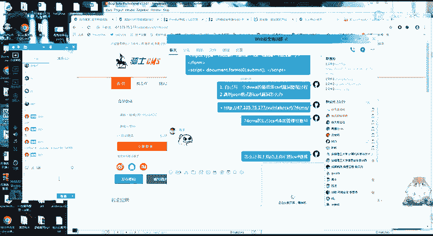

本节课中我们一起学习了CSRF漏洞。我们从其定义和攻击模型入手，理解了攻击者如何利用用户已登录的状态发起伪造请求。接着，我们学习了GET和POST两种类型的CSRF攻击构造方式，并掌握了通过分析请求包中的Token、Referer等关键参数来寻找漏洞的方法。最后，我们探讨了使用Token验证、检查Referer等主流的防御策略。CSRF漏洞原理简单但危害巨大，理解其攻防对于网络安全至关重要。