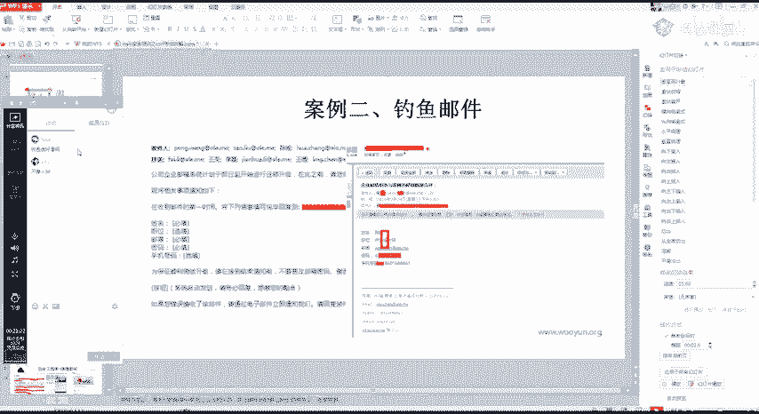
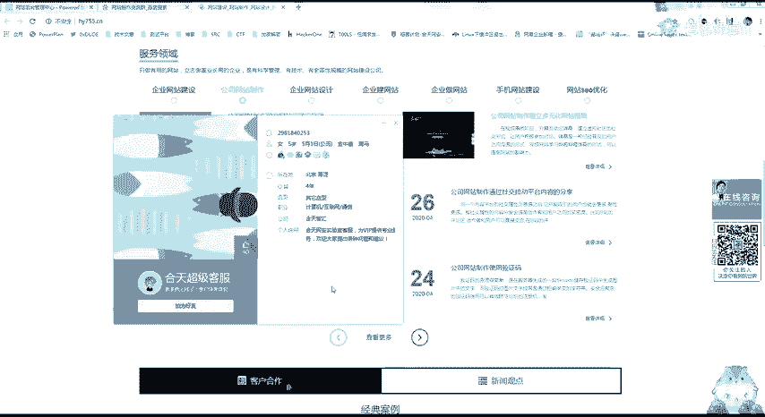
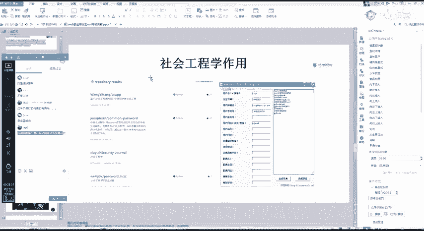
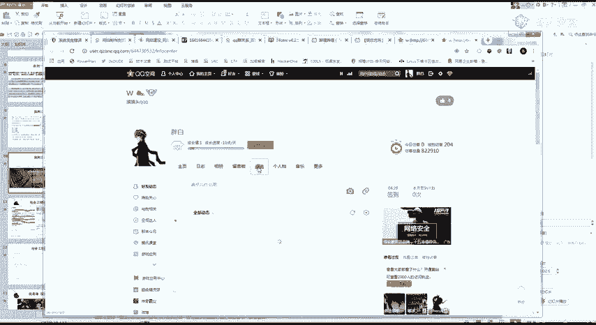

# 网络安全教程：P15：CSRF漏洞扩大影响

## 概述
在本节课中，我们将学习CSRF漏洞的扩大影响，并初步了解社会工程学在渗透测试中的应用。课程将涵盖如何将CSRF漏洞与其他漏洞结合，以提升攻击效果和危害等级，同时也会介绍社会工程学的基本概念和常见手法。

---

## 社会工程学简介
上一节我们介绍了CSRF漏洞的基本利用。本节中，我们来看看如何结合社会工程学扩大攻击面。社会工程学是一种通过人际交流影响他人心理，使其执行特定操作或泄露机密信息的技术。它常被视为一种利用欺骗手段收集信息、进行计算机系统入侵的行为。

社会工程学本质上是一种心理和物理层面的攻击。

### 社会工程学案例
以下是几个常见的社会工程学攻击案例：

1.  **信息诈骗**：攻击者通过非法手段获取大量个人信息（如从招生平台窃取数据），利用这些详细信息获取受害者信任，进而实施诈骗。这提醒我们提升自身安全意识，并认识到在特定渗透测试场景中，社工可能是非常有效的手段。
2.  **钓鱼邮件**：这是最常见的社工案例。攻击者伪造官方邮件（例如，冒充公司IT部门通知邮箱升级），诱导受害者点击包含恶意CSRF代码的链接。钓鱼邮件是目前渗透测试中非常有效的攻击方式。你可以在网上搜索钓鱼邮件模板进行学习，但切勿用于非法用途。
3.  **钓鱼页面**：攻击者利用可信域名（如腾讯问卷）创建虚假的钓鱼页面，由于域名本身可信，受害者更容易上当。常见的还有伪装成游戏活动领取页面的钓鱼网站。

### 社会工程学在渗透测试中的作用
社会工程学在渗透测试中的一个主要作用是**信息收集**。




例如，针对一个网站制作公司，攻击者可能通过以下思路进行社工：
*   冒充潜在客户与客服交流，以测试为名获取网站后台权限，进而寻找文件上传等漏洞。
*   在交流过程中，以解决问题为借口向客服发送木马文件。
*   通过公开信息或交流群收集目标人员的QQ号，再利用社工库查询该QQ关联的历史密码、注册信息等。

信息收集越充分，后续攻击的成功率越高。例如，可以根据已知信息（用户名、生日、邮箱等）利用工具生成针对性的密码字典。

**密码字典生成逻辑示例（伪代码）**:
```python
# 基于已知信息组合生成潜在密码
base_info = ['用户名', '出生年份', '常用昵称']
common_suffix = ['123', '!@#', '2023']
generated_passwords = []

for info in base_info:
    for suffix in common_suffix:
        generated_passwords.append(info + suffix)
        generated_passwords.append(info + '_' + suffix)
# 输出生成的密码列表
print(generated_passwords)
```




**重要提醒**：学习社会工程学是为了提升防御意识，了解攻击手法。所有技术的学习和应用都必须在法律允许的范围内进行，牢记网络安全法。

---




## CSRF漏洞的扩大影响
在掌握了基础的社会工程学概念后，我们回到CSRF漏洞本身，探讨如何扩大其影响。

### 挖掘CSRF漏洞的关键点
挖掘CSRF漏洞时，需牢记以下几点：
*   **全局性**：通常，一个站点如果存在CSRF漏洞，往往在整个站点范围内都存在。修复时也是全局修复。
*   **目标敏感性**：对于**操作类**CSRF（如修改、删除），应重点寻找敏感功能点，例如：
    *   删除用户账号
    *   更换绑定手机号
    *   转账、提现
    *   修改权限设置
*   对于**读取类**CSRF（如窃取信息），应重点寻找能获取敏感信息的功能点，例如：
    *   获取账号的API密钥或Token
    *   查看个人详细资料、住址
    *   导出账户数据

### 漏洞组合利用
CSRF漏洞不应被孤立看待。一个重要的思路是将其与其他漏洞组合，实现更严重的危害，例如GetShell（获取服务器控制权）。

**思路示例**：
假设目标网站后台存在一个可通过特定参数执行命令的漏洞（例如，`/admin.php?action=exec&cmd=whoami`）。如果该后台管理功能同时存在CSRF漏洞，那么攻击者就可以构造一个恶意页面，诱使已登录的管理员访问，从而在后台远程执行命令。

**组合攻击POC示例**:
```html
<!-- 恶意页面：诱使管理员点击后，在其后台执行命令 -->
<html>
  <body>
    
    <h1>你收到一张图片，加载失败！</h1>
  </body>
</html>
```
当管理员浏览器加载这个图片标签时，就会向目标后台发送执行命令的请求，从攻击者服务器下载Webshell。

### 漏洞利用的深度与奖励
在实战漏洞挖掘（如SRC项目）中，深度利用漏洞往往能获得更高奖励。
*   **单独漏洞**：一个独立的CSRF或XSS漏洞，奖励可能较低。
*   **组合漏洞**：如果将CSRF与XSS等漏洞组合，实现自动化攻击或更深入的渗透（如进入内网），奖励会大幅提升。一些大型企业的专项渗透活动中，对深入内网的漏洞报告奖励可能高达数万元。

这启示我们，发现一个漏洞时，不应急于提交。应思考如何将其作为跳板，与其他漏洞结合，进行更深层次的利用。这个过程不仅能锻炼技术，也可能带来更丰厚的回报。

---

## 通过社交平台扩大CSRF攻击
最后，我们看一个通过社交平台传播CSRF攻击的实例。攻击者可以利用平台分享功能中的URL跳转漏洞。

**攻击场景**：
1.  攻击者发现某个社交平台（如微博）的“分享到QQ空间”功能，在生成分享链接时，`referer`或跳转URL参数可控。
2.  攻击者将分享链接中的目标URL参数替换为自己的恶意CSRF攻击页面地址。
3.  攻击者将这条分享动态发布到社交平台，或通过私聊发送给好友。
4.  受害者看到分享内容（标题、图片均正常），点击后却跳转到了攻击者的CSRF页面。如果受害者此时恰好登录了目标网站，攻击便会生效。

**关键点**：这种攻击利用了用户对社交平台内容的信任，以及分享功能的安全缺陷，实现了CSRF攻击链的传播。

---

## 总结
本节课我们一起学习了以下内容：
1.  **社会工程学**的基本概念及其在渗透测试中用于信息收集和初始突破的作用。
2.  **CSRF漏洞的扩大利用**，包括如何针对敏感功能点进行挖掘，以及将CSRF与其他漏洞（如命令执行）组合实现更严重的攻击效果（如GetShell）。
3.  在漏洞挖掘中，**深度利用和组合漏洞**的思路能极大提升漏洞的价值和危害等级。
4.  了解了如何通过**社交平台的功能缺陷**（如URL跳转）来传播和放大CSRF攻击的影响。



请始终记住，学习这些知识的目的是为了构建更安全的系统。所有实践都必须在合法授权的环境下进行。