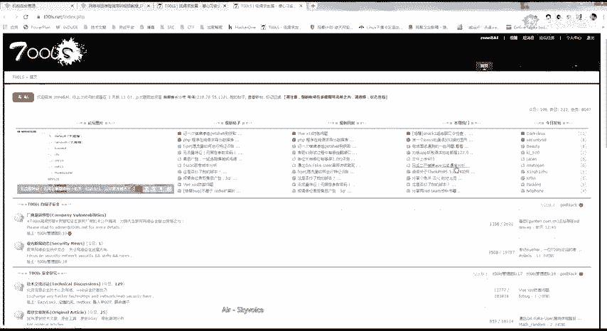
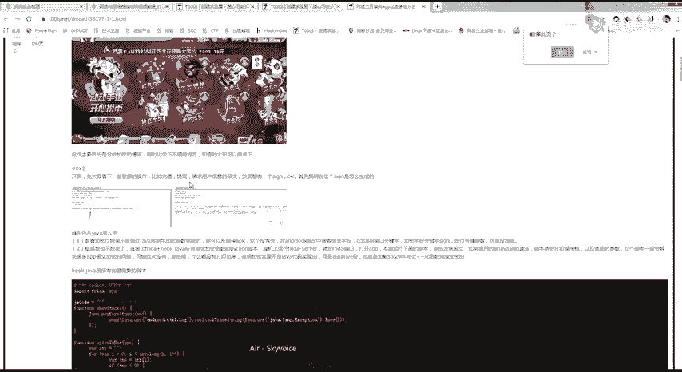
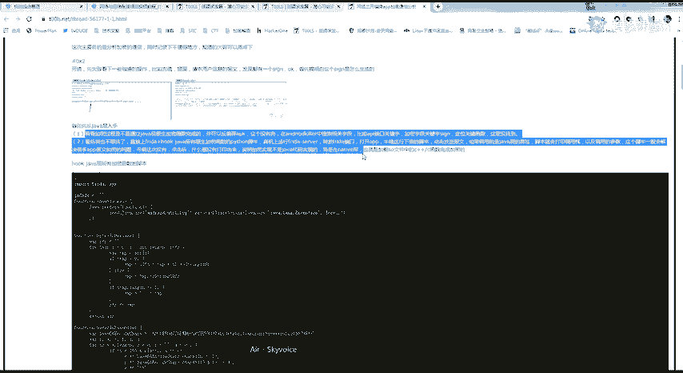
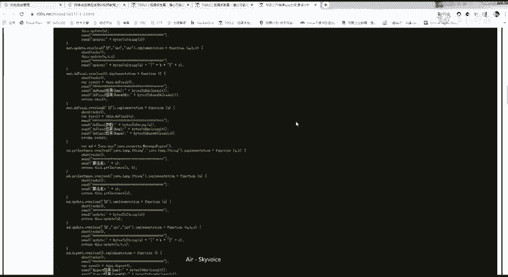
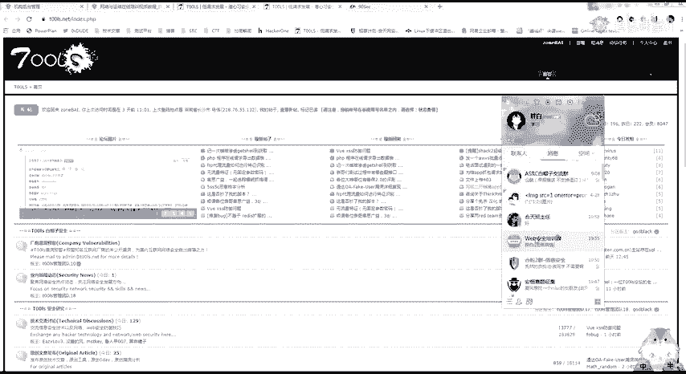
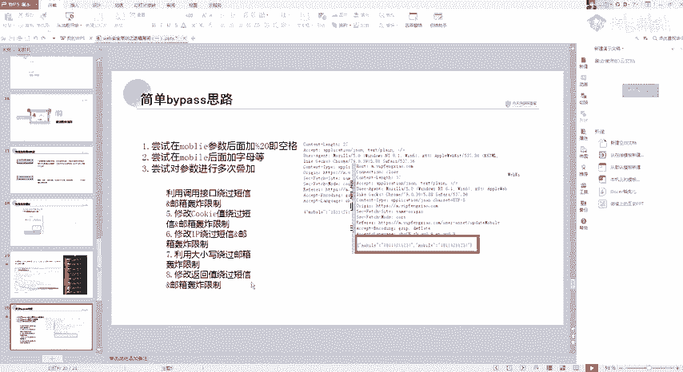

# 网络安全教程：P16：逻辑漏洞简介

在本节课中，我们将要学习网络安全中一个非常重要且常见的漏洞类型——逻辑漏洞。我们将了解它的基本概念、产生原因，并重点学习两种具体的逻辑漏洞：URL跳转漏洞和短信轰炸漏洞。这些知识对于挖掘安全漏洞至关重要。

## 什么是逻辑漏洞？

上一节我们介绍了课程概述，本节中我们来看看什么是逻辑漏洞。

逻辑漏洞是由于程序员在编写程序时，其逻辑思维存在不足而产生的。它与传统漏洞（如SQL注入）不同，攻击者是通过合法的功能操作来达到破坏目的。

例如，一个四位数的验证码功能，在程序设计上是正常的。但如果程序没有考虑到这四位验证码可以被暴力破解，这就构成了一个逻辑漏洞。这类漏洞很难被安全设备或自动化扫描器发现，因为攻击流量看起来是正常的业务请求。

逻辑漏洞产生的主要原因包括：
*   程序员的逻辑设计不严密。
*   业务流程过于复杂。

一个重要的规律是：网站的功能点越多，其存在逻辑漏洞的可能性就越大。

## 如何挖掘逻辑漏洞？

了解了逻辑漏洞的定义后，我们来看看挖掘这类漏洞的一些思路和方法。

挖掘逻辑漏洞的核心在于熟练使用抓包工具（如Burp Suite）并建立系统的测试思路。关键在于仔细分析每个请求和响应数据包。

以下是一些经验之谈：
*   **尝试所有参数**：对数据包中的每个参数进行测试，即使它看起来与当前功能无关。
*   **关注响应格式**：特别注意返回格式为JSON的数据包。有时，程序虽然在前端隐藏了某些参数，但后端仍然会接收和处理它们。
*   **大胆假设，小心验证**：漏洞往往是测试者“试”出来的。当常规测试无效时，可以尝试一些非常规的修改，例如将其他功能点的参数移植到当前请求中。

## URL跳转漏洞

上一节我们探讨了逻辑漏洞的挖掘思路，本节中我们重点学习第一种具体的漏洞：URL跳转漏洞。

URL跳转漏洞，也称为开放重定向漏洞。其核心危害在于，攻击者可以构造一个恶意链接，当用户点击后，会被重定向到攻击者控制的钓鱼网站或恶意页面。

**漏洞原理**：程序未对用户可控的跳转URL参数进行充分检查和过滤，导致攻击者可以任意指定重定向目标。

**危害**：
1.  **钓鱼攻击**：诱导用户输入账号密码。
2.  **配合CSRF**：与跨站请求伪造漏洞结合利用。
3.  **配合XSS**：与跨站脚本漏洞结合利用。
4.  **配合浏览器漏洞**：利用浏览器自身漏洞控制用户电脑。

### 如何寻找URL跳转漏洞？

URL跳转漏洞常出现在需要进行页面跳转的业务环节。

以下是常见的存在点：
*   **用户登录/认证后**的跳转。
*   **用户分享、收藏内容后**的跳转。
*   **业务操作完成后的跳转**，如评论成功、修改密码成功等。

**检测方法**：
在测试时，关注请求参数中是否包含`url`、`redirect`、`link`、`jump`、`to`等关键字。将参数值修改为你控制的地址（如`http://your-evil-site.com`），观察是否成功跳转。

### 绕过技巧

有时，程序会对跳转地址进行限制（例如，只允许跳转到自家域名下）。此时可以尝试一些绕过方法：

以下是几种常见的绕过方式：
*   **利用`@`符号**：`http://www.trusted.com@www.evil.com`，部分浏览器会跳转到`@`后面的地址。
*   **利用子域名**：`http://www.trusted.com.evil.com`，如果程序只检查主域名，可能会被绕过。
*   **利用特殊地址**：如`http://127.0.0.1/%77%77%77%2E%62%61%69%64%75%2E%63%6F%6D`（URL编码），可能跳转到百度。
*   **利用IP地址转换**：将IP地址转换成十进制或八进制格式，例如`http://2130706433` 等价于 `http://127.0.0.1`。

## 短信/邮件轰炸漏洞

学习了URL跳转漏洞后，我们来看另一种因逻辑缺陷导致的问题：短信/邮件轰炸漏洞。

短信轰炸漏洞是指，在发送短信验证码或邮件的功能处，由于没有对发送频率、次数或接收方做有效限制，导致攻击者可以在短时间内向同一手机号或邮箱发送大量信息，造成骚扰。

**漏洞原理**：程序在“发送验证码”等环节，缺乏对时间、频率、用户身份或请求有效性的校验。

**常见存在点**：所有需要发送短信或邮件验证码的功能点，如登录、注册、找回密码、修改绑定手机等。

### 绕过与利用技巧

除了简单的重复发包，还可以尝试一些绕过限制的技巧：

以下是一些可能绕过限制的思路：
*   **添加无关字符**：在手机号后添加空格（URL编码为`%20`）或字母，如果程序校验不严，系统可能将其识别为新号码。
*   **参数叠加**：在请求中重复添加手机号参数，如`mobile=13800138000&mobile=13800138000`，看系统是否会处理多次。
*   **调用不同接口**：网站可能有多个发送短信的功能（注册、改密、支付），每个功能对应不同的接口或参数（如`type=1`）。尝试遍历这些接口，实现轰炸。
*   **修改Cookie/IP**：尝试在请求时删除或修改Cookie，或使用代理切换IP，以绕过基于会话或IP的频率限制。
*   **修改返回值**：拦截服务器的响应包，将“发送失败”或“频率过高”的返回值修改为“发送成功”，欺骗前端继续发送。

---

本节课中我们一起学习了逻辑漏洞的基本概念，并深入探讨了两种典型的逻辑漏洞：URL跳转和短信轰炸。理解这些漏洞的原理和挖掘方法，是成为合格安全测试人员的重要一步。记住，逻辑漏洞的发现更多地依赖于对业务流的深入理解和大胆细致的测试。