# 网络安全教程：P17：逻辑漏洞讲解

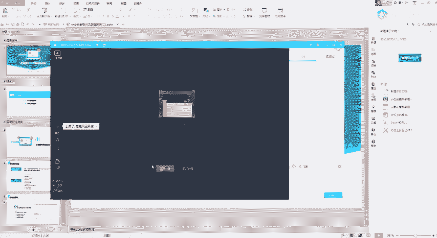

## 概述
在本节课中，我们将要学习网络安全中一种常见且重要的漏洞类型——逻辑漏洞。我们将重点讲解“任意密码重置”和“任意账户登录”两种逻辑漏洞的原理、常见场景及测试思路。逻辑漏洞的核心在于程序员的业务逻辑设计缺陷，而非复杂的技术实现，因此理解思路至关重要。

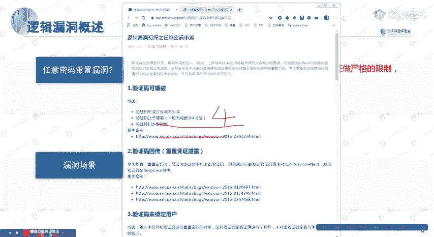

## 任意密码重置漏洞
上一节我们概述了逻辑漏洞，本节中我们来看看第一种具体类型：任意密码重置漏洞。其核心原理是：**在密码修改流程中，系统未对修改凭证进行严格校验，导致攻击者可以绕过验证，修改任意用户的密码**。

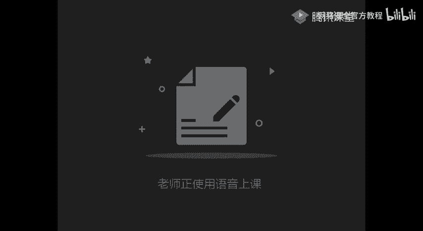

用简单的代码逻辑表示，一个不安全的密码重置流程可能如下：
```python
# 不安全的示例：仅验证验证码，未绑定用户
def reset_password(phone_number, verification_code, new_password):
    if verification_code == get_stored_code():  # 只检查验证码是否正确
        update_password(phone_number, new_password)  # 未验证此验证码是否属于该手机号
        return "密码重置成功"
    else:
        return "验证码错误"
```

以下是任意密码重置漏洞的十种常见场景：

**1. 验证码可被爆破**
此场景指验证码（通常是4位或6位数字）位数过短，且系统未对验证尝试次数和时间做限制，导致可通过自动化工具暴力破解。
*   **4位数字验证码**：最多10000种组合，可在短时间内爆破。
*   **6位数字验证码**：若有效时间长（如2小时）且无尝试次数限制，也可能被爆破。
*   **验证码不会过期**：极少数情况下，验证码长期有效，增加了爆破可行性。

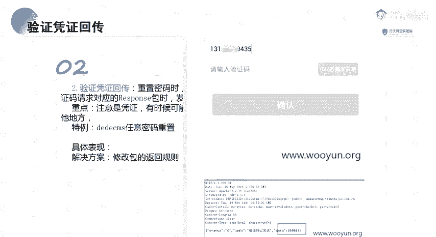


**2. 验证码/凭证在返回包中回显**
此场景指服务器在响应请求时，将本应发送到用户手机或邮箱的验证码或重置凭证，直接包含在HTTP响应包中返回给客户端。
*   攻击者通过抓包工具（如Burp Suite）即可直接获取验证信息。
*   回显的不仅是验证码，有时可能是重置密码的链接或Token。

**3. 验证码未与用户绑定**
此场景指系统只验证了“验证码是否正确”，但没有校验“该验证码是否由当前正在操作的用户手机/邮箱接收”。
*   例如，用户A获取的验证码，可以用来重置用户B的密码。
*   漏洞点在于修改手机号或邮箱的参数可被篡改。

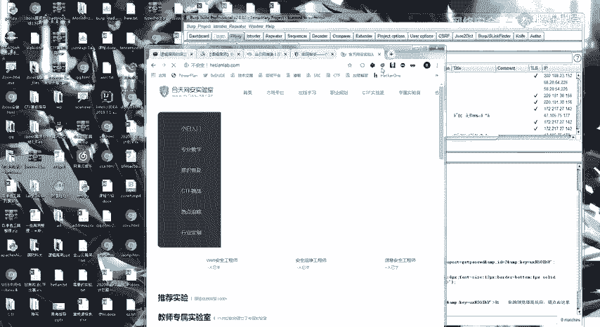

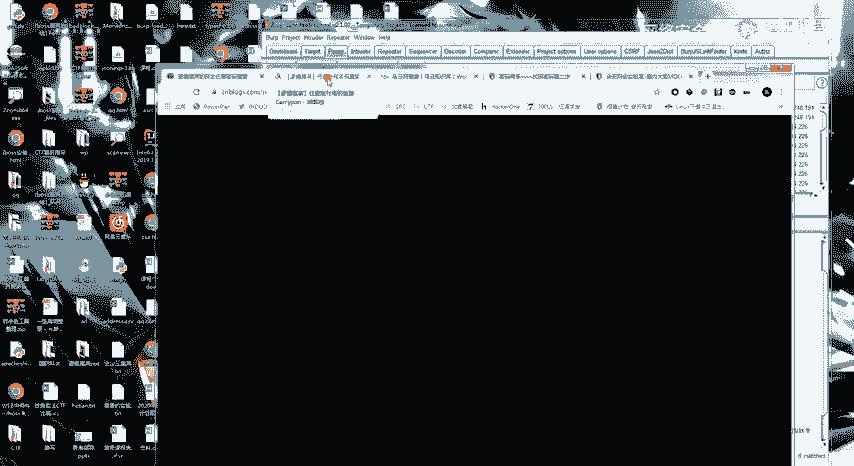

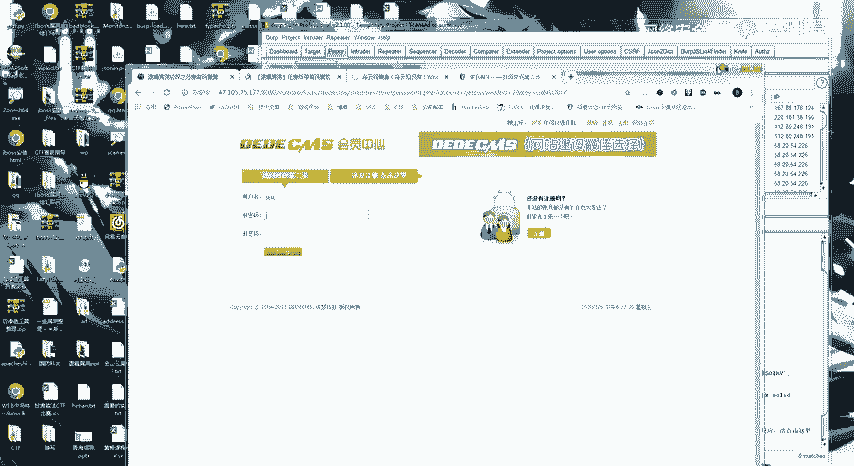


**4. 验证逻辑仅在前端（JavaScript）完成**
此场景指验证码的校验工作完全由浏览器端的JavaScript代码执行，服务器端未做二次验证。
*   攻击者可以轻易绕过前端JS验证，直接向服务器发送请求。
*   或通过分析JS代码，找到固定的“万能验证码”。

**5. 可跳过验证步骤**
此场景指密码重置流程分为多步（如：1.输入账号 -> 2.验证身份 -> 3.设置新密码），但系统未校验步骤的连续性。
*   攻击者通过正常流程获取到“设置新密码”页面的URL后，可直接访问该URL，跳过前面的身份验证步骤。

**6. 重置凭证（Token）可被预测**
此场景指用于重置密码的Token（通常包含在链接中）生成有规律，而非真正的随机数。
*   Token可能是基于时间、用户ID等参数生成的，存在规律。
*   攻击者通过收集少量样本，即可分析出规律并构造出其他用户的Token。

**7. 可同时向多个账户发送凭证**
此场景是一个特殊思路。在输入手机号或邮箱的环节，尝试使用逗号等分隔符同时输入多个账号。
*   如果系统设计不当，可能会向所有列出的账号发送相同的验证码或重置链接。
*   攻击者利用此点，可用自己账号收到的凭证去重置他人账号。

**8. 接收端参数可被篡改**
此场景与场景3类似，但更侧重于在验证通过后的“修改密码”阶段，参数被篡改。
*   例如，在提交新密码的请求中，除了新密码参数，还可能包含一个标识目标用户的参数（如`user_id`）。
*   如果服务器仅依赖此参数判断为哪个用户修改密码，而未与之前验证的身份关联，则篡改`user_id`即可修改他人密码。

**9. 存在万能验证码**
此场景极少见，指系统存在一个固定的、通用的验证码（如`000000`），可用于任何账户的重置流程。

**10. 验证码为空或越权**
此场景指在重置请求中，提交空的验证码或删除验证码参数，系统依然能通过验证。或者验证逻辑存在越权，低权限凭证能进行高权限操作。

## 任意账户登录漏洞
理解了任意密码重置漏洞后，本节我们来看看与之思路高度重叠的任意账户登录漏洞。其核心定义是：**利用逻辑错误，在不知道目标账户密码的情况下，直接登录该账户**。

以下是几种常见的任意账户登录场景：

**1. 验证码回显登录**
与密码重置漏洞类似，在短信/邮箱验证码登录时，验证码在服务器返回包中直接显示。

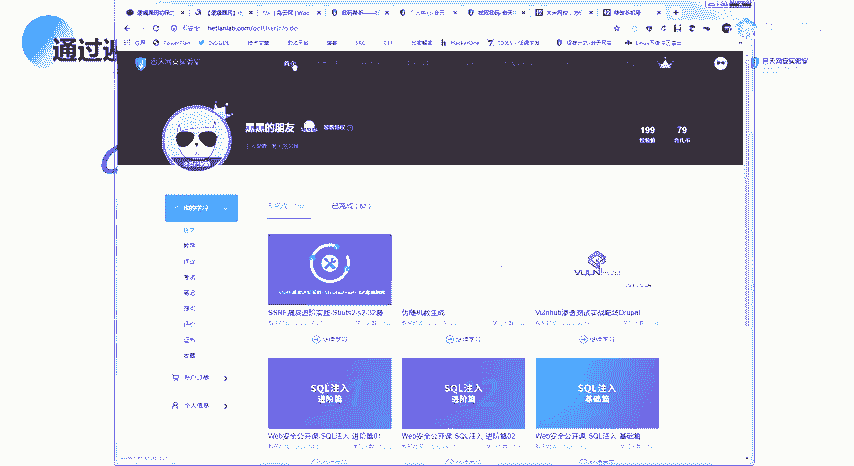

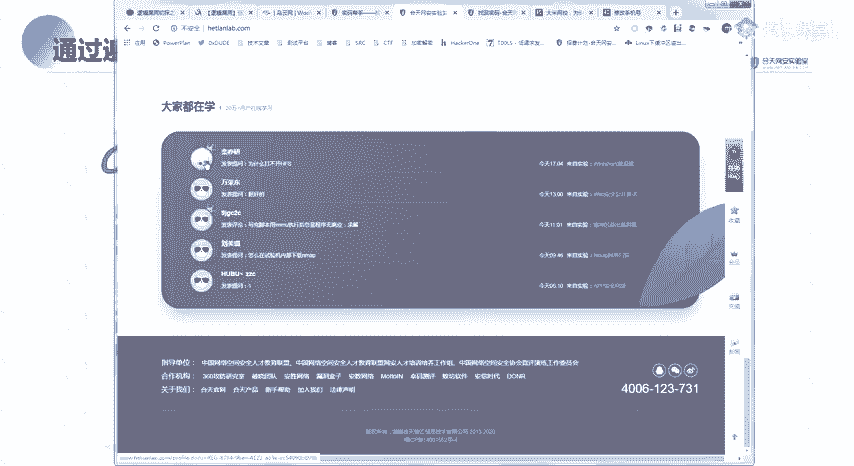

**2. 修改返回包实现登录**
此场景指在登录过程中，拦截服务器返回的响应包，并将其内容从“登录失败”修改为“登录成功”的响应内容，从而欺骗前端应用，使其认为登录已成功。
*   例如，抓取一次成功登录的返回包，保存其响应体。在尝试登录他人账号时，用保存的成功响应体替换掉失败的响应体。

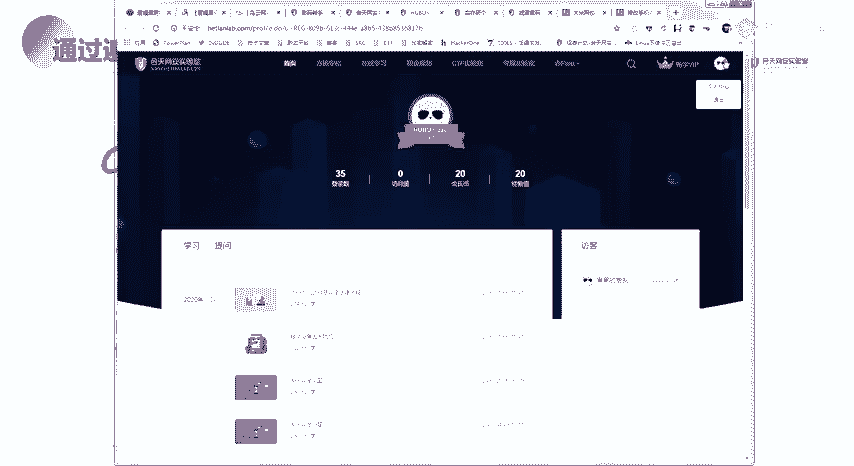

**3. 修改用户标识参数（如UID）**
某些登录接口或登录后的会话维持，依赖于`user_id`、`username`等参数。
*   如果登录后的Cookie或Session中包含了明文的用户ID，修改它可能切换到其他用户会话。
*   某些特殊登录接口直接接受用户ID作为凭证的一部分，修改它即可登录相应用户。

**4. SQL注入之“万能密码”**
这是一种经典的、因逻辑缺陷导致的漏洞。登录SQL语句如：
```sql
SELECT * FROM users WHERE username = ‘输入的用户名’ AND password = ‘输入的密码’
```
攻击者输入用户名：`admin‘ --`，密码任意。SQL语句变为：
```sql
SELECT * FROM users WHERE username = ‘admin’ -- ’ AND password = ‘xxx’
```
`--`将后面的密码验证注释掉，从而只验证用户名，实现以admin身份登录。

**5. 默认口令/弱口令**
系统或设备出厂时设置的默认用户名密码（如`admin/admin`），或用户设置的常见弱密码（如`123456`）。
*   在目标系统未强制修改初始密码或存在大量弱密码时，可通过口令爆破或社工库碰撞进行登录。

**6. 撞库攻击**
利用从其他平台泄露的账号密码数据库（社工库），去尝试登录目标系统。
*   因为很多用户在不同平台使用相同的账号密码，一旦某一平台数据泄露，其他平台账户也面临风险。

**7. Cookie混淆**
系统使用Cookie中的某个字段（如`user_id=123`）来标识当前登录的用户身份。
*   如果该字段值可被预测或篡改（例如改为`user_id=124`），就可能以其他用户身份登录。

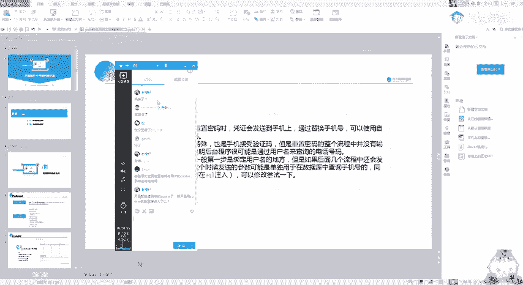

## 总结
本节课中我们一起学习了逻辑漏洞中的两大核心类型：任意密码重置和任意账户登录。我们深入分析了十余种具体的漏洞场景，从验证码爆破、回显、未绑定，到跳过步骤、Token预测、参数篡改等。逻辑漏洞的挖掘关键在于**理解业务逻辑流程**和**发散性测试思维**，多观察、多尝试、多思考“如果…会怎样”。课后请结合靶场和实际案例进行练习，巩固这些思路。记住，发现逻辑漏洞的秘诀在于对正常流程的每一个环节都抱以质疑的态度并进行测试。