# 网络安全：P19：课程考核与逻辑漏洞脑洞篇

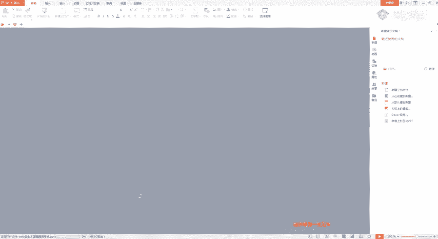

在本节课中，我们将对之前布置的课程考核题目进行讲解，并深入探讨逻辑漏洞挖掘中一些扩展性的思路与“脑洞”。我们将学习如何通过简单的抓包改包发现支付逻辑漏洞、越权漏洞，并理解如何通过“增、删、改”参数来发现隐藏的安全问题。

---

## 考核题目讲解

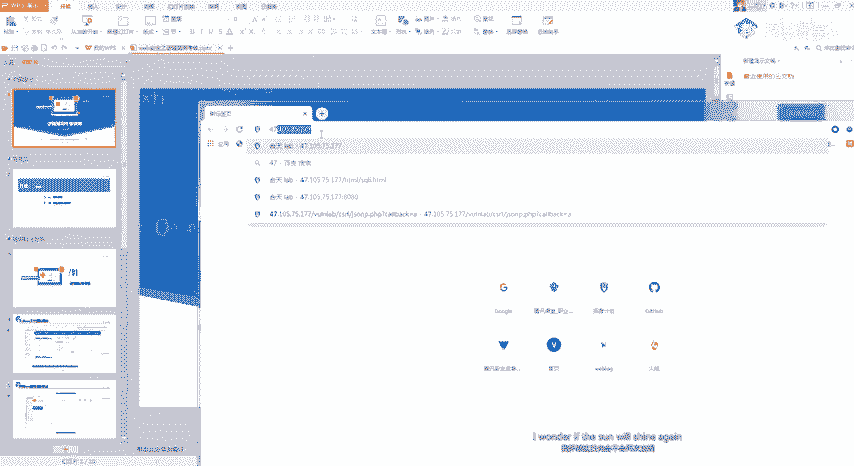

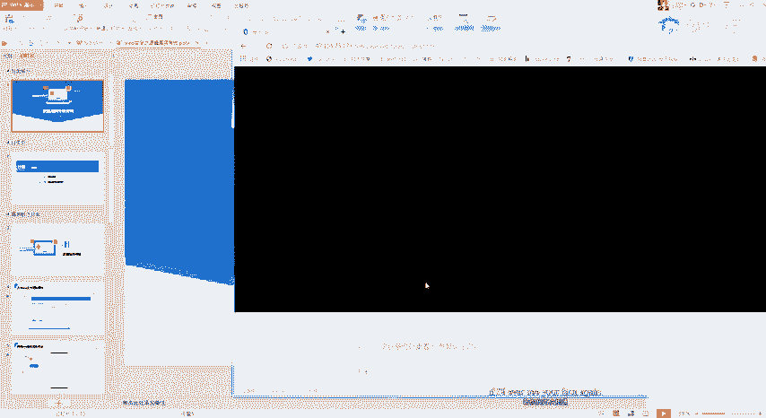

上一节我们介绍了逻辑漏洞的基本概念，本节中我们来看看具体的考核题目如何分析与利用。

### 大米CMS支付逻辑漏洞

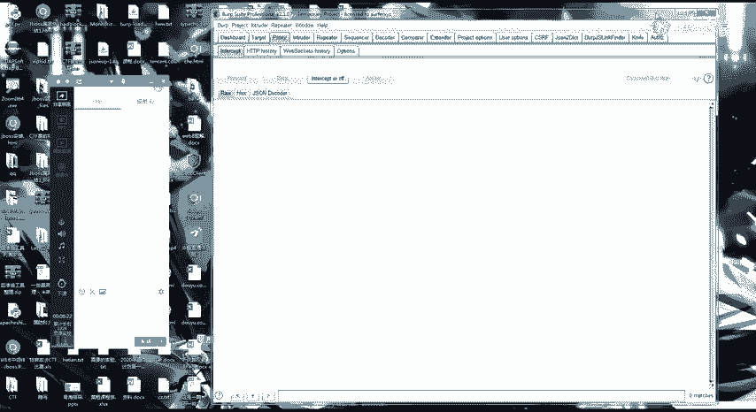

这个漏洞的核心在于修改订单参数，实现支付金额的异常变动。

**漏洞利用步骤：**
1.  注册一个账号。
2.  在网站中选择一个产品，点击购买。
3.  在提交订单时进行抓包。
4.  分析数据包中的参数，例如 `price`（价格）、`num`（数量）、`id`（商品ID）等。
5.  尝试修改这些参数的值，例如将数量 `num` 改为 `-1`。
6.  提交修改后的数据包，观察账户余额变化。

**核心思路：**
支付逻辑漏洞的测试关键在于对请求包中**每一个参数**进行测试。开发者可能只对价格 `price` 做了校验，但忽略了数量 `num` 或商品ID `id` 的校验。通过抓包并系统性地修改每个参数，就可能发现逻辑缺陷。

### 熊海CMS后台越权漏洞

这个漏洞利用了系统通过Cookie中的特定字段（如`user`）来判断用户身份的逻辑缺陷。

**漏洞利用步骤：**
1.  访问后台登录页面（例如 `r=login`）。
2.  通过查看源码或下载该CMS的源代码，了解其后台的目录和参数结构。
3.  在请求中，尝试在Cookie里添加一个管理员字段，例如 `user=admin`。
4.  直接访问后台功能页面（如 `r=admin`），观察是否成功越权访问。

**核心思路：**
对于开源CMS，可以通过下载源码来了解其认证和授权逻辑。重点检查身份验证是否依赖于客户端可控制的字段（如Cookie）。如果发现仅通过修改Cookie中的某个值就能切换身份，则存在越权漏洞。

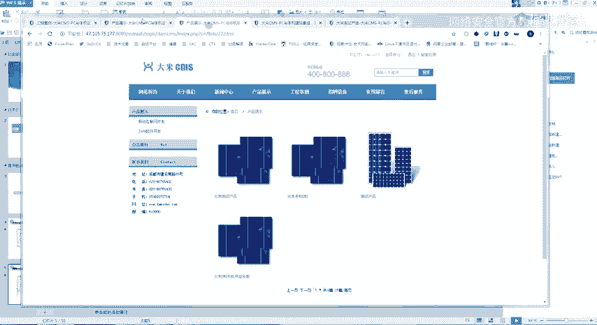

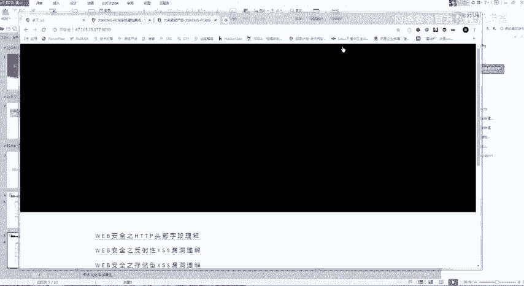

### ThinkShop收货地址越权漏洞

这是一个典型的基于ID的越权访问（IDOR）漏洞。

**漏洞利用步骤：**
1.  登录用户A，添加一个收货地址，抓取修改或删除该地址的请求包。
2.  观察请求包中用于标识地址的唯一参数，通常是 `address_id` 或 `uid`。
3.  登录用户B，尝试修改用户B请求包中的 `address_id` 为用户A的地址ID。
4.  如果操作成功，则证明存在越权漏洞。

**核心思路：**
越权漏洞常出现在对数据对象进行操作时，服务端未校验当前用户是否有权操作该对象ID。在测试时，应重点关注所有携带ID参数的请求，尝试修改ID值，测试是否能访问或操作其他用户的数据。这类漏洞在医院、学校等管理大量用户信息的系统中尤为常见。

---

## 逻辑漏洞挖掘“脑洞篇”

掌握了基础漏洞的利用方法后，本节我们来看看如何拓展思维，发现更深层或更隐蔽的逻辑漏洞。核心在于对HTTP请求参数进行“增、删、改、查”之外的创造性测试。

### 思路一：删除参数

有时，开发者为了防御某些漏洞（如CSRF）会添加Token参数，但服务端的校验逻辑可能存在缺陷。

**测试方法：**
在拦截到的请求中，尝试删除某些看似重要的参数，例如：
*   删除整个Cookie头，测试是否还能访问需要登录的敏感信息（未授权访问）。
*   删除CSRF Token（`token`、`csrf_token`等），测试操作是否依然能成功执行。

**案例启发：**
如果删除认证凭证（如Cookie）后，请求依然返回敏感数据，则存在严重的未授权访问漏洞。这提醒我们，不要看到Token就放弃测试，而应验证其是否被后端严格校验。

### 思路二：添加参数

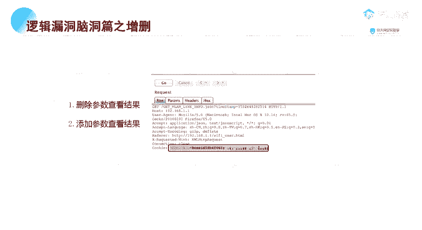

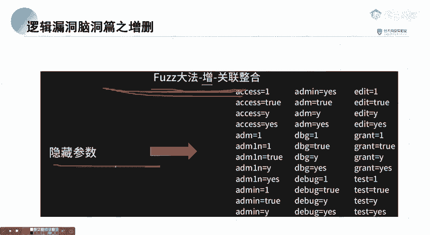

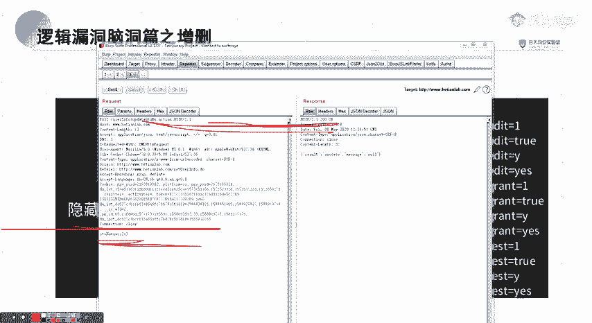

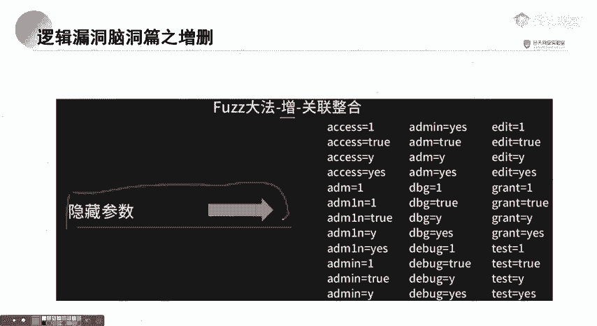

网站功能可能隐藏了一些未在页面上显示的参数，这些“隐藏参数”可能控制着不同的逻辑分支，是漏洞的富矿。

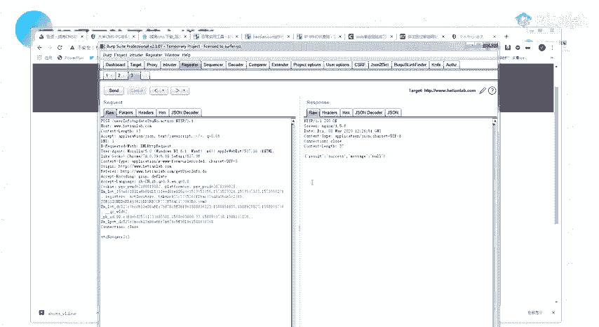

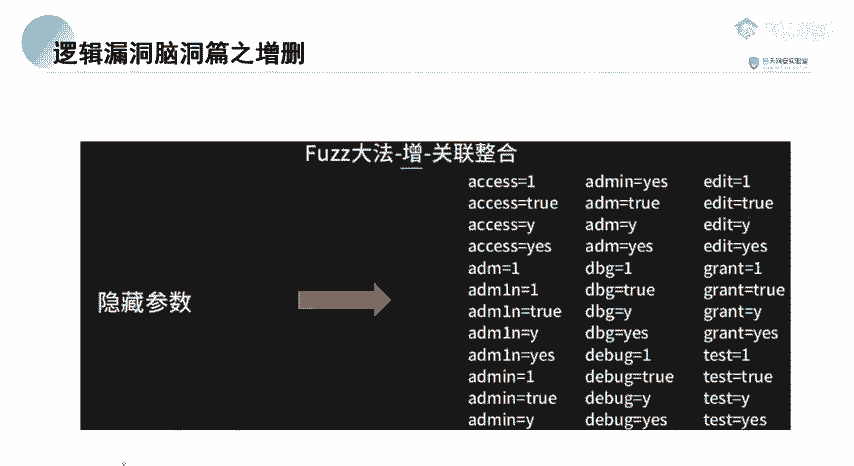

**测试方法：**
1.  准备一个包含常见参数名的字典（例如：`callback`、`debug`、`admin`、`isAdmin`）。
2.  对目标请求使用Burp Suite的Intruder等功能，在请求中插入一个参数位置（如 `?test=1`），并将参数名设置为字典变量。
3.  发起攻击，观察响应内容、长度或状态码是否有异常变化。

**案例启发：**
*   **JSONP劫持：** 通过添加 `callback` 参数，可能发现JSONP端点，进而测试是否存在敏感信息泄露。
*   **功能切换：** 添加 `debug=true`、`admin=1` 等参数，可能开启调试模式或管理员功能。
*   **越权挖掘：** 在数据查询请求中，除了明显的 `id` 参数，尝试添加 `user_id`、`student_id`、`family_id` 等参数，可能发现不同的、未做权限校验的数据查询路径。

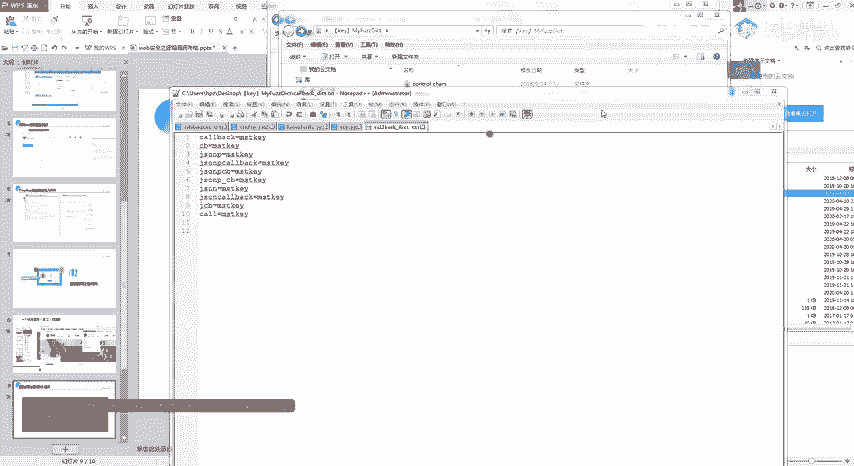

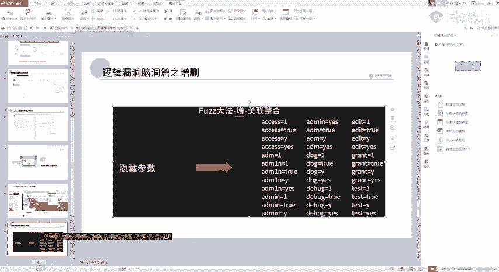

### 思路三：参数混淆与替换

当直接修改某个参数（如ID）无效时，可以尝试从服务器的其他响应中寻找线索，用新的参数名或值进行替换。

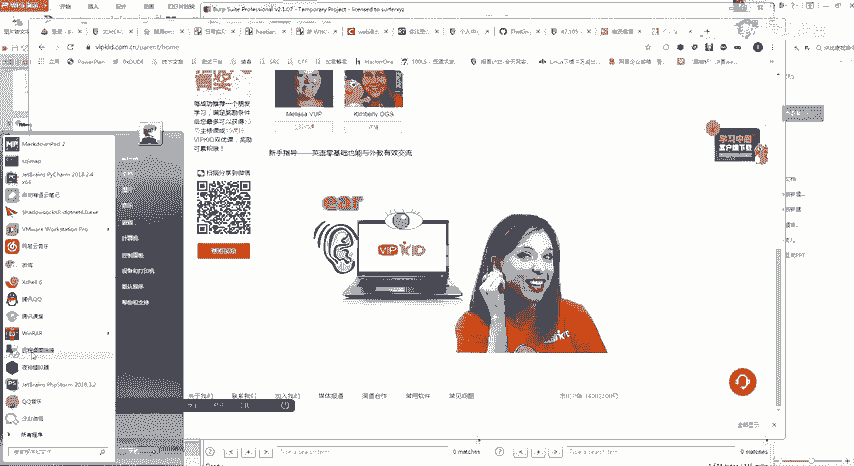

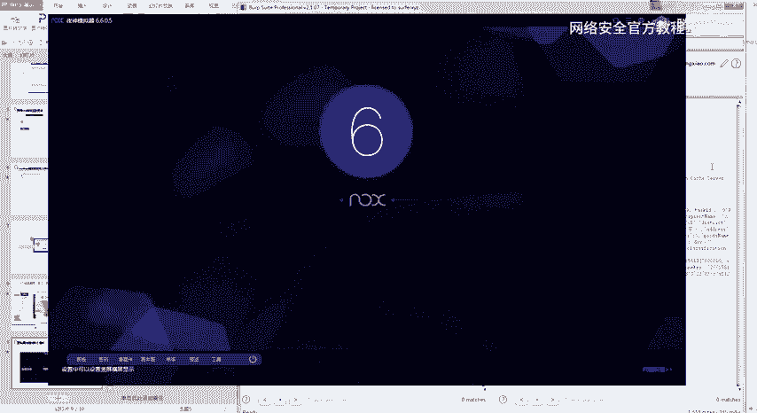

**测试方法：**
1.  分析网站或APP的API返回的JSON数据，其中可能包含多个标识对象的ID字段。
2.  在后续的相关请求中，不局限于修改原始参数，而是尝试将请求中的参数名或值替换为JSON中看到的其他ID字段。
3.  例如，原请求使用 `id=123`，但JSON数据中还有 `studentId=456` 和 `familyId=789`。可以尝试将请求改为 `studentId=456` 或 `familyId=789`，观察是否能访问到不同或未授权的数据。

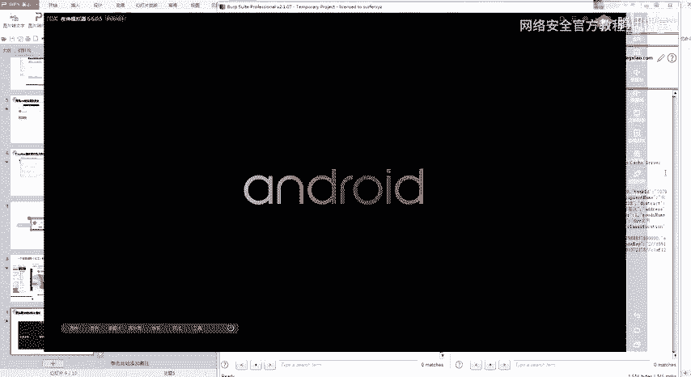

**核心思维：**
逻辑漏洞挖掘需要发散思维，不要被界面和常规参数所限制。服务器的业务逻辑可能复杂，认证和授权点可能分散。通过“增、删、改”参数，模拟各种意外或恶意输入，才能触发那些非常规路径下的逻辑缺陷。

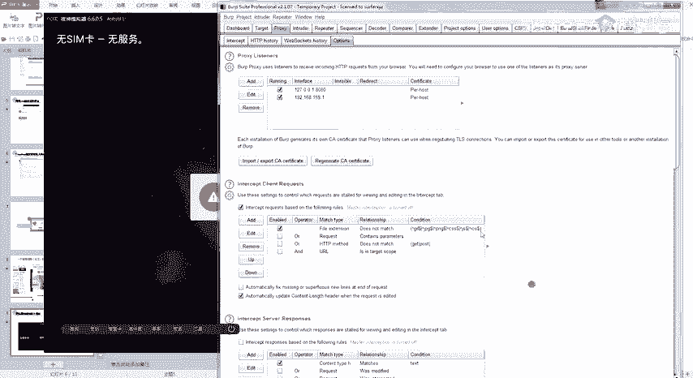

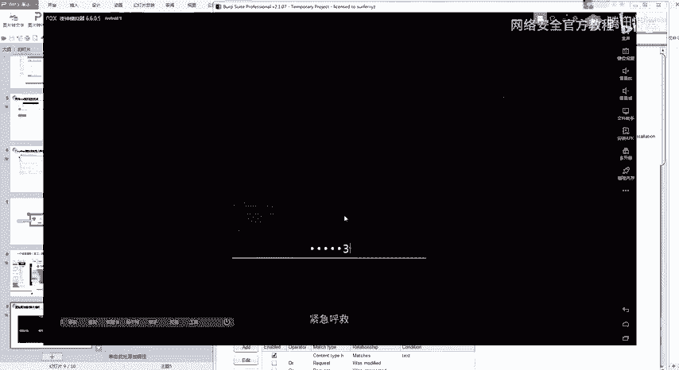

---

## 总结

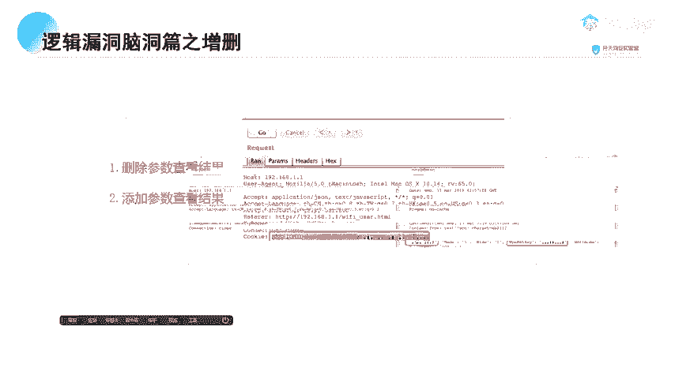

本节课中我们一起学习了：
1.  **三个考核漏洞**：大米CMS的支付逻辑漏洞、熊海CMS的Cookie越权漏洞、ThinkShop的IDOR越权漏洞。它们都通过抓包改包即可验证，关键在于理解每个参数的作用并大胆测试。
2.  **逻辑漏洞扩展思路**：重点介绍了通过**删除参数**来测试校验缺失，通过**添加参数**来探测隐藏功能与接口，通过**参数混淆**来寻找非常规的数据访问路径。这些方法旨在拓宽测试边界，发现更深层的安全问题。

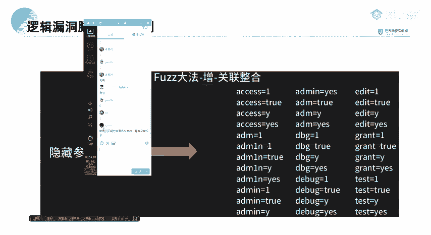

记住，挖掘逻辑漏洞需要保持好奇心与“黑客思维”，多问“如果…会怎样？”，并亲手进行测试验证。