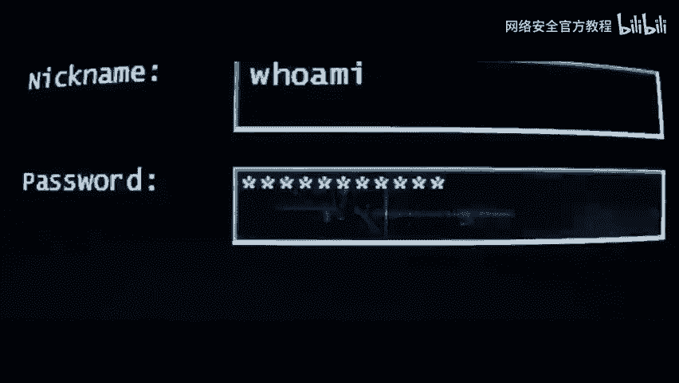

网络安全入门：P1：课程先导与核心概念

在本节课中，我们将了解网络安全的基本轮廓，明确学习路径，并认识一些核心概念。课程旨在为初学者构建清晰的知识框架。

---

### **什么是网络安全？**

网络安全涉及保护计算机系统、网络和数据免受攻击、损坏或未经授权的访问。其目标是确保信息的**机密性**、**完整性**和**可用性**，这通常被称为 **CIA三元组**。

*   **机密性**：确保信息不被未授权者访问。
*   **完整性**：确保信息在存储或传输过程中不被篡改。
*   **可用性**：确保授权用户能在需要时访问信息和资源。


---

### **主要学习领域**

上一节我们定义了网络安全，本节中我们来看看其涵盖的几个关键方向。以下是网络安全领域常见的几个细分方向：


1.  **Web安全**：专注于网站、Web应用及其后端服务器的安全防护。核心是发现并修复如SQL注入、跨站脚本等漏洞。
2.  **渗透测试**：模拟黑客攻击，以授权的方式评估系统安全性。流程通常包括：信息收集、漏洞扫描、漏洞利用、权限维持和报告撰写。
3.  **内网渗透**：在获得边界系统一定权限后，对内网中的其他计算机和设备进行深入探测与横向移动，评估内网整体安全状况。
4.  **CTF**：全称“夺旗赛”，是一种在安全领域流行的竞赛形式，通过解决与网络安全相关的挑战题目来学习技术。

---

### **核心技能与工具基础**

了解领域后，我们需要掌握支撑这些领域的公共基础。以下是入门阶段必须熟悉的一些核心概念和工具：



*   **网络基础**：理解TCP/IP模型、HTTP/HTTPS协议、IP地址、端口等概念是分析网络流量和攻击的基础。
*   **操作系统**：熟悉**Linux**（如Kali Linux）和**Windows**命令行操作，因为它们是主要的目标和攻击平台。
*   **编程与脚本**：掌握至少一门脚本语言（如**Python**或**Bash**）能极大提高自动化处理能力。例如，一个简单的Python端口扫描脚本片段：
    ```python
    import socket
    target = "example.com"
    for port in range(1, 1025):
        s = socket.socket(socket.AF_INET, socket.SOCK_STREAM)
        if s.connect_ex((target, port)) == 0:
            print(f"Port {port} is open")
        s.close()
    ```
*   **虚拟化技术**：使用**VMware**或**VirtualBox**搭建隔离的实验环境，避免对真实系统造成影响。

---

### **正确的学习路径建议**

盲目自学容易迷失方向，一个结构化的路径至关重要。


1.  **夯实基础**：首先学习计算机网络、操作系统和一门编程语言。
2.  **学习理论**：系统了解各类攻击原理（如OWASP Top 10漏洞）和防御机制。
3.  **动手实践**：在合法授权的实验环境（如靶场：DVWA、Metasploitable）中反复练习。
4.  **使用工具**：学习主流安全工具（如Nmap, Burp Suite, Wireshark）的基本操作，并理解其背后原理。
5.  **持续学习与交流**：关注安全动态，阅读技术博客，参与社区讨论或CTF比赛。

---

本节课中我们一起学习了网络安全的定义、核心的CIA目标、主要的四个学习领域（Web安全、渗透测试、内网渗透、CTF），以及入门所需的技能基础与建议的学习路径。记住，网络安全是一门需要持续学习和大量实践的学科，从基础开始，循序渐进是成功的关键。