# 网络安全：20：XML基础、DTD基础与XXE简介

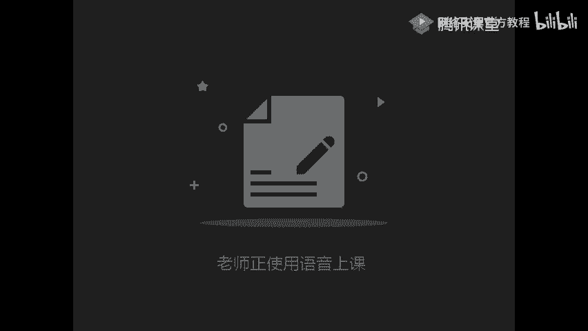

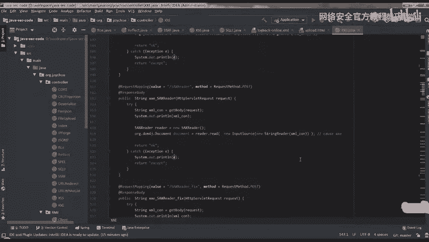

在本节课中，我们将要学习XML外部实体注入攻击的基础知识。课程将首先介绍XML语言的基本概念和结构，然后讲解DTD文档类型定义，最后引入XXE漏洞的初步概念。这些知识是理解后续XXE漏洞利用与防御的基础。

## XML基础

XML是一种用于标记电子文件，使其具有结构性的可扩展标记语言。它的形式与HTML语言类似，但XML没有固定的标签，所有标签都可以自定义。XML设计的宗旨是传输数据，而非像HTML一样用于前端显示。

### XML处理流程

以下是程序处理XML的一个典型流程。

1.  客户端生成一个XML文档。
2.  客户端通过HTTP协议将XML文档发送给服务端。
3.  服务端接收请求后，使用XML解析库对文档进行解析。
4.  解析后，服务端可能将数据回显给客户端，或进行其他处理。

### XML文档结构

一个XML文档通常包含以下部分。

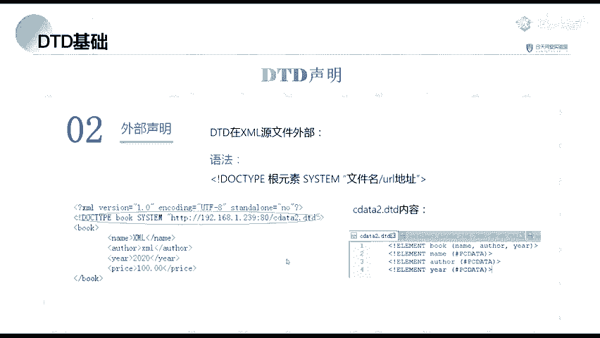

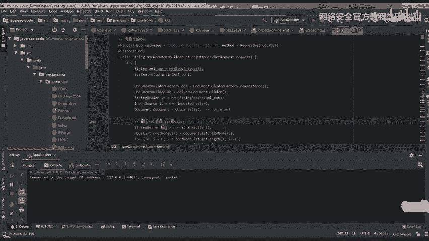

*   **XML声明**：表明文档类型和编码，例如 `<?xml version="1.0" encoding="UTF-8"?>`。
*   **文档类型定义**：可选部分，用于定义文档结构约束。
*   **文档元素**：文档的主体内容，包含根元素和子元素。

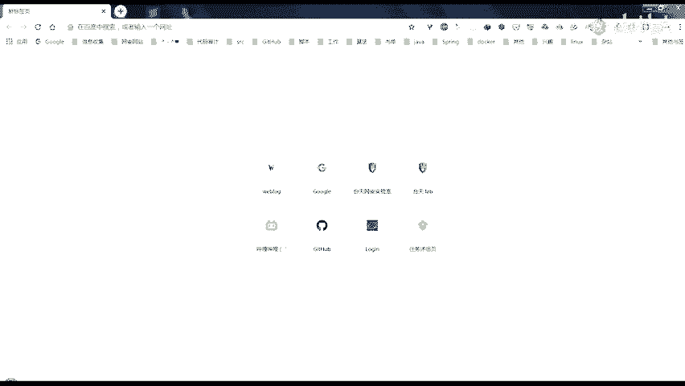

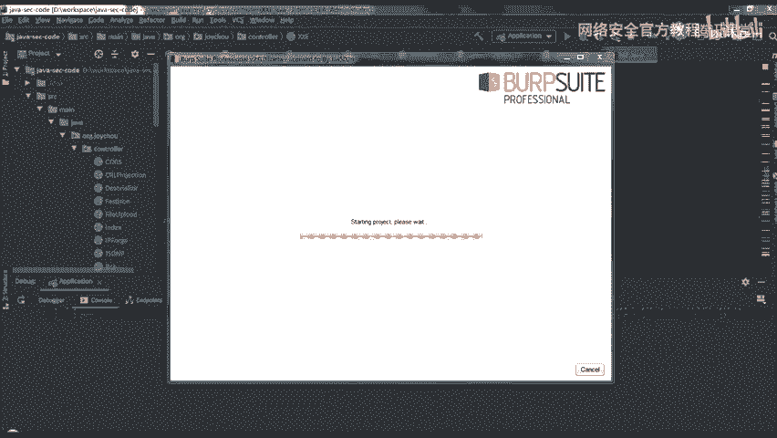

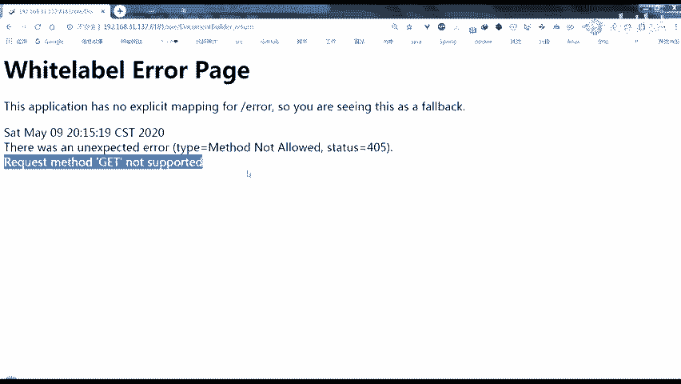

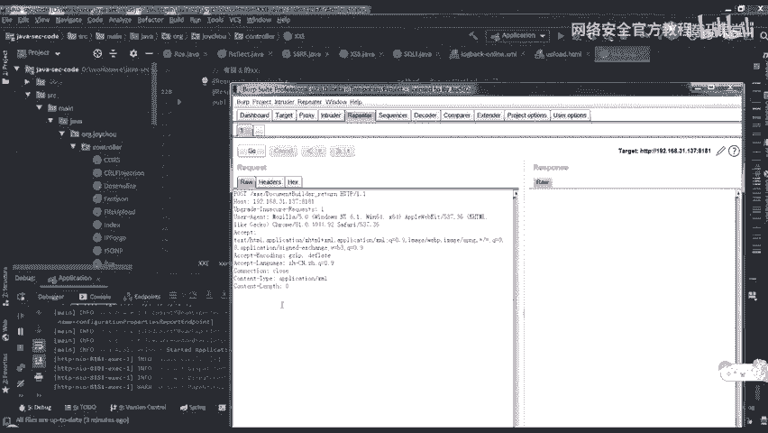

### XML语法规则

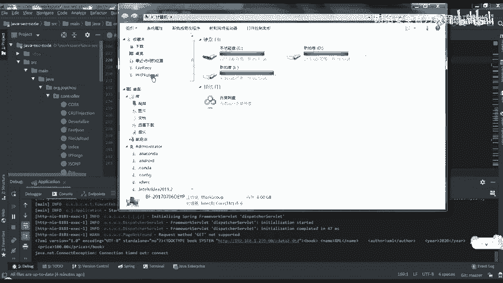

XML文档必须遵循以下基本语法规则。

*   XML文档必须有一个根元素。
*   XML元素必须有关闭标签。
*   XML标签对大小写敏感。
*   XML元素必须被正确地嵌套。
*   XML属性值必须加引号。

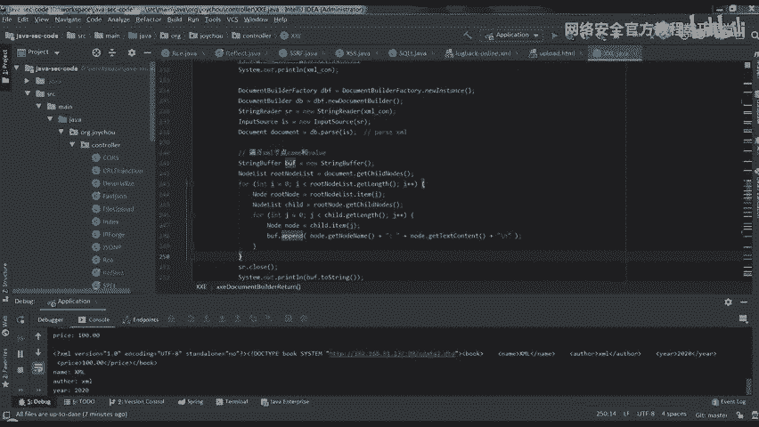

## DTD基础

上一节我们介绍了XML的基本结构，本节中我们来看看如何定义XML文档的约束，即DTD。

DTD是文档类型定义，用于为XML文档定义语义约束。可以将DTD理解为一个模板，它定义了用户自定义的根元素、子元素及其合法值和属性。XML文档元素必须以DTD为模板进行规范化。

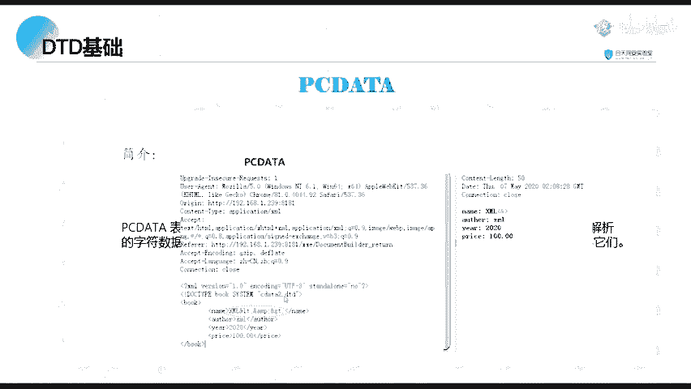

### DTD声明方式

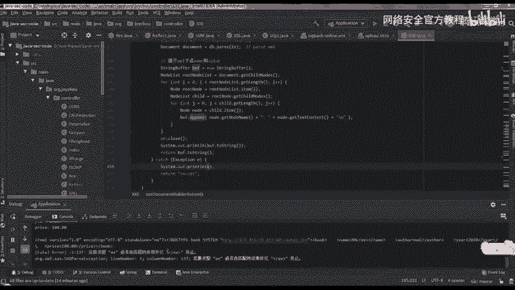

DTD声明有两种方式：内部声明和外部声明。

**内部DTD声明**的语法如下，它直接写在XML文档内部。

```xml
<!DOCTYPE 根元素名 [
  <!ELEMENT 子元素名 (#PCDATA)>
  ...
]>
```

**外部DTD声明**的语法如下，它通过`SYSTEM`关键字引入外部文件。

```xml
<!DOCTYPE 根元素名 SYSTEM "文件名.dtd">
```
或者引入远程URL。
```xml
<!DOCTYPE 根元素名 SYSTEM "http://example.com/path/to/file.dtd">
```

### PCDATA 与 CDATA

在DTD中定义元素类型时，会用到`#PCDATA`和`CDATA`。

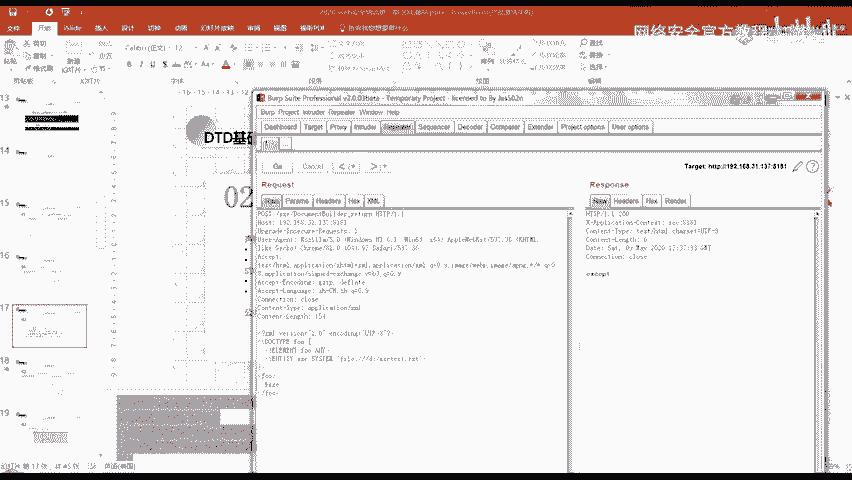

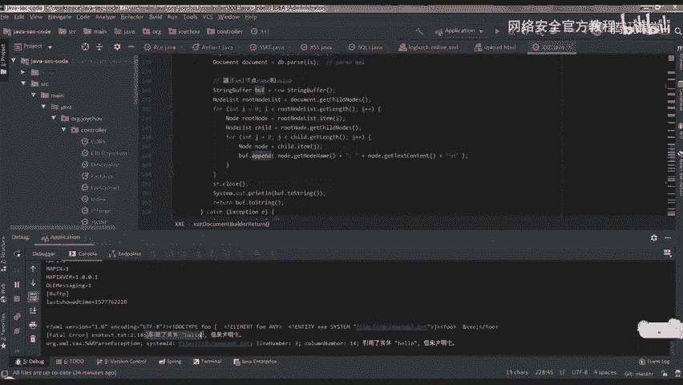

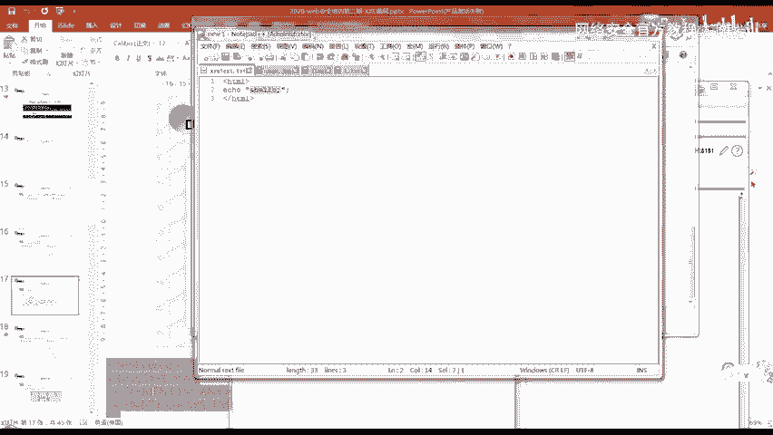

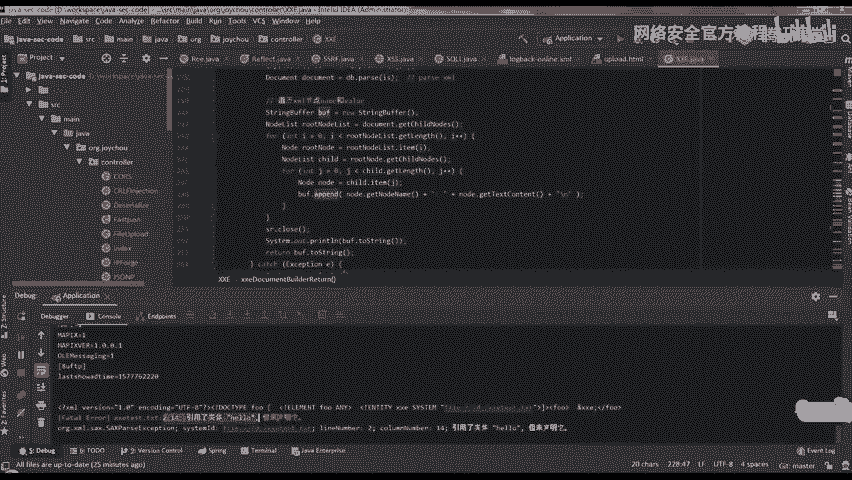

*   **`#PCDATA`**：表示可解析的字符数据。包含在此类型中的文本将被解析器检查。如果数据中包含 `<`、`>`、`&` 等特殊字符，需要使用对应的实体（如 `&lt;`， `&gt;`， `&amp;`）来替代，否则解析会出错。
*   **`CDATA`**：表示不应由XML解析器进行解析的文本数据。所有内容都会被解析器忽略。其语法由 `<![CDATA[ 文本内容 ]]>` 包裹。这常用于包含大量特殊字符（如代码片段）的情况，以避免解析错误。

## DTD实体

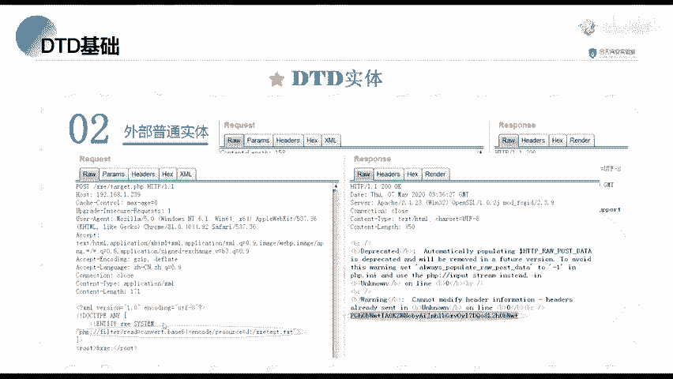

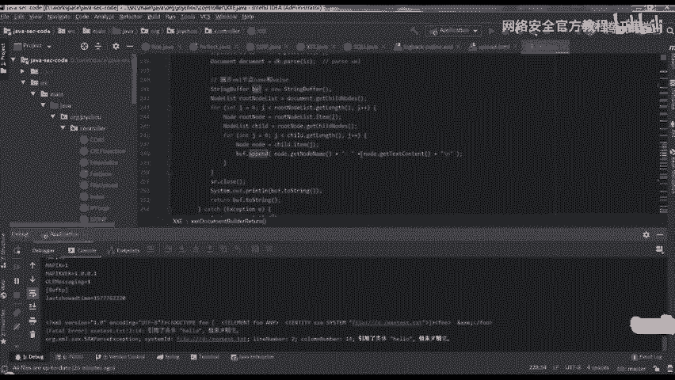

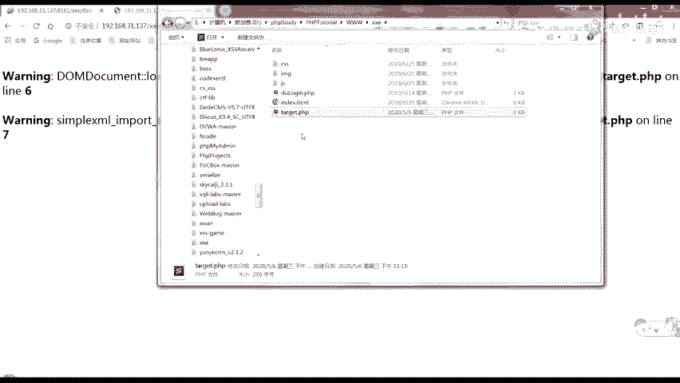

理解了DTD的基本声明后，本节我们深入探讨DTD的核心组成部分之一：实体。实体类似于变量，用于定义引用一段文本或数据。

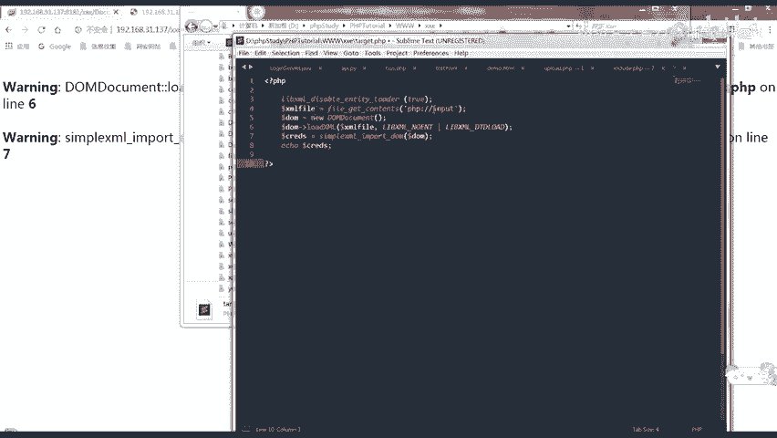

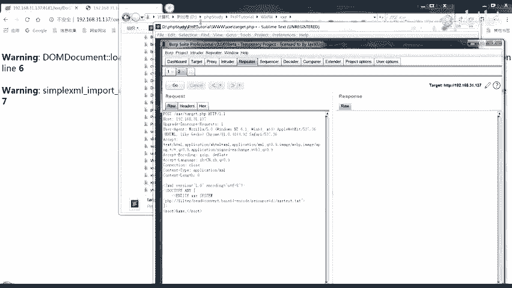

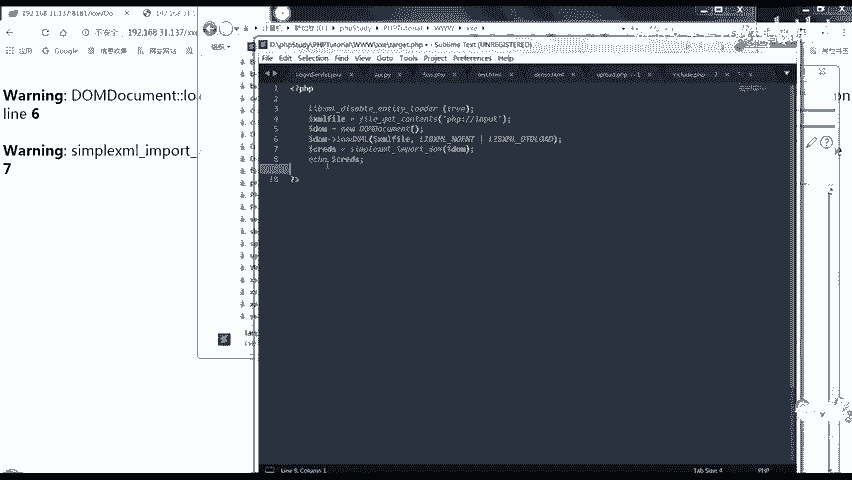

### 内部普通实体

内部普通实体在DTD内部定义和赋值。以下是其声明和引用方式。

声明语法：
```xml
<!ENTITY 实体名 "实体值">
```
引用语法：
```xml
&实体名;
```
例如，定义 `<!ENTITY hello "World">`，在XML元素中引用 `&hello;`，解析后会替换为 “World”。

### 外部普通实体

外部普通实体引用了外部文件或资源的内容。以下是其声明方式。

声明语法：
```xml
<!ENTITY 实体名 SYSTEM "URI">
```
或
```xml
<!ENTITY 实体名 PUBLIC "公共标识符" "URI">
```
引用方式与内部实体相同：`&实体名;`。

例如，以下声明会读取服务器本地文件。
```xml
<!ENTITY file SYSTEM "file:///C:/windows/win.ini">
```
在XML中引用 `&file;`，如果服务器存在XXE漏洞，则可能将 `win.ini` 文件的内容回显出来。

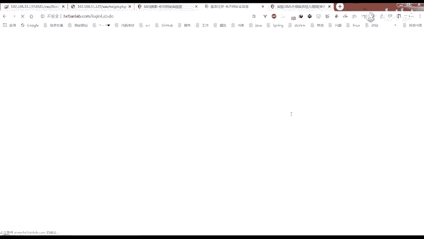

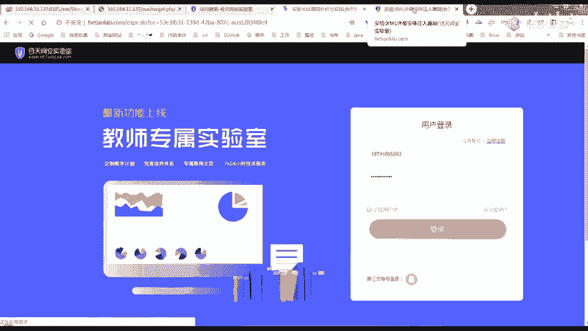

### 外部实体支持协议

不同语言的XML解析器支持不同的协议来引用外部实体。以下是常见语言支持的部分协议。

*   **PHP**：`file`， `http`， `php`（filter）， `compress.zlib` 等。
*   **Java**：`file`， `http`， `https`， `ftp` 等。
*   **.NET**：`file`， `http`， `https` 等。

利用这些协议，攻击者可以尝试读取服务器文件（`file://`）、发起SSRF攻击（`http://`）等。例如，在PHP中，可以利用`php://filter`协议以Base64编码方式读取文件，避免特殊字符导致解析错误。
```xml
<!ENTITY file SYSTEM "php://filter/read=convert.base64-encode/resource=/etc/passwd">
```

## XXE漏洞简介

基于前面学习的DTD外部实体知识，我们现在可以初步理解XXE漏洞。当应用程序解析用户可控的XML输入时，如果没有禁用外部实体的加载，攻击者就可以构造恶意的XML文档，利用外部实体声明来读取服务器本地文件、进行内网探测或发起拒绝服务攻击等。

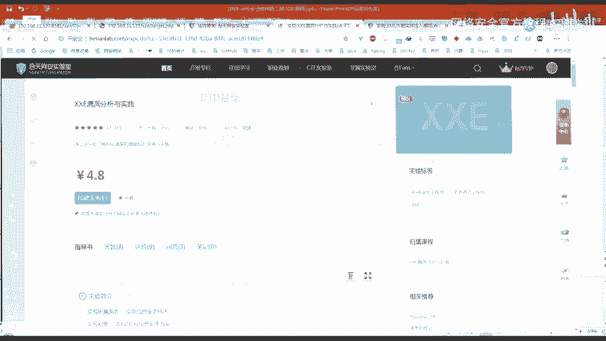

本节课中我们一起学习了XML的基本语法与结构、DTD的定义与声明方式，以及DTD内部实体与外部实体的概念。我们还初步了解了XXE漏洞的产生原理，即由不安全地解析外部实体引发。下一节课，我们将深入探讨XXE漏洞的具体利用方式、攻击技巧以及如何防御此类漏洞。