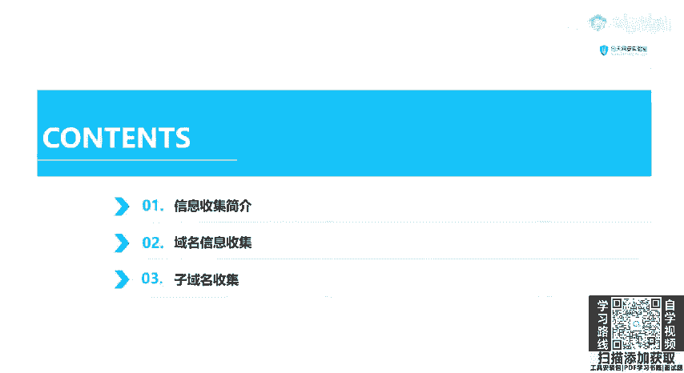
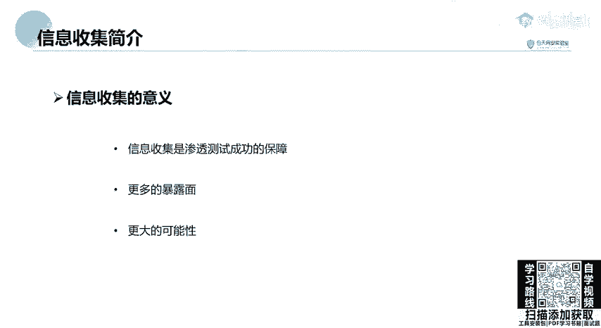
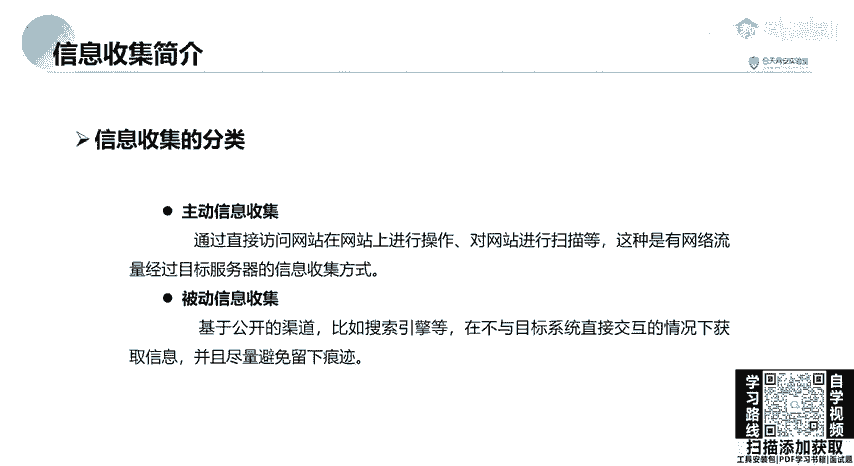
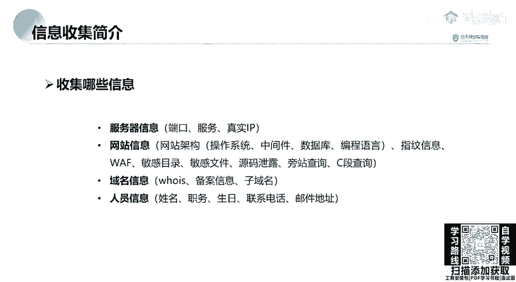

# 网络安全教程：P27：25.信息收集简介

在本节课中，我们将要学习渗透测试中至关重要的第一步：信息收集。我们将了解信息收集的目的、分类以及具体需要收集哪些内容，为后续的渗透测试工作打下坚实基础。

## 为什么要进行信息收集？

信息收集是指通过各种方式获取目标系统相关信息的过程。充分的收集工作能让我们在后续的渗透测试中更有针对性地进行攻击。

信息收集是渗透测试成功的保障。它能够扩大目标的暴露面，从而增加我们发现漏洞和渗透成功的可能性。正如“知己知彼，百战百胜”所言，当我们从甲方获得一个目标（如一个IP地址或域名）后，不能仅针对该单一目标进行扫描。例如，挖掘百度SRC漏洞时，直接对`www.baidu.com`主站进行高强度扫描，发现漏洞的几率很小。此时，我们需要搜索其子域名、旁站或C段网络，寻找那些可能不太重要或新上线的测试站点，这些地方往往存在更高的安全风险。

## 信息收集的分类

信息收集主要分为主动信息收集和被动信息收集两类。

主动信息收集是指通过直接与目标系统交互来获取信息的方式，例如直接访问网站、进行漏洞扫描或端口扫描。这种方式会产生流向目标服务器的网络流量，并可能在目标服务器的访问日志中留下记录。如果目标部署了防火墙或入侵检测系统（IDS），你的行为可能会被检测并封锁。

被动信息收集则是基于公开渠道，在不与目标系统直接交互的情况下获取信息，并尽量避免留下痕迹。例如，利用搜索引擎或网络空间搜索引擎（如Shodan、Fofa）来查询目标信息。搜索引擎的爬虫已经预先收集了互联网上的公开信息，我们只需在搜索引擎中输入关键词即可完成信息收集，而无需直接触碰目标服务器。

## 需要收集哪些信息？

无论是面试、刚入门，还是已经从事渗透测试工作，在进行任何渗透项目时，通常都需要收集以下几类信息。以下是具体需要收集的内容：

1.  **服务器信息**
    *   IP地址
    *   开放的端口及运行的服务
    *   中间件信息（如Apache、Nginx、Tomcat）
    *   操作系统信息

2.  **网站信息**
    *   网站架构：操作系统、中间件、数据库、编程语言（如PHP、JSP、ASP）等指纹信息。
    *   是否存在Web应用防火墙（WAF）。
    *   敏感目录与敏感文件。
    *   是否存在源码泄露。
    *   旁站（同一IP上的其他网站）与C段（同一网段的其他IP）信息。

3.  **域名信息**
    *   通过WHOIS查询获取域名注册信息。
    *   网站备案信息。
    *   子域名信息。

4.  **人员信息**
    *   目标系统相关人员的姓名、职务、生日、联系电话、邮件地址等。
    *   这些信息可用于生成针对性密码字典进行爆破。许多人在设置密码时会使用姓名、生日等易记信息，掌握这些能提高密码破解的成功率。

本节课中我们一起学习了信息收集在渗透测试中的核心地位、主动与被动收集的区别，以及需要重点收集的四大类信息（服务器、网站、域名、人员）。掌握全面、高效的信息收集方法是成为一名合格渗透测试工程师的第一步。在接下来的课程中，我们将深入探讨各类信息收集的具体技术与工具。