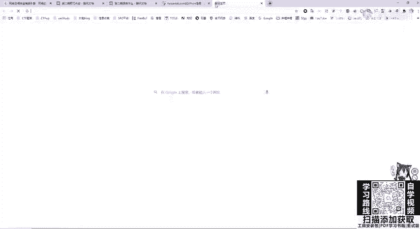
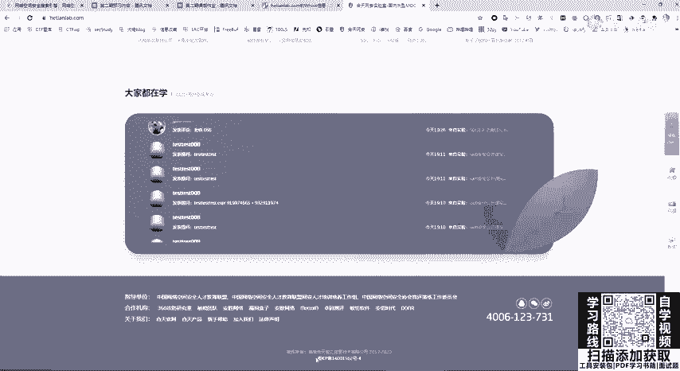
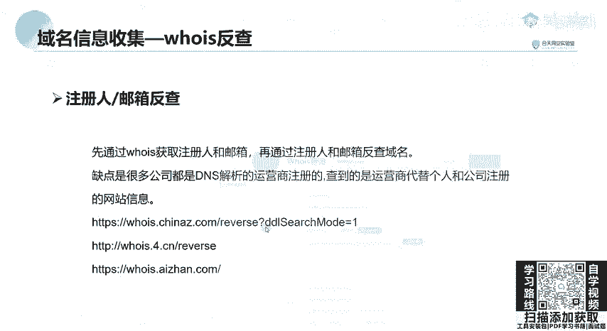

# 网络安全：P28：域名信息收集教程 🎯

## 概述
在本节课中，我们将要学习网络安全信息收集阶段的一个重要环节——域名信息收集。我们将了解域名的基本概念、域名系统（DNS）的工作原理，并掌握几种实用的域名信息查询方法，包括Whois查询和备案信息查询。这些技能是进行后续渗透测试或安全评估的基础。

## 什么是域名？🌐
域名是互联网上用于标识计算机或计算机组的一串用点分隔的名称。它本质上是一个易于记忆的计算机名称。

域名与IP地址通过DNS（域名系统）相互映射。DNS是一个分布式数据库，它将人类可读的域名（如 `example.com`）转换为机器可读的IP地址（如 `192.0.2.1`），使我们能够更方便地访问互联网。

例如，访问“核天网安实验室”的官网，如果要求你输入其服务器的IP地址，这非常难以记忆和访问。而通过DNS将其映射为域名 `hetian.la`，大家就很容易记住了。类似地，`www.weibo.com`、`www.baidu.com` 都是通俗易记的域名。

## 域名的层级结构
域名分为不同的层级，例如顶级域名、二级域名、三级域名等。

*   **顶级域名**：位于域名最后一部分，即最后一个点后面的字母。例如 `.com`。
*   **二级域名**：在顶级域名左侧的部分。例如，在 `example.com` 中，`example` 就是二级域名。
*   **三级域名**：在二级域名左侧的部分。例如，在 `www.example.com` 中，`www` 就是三级域名。

顶级域名有很多种类，例如：
*   **.com**：通用的国际商业域名。
*   **.gov**：政府机构使用的域名。
*   **.edu**：教育机构使用的域名。

**重要提示**：在中国，未经授权，绝对禁止对 `.gov` 政府域名进行任何形式的渗透测试、扫描或信息收集，否则可能面临法律风险。对于 `.edu` 教育域名，如果初学者想挖掘安全漏洞（SRC），可以尝试从高校的漏洞奖励计划入手。

## Whois 查询 🔍
上一节我们介绍了域名的基本概念，本节中我们来看看如何查询域名的注册信息。Whois 是一种用于查询域名IP地址以及域名所有者等详细信息的协议。

Whois 用于查询域名是否已被注册，以及注册域名的详细信息数据库。这些信息包括域名的所有人、注册商、注册日期、过期日期等。这类似于查询一家公司的工商注册信息。

我们可以将 Whois 理解为一个服务器。通过向 Whois 服务器发送查询请求，我们可以获得域名的注册者、联系邮箱、地址等信息。对于中小型网站，域名注册者很可能就是网站的管理员。因此，我们可以利用搜索引擎，对 Whois 查询到的信息进行进一步搜索，以获取更多关于域名注册者的个人信息。

以下是进行 Whois 查询的两种主要方法：

### 1. Web接口查询
这是非常方便的方法。有许多在线平台提供 Whois 查询服务。

例如：
*   阿里云 Whois 查询接口
*   站长之家 Whois 查询接口

操作步骤通常是在查询框中输入目标域名（例如 `hetian.la`），即可返回域名的创建时间、DNS服务器、注册商、联系邮箱等信息。需要注意的是，现在很多域名是通过代理商（如阿里云、腾讯云）注册的，因此查询到的注册商和联系邮箱可能是代理商的信息，而非网站实际管理者的信息。

### 2. 命令行查询
在 Kali Linux 等安全测试系统中，可以直接使用 `whois` 命令进行查询。该命令同样是向 Whois 服务器发送请求。

**代码示例：**
```bash
whois baidu.com
```
执行此命令将返回百度域名的详细注册信息。

## 网站备案信息查询 📄
除了 Whois，在中国大陆还有一个重要的信息收集渠道：查询网站的备案信息。



根据中国法律，在中国大陆搭建网站并进行域名解析，都需要对网站服务器进行备案。备案成功后，会获得一个ICP备案号。通常，在中国大陆运营的网站会在页面底部展示这个备案号。



如果网站在国内未进行备案，则无法正常进行域名解析。因此，我们可以利用备案号信息来搜集网站的管理员信息、关联站点以及子域名信息。

**查询方法**：可以通过工信部备案管理系统或第三方备案查询网站（如站长之家备案查询）进行查询。输入域名或备案号，即可查询到备案主体（公司或个人）信息，以及该主体备案的其他所有网站域名。这有助于我们发现目标公司的更多网络资产。

## 利用信息进行反查
在获取了 Whois 信息（如注册人、邮箱）或备案信息后，可以进行反查。

例如，通过 Whois 查询到的注册邮箱，可以在搜索引擎或专门的域名反查服务中进行搜索，查看该邮箱还注册了哪些其他域名。但需要注意的是，如前所述，由于很多域名是通过代理商注册，查到的邮箱可能是代理商的公共邮箱，因此这种方法的实用性已经降低。

**操作示意**：在 Whois 查询结果页面，直接点击显示出的邮箱地址，有些服务会列出该邮箱注册的所有域名。



## 总结
本节课中，我们一起学习了域名信息收集的核心知识。我们首先了解了域名和DNS系统的基本概念，然后掌握了两种关键的信息收集方法：Whois查询和网站备案信息查询。这些方法可以帮助我们初步摸清目标网站的注册情况、管理者信息以及可能的关联资产，为后续更深入的安全评估工作打下基础。记住，在实际操作中，务必遵守法律法规，仅在获得授权的前提下对目标进行信息收集。