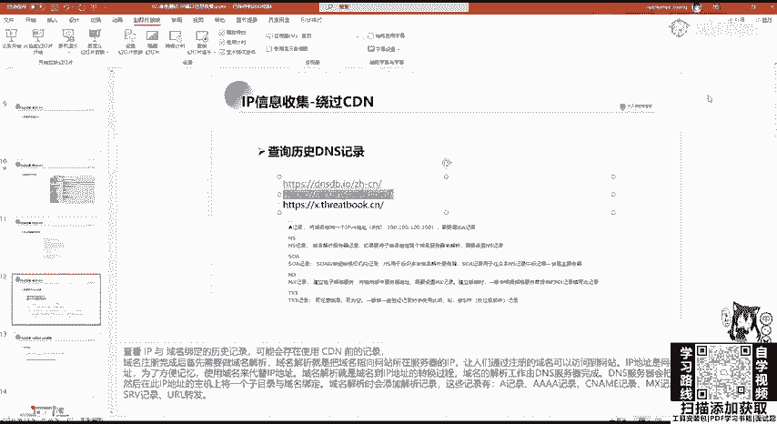
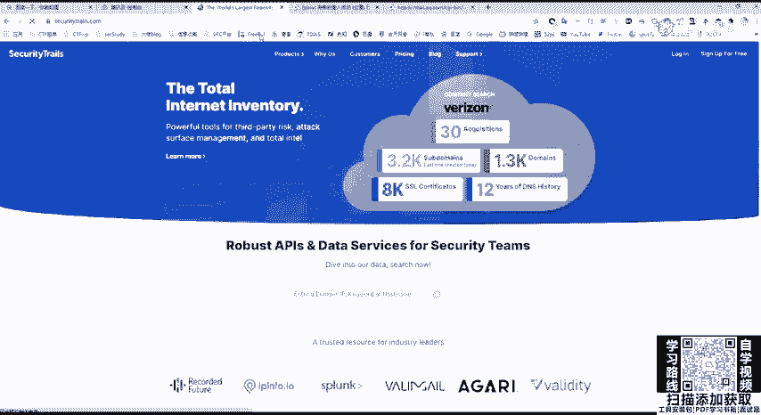
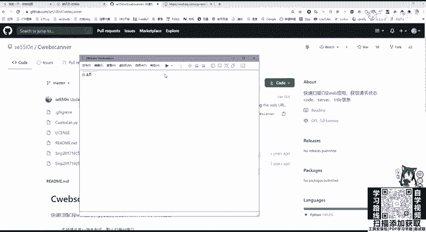
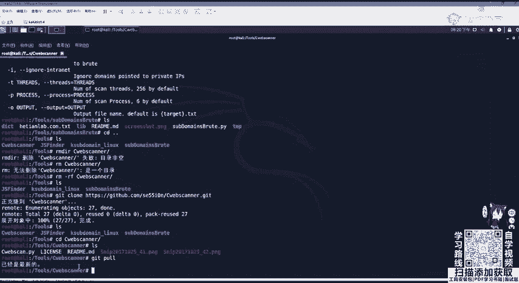
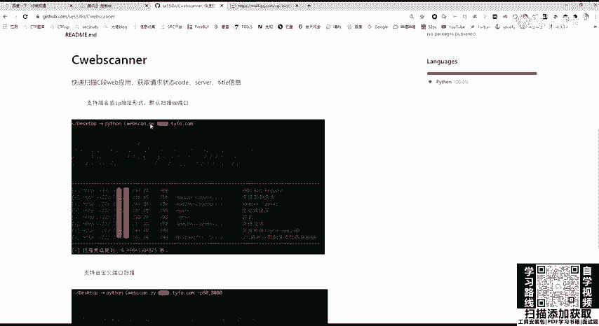
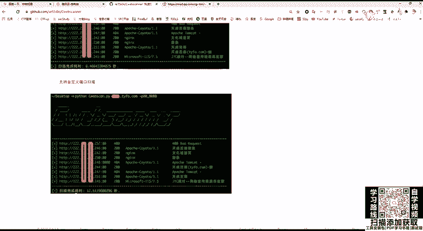
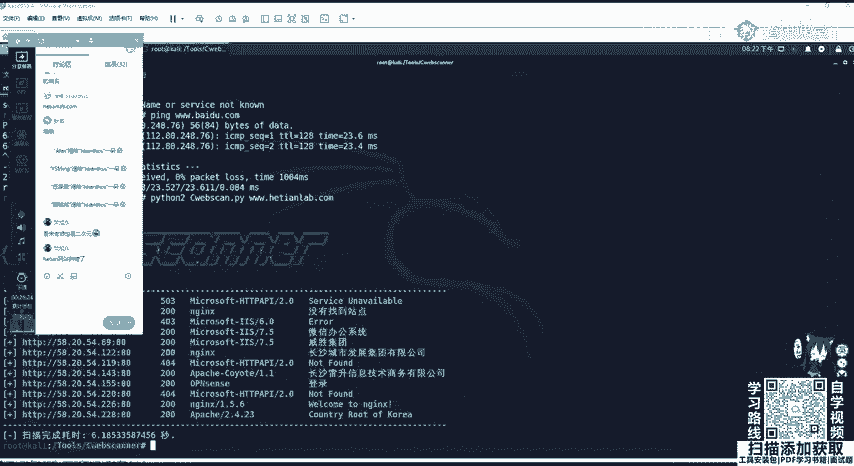

# 网络安全基础教程：P29：IP信息收集

## 概述
在本节课中，我们将要学习网络安全渗透测试中一个至关重要的环节：**IP地址信息收集**。我们将了解IP与域名的关系、如何通过IP反查域名、如何判断目标是否使用了CDN服务，以及如何绕过CDN获取目标的真实IP地址。掌握这些技能是进行有效信息收集和后续渗透测试的基础。

## IP与域名的关系
IP地址是网络世界中主机的唯一标识。当甲方给出的目标是IP地址时，我们可以通过这个IP进行反查，寻找与之绑定的域名。这个过程对于虚拟主机环境尤其有价值。

一台物理服务器上可能运行着多个虚拟主机，这些主机拥有不同的域名，但通常共享同一个IP地址。通过IP反查域名，我们可以发现这台服务器上运行的其他网站（即“旁站”）。如果这些旁站存在漏洞，我们就可以利用这些漏洞获取服务器控制权，进而迂回地获取我们真正目标的权限，这种策略通常被称为“旁站攻击”。

例如，使用PHPStudy等集成环境时，我们可以在`www`目录下建立多个文件夹，每个文件夹代表一个独立的站点。这些站点虽然域名不同，但都指向同一个IP地址。在真实的服务器环境中也是如此，多个站点可以共享一个IP。

有时，在挖掘SQL注入漏洞时，会发现数据库中存在大量不属于目标网站的表。这表明该服务器上可能托管了多个网站，它们的数据库都存放在同一台服务器上。通过获取其他网站的漏洞，我们就有可能拿到整个服务器的权限。

## 如何通过IP反查域名
通过IP反查域名，一个简单有效的方法是使用站长之家（`chinaz.com`）提供的Web查询接口。

操作步骤如下：
1.  访问站长之家。
2.  在IP反查工具中输入目标IP地址（例如：`58.205.42.226`）。
3.  点击查询，即可看到与该IP绑定的域名列表。

这个过程非常直接，能够快速帮助我们找到目标IP上可能存在的所有网站。

## 如何通过域名查询IP
上一节我们介绍了通过IP找域名，本节中我们来看看反向操作：通过域名查询IP。当我们收集到目标域名或子域名后，需要获取其对应的IP地址，以便进行端口扫描和服务探测（例如，检查是否开启了MySQL、Redis、Samba等服务）。

通过域名查询IP的方法同样简单：
*   **使用`ping`命令**：在命令行中输入 `ping 目标域名`。这个命令会向DNS服务器发起请求，将域名解析为IP地址并显示出来。
*   **使用站长之家Web接口**：在站长之家的“域名/IP查询”工具中输入域名（例如：`hetianlab.com`），即可查询到其对应的IP地址和地理位置信息。

然而，这里会遇到一个常见问题：**CDN服务**。

## 什么是CDN及其影响
CDN，即内容分发网络。其官方定义是：构建在网络之上的内容分发网络，依靠部署在各地的边缘服务器，通过中心平台的负载均衡等技术，使用户就近获取所需内容，以降低网络拥塞、提高访问速度和命中率。

简单来说，CDN就像是一个遍布全球的缓存系统。例如，一个位于黑龙江的网站，为了让湖南的用户能快速访问，会在湖南的CDN节点上存放一份网站内容的副本。当湖南用户访问该网站时，实际上访问的是湖南本地CDN节点上的副本，而非远在黑龙江的原始服务器。这大大降低了访问延迟。

**关键影响**：当目标网站使用了CDN时，我们通过`ping`或域名查询工具得到的IP地址，通常是CDN节点的IP，而不是网站真实服务器的IP。对这个CDN IP进行端口扫描或渗透测试，通常没有意义。

## 如何判断目标是否使用了CDN
以下是判断服务器是否开启CDN服务的方法。

我们可以利用站长之家的“多地ping”功能进行判断。该功能会模拟从全国不同地区的服务器去ping目标域名。

*   **开启了CDN的示例**：ping `baidu.com`。你会发现，从江苏、深圳等地ping出的IP地址各不相同（例如`39.x.x.x`和`220.x.x.x`），且延迟都很低。这是因为百度使用了CDN，用户会访问离自己最近的节点。
*   **未开启CDN的示例**：ping一个未使用CDN的网站（例如`hetianlab.com`）。无论从哪个地区ping，返回的都是同一个IP地址（例如`58.205.42.226`）。

因此，如果多地ping的结果返回多个不同的IP地址，基本可以判定目标使用了CDN。

## 如何绕过CDN获取真实IP
在确认目标使用CDN后，我们需要设法找到其背后的真实服务器IP。以下是几种常用的方法。

### 1. 利用国外访问
CDN服务通常按流量收费，且在中国大陆价格昂贵。因此，许多国内网站为了节省成本，可能不会对国外用户开启CDN加速。

操作方法：
*   使用提供“海外ping”功能的网站（如卡卡网、站长之家的海外节点选项）。
*   用海外服务器去ping目标域名。
*   如果所有海外节点返回的都是同一个IP地址，那么这个IP很可能是真实IP。



### 2. 查询子域名IP
CDN配置可能不会覆盖所有子域名。一些次要的、访问量小的子域名（旁站）可能直接解析到真实服务器IP。



操作方法：
1.  先进行子域名收集。
2.  对收集到的子域名逐一进行ping操作或使用站长之家查询其IP。
3.  如果某个子域名解析到的IP与主域名解析到的CDN IP不同，且该IP是真实的公网IP，则可能是真实服务器IP。进一步查询该IP的C段（同一网段的其他IP），也可能有所发现。

### 3. 查看历史DNS记录
网站在刚建立时，通常会先将域名直接解析到真实服务器IP。之后随着业务发展，才可能购买和配置CDN服务。最初的域名解析记录会被保存在一些DNS历史记录数据库中。

操作方法：
*   使用DNS历史记录查询网站（如`viewdns.info`, `securitytrails.com`）。
*   输入目标域名，查询其历史上的A记录（即将域名指向IPv4地址的记录）。
*   在CDN启用前的解析记录中，很可能找到真实的服务器IP。

### 4. 查询邮件服务器信息
如果目标网站拥有自己的邮件服务，并且邮件服务器与Web服务器部署在同一台物理机器或同一网段内，那么通过分析邮件头信息，有可能找到真实IP。

操作方法（以QQ邮箱为例）：
1.  打开一封来自目标域名的邮件。
2.  点击“更多”->“显示邮件原文”或类似选项。
3.  在邮件原文的头部，查找以“Received: from”开头的行，后面跟随的IP地址可能就是发件邮件服务器的IP。

### 5. 查看PHPInfo文件（概率较低）
如果目标服务器是PHP环境，并且存在未删除的`phpinfo.php`文件，访问该文件可以查看到服务器环境变量，其中`$_SERVER[‘SERVER_ADDR’]`通常显示服务器的真实IP地址。

**限制**：出于安全考虑，管理员通常会删除此文件。且该方法仅适用于PHP环境。

**注意**：以上方法可能需要组合使用。如果目标对全球都部署了CDN，且没有历史记录泄露，则可能无法绕过。



## 对真实IP进行C段扫描
在获取到目标的真实IP地址后，我们可以对其进行C段扫描，以发现同一网段内的其他主机资产。C段指的是IP地址中前三个数字相同的网段，例如`192.168.1.0`到`192.168.1.255`。公司通常会在同一网段内部署多台服务器。



以下是进行C段存活主机探测的方法。



### 使用Nmap扫描
Nmap是一款强大的网络发现和安全审计工具。使用`-sn`参数可以进行Ping扫描（主机发现），不进行端口扫描。
```bash
nmap -sn 目标IP/24
```
例如：`nmap -sn 58.205.42.0/24` 会扫描`58.205.42.1`到`58.205.42.254`的所有主机，并列出存活的主机。



### 使用第三方工具：CWebScanner
对于Web资产的C段扫描，有一些更专注的工具，例如`CWebScanner`。它可以从GitHub上获取。

安装与使用步骤如下：
1.  **克隆项目**：在命令行中执行 `git clone [CWebScanner的GitHub仓库地址]`。
2.  **进入目录**：`cd CWebScanner`。
3.  **更新工具**：`git pull` 可以更新到最新版本。
4.  **运行扫描**：根据工具的README说明，通常命令格式如下：
    ```bash
    python cwebscan.py 目标域名 -p 80,443,8080
    ```
    该命令会扫描目标域名真实IP所在C段，并检测这些IP上是否开放了指定的Web端口（如80, 443, 8080），从而发现同一网段内的其他Web站点。




## 总结
本节课中我们一起学习了IP信息收集的核心知识。我们首先理解了IP与域名的映射关系，以及通过IP反查域名在旁站攻击中的价值。接着，我们学习了如何通过域名查询IP，并重点探讨了CDN服务对信息收集的影响。我们掌握了判断CDN是否存在的方法，以及五种绕过CDN获取真实IP的策略：利用国外访问、查询子域名、查找历史DNS记录、分析邮件头、以及查看PHPInfo文件。最后，在获得真实IP后，我们介绍了如何使用Nmap和CWebScanner等工具对目标IP所在的C段进行扫描，以扩大攻击面，发现更多潜在资产。这些技能是渗透测试前期信息收集阶段的关键，需要熟练掌握和灵活运用。