# 网络安全教程：P30：端口信息收集 🔍

## 概述
在本节课中，我们将要学习网络安全信息收集中的一个核心环节——端口信息收集。端口是网络通信的入口，了解目标主机开放的端口及其服务，是渗透测试中“踩点”的关键步骤。我们将介绍端口的基本概念、常见服务端口及其潜在风险，并重点学习如何使用强大的工具Nmap进行端口扫描。

## 端口是什么？
在互联网上，各个主机通过TCP/IP协议发送和接收数据包。每个数据包需要知道目标主机的IP地址进行网络路由选择，从而顺利传输。数据包到达目标主机后，需要知道传给哪一个具体的服务，这就是通过端口号来区分的。

端口根据提供服务类型的不同，可以分为TCP端口和UDP端口。TCP和UDP是传输层的两个通信协议，TCP是面向连接的可靠通信协议，UDP是无连接的不可靠传输协议。TCP协议有三次握手的过程，UDP则没有。TCP协议的端口和UDP协议的端口是相互独立的。


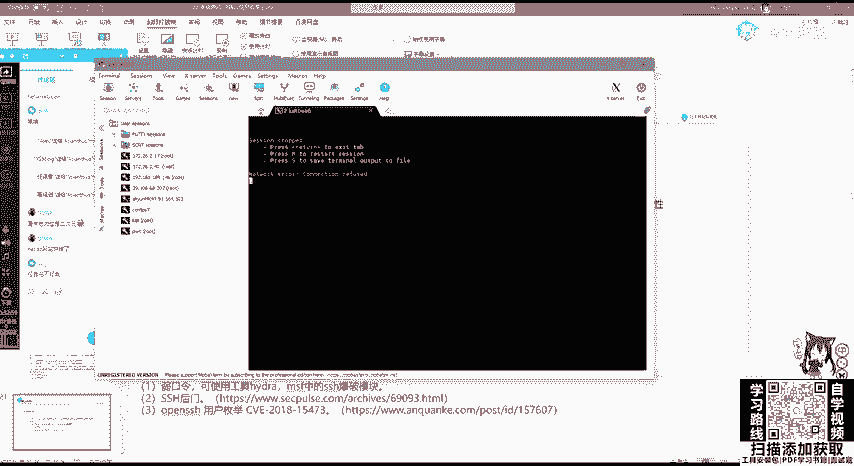

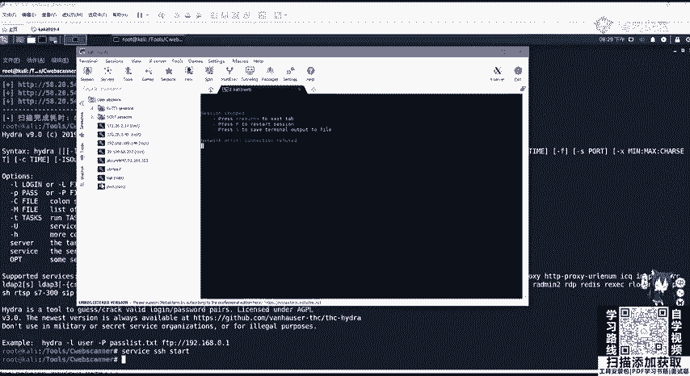

## 端口的类型
端口的类型分为三种，是根据端口号的范围来进行划分的。

以下是三种端口类型：
1.  **周知端口**：范围是0到1023。这些端口是系统固定服务的端口号，也就是众所周知的端口。例如，80端口是WWW服务，也就是Web服务的端口。
2.  **注册端口**：范围是从1024到49151。这些端口用于分配给用户进程或程序。例如，当客户端访问Web服务器的80端口时，客户端会使用一个注册端口来接收服务器的响应。
3.  **动态端口**：范围是49152至65535。这些端口一般不固定分配给某种服务，可以由程序动态使用。

## 为什么需要收集端口信息？
我们可以把服务器比作一个房子，而端口就是进入这个房子的门。渗透测试人员就像需要进入房子的“访客”。在“破门而入”之前，我们必须知道这房子有几扇门，每扇门是什么材质（对应什么服务），门后有什么（服务是否存在漏洞）。这个过程俗称“踩点”，踩点越详细，后续的渗透测试就越顺利。

## 常见服务端口与潜在风险
上一节我们介绍了端口的概念和重要性，本节中我们来看看一些常见的、在渗透测试中需要重点关注的端口及其可能存在的安全风险。

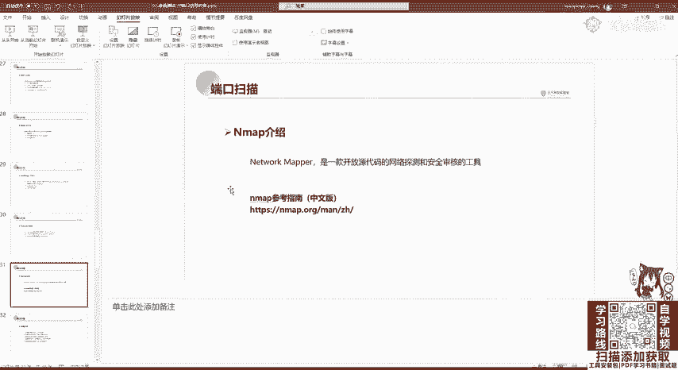

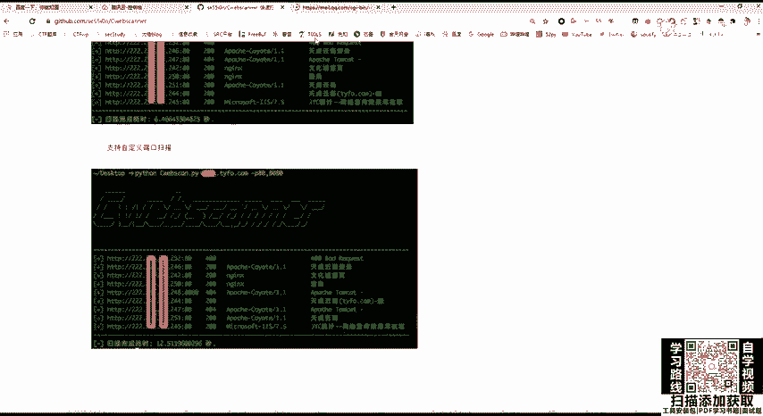

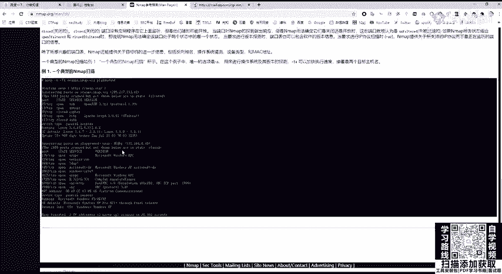

以下是需要重点关注的端口列表：
*   **FTP (文件传输协议)**
    *   **端口**：20（数据传输），21（控制信息）。
    *   **潜在风险**：
        1.  **FTP爆破**：使用工具（如Hydra）尝试破解FTP登录凭证。
        2.  **FTP匿名访问**：服务器未开启验证，允许匿名用户（用户名：anonymous，密码为空）登录，可能导致敏感信息泄露。
        3.  **VSFTPD后门**：特定版本的VSFTPD服务器软件存在后门漏洞，可导致权限提升。
        4.  **嗅探**：FTP默认使用明文传输，网络流量可能被截获。
*   **SSH (安全外壳协议)**
    *   **端口**：22。
    *   **潜在风险**：弱口令爆破、用户枚举。SSH用于安全地远程登录和管理服务器。
*   **Telnet (远程登录协议)**
    *   **端口**：23。
    *   **潜在风险**：协议本身使用明文传输，流量极易被拦截并获取登录密码，安全性很低。
*   **SMTP (简单邮件传输协议)**
    *   **端口**：25, 465。
    *   **潜在风险**：常被用来发送钓鱼邮件。
*   **HTTP (超文本传输协议)**
    *   **端口**：80, 443。
    *   **潜在风险**：这是最常见的Web服务端口。攻击方式包括针对Web应用程序的漏洞（如OWASP Top 10）和针对中间件（如Apache, Nginx, IIS）本身的漏洞。
*   **SMB (服务器消息块)**
    *   **端口**：139, 445。
    *   **潜在风险**：这是文件共享服务。历史上存在多个高危漏洞，如`MS17-010`（永恒之蓝）、`MS08-067`。攻击者常利用这些漏洞获取系统权限。
*   **MySQL (数据库)**
    *   **端口**：3306。
    *   **潜在风险**：弱口令。一旦进入数据库，可能窃取数据或尝试提权。
*   **RDP (远程桌面协议)**
    *   **端口**：3389。
    *   **潜在风险**：弱口令爆破、历史漏洞（如`MS12-020`）。成功连接后，攻击者将获得对Windows服务器的图形化控制权。
*   **Redis (数据库)**
    *   **端口**：6379。
    *   **潜在风险**：弱口令、未授权访问。常结合SSRF漏洞进行攻击。
*   **WebLogic (中间件)**
    *   **端口**：7001。
    *   **潜在风险**：存在SSRF及反序列化等高危漏洞。
*   **Tomcat (中间件)**
    *   **端口**：8080。
    *   **潜在风险**：管理后台弱口令、任意文件上传漏洞等。

## 端口扫描利器：Nmap 🛠️
了解了目标可能开放的端口后，我们需要一种方法来发现它们。Nmap是网络探测和安全审核的标杆工具，功能强大且开源。

Nmap的主要功能包括：
1.  **主机发现**：探测网络中有哪些主机在线。
2.  **端口扫描**：探测目标主机开放了哪些端口。
3.  **版本侦测**：探测开放端口上运行的服务软件及其版本。
4.  **操作系统侦测**：探测目标主机的操作系统类型和版本。
5.  **漏洞扫描**：通过Nmap脚本引擎探测已知漏洞。

### Nmap端口状态
使用Nmap扫描端口后，通常会看到以下几种状态：
*   **`open`**：端口开启，有程序正在该端口监听连接。
*   **`closed`**：端口关闭，没有程序监听，但主机是可访问的。
*   **`filtered`**：端口状态无法确定，数据包可能被防火墙或IDS（入侵检测系统）过滤。

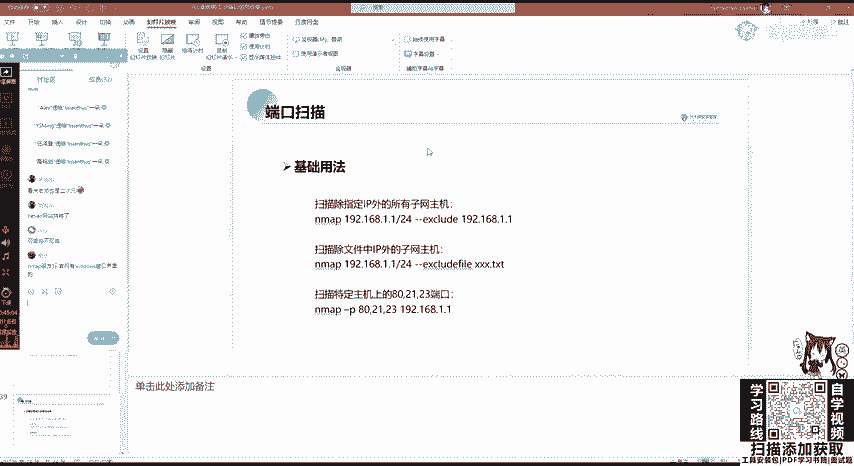

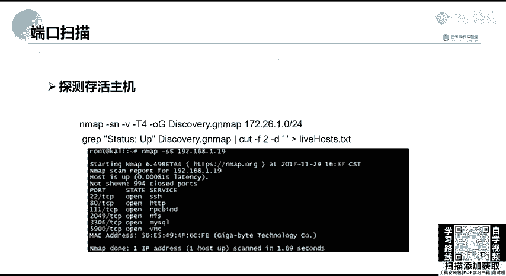

### Nmap基础用法
Nmap的命令格式通常为：`nmap [扫描类型] [选项] {目标}`。


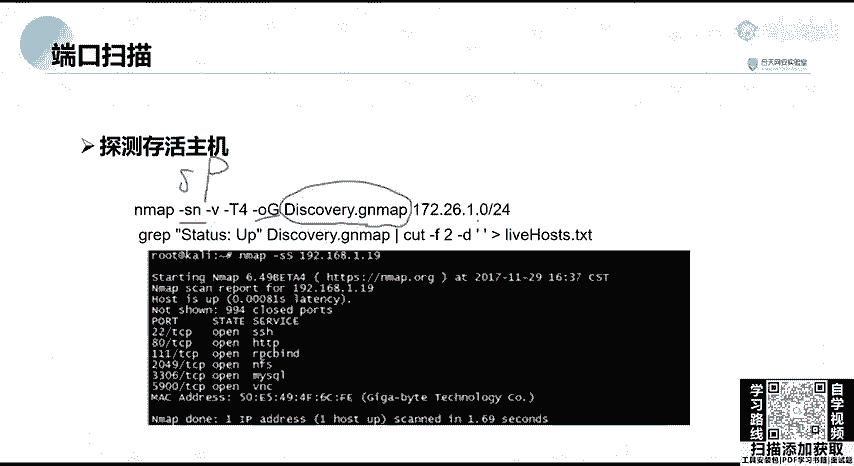

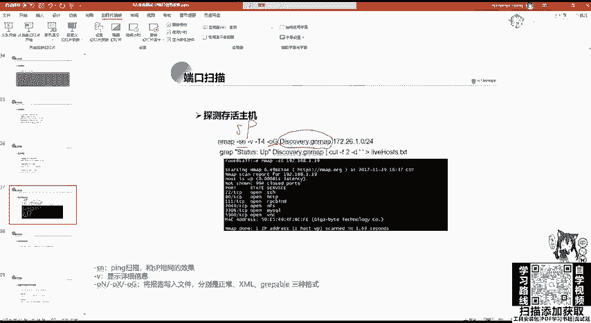

以下是几个基础且常用的扫描命令示例：
*   **全面扫描**：`nmap -A -T4 <目标IP>`。`-A`启用操作系统和版本探测，`-T4`指定较快的扫描速度。
*   **Ping扫描（主机发现）**：`nmap -sn <目标IP或网段>`。仅检查主机是否在线，不扫描端口。
*   **扫描指定端口**：`nmap -p 80,443,22 <目标IP>`。
*   **扫描全端口**：`nmap -p- <目标IP>`。扫描1-65535所有端口，速度较慢。
*   **SYN半开扫描**：`nmap -sS -T4 <目标IP>`。这是一种隐蔽的扫描方式，不完成完整的TCP三次握手，不易被日志记录。

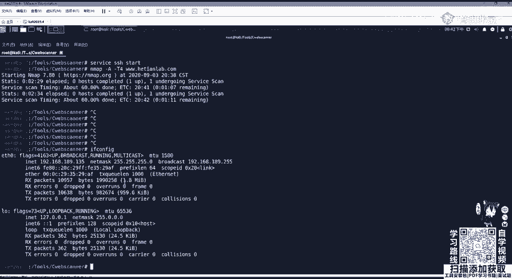

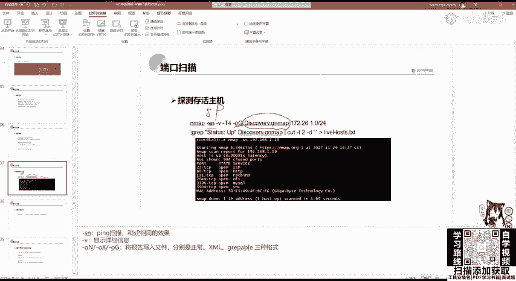

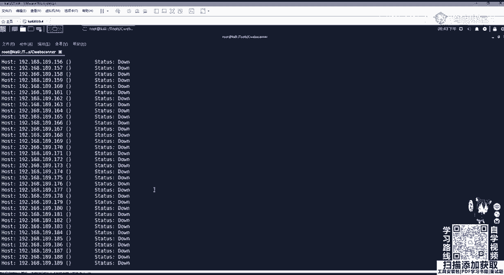

### 进阶使用与信息提取
在实际渗透测试中，我们常需要批量扫描和结果处理。

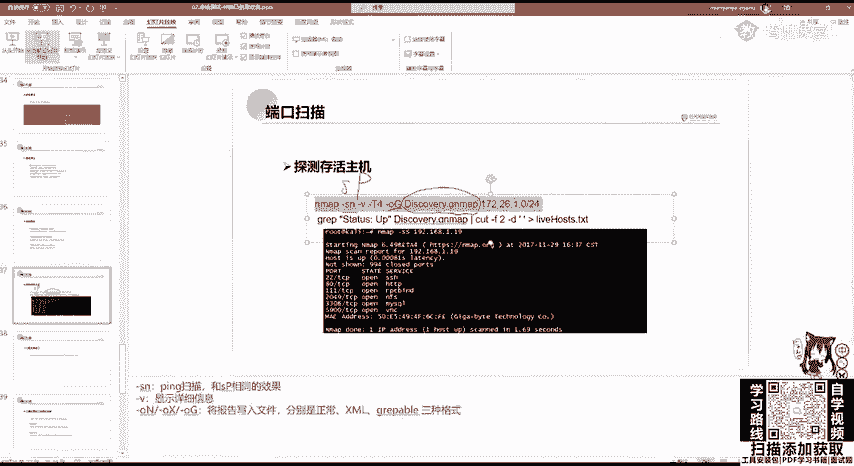

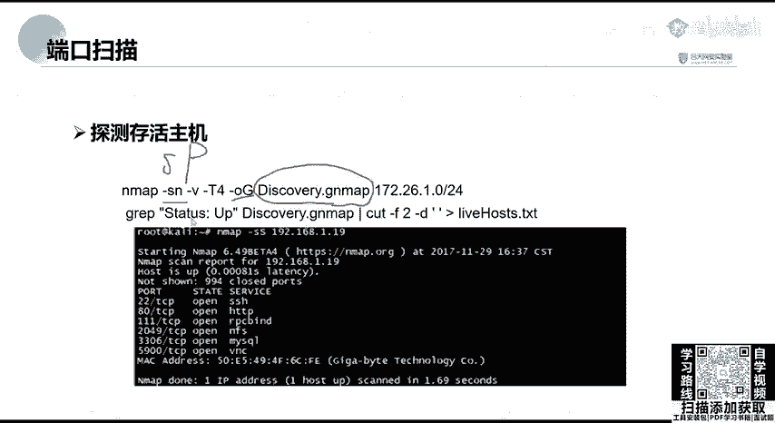


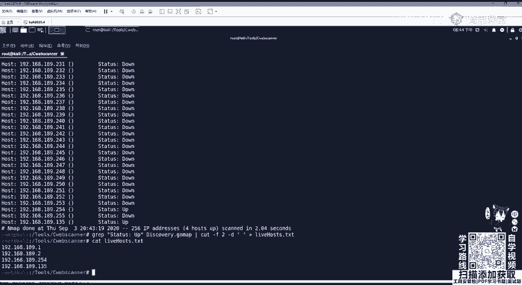

例如，扫描一个C段（如192.168.1.0/24）并提取出存活的主机IP列表，可以使用管道命令组合：
```bash
nmap -sn 192.168.1.0/24 | grep -E “Nmap scan report for |Host is up” | cut -d “ “ -f 5 > live_hosts.txt
```
这条命令先进行Ping扫描，然后通过`grep`过滤出包含扫描报告和“Host is up”的行，再用`cut`命令提取出IP地址，最后保存到`live_hosts.txt`文件中。

### Nmap脚本引擎
Nmap的强大之处在于其脚本引擎，可以用于漏洞检测。

例如，使用脚本扫描SMB服务的永恒之蓝漏洞：
```bash
nmap -p 445 --script smb-vuln-ms17-010 192.168.1.0/24
```


## 总结
本节课中，我们一起学习了网络安全信息收集的核心——端口信息收集。我们首先明确了端口在网络通信中的作用和不同类型。然后，详细列举了FTP、SSH、SMB、RDP等关键服务端口及其在渗透测试中可能被利用的风险点。最后，我们深入学习了如何使用Nmap这一神器进行主机发现、端口扫描、服务识别乃至漏洞探测，并掌握了一些基础命令和结果处理技巧。记住，充分的端口信息收集是成功渗透测试的坚实基础。