# 网络安全教程：P31：30. 其他信息收集 🕵️

在本节课中，我们将学习信息收集阶段的最后一部分内容：如何查找和利用目标系统的历史漏洞信息，并简要了解社会工程学的基本概念及其危害。

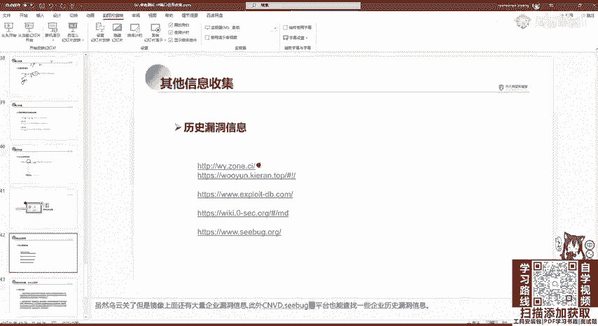

## 概述

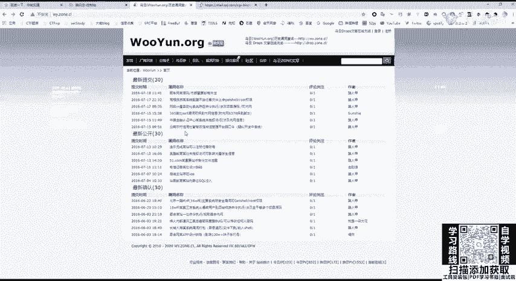

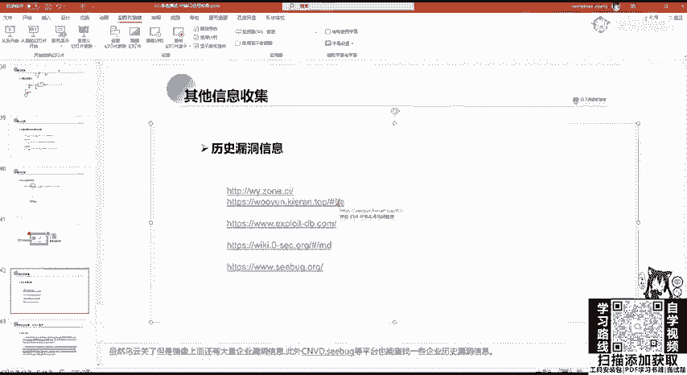

上一节我们介绍了如何探测目标网站的中间件和架构。本节中，我们来看看如何根据已识别的组件，查找其历史漏洞信息，以便进行后续的渗透测试。同时，我们也会简要探讨社会工程学这一非技术性攻击手段。

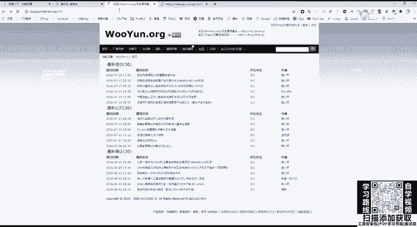

## 历史漏洞信息收集

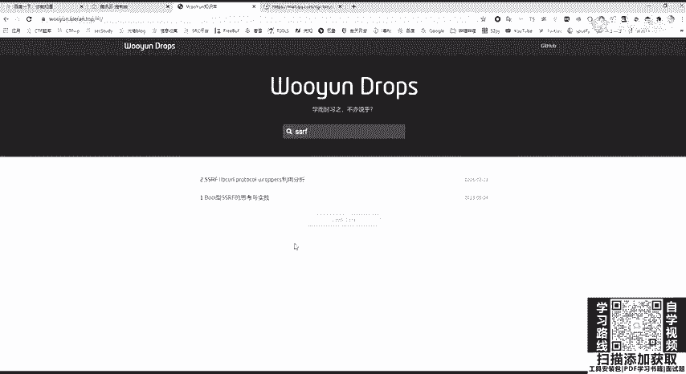

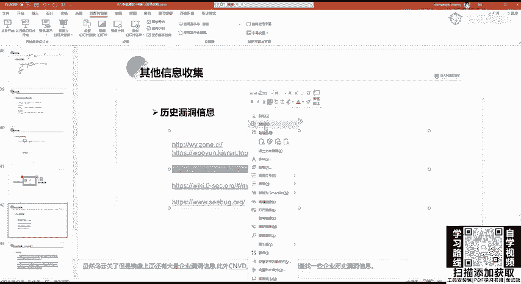

当我们探测到一个网站使用的是特定CMS（如WordPress）、开发语言（如PHP）或中间件（如Apache）后，下一步是寻找针对这些技术的已知漏洞。我们通常无需自己编写攻击脚本，而是利用公开的漏洞信息平台。

以下是几个常用的历史漏洞信息收集平台：

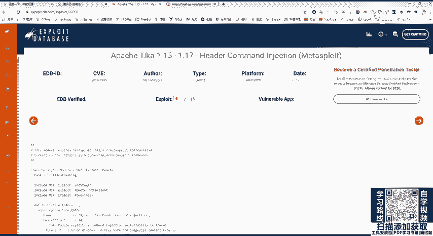

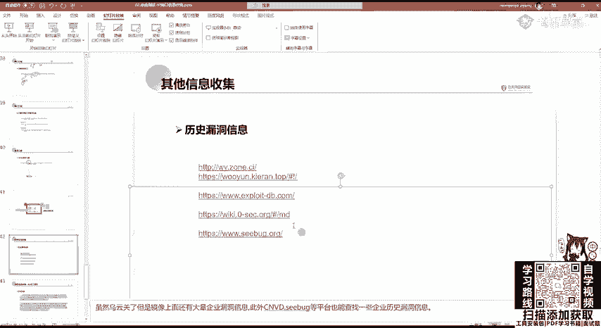

*   **乌云镜像**：乌云网虽已关闭，但其镜像站点仍保存了大量历史漏洞资料。可以通过百度搜索或自行搭建访问。
*   **乌云知识库**：该知识库可用于搜索特定漏洞知识。例如，想学习ROP（返回导向编程）或SSRF（服务器端请求伪造）漏洞，直接搜索相关关键词即可找到资料。
*   **Exploit Database**：这是一个国外的漏洞平台。例如，想搜索Apache的历史漏洞，可以在其搜索框中输入“Apache”进行查询。该平台会列出相关漏洞，部分漏洞还提供可直接下载或查看的Exploit（漏洞利用代码）。
*   **CVE Details**：另一个非常好用的漏洞信息查询网站。
*   **其他平台**：如知道创宇的漏洞平台等，功能类似。在这些平台上，可以查看到诸如WordPress、深信服、宝塔面板等产品的历史漏洞详情，学习如何利用这些漏洞进行攻击。

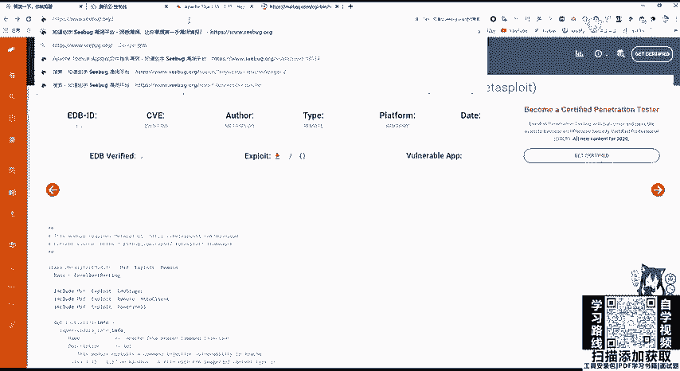

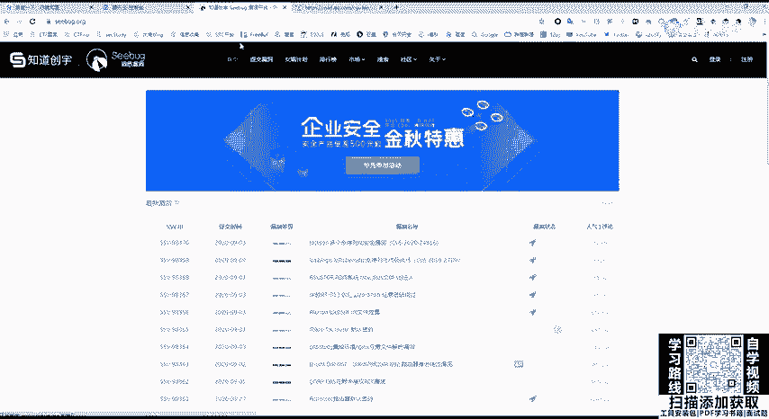

## 社会工程学简介

社会工程学是一种通过人际交互手段（如欺骗、诱导）来获取敏感信息或访问权限的非技术性攻击方法。其危害性极大，常被用于电信诈骗。

例如，在对一个网站进行渗透时，如果发现后台登录页面没有SQL注入、逻辑漏洞等问题，但页面上有管理员邮箱。攻击者可能会伪造身份（如公司高管），向该管理员发送钓鱼邮件，诱骗其提供密码。

一个著名的案例是“徐玉玉案”，黑客通过攻击山东省高考招生平台窃取学生信息，并利用这些个人信息进行电信诈骗，造成了严重后果。

在实际的网络环境中，钓鱼邮件攻击非常普遍。例如，攻击者可能发送伪装成企业邮箱升级的邮件，要求收件人提供姓名、职位、手机号和密码，其核心目的就是窃取密码。

此外，还有钓鱼网页攻击。攻击者可以使用工具（如`The Social-Engineer Toolkit (SET)`或`Cobalt Strike`）生成假冒的登录页面或问卷系统。例如，伪造一个“游戏抽奖”页面，要求用户输入游戏账号和密码，用户一旦输入，信息就会被攻击者窃取。

**注意**：目前国内对“社工库”（汇集了大量泄露个人信息的数据库）的打击非常严厉，切勿尝试获取或使用此类资源。在合法的安全测试（如参与厂商的SRC）中，也禁止使用社会工程学手段。

## 总结

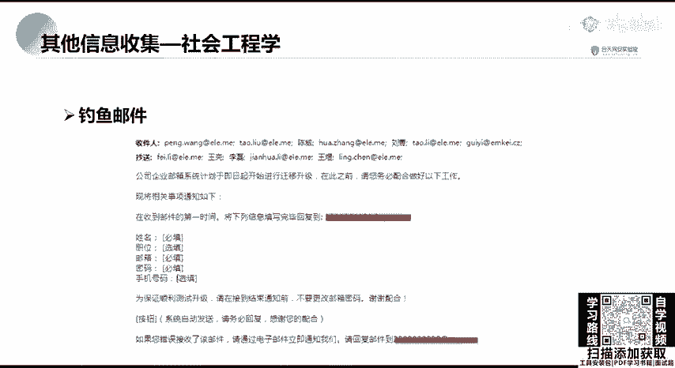

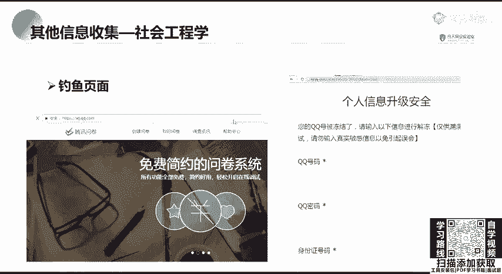

本节课中，我们一起学习了信息收集的另外两个重要方面：
1.  **历史漏洞信息收集**：介绍了如何利用乌云镜像、Exploit-DB等平台，根据已识别的目标组件查找已知漏洞，为后续攻击提供弹药。
2.  **社会工程学**：了解了这种利用人性弱点进行攻击的非技术手段的基本概念、常见形式（如钓鱼邮件、钓鱼网站）及其巨大危害，并强调了其非法性和在安全测试中的禁用原则。

至此，关于目标信息收集的核心内容就介绍完毕了。掌握全面的信息是成功进行渗透测试的第一步。