# 网络安全教程：P32：31.网站指纹识别 🕵️

## 概述
在本节课中，我们将学习信息收集阶段的最后一个关键环节：网站指纹识别。我们将了解如何识别目标网站的服务器操作系统、中间件、脚本语言、数据库以及可能使用的CMS系统，这些信息对于后续的渗透测试至关重要。

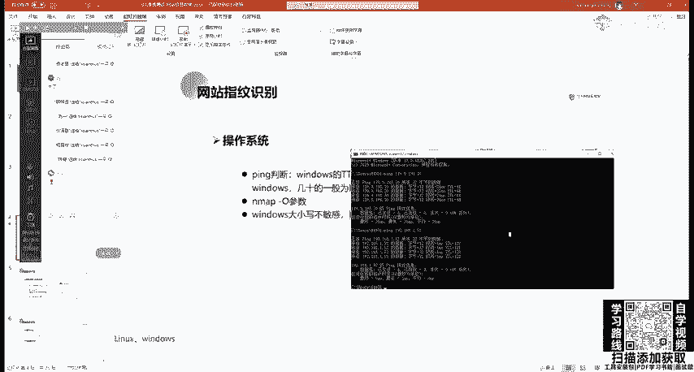

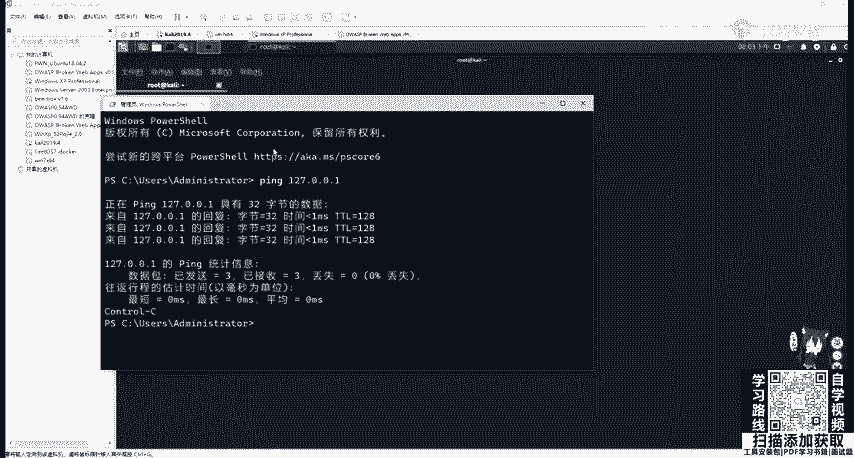

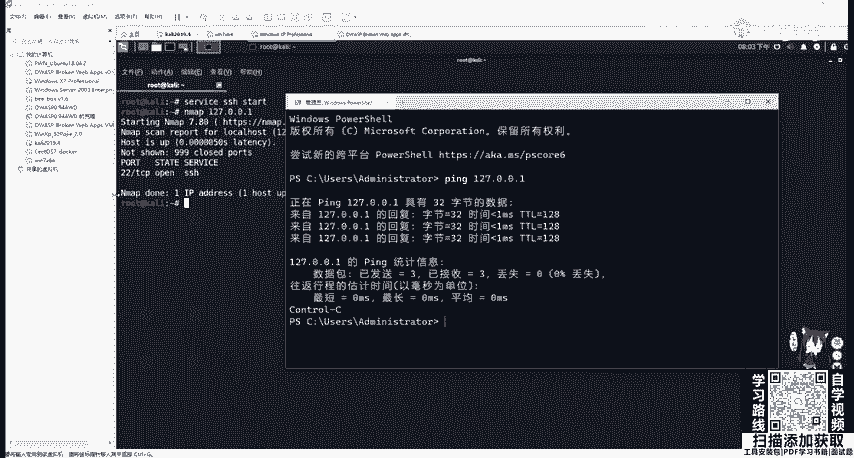

## 网站的基本组成
一个网站通常由四个核心部分组成：**服务器（操作系统）**、**中间件（Web容器）**、**脚本语言**和**数据库**。了解这些组成部分是进行指纹识别的基础。

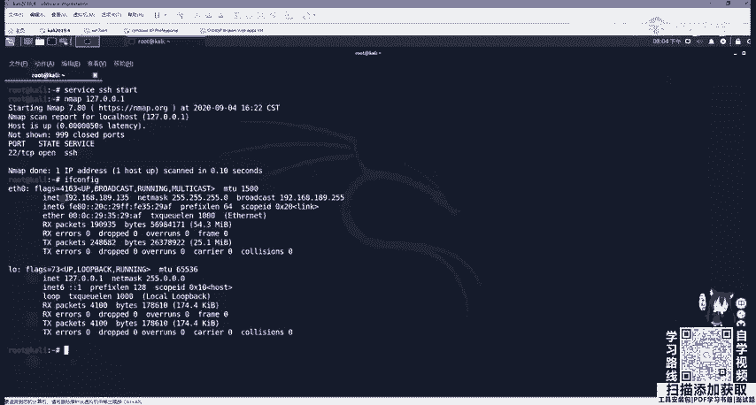

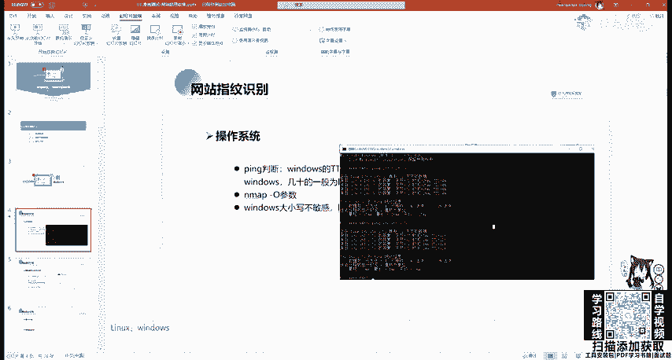

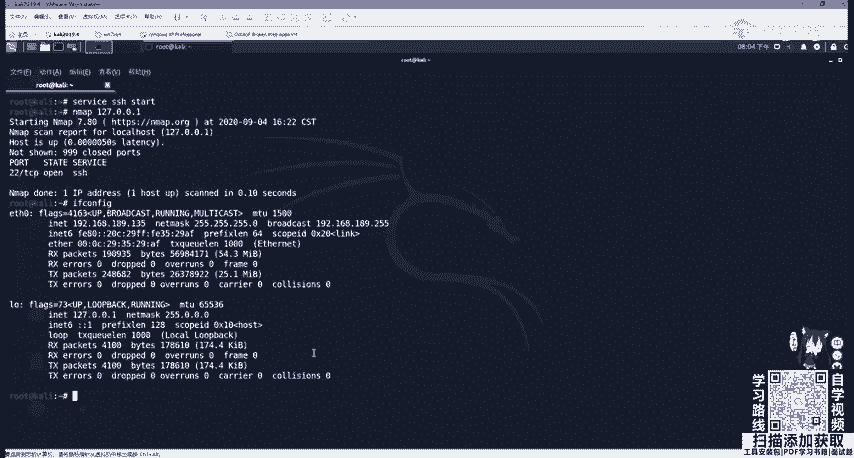

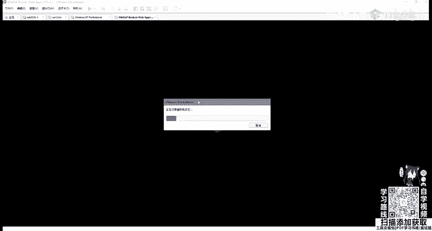

以下是这些组成部分的常见类型：
*   **服务器（操作系统）**：Linux、Windows Server。
*   **中间件（Web容器）**：Apache、Tomcat、Nginx等。
*   **脚本语言**：JSP、PHP、ASP、ASP.NET、Python（Django/Flask）等。
*   **数据库**：MySQL、SQL Server、Oracle、Access等。

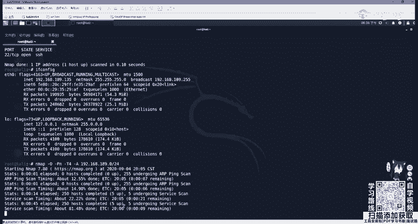

## 操作系统识别
识别目标服务器的操作系统是第一步。不同的操作系统，其文件路径、命令和漏洞利用方式都不同。

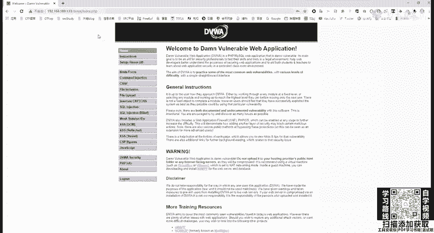

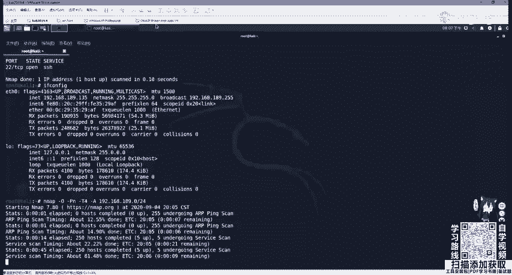

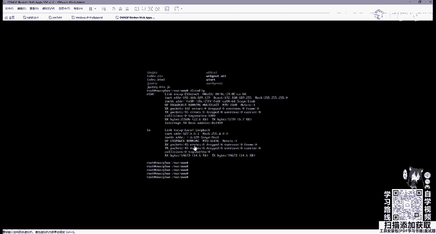

以下是三种常见的识别方法：
1.  **Ping命令TTL值判断**：通过Ping目标IP，观察返回数据包的TTL（生存时间）值。Windows系统的初始TTL通常为128，Linux系统通常为64。如果TTL值大于100，一般为Windows服务器；小于100，一般为Linux服务器。
    *   **示例**：`ping 192.168.1.1`
2.  **Nmap扫描识别**：使用Nmap工具的`-O`参数可以主动探测目标的操作系统类型。
    *   **命令示例**：`nmap -O -Pn -T4 192.168.189.0/24`
3.  **URL大小写敏感性测试**：Windows服务器对URL路径大小写不敏感，而Linux服务器区分大小写。可以通过在浏览器中尝试访问同一路径的大小写不同版本来判断。
    *   **示例**：访问 `http://target.com/index.php` 和 `http://target.com/INDEX.php`，如果两者都能访问，则可能是Windows服务器。

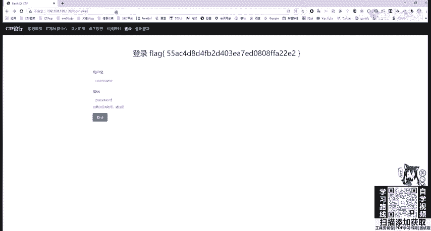

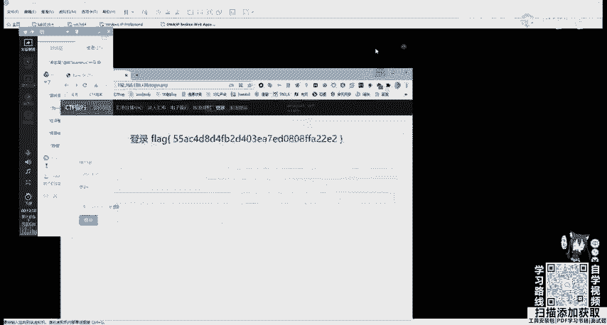

## 中间件与脚本语言识别
识别网站使用的Web容器（中间件）和脚本语言，有助于我们寻找与之相关的已知漏洞。

以下是几种识别方法：
1.  **浏览器开发者工具（F12）**：打开浏览器的开发者工具，切换到“Network”（网络）标签页，刷新页面。查看任意一个请求（通常是第一个对域名的请求）的响应头（Response Headers），寻找`Server`字段，其中常包含中间件信息（如`nginx/1.18.0`）。
2.  **在线工具与浏览器插件**：使用如`Wappalyzer`、`WhatWeb`等在线工具或其浏览器插件。安装插件后，访问目标网站，点击插件图标即可快速识别出网站的技术栈，包括中间件、前端框架、编程语言等。
3.  **观察网站URL后缀**：通过观察网页的URL后缀名，可以初步判断脚本语言。例如，`.php`结尾通常为PHP，`.jsp`或`.do`、`.action`结尾通常为Java（JSP或Struts2框架），`.aspx`结尾通常为ASP.NET。

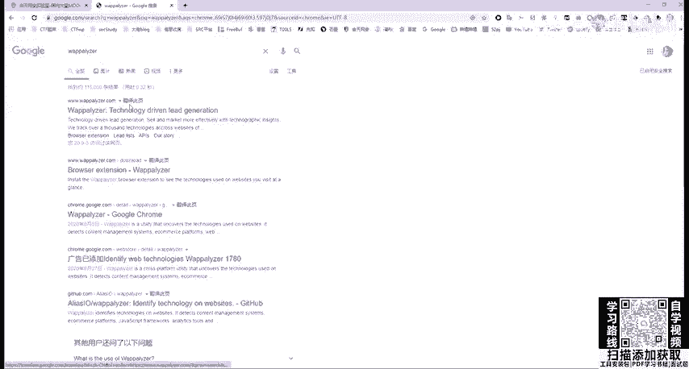

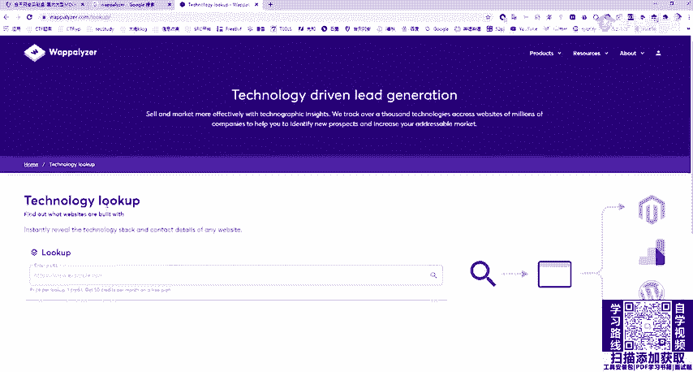

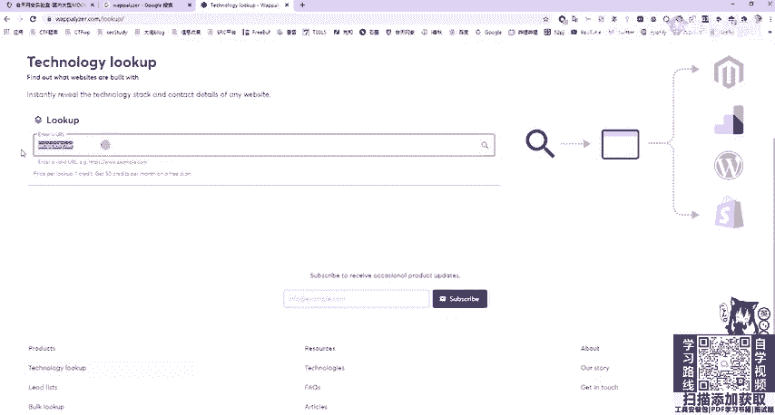

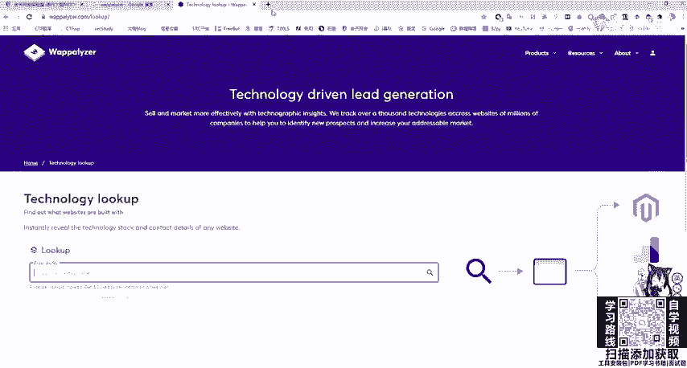

## 数据库类型识别
数据库类型的识别相对间接，通常需要结合其他信息或使用专门的工具。
*   **经验判断**：常见的搭配如“PHP + MySQL”、“ASP + SQL Server”、“JSP + Oracle”。识别出脚本语言后，可以对其常见的数据库搭配进行猜测。
*   **工具探测**：一些综合性的扫描工具（如SQLMap的指纹识别功能）或在线指纹识别平台，有时能识别出数据库类型。

## 常见CMS识别
CMS（内容管理系统）如WordPress、Discuz!、织梦等，拥有大量用户，也常存在公开漏洞。识别出CMS类型能极大提高漏洞发现的效率。

以下是识别CMS的方法：
1.  **查看网站页脚或元信息**：许多CMS会在网站页脚（如“Powered by Discuz!”）或网页HTML源代码的`<meta>`标签中留下标识。
2.  **使用在线CMS识别工具**：存在一些专门用于识别CMS的在线平台，输入URL即可进行分析。
3.  **特定目录或文件访问**：许多CMS有固定的后台登录地址（如`/wp-admin`）、安装目录或特征文件，尝试访问这些路径有时也能确认CMS类型。
    *   **示例**：发现网站存在 `/wp-login.php`，则很可能使用了WordPress。

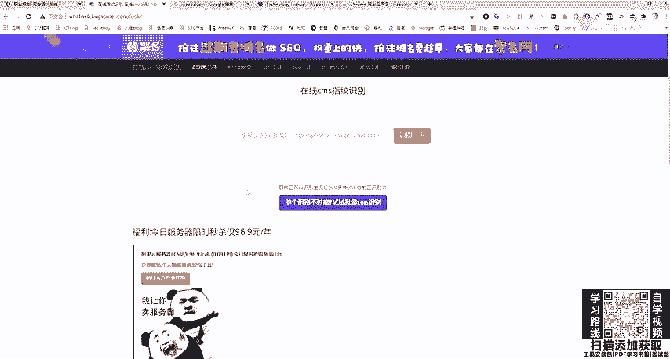

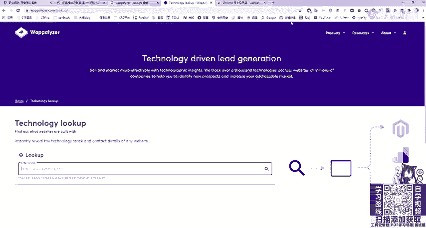

识别出具体的CMS名称和版本后，就可以在漏洞库（如Exploit-DB、CNVD、CNNVD）中搜索相关的历史漏洞和利用方法，进行针对性测试。

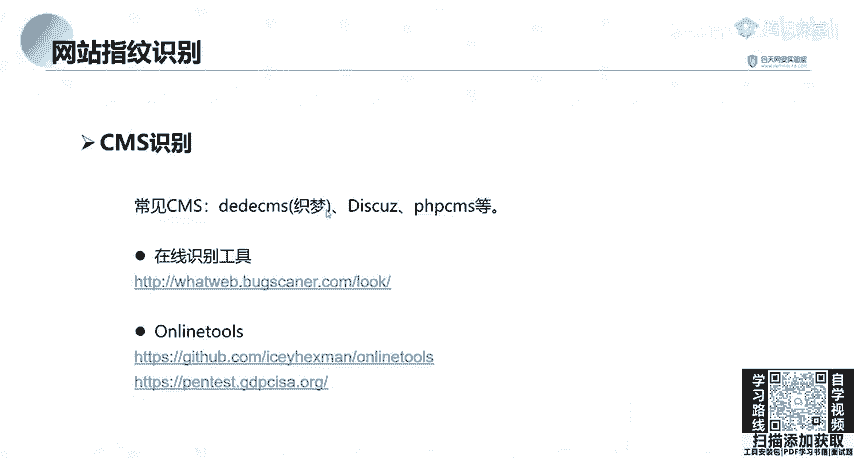

## 总结
本节课我们一起学习了网站指纹识别的核心内容。我们首先了解了网站的四大组成部分，然后详细讲解了如何识别服务器操作系统、Web中间件、脚本语言、数据库以及常见的CMS系统。掌握这些信息收集技能，能够帮助我们更精准地定位攻击面，为后续的漏洞探测和利用打下坚实的基础。记住，细致的信息收集是成功渗透测试的第一步。