# 网络安全教程：P33：敏感文件及目录探测 🔍

## 概述
在本节课中，我们将学习网络安全渗透测试中的一个重要环节：敏感文件及目录探测。网站管理员在搭建和维护网站时，可能会无意中遗留一些敏感文件，例如数据库配置文件、源代码备份文件等。探测并获取这些文件，可以帮助我们发现关键信息，为进一步的渗透测试打下基础。

## 敏感文件及目录类型
上一节我们概述了探测的重要性，本节中我们来看看常见的敏感文件及目录类型。以下是几种主要的泄露类型：

*   **Git泄露**：当开发人员使用Git进行版本控制，并将本地仓库与线上环境同步时，如果配置不当，可能会将 `.git` 目录部署到线上。攻击者可以利用此目录下载整个网站的源代码。
*   **SVN泄露**：与Git类似，Subversion（SVN）也是一个版本控制系统。`.svn` 目录的泄露同样可能导致源代码被获取。
*   **DS_Store泄露**：这是macOS操作系统自动生成的文件夹属性文件，可能包含目录结构信息。
*   **WEB-INF泄露**：这是Java Web应用的安全目录，如果配置不当，可能允许未授权访问，导致 `web.xml` 等配置文件泄露。
*   **备份文件泄露**：管理员可能将网站源代码打包成 `.zip`、`.tar`、`.rar` 或 `.bak` 等格式的备份文件，并遗留在Web目录下，从而被直接下载。

## 如何发现与利用泄露文件
了解了常见的泄露类型后，本节我们来看看如何主动发现和利用这些泄露。核心思路是使用自动化工具进行探测和下载。

### Git泄露探测与利用
对于Git泄露，我们可以使用 `GitHack` 工具。其原理是访问目标网站的 `/.git/` 目录，并利用Git的内部机制还原源代码。

**使用命令示例**：
```bash
python GitHack.py http://target.com/.git/
```
执行后，工具会将目标网站的源代码克隆到本地。

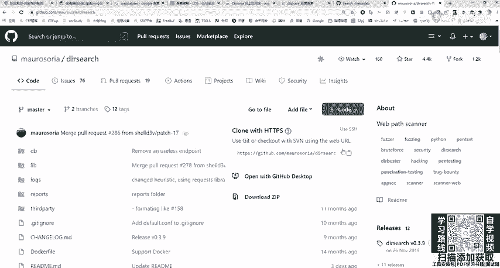

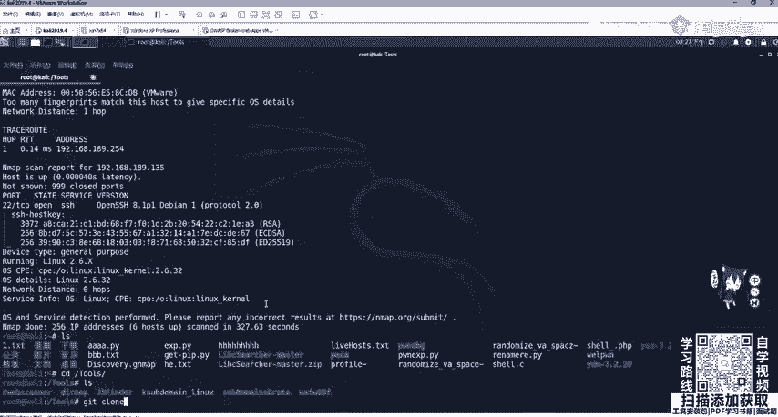

### 目录与文件爆破
很多时候，我们需要主动发现网站隐藏的目录、后台管理页面或特定文件。以下是几种常用的目录爆破工具：

*   **御剑**：一款经典的图形化目录扫描工具，支持多种脚本类型，设置简单。
*   **Dirsearch**：一个基于Python的命令行工具，速度快，字典强大。
*   **DirMap**：另一款高效的Python目录爆破工具，支持多线程和多种扫描选项。

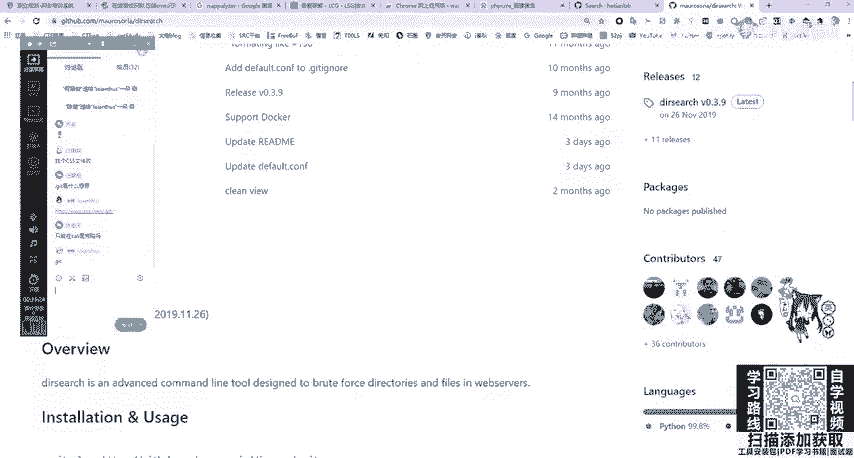

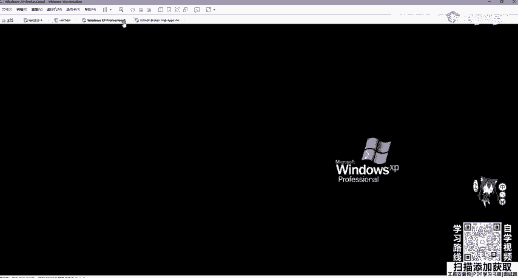

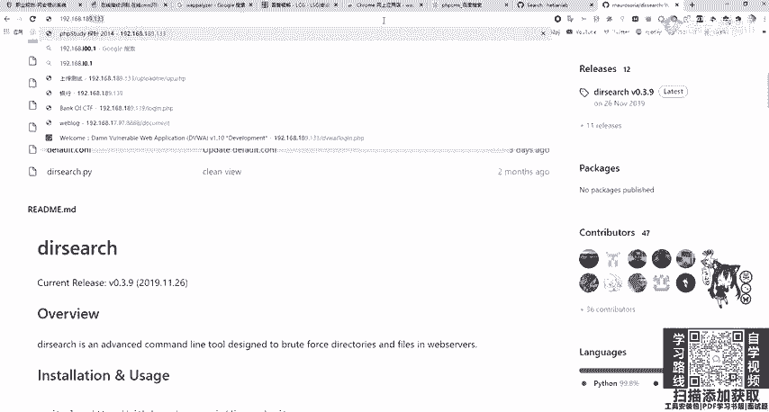

**Dirsearch基本使用命令**：
```bash
python3 dirsearch.py -u http://target.com -e php,html,zip
```
**参数解释**：
*   `-u`：指定目标URL。
*   `-e`：指定要扫描的文件扩展名。

**DirMap基本使用命令**：
```bash
python3 dirmap.py -i http://target.com -lcf
```
**参数解释**：
*   `-i`：指定目标URL。
*   `-lcf`：使用默认配置进行扫描。

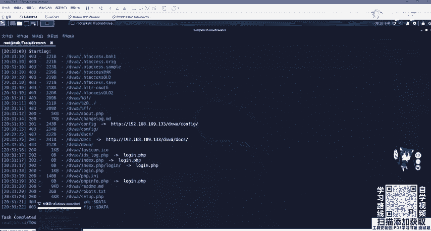

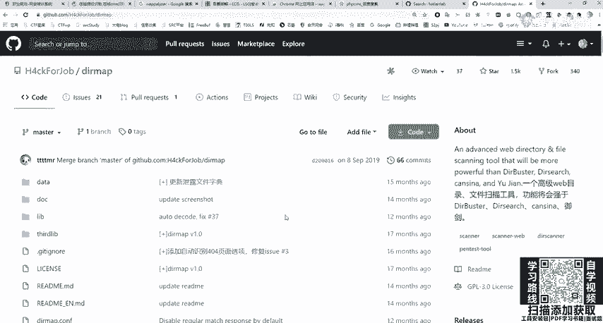

**工具获取与使用提示**：
以上工具通常托管在GitHub上。使用前需要将其“克隆”（即下载）到本地。克隆命令为：
```bash
git clone <仓库地址>
```
例如克隆Dirsearch：
```bash
git clone https://github.com/maurosoria/dirsearch.git
```
克隆后，进入工具目录，通常需要根据 `README.md` 文件的说明安装必要的Python依赖包，例如：
```bash
pip3 install -r requirements.txt
```

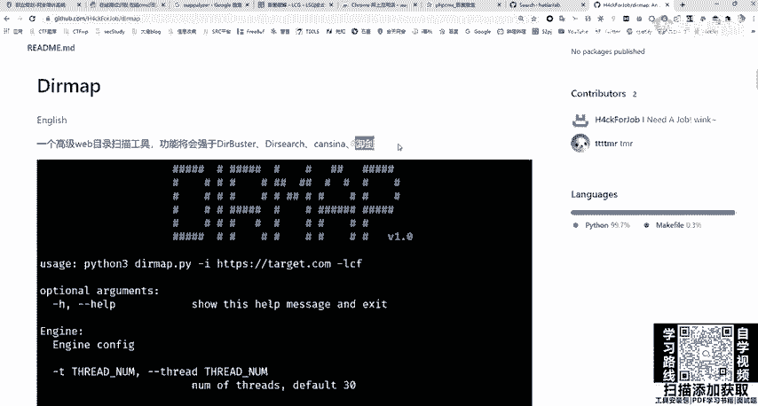

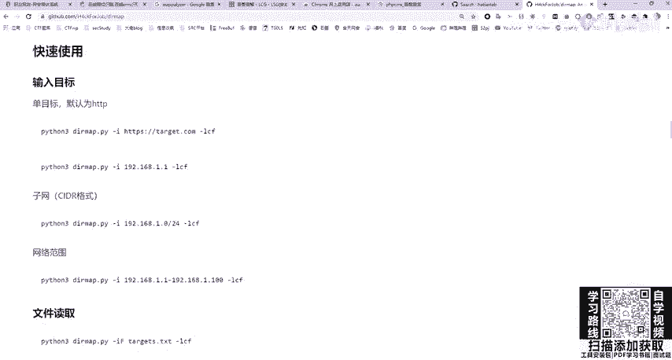

### 特定漏洞导致的信息泄露
除了常规备份文件，一些特定的框架漏洞也可能导致信息泄露。例如，Spring Boot框架的Actuator组件如果配置不当，可能暴露 `/env` 等端点，泄露数据库密码、密钥等敏感信息。

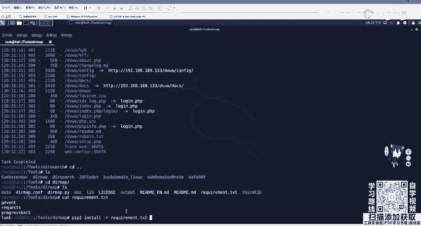

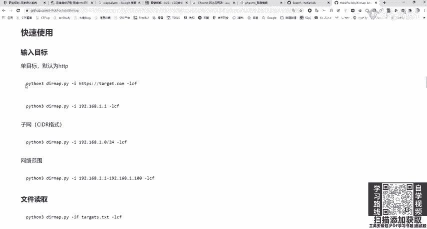

发现这类泄露的途径往往是先通过目录爆破发现可疑路径（如 `/actuator/env`），然后直接访问进行验证。

## 探测的意义与后续操作
探测到敏感文件或目录后，我们能做什么呢？以下是几个关键的应用方向：

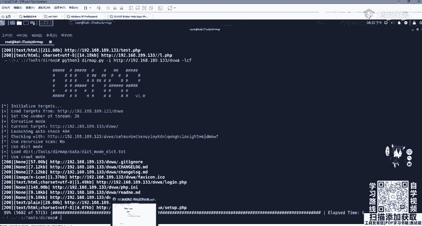

1.  **获取源代码**：通过Git/SVN泄露或备份文件下载源码。
2.  **代码审计**：对获取的源代码进行审计（白盒测试），寻找SQL注入、文件包含、逻辑缺陷等漏洞。
3.  **获取配置信息**：在源码的配置文件（如 `config.php`、`application.properties`）中寻找数据库连接信息、后台密码、API密钥等。
4.  **发现后台入口**：通过目录爆破发现网站的后台管理登录页面。
5.  **信息收集**：收集到的邮箱、用户名、内部系统路径等信息，可用于社会工程学攻击或扩大攻击面。


## 总结
本节课中，我们一起学习了敏感文件及目录探测的相关知识。我们首先了解了 `.git`、`.svn`、备份文件等常见的泄露类型。接着，学习了如何使用 `GitHack`、`Dirsearch`、`DirMap` 等工具来主动发现和利用这些泄露。最后，我们探讨了成功探测后，如何通过代码审计、分析配置文件等手段将获取的信息转化为实际的渗透测试突破口。请记住，信息收集是渗透测试的基石，细致全面的探测往往能发现意想不到的突破点。