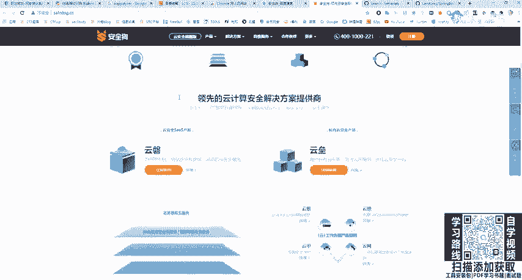
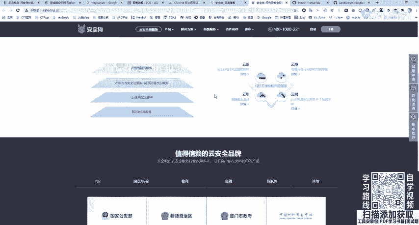
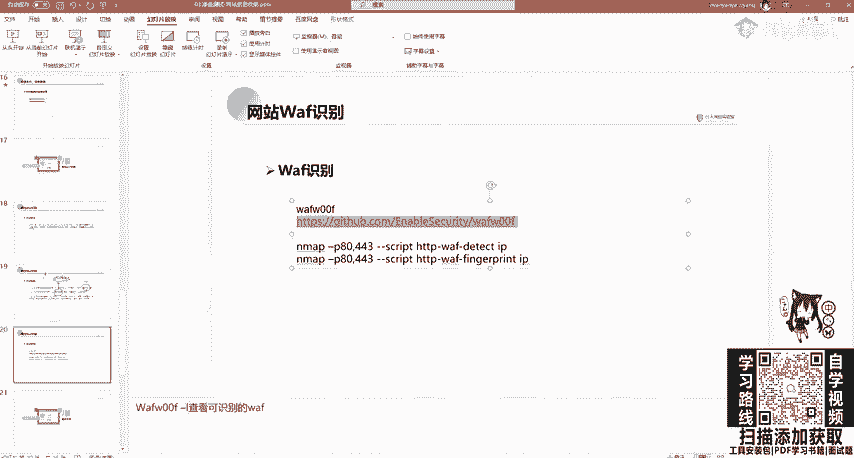
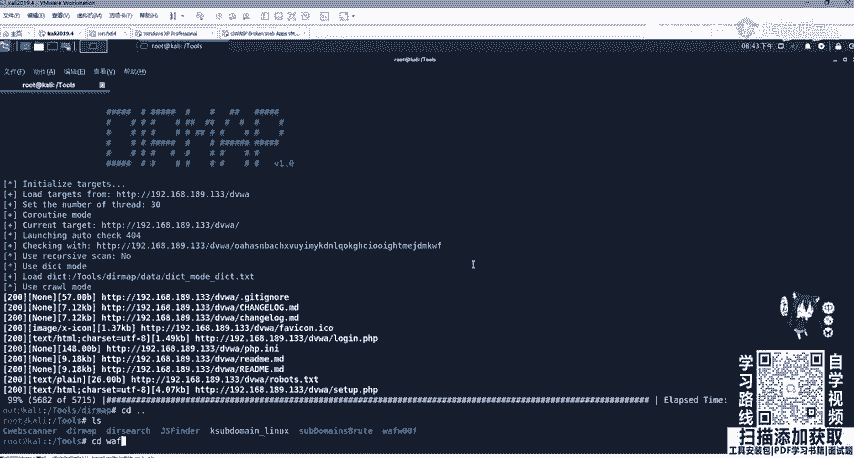
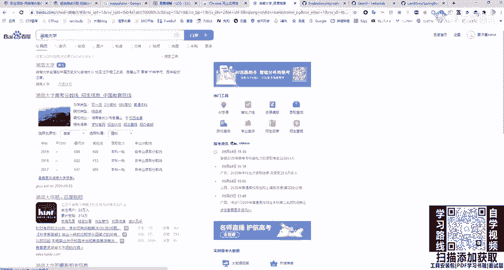
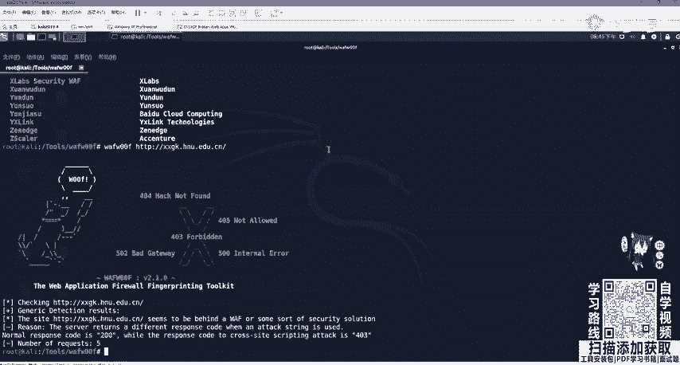
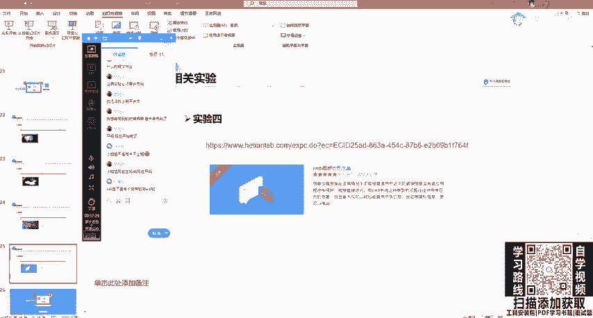
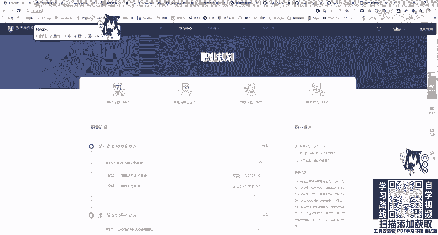
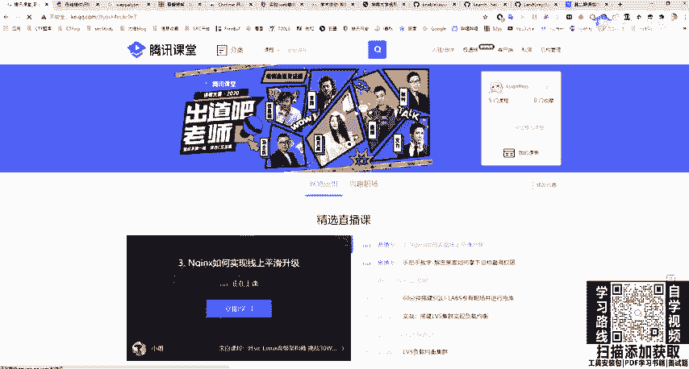
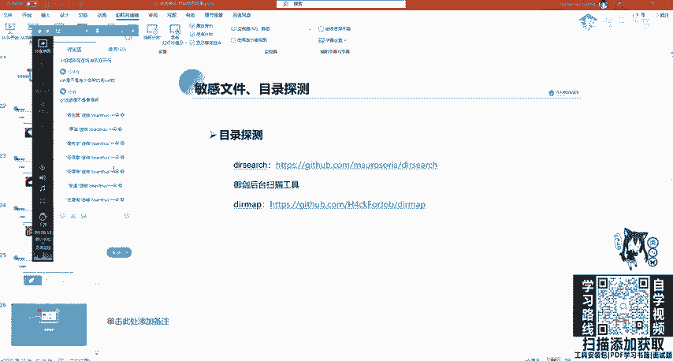

# 网络安全教程：P34：33.网站WAF识别 🔍

在本节课中，我们将要学习Web应用防火墙（WAF）的基本概念、作用以及如何识别目标网站是否部署了WAF。这对于后续的渗透测试和漏洞利用至关重要。

## 概述

WAF是Web应用防火墙的简称，用于保护网站免受黑客攻击。网站管理员可能不熟悉自身代码的安全性，因此会部署WAF来提供防护。WAF主要分为硬件WAF和软件WAF两种类型。



## WAF的类型与作用



上一节我们介绍了WAF的基本概念，本节中我们来看看WAF的具体类型和它们的主要功能。

### 硬件WAF
硬件WAF通常是一个物理设备（例如“铁盒子”），它集成了入侵检测系统（IDS）和流量监控等功能。

### 软件WAF
软件WAF则通过代码实现，利用白名单或黑名单机制对HTTP请求包（`request`）和响应包（`response`）进行过滤。

以下是常见的WAF产品示例：
*   **免费/开源WAF**：例如安全狗、知道创宇的WAF。
*   **集成WAF**：例如宝塔面板自带的WAF功能。
*   **云WAF**：例如阿里云盾、安骑士等，可以防御SQL注入等基础攻击。

## 为何需要识别与绕过WAF





在进行渗透测试时，如果遇到WAF，盲目攻击可能导致IP被封锁。因此，需要先识别WAF，并寻找绕过方法。



WAF的核心作用是保护网站，防御网络攻击。例如，当使用SQL注入语句测试时，可能会触发安全狗的拦截提示，甚至导致扫描工具（如sqlmap）的IP被封锁。

虽然部署WAF能提升安全性，但有时服务商频繁的电话推销升级产品也可能带来困扰。

## 如何识别WAF



识别WAF是绕过它的第一步。以下是手动识别WAF防护范围的几个方面：

1.  **防御OWASP Top 10攻击**：包括但不限于SQL注入、XSS、CSRF、网站后门等。WAF会拦截含有系统调用命令的请求包，使一些Webshell失效。
2.  **防止自动化攻击**：例如暴力破解。WAF可以配置规则，在多次登录失败后封锁IP。
3.  **阻止其他常见威胁**：包括爬虫、DDoS攻击、越权访问、敏感信息泄露等。WAF也能有效防护恶意爬虫。

## 使用工具自动化识别WAF

除了手动判断，我们还可以使用自动化工具来识别WAF。一个常用的工具是`WAFW00F`。

以下是使用`WAFW00F`的基本步骤：
1.  克隆项目并安装：
    ```bash
    git clone https://github.com/EnableSecurity/wafw00f.git
    cd wafw00f
    python setup.py install
    ```
2.  查看支持的WAF列表：
    ```bash
    wafw00f -l
    ```
3.  对目标URL进行识别：
    ```bash
    wafw00f http://target-url.com
    ```

**请注意**：使用此类工具进行探测时，您的IP地址有被目标WAF封锁的风险。在授权测试中需谨慎操作。

## 信息收集的后续步骤与作业

对网站的WAF识别是信息收集阶段的一部分。收集完信息后，下一步是分析目标是否存在脆弱性漏洞，例如CMS漏洞、中间件漏洞等。如果存在WAF，则需研究绕过方法；如果找不到漏洞，则需要扩大资产扫描范围（如C段、旁站）。

为了巩固学习，请完成以下课后作业：

*   **实验一**：完成`Nmap`网络扫描实验，熟悉主动扫描技巧。
*   **实验二**：完成`Git`/`SVN`等版本控制系统的敏感信息泄露实验，使用相关工具进行探测。
*   **尝试练习**：选择一个公益SRC或众测平台上的目标，尝试进行一次完整的信息收集流程，并熟悉各个环节。





**重要提醒**：在针对教育机构（`.edu`）或其他特定目标进行SRC漏洞挖掘时，务必遵守“不查看、不删除、不修改”数据的原则，切勿上传木马等恶意文件，一切操作应在法律和授权范围内进行。



## 总结



本节课中我们一起学习了Web应用防火墙（WAF）的基础知识，包括其类型、作用以及识别方法。我们了解到，在渗透测试中，识别WAF是规避防护、进行有效测试的关键步骤。同时，我们介绍了使用`WAFW00F`工具进行自动化识别的方法，并布置了相关的实践作业来帮助大家巩固信息收集的技能。