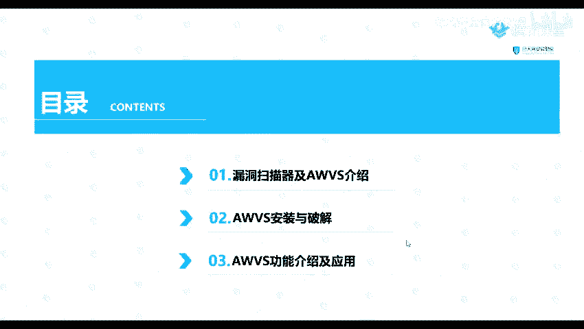
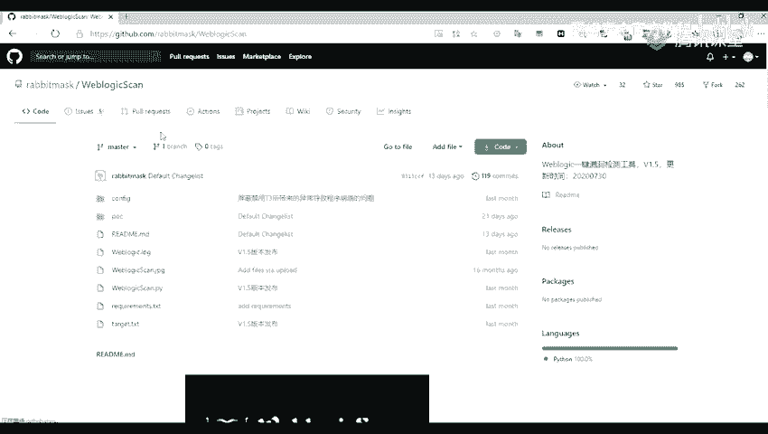
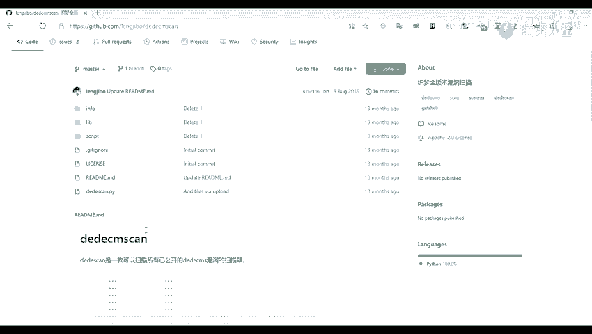
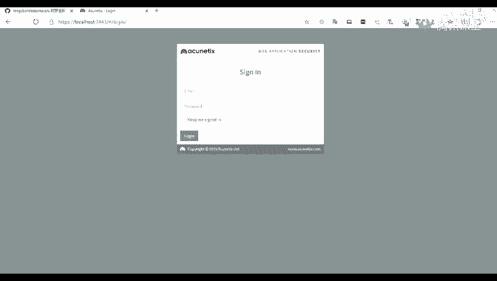
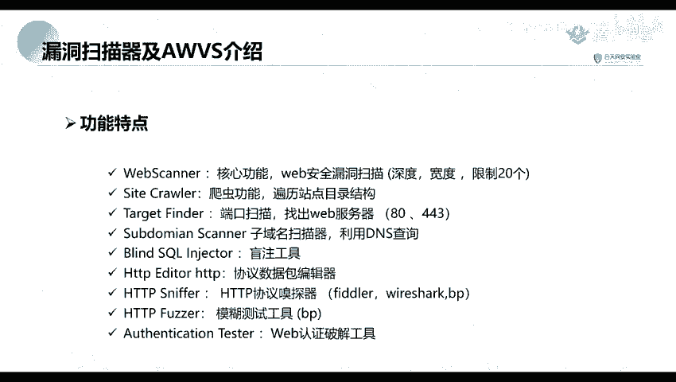

# 网络安全教程：P35：AWVS工具介绍和应用场景 🛡️

在本节课中，我们将要学习一款重要的Web漏洞扫描工具——AWVS。我们将了解什么是漏洞扫描器，详细介绍AWVS的功能特点，并学习其安装、破解与基本使用方法。通过本节课，你将能够使用AWVS对网站进行初步的安全漏洞检测。

## 漏洞扫描器与AWVS介绍

上一节我们介绍了信息收集，例如端口、网站及子域名信息的收集。本节中我们来看看如何对收集到的目标进行漏洞发现，即利用AWVS进行漏洞扫描。

首先，我们需要理解什么是漏洞扫描。漏洞扫描是指基于漏洞数据库，通过扫描等手段，对指定的远程或本地计算机系统的安全性进行检测。也就是说，我们通过扫描手段，对上一节课收集到的子域名进行安全脆弱性检测，以发现是否存在可利用的漏洞。这是一种为后续渗透攻击做准备的安全检测行为。

网络上存在许多免费或付费的漏洞扫描工具或脚本。以下是常见的几类：

*   **针对某类漏洞的工具**：例如，针对SQL注入漏洞的 `sqlmap` 工具。
*   **针对特定中间件的工具**：例如，针对WebLogic漏洞的 `WeblogicScan` 工具，其内置了多种漏洞的检测脚本（POC）。
*   **针对某类CMS的工具**：例如，针对WordPress的 `WPScan` 和针对DedeCMS的 `DedeCMSscan`。
*   **针对系统应用层的工具**：例如，商业漏洞扫描器Nessus。
*   **针对特定框架的工具**：例如，针对Struts2框架的漏洞检测工具。
*   **针对Web服务的综合工具**：例如，Burp Suite（不仅是抓包工具）、长亭科技出品的XRAY，以及本节课的核心——AWVS。

那么，什么是AWVS？AWVS（Acunetix Web Vulnerability Scanner）是一款知名的网络漏洞扫描工具。它通过网络爬虫测试网站安全性，检测流行的安全漏洞，如SQL注入、跨站脚本（XSS）等。在11.0版本之前，AWVS是一个客户端软件。从11.0版本开始，它转变为通过浏览器访问的B/S架构，我们通过访问其服务的特定端口来使用它。

AWVS具有以下功能特点：
1.  **Web Scanner**：核心功能，用于扫描Web安全漏洞。
2.  **Site Crawler**：爬取网站站点目录结构。
3.  **Port Scanner**：扫描Web服务器开放端口（如80、443）。
4.  **Subdomain Scanner**：利用DNS查询发现子域名。
5.  **SQL Injector**：SQL注入检测工具。
6.  **HTTP Editor**：HTTP协议数据包编辑器。
7.  **HTTP Sniffer**：HTTP协议嗅探器。
8.  **Fuzzer**：模糊测试工具。
9.  **Authentication Tester**：Web认证破解工具。

## AWVS的安装与破解

了解了AWVS的基本概念后，本节我们来看看如何安装和破解它。由于正版AWVS需要收费，我们在学习环境中通常会使用破解版。

以下是安装与破解的主要步骤：
1.  从网络获取AWVS的安装包及破解补丁。
2.  运行安装程序，按照向导完成AWVS的安装。
3.  安装完成后，使用提供的破解补丁替换原程序文件或执行注册操作。
4.  启动AWVS服务，并通过浏览器访问其管理界面（例如 `https://localhost:3443`）进行验证。

> **注意**：请确保仅在授权的学习或测试环境中使用破解软件，切勿用于非法用途。

## AWVS的功能与使用

成功安装AWVS后，本节我们将点一下它的主要功能界面和基本使用方法。

通过浏览器访问AWVS的管理界面后，你会看到类似下图的仪表盘。核心操作是创建一个新的扫描任务。

以下是创建一个基本扫描任务的流程：
1.  在界面中找到并点击 **“New Scan”** 或类似按钮。
2.  在目标地址栏输入要扫描的网站URL，例如 `http://testphp.vulnweb.com`。
3.  配置扫描选项，如扫描类型（全扫描、高风险漏洞扫描等）、是否启用爬虫、是否进行身份验证等。
4.  点击启动扫描。AWVS将自动开始爬取网站结构和测试漏洞。
5.  扫描完成后，可以在结果界面查看发现的漏洞列表、风险等级、详细描述及修复建议。

除了单目标扫描，AWVS也支持批量扫描功能。你可以将上一节课收集到的多个子域名整理成列表，通过AWVS的批量任务功能进行导入和扫描，从而提高效率。

## 总结

本节课中我们一起学习了Web漏洞扫描工具AWVS。我们首先了解了漏洞扫描器的概念和常见类型，然后重点介绍了AWVS的功能特点。接着，我们学习了AWVS的安装、破解步骤。最后，我们点了一下AWVS的基本操作界面和如何创建扫描任务。掌握AWVS的使用，是进行Web渗透测试中漏洞发现阶段的重要技能。