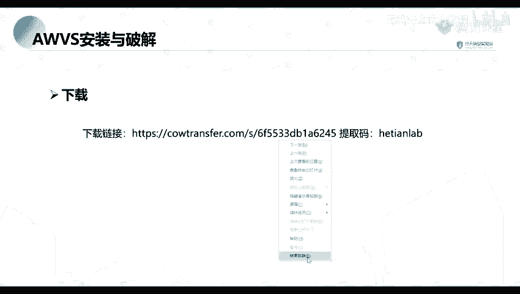
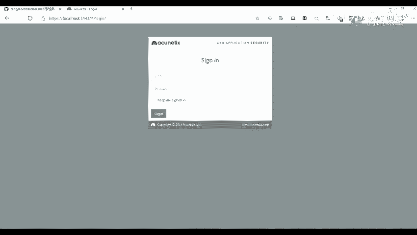
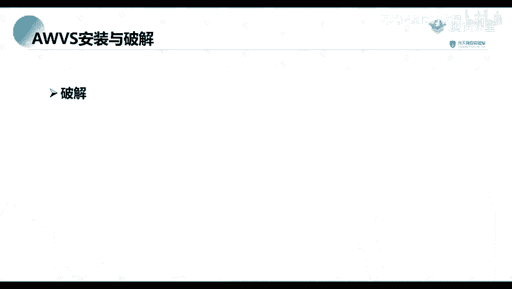

网络安全教程：P36：AWVS的安装与破解

在本节课中，我们将学习AWVS（Acunetix Web Vulnerability Scanner）的安装与破解过程。AWVS是一款功能强大的Web漏洞扫描工具，对于渗透测试和安全评估至关重要。我们将从下载工具开始，逐步完成安装，并详细讲解破解步骤，确保您能够成功配置并使用该工具。

---

### 下载AWVS安装包与破解工具

首先，您需要下载AWVS的安装包及相应的破解工具。这些资源已包含在课程预习材料中。下载链接如下，您可以访问并下载所需文件。

下载完成后，您将获得一个压缩包，其中包含以下内容：
*   **AWVS 12 安装包**：主程序安装文件。
*   **破解工具包**：包含用于激活软件的必要文件。

请注意，破解步骤在预习材料中可能未详细说明，本节课将重点讲解这一部分。

---

### 安装AWVS主程序

接下来，我们开始安装AWVS主程序。其安装过程与安装常见的软件（如QQ或微信）类似，遵循标准的向导步骤。

不过，在安装过程中有几个关键设置点需要注意：

1.  **设置账户信息**：安装程序会提示您设置登录邮箱和密码。这是用于访问AWVS管理界面的凭证。
2.  **配置访问端口**：您需要设置Web访问端口。此端口决定了您后续通过浏览器访问AWVS管理界面的地址。例如，如果设置为 `13443`，则访问地址为 `https://localhost:13443`。端口号可以按需自定义。
3.  **设置远程访问权限**：安装程序会询问是否允许远程机器访问此AWVS实例。如果选择不允许（默认或取消勾选），则只能在安装AWVS的本地计算机上进行访问。本节课演示中，我们选择仅允许本地访问，以增强安全性。

完成以上设置后，继续完成安装向导即可。

---

### 破解AWVS

安装完成后，我们需要使用破解工具来激活软件。上一节我们完成了程序的安装，本节中我们来看看具体的破解步骤。

首先，找到您下载的破解工具包。解压后，通常会看到两个关键文件：一个 `.exe` 可执行文件和一个 `date` 文件（或类似名称的数据文件）。

以下是破解的具体操作步骤：

1.  **定位AWVS安装目录**：AWVS的默认安装路径通常为 `C:\Program Files (x86)\Acunetix\`。您需要在此目录下找到版本号对应的文件夹（例如 `12` 或 `v_12`）。
2.  **复制破解文件**：将破解工具包中的两个文件（`.exe` 和 `date`）复制到上一步找到的AWVS安装目录下。
3.  **以管理员身份运行破解程序**：在AWVS安装目录中，找到并右键单击破解工具的 `.exe` 文件，选择 **“以管理员身份运行”**。
4.  **填写注册信息**：运行破解程序后，会弹出一个窗口，要求填写姓名、公司名称、电话号码等信息。这些信息可以随意填写，不会影响破解结果。参照下图示例填写即可。

5.  **完成破解**：填写完信息后，点击确认或生成按钮。程序会自动完成破解过程。成功后，关闭破解程序。

---

### 验证与访问

破解步骤完成后，您就可以启动AWVS服务了。您可以在开始菜单中找到Acunetix相关的启动项，或者在浏览器中输入安装时设置的端口地址（例如 `https://localhost:13443`）来访问AWVS的Web管理界面。

使用之前设置的邮箱和密码登录，如果能够成功进入主界面，并且没有试用期提示，则说明安装与破解均已成功。

---

本节课中我们一起学习了AWVS漏洞扫描工具的完整安装与破解流程。我们首先下载了必要的安装包和破解工具，然后逐步完成了软件的安装，特别注意了账户、端口和远程访问的设置。最后，我们详细讲解了通过复制破解文件并以管理员身份运行来激活软件的关键步骤。掌握这些步骤后，您就具备了搭建本地Web漏洞扫描环境的基础能力。