# 网络安全：P37：AWVS漏洞扫描工具使用教程

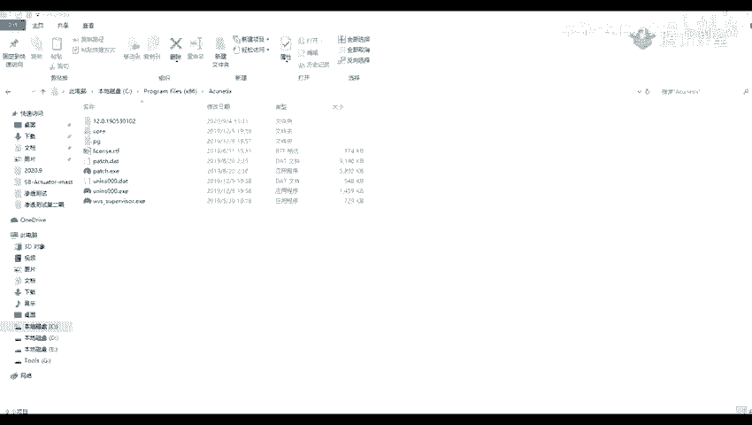

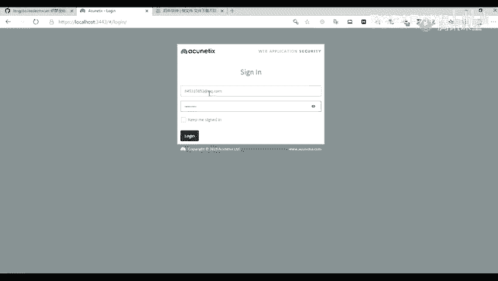

## 概述
在本节课中，我们将学习AWVS（Acunetix Web Vulnerability Scanner）漏洞扫描工具的基本功能、界面布局以及核心操作流程。我们将从登录界面开始，逐步讲解仪表盘、目标管理、扫描配置、报告导出和批量扫描等关键功能，帮助你快速上手使用这款强大的自动化安全评估工具。

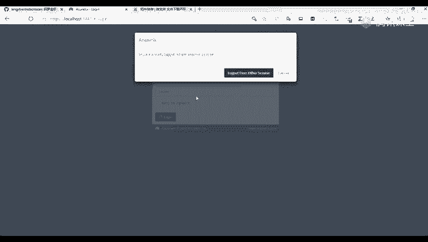

---

## 界面布局与核心功能

上一节我们概述了课程内容，本节中我们来看看AWVS工具的主要界面构成。

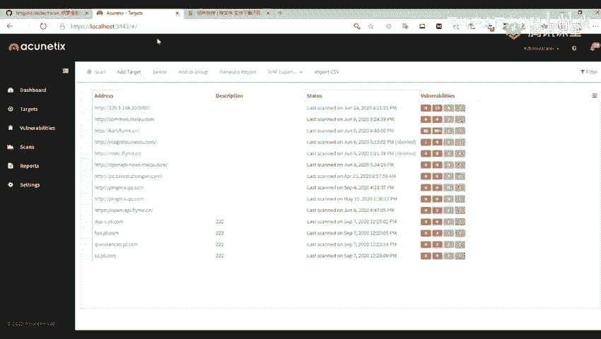

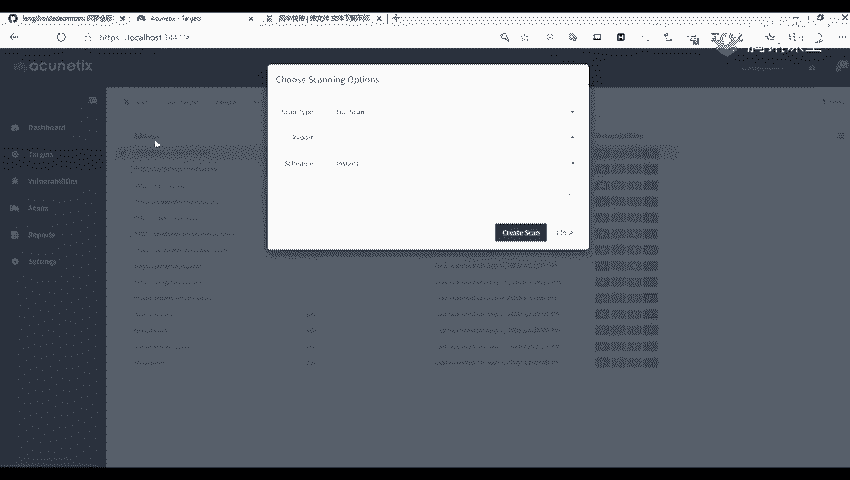

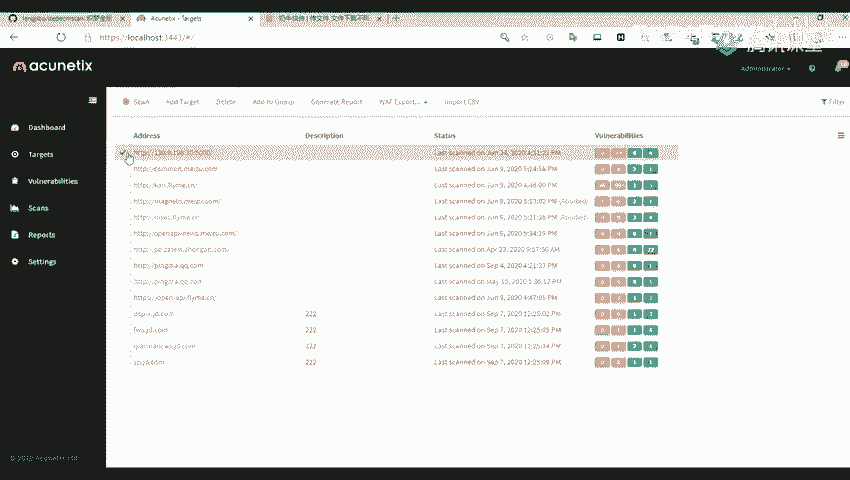

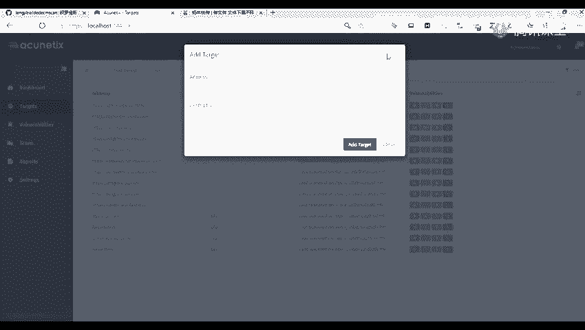

AWVS的Web界面主要分为六个核心区域，每个区域承担不同的功能。

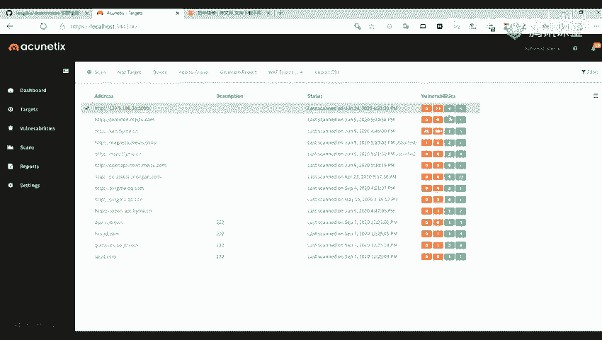

以下是各个功能区域的简要说明：
1.  **仪表盘（Dashboard）**：展示扫描概览，包括漏洞数量、分布和任务进度。
2.  **目标（Targets）**：管理所有待扫描或已扫描的网站目标。
3.  **漏洞（Vulnerabilities）**：集中展示通过扫描发现的所有安全漏洞详情。
4.  **扫描（Scans）**：配置、启动和管理具体的扫描任务。
5.  **报告（Reports）**：查看和导出生成的扫描报告。
6.  **设置（Settings）**：进行系统及扫描引擎的相关配置。

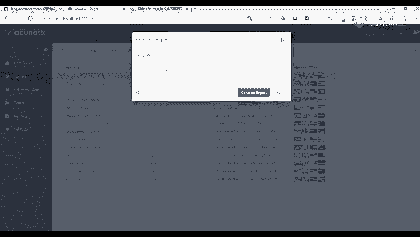

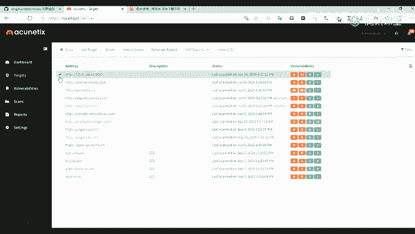

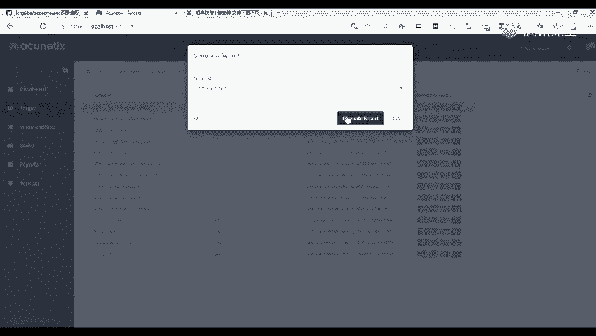

---

## 登录与仪表盘详解

### 登录注意事项
AWVS目前只允许一个账号同时在一个客户端登录。如果登录时提示“本地已有其他账号登录”，需要先点击“退出”当前会话，然后重新登录。

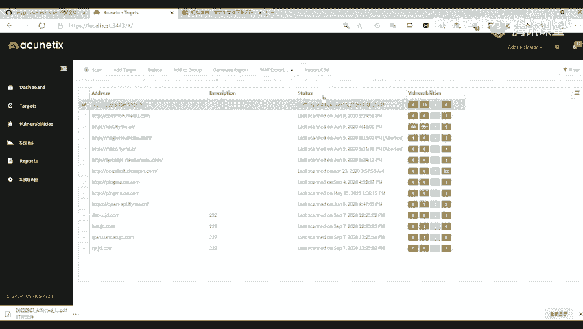

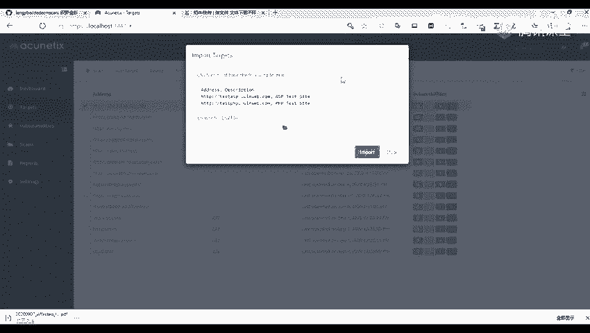

登录成功后，首先进入的是仪表盘界面。

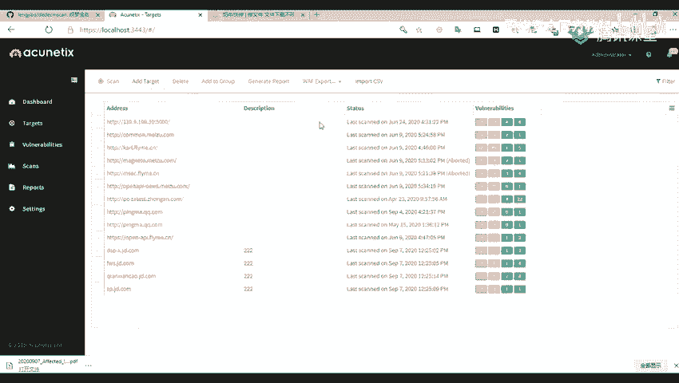

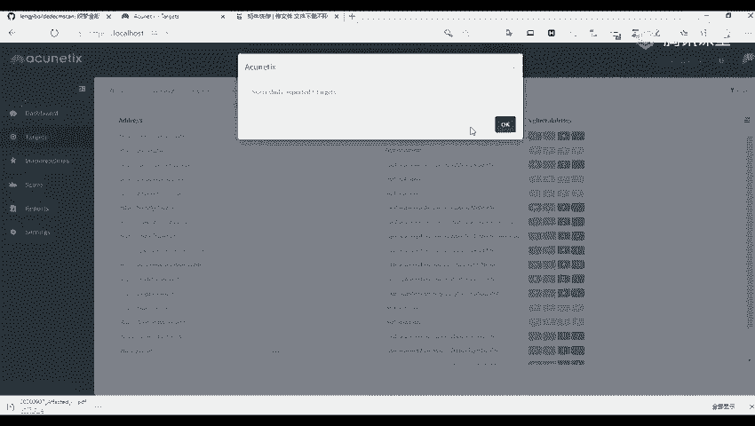

### 仪表盘信息解读
仪表盘是扫描结果的综合展示中心，主要包含以下信息：

1.  **漏洞数量与分布**：顶部以不同颜色圆环展示漏洞统计。
    *   **粉红色**：代表**高危漏洞**的数量。
    *   **橘黄色**：代表**中危漏洞**的数量。
    *   **浅蓝色**：代表**低危漏洞**的数量。
2.  **漏洞站点分布**：左下角列表展示了发现漏洞的具体网站域名及对应的漏洞数量。
3.  **漏洞类型排名**：右下角列表按数量降序排列了发现的漏洞类型，例如“目录遍历”、“跨站脚本（XSS）”等。

仪表盘上方还显示了扫描任务的实时进度条。

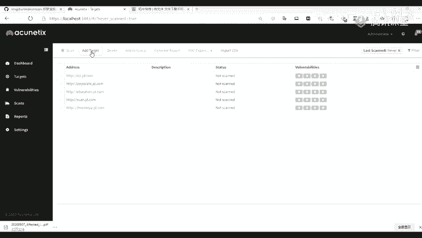

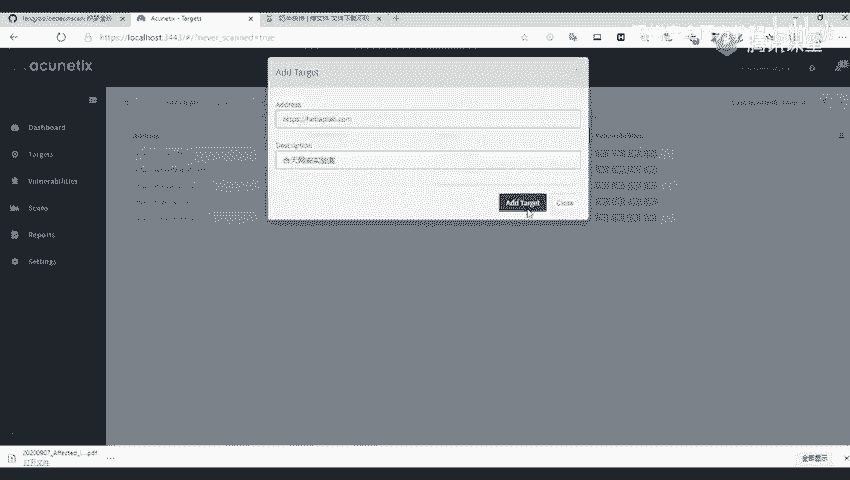

---

## 目标（Targets）管理

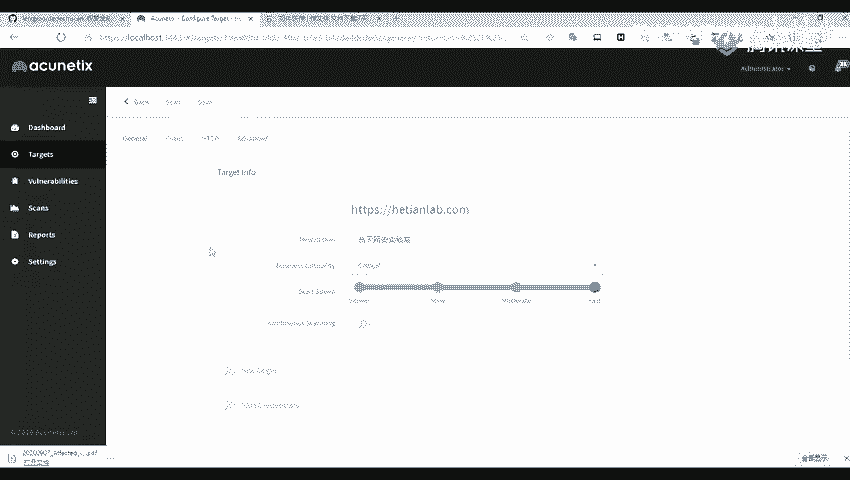

上一节我们介绍了信息汇总的仪表盘，本节中我们来看看如何管理具体的扫描目标。

在“Targets”页面，可以管理所有需要扫描的网站。页面提供了一系列操作按钮。

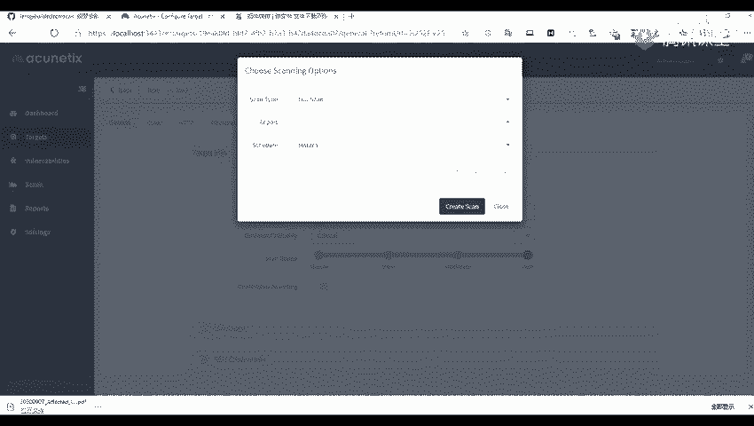

以下是目标管理的主要操作：
*   **扫描（Scan）**：对选中的目标启动漏洞扫描。
*   **添加目标（Add Target）**：手动输入新的网站地址进行添加。
*   **删除（Delete）**：删除选中的目标。
*   **添加到组（Add to Group）**：将目标归类到自定义的组中，便于管理。
*   **导出报告（Export）**：导出选中目标的扫描报告。

### 添加与扫描单个目标
点击“Add Target”，在弹出的窗口中填写目标地址（支持URL或IP）和描述信息，然后保存。添加成功后，在目标列表中选中它，点击“Scan”即可开始扫描。在扫描配置中，可以设置扫描类型、报告格式和扫描计划（立即、定时或循环扫描）。

### 批量导入目标
当需要扫描大量目标时，可以使用“Import CSV”功能进行批量导入。

**操作步骤**：
1.  准备一个CSV格式的文件，内容为“目标地址,描述”（例如：`http://example.com,这是一个示例网站`）。
2.  在Excel中编辑好目标列表后，另存为“CSV（逗号分隔）”格式。
3.  在AWVS界面点击“Import CSV”，选择该文件即可完成导入。

导入的目标会显示在列表中，状态为“未扫描”，之后可以批量选中并启动扫描。

### 过滤器（Filter）功能
“Targets”页面还提供了过滤器功能，可以根据目标地址、描述或上次扫描时间等条件快速筛选出特定目标。

---

## 漏洞查看与报告导出

### 查看漏洞详情
所有扫描发现的漏洞都会在“Vulnerabilities”页面集中列出。点击任意一个漏洞，可以查看其详细信息，包括：
*   **漏洞描述**：说明漏洞的成因和潜在风险。
*   **HTTP请求与响应**：展示触发漏洞的原始请求数据包和服务器返回的数据包。
*   **修复建议**：提供修补该漏洞的指导方案。
*   **攻击载荷（Payload）**：对于XSS等漏洞，会展示具体的攻击测试代码。

### 导出扫描报告
扫描完成后，可以在“Reports”页面查看或下载报告。

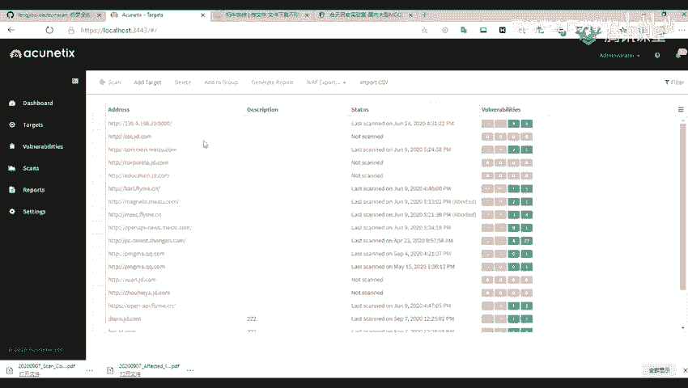

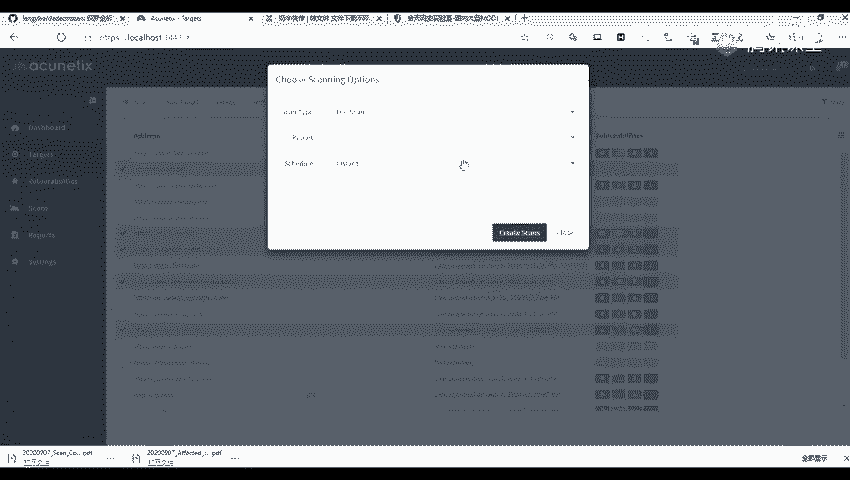

**导出步骤**：
1.  在“Targets”或“Scans”页面，选中已完成扫描的目标或任务。
2.  点击“Export”按钮。
3.  选择报告格式（如PDF、HTML）。
4.  报告生成后，在“Reports”页面找到对应条目，点击“Download”即可下载。

导出的报告通常以“日期_扫描类型_目标_端口.pdf”的格式命名，内容包含漏洞概览、详情及修复建议。

### 比较扫描结果
“Scans”页面中的“Compare Results”功能非常实用。它可以对比同一目标在不同时间点的两次扫描结果，生成差异报告。这常用于验证漏洞修复是否生效。

---

## 高级技巧：批量扫描与脚本使用


上一节我们介绍了常规的扫描与报告功能，本节中我们来看看如何应对大量目标的自动化扫描需求。

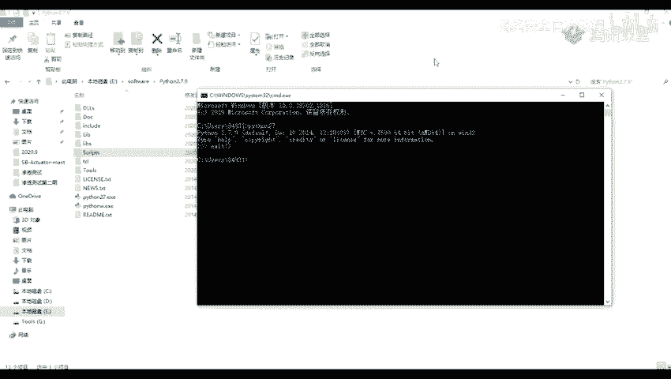

手动逐个添加和启动扫描效率低下。AWVS支持通过Python脚本进行批量自动化操作。

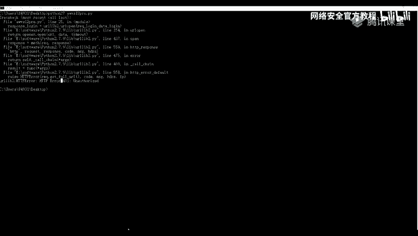

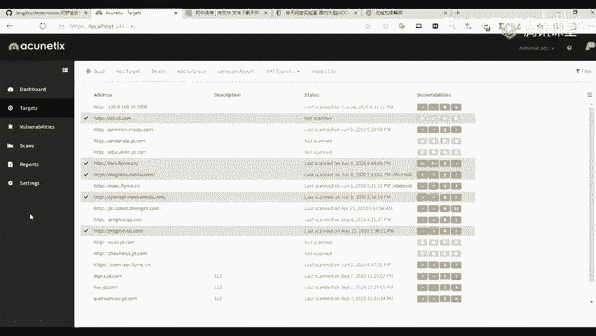

### 批量扫描脚本使用流程
以下是使用脚本进行批量扫描的核心步骤：

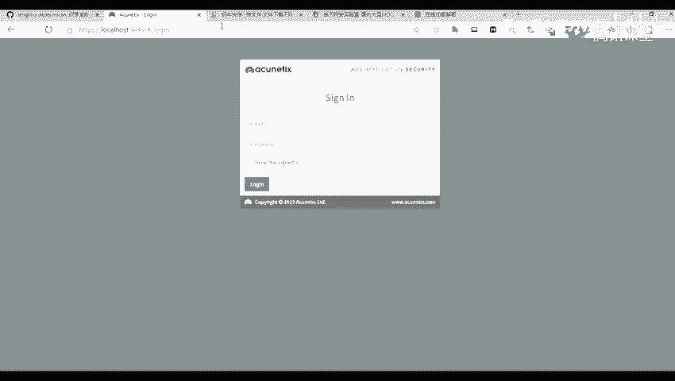

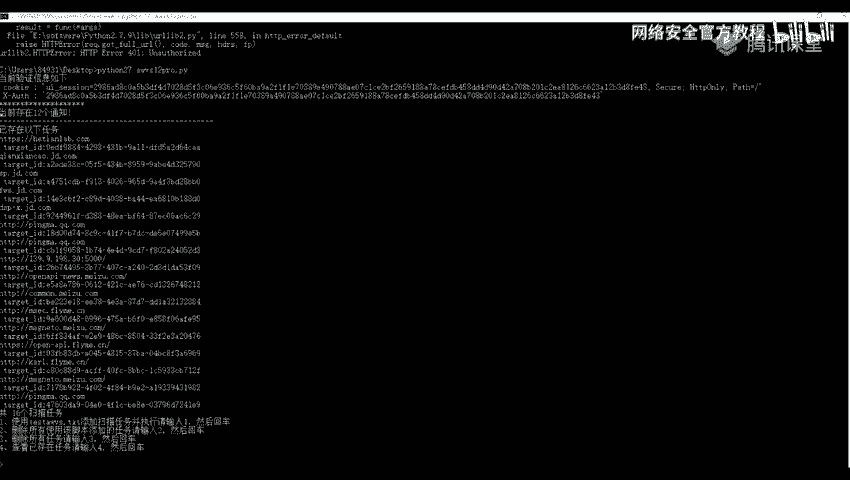

1.  **环境准备**：确保系统已安装**Python 2.7.9**，并正确配置环境变量。
2.  **脚本修改**：获取批量扫描脚本（通常为`.py`文件），修改其中的登录信息。
    *   `username`：填写你的AWVS登录邮箱。
    *   `password`：填写你的密码经过**SHA-256加密**后的哈希值。你可以使用在线工具对明文密码进行加密后填入。
        ```python
        # 示例：修改脚本中的账号密码部分
        username = ‘your_email@example.com‘
        password = ‘加密后的SHA-256哈希值‘
        ```
3.  **准备目标列表**：创建一个`targets.txt`文件，每行写入一个目标URL，并将其与脚本放在同一目录下。
4.  **执行脚本**：在命令行中运行脚本。
    ```bash
    python2 awvs_batch_scan.py
    ```
5.  **交互操作**：脚本运行后，按提示选择“添加并扫描任务”。脚本会自动读取`targets.txt`中的URL，依次添加到AWVS并启动扫描。

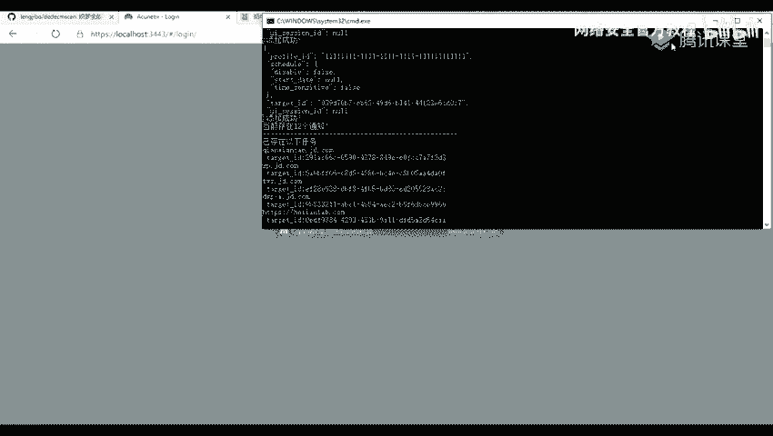

**注意**：如果脚本运行报错“401未授权”，通常是因为AWVS只允许一个活跃会话。需要先退出AWVS的Web界面登录，再重新运行脚本。

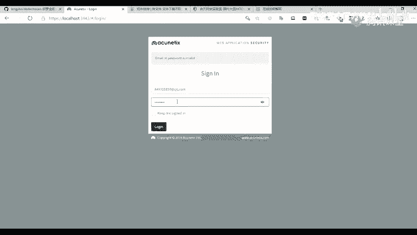

---

## 总结
本节课我们一起学习了AWVS漏洞扫描工具的核心使用方法。我们从界面布局和仪表盘开始，逐步掌握了如何添加和管理扫描目标、配置并启动扫描任务、查看漏洞详情以及导出专业报告。最后，我们还探讨了使用Python脚本实现批量目标自动化扫描的高级技巧，这能极大提升在大型项目或众测场景中的工作效率。掌握这些基础操作后，你就可以利用AWVS对Web应用进行高效的自动化安全检测了。