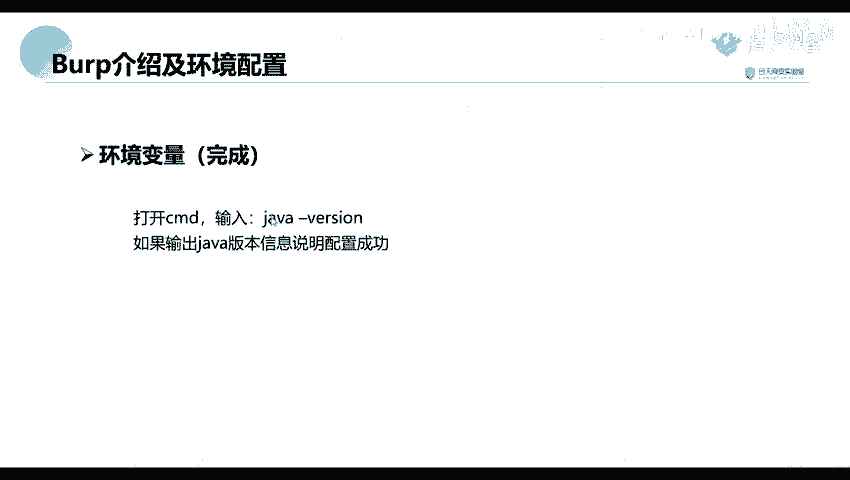

# 网络安全教程：P38：Burp介绍及环境配置 🛠️

在本节课中，我们将要学习渗透测试中一个极其重要的工具——Burp Suite。我们将从它的基本介绍开始，然后详细讲解如何配置其运行所需的Java环境，为后续的实际使用打下基础。

## 工具介绍


Burp Suite 是一款集成化的渗透测试工具。它集合了多种渗透测试组件，使我们能够以自动化或手动的方式，更高效地完成对Web应用的渗透测试和攻击。


在渗透测试过程中，Burp Suite 能够显著简化我们的工作流程。只要熟悉了这款工具的使用，测试工作就能变得轻松且高效。

由于它是由Java语言编写的，得益于Java自身的跨平台特性，这款软件可以在多种操作系统上使用。例如，我们可以在Windows、Linux以及macOS（苹果系统）上运行它。

## 环境配置

上一节我们介绍了Burp Suite是什么，本节中我们来看看如何配置它的运行环境。因为Burp Suite由Java编写，所以我们需要先配置Java环境。

关于Java环境配置的详细课程，在系列教程的前期已经讲过。这里我们进行简单的回顾。如果有不理解的地方，可以回顾之前的课程或查看提供的资料。

以下是配置Java环境变量的基本步骤：

1.  右键点击“此电脑”，选择“属性”。
2.  在系统设置中，找到并点击“高级系统设置”。
3.  在弹出的窗口中，点击“环境变量”按钮。
4.  在“系统变量”部分，新建一个变量。
    *   **变量名**：`JAVA_HOME`
    *   **变量值**：你的JDK安装路径（例如：`C:\Program Files\Java\jdk1.8.0_291`）
5.  编辑“Path”变量，在末尾添加 `%JAVA_HOME%\bin`。

实际上，从JDK 8版本开始，安装程序通常会**自动配置**环境变量。安装后，系统可能已在特定路径（如`C:\Program Files (x86)\Common Files\Oracle\Java`）下完成了配置。

要验证Java环境是否配置成功，请按以下步骤操作：

1.  打开命令提示符（CMD）窗口。
2.  输入命令 `java -version` 并按回车。

如果配置成功，命令行将输出Java的版本信息，类似于：
```bash
java version "1.8.0_291"
Java(TM) SE Runtime Environment (build 1.8.0_291-b10)
Java HotSpot(TM) 64-Bit Server VM (build 25.291-b10, mixed mode)
```
如果未出现上述版本信息，则说明需要按照前述步骤进行手动配置。



## 课程总结

本节课中我们一起学习了渗透测试神器Burp Suite的基本概念以及其运行所需的Java环境配置。我们了解到Burp是一款功能强大的集成化测试工具，并且由于其基于Java开发，我们需要确保系统已正确安装并配置了Java环境。这是使用Burp Suite进行后续所有渗透测试操作的第一步基础。