# 网络安全教程：P39：Burp Suite破解及代理抓包 🛠️

在本节课中，我们将学习Burp Suite Professional的激活方法，以及如何配置代理进行HTTP/HTTPS流量抓包。这是进行Web安全测试和渗透测试的基础技能。

## 概述
Burp Suite是一款广泛用于Web应用程序安全测试的集成平台。本节内容分为两部分：首先介绍如何激活Burp Suite Professional版本，然后详细讲解如何配置代理以拦截和分析网络流量。

## Burp Suite Professional 激活步骤 🔑

上一节我们概述了课程内容，本节中我们来看看具体的激活流程。请确保您已下载包含`burploader.jar`和许可证文件的安装包。

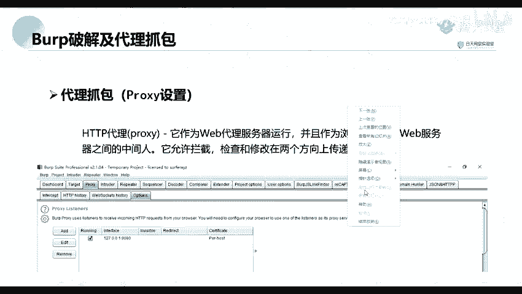

以下是详细的激活步骤：

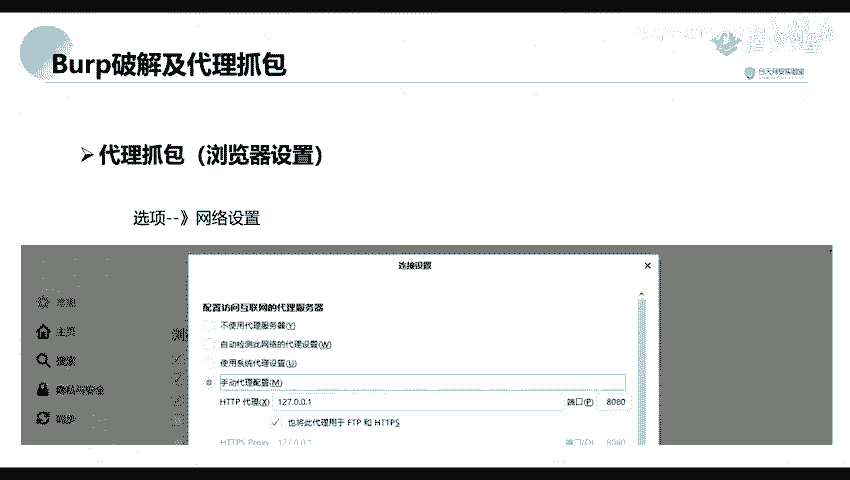

1.  **运行加载器**：找到下载文件中的`burploader.jar`文件，双击运行。
2.  **启动Burp Suite**：程序运行后会出现一个窗口，点击 **Run** 按钮。
3.  **进入激活界面**：启动后，会进入 `Burp Suite Professional` 的激活页面。此时，打开您下载的激活程序（通常是一个`keygen`或类似工具）。
4.  **复制许可证密钥**：在激活程序中，复制 `License` 或 `Activation Request` 框内的字符串。
5.  **粘贴并激活**：回到Burp Suite的激活界面，将复制的字符串粘贴到 `Enter license key` 或 `Activation Request` 输入框中。
6.  **生成响应**：点击界面右侧的 **Manual activation** 或类似按钮，将上一步生成的 `Activation Request` 内容复制到激活程序的 `Activation Response` 生成框中。
7.  **完成激活**：激活程序会自动生成 `Activation Response` 字符串。将此字符串复制回Burp Suite的 `Activation Response` 输入框，点击 **Next** 即可完成激活。

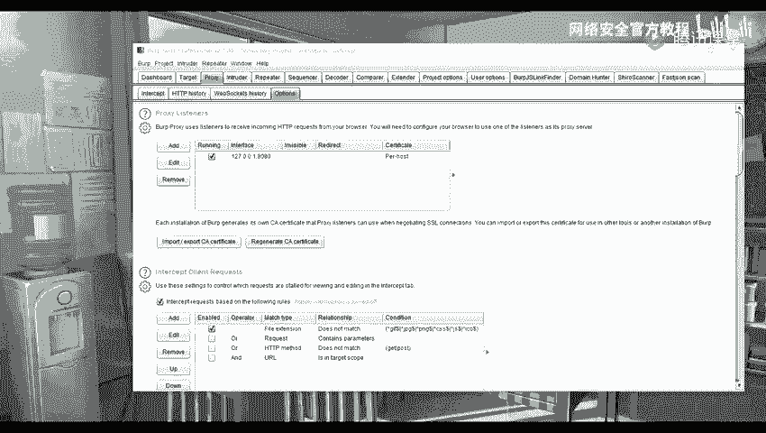

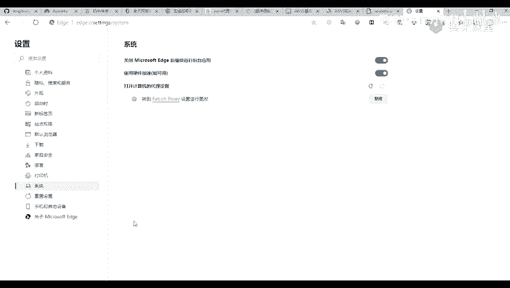

## 配置代理进行抓包 🌐

成功激活Burp Suite后，我们就可以利用其代理功能拦截网络流量了。Burp Suite作为中间人代理，可以截获并修改客户端（如浏览器）与服务器之间的HTTP/HTTPS请求和响应。

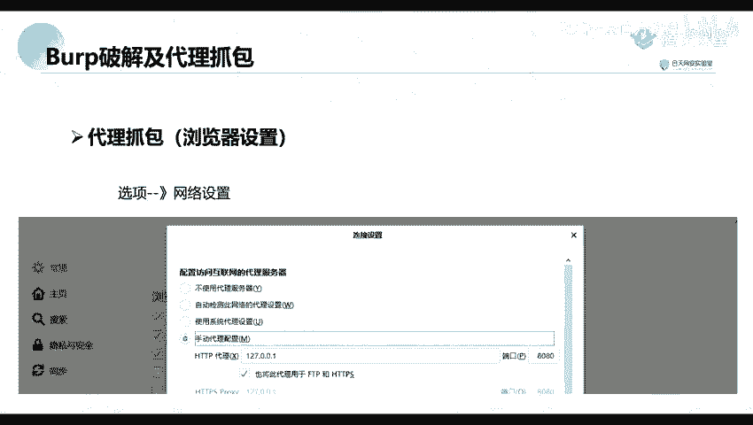

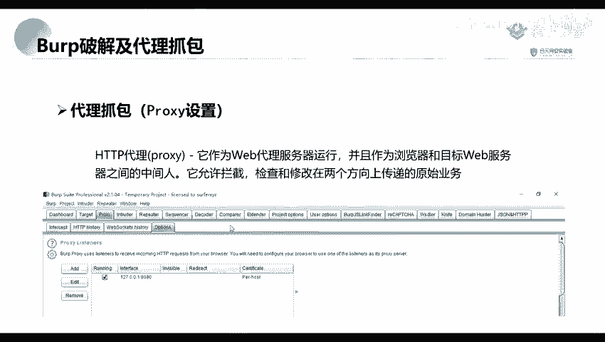

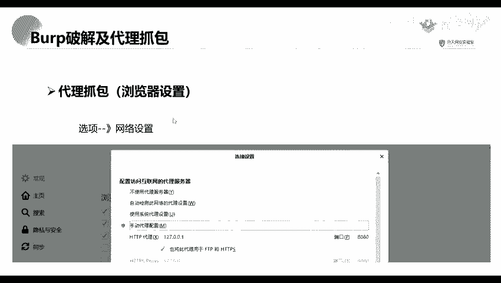

### 代理工作原理
其默认监听地址为 `127.0.0.1`（本地主机）和端口 `8080`。这意味着所有发送到该地址和端口的流量都会被Burp Suite截获。

### 浏览器代理配置
要让浏览器流量经过Burp Suite，需要在浏览器中设置代理。以下是针对不同浏览器的通用配置方法：

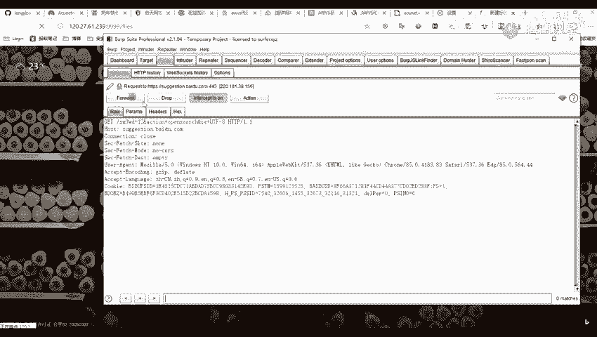

*   **Microsoft Edge / Google Chrome**：进入“设置” > “系统” > “打开计算机的代理设置”，在打开的Windows系统设置中配置代理。
*   **Mozilla Firefox**：进入“选项” > “网络设置”，在底部找到“配置代理访问互联网的设定”，选择“手动代理配置”。
*   **配置参数**：无论哪种浏览器，手动代理配置都需要填写以下信息：
    *   **HTTP代理**：`127.0.0.1`
    *   **端口**：`8080`
    *   同时确保勾选“为所有协议使用相同代理服务器”选项。

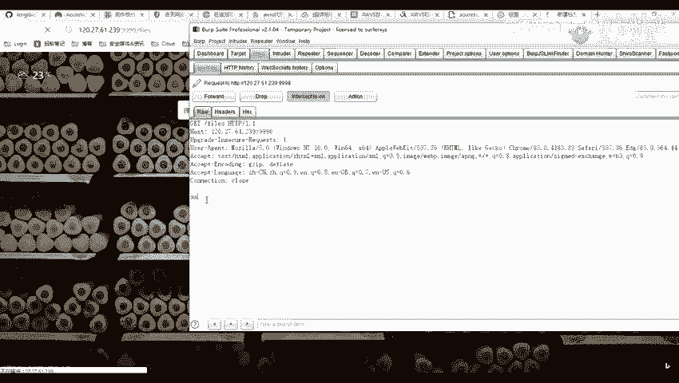

配置完成后，打开Burp Suite，进入 **Proxy** > **Intercept** 选项卡，确保 **Intercept is on** 按钮是打开状态。此时在浏览器中访问任何HTTP网站，请求就会被Burp Suite截获并显示在界面中，您可以查看或修改请求内容后继续转发。

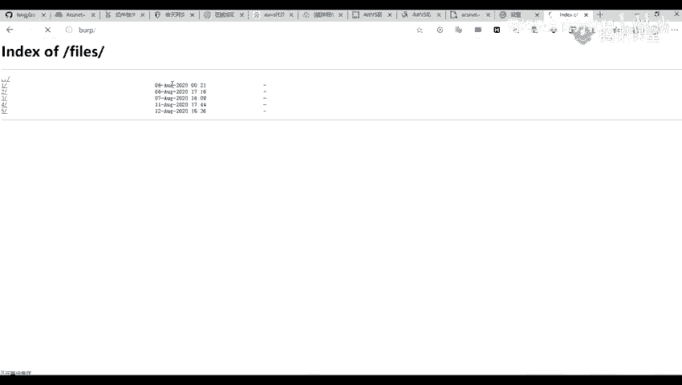

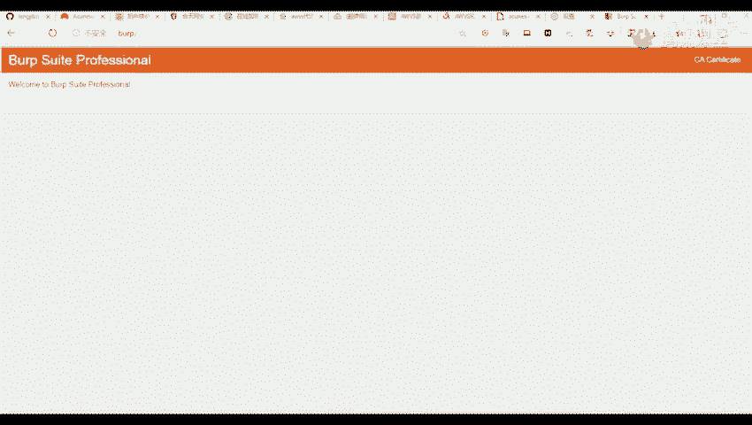

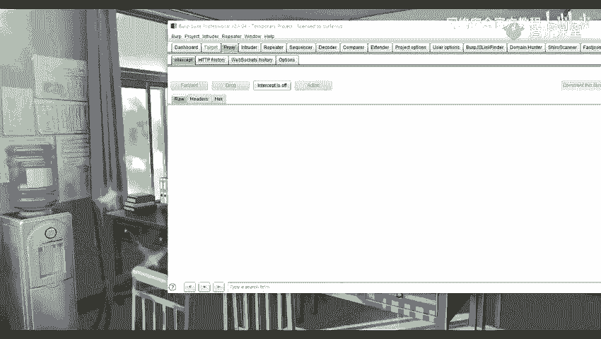

### HTTPS流量抓包配置
默认情况下，Burp Suite无法直接解密HTTPS流量。要抓取HTTPS包，需要安装Burp Suite的CA证书。

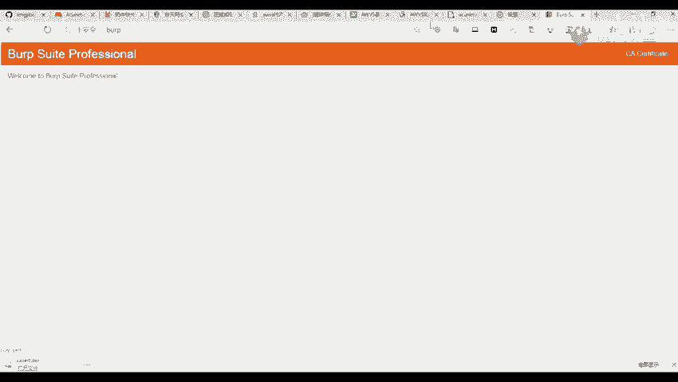

以下是安装证书的步骤：

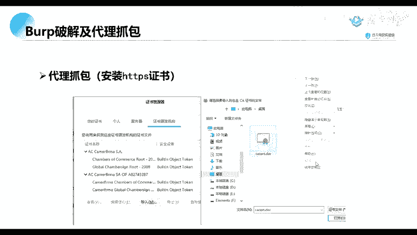

1.  **下载证书**：确保浏览器代理已指向Burp Suite（`127.0.0.1:8080`）。在浏览器中访问 `http://burp` 或 `http://127.0.0.1:8080`，点击页面右上角的 **CA Certificate** 按钮下载证书文件（通常为`cacert.der`）。
2.  **导入证书**（以Firefox为例）：
    *   打开浏览器设置，搜索“证书”。
    *   点击“查看证书”或“管理证书”。
    *   切换到“证书颁发机构”选项卡。
    *   点击“导入”，选择刚才下载的`cacert.der`文件，在弹出窗口中勾选“信任此CA以标识网站”，完成导入。
3.  **重启浏览器**：导入证书后，请完全关闭并重新打开浏览器，以使证书生效。

完成以上步骤后，即可对HTTPS网站进行抓包。

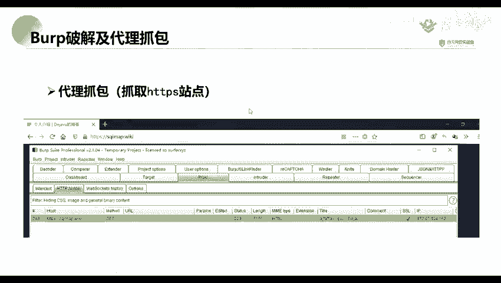

### 使用浏览器插件简化代理切换
为了方便地在正常模式和Burp代理模式之间切换，可以使用浏览器插件来管理代理设置。

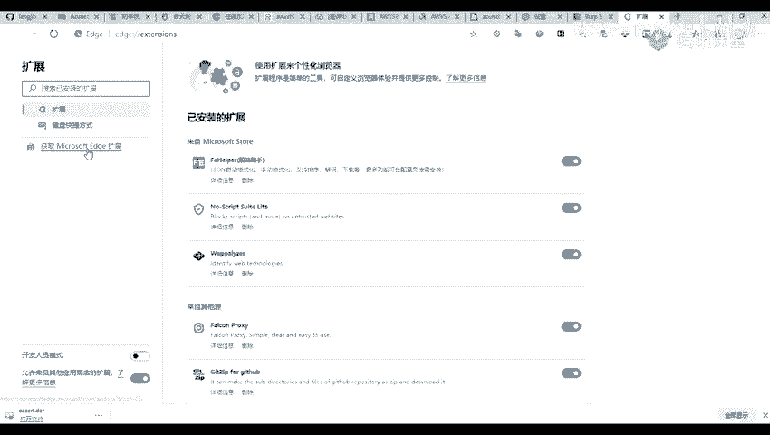

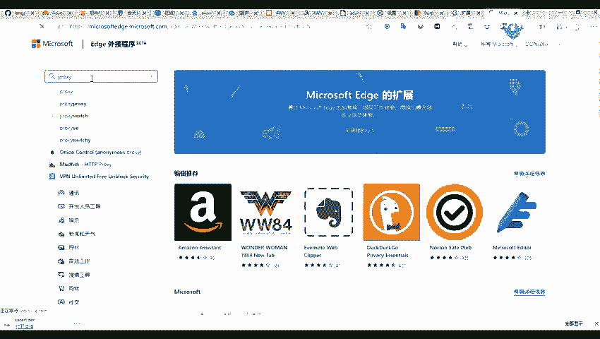

以下是寻找和配置此类插件的一般方法：

1.  在浏览器的扩展商店（如Chrome网上应用店、Firefox附加组件商店）中搜索代理切换插件，例如关键词“Proxy SwitchyOmega”、“FoxyProxy”等。
2.  安装插件后，添加一个新的情景模式。
3.  在该模式的设置中，选择“代理服务器”，并填写以下信息：
    *   **代理协议**：HTTP
    *   **代理服务器**：`127.0.0.1`
    *   **代理端口**：`8080`
4.  配置完成后，在浏览器工具栏点击该插件图标，即可快速切换到Burp代理模式或切回直接连接模式，极大提高测试效率。

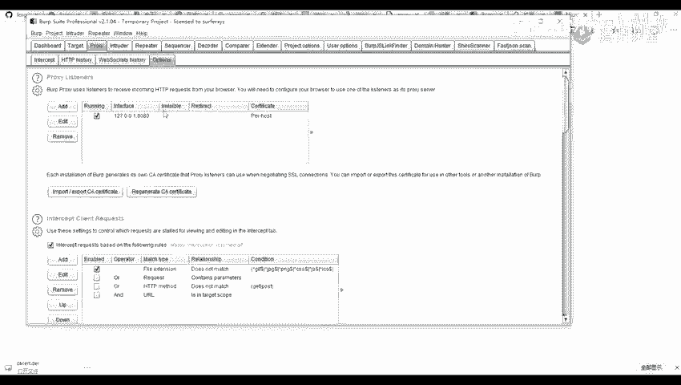

## 总结
本节课中我们一起学习了两个核心技能：激活Burp Suite Professional版，以及配置代理环境进行HTTP/HTTPS流量抓包。我们了解了代理的工作原理，掌握了在浏览器中手动配置代理和安装CA证书以支持HTTPS的方法，并介绍了使用插件简化代理切换操作的技巧。这是后续进行漏洞扫描、渗透测试等操作的重要基础，请务必熟练掌握。