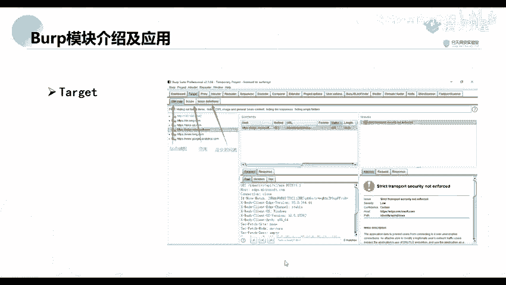
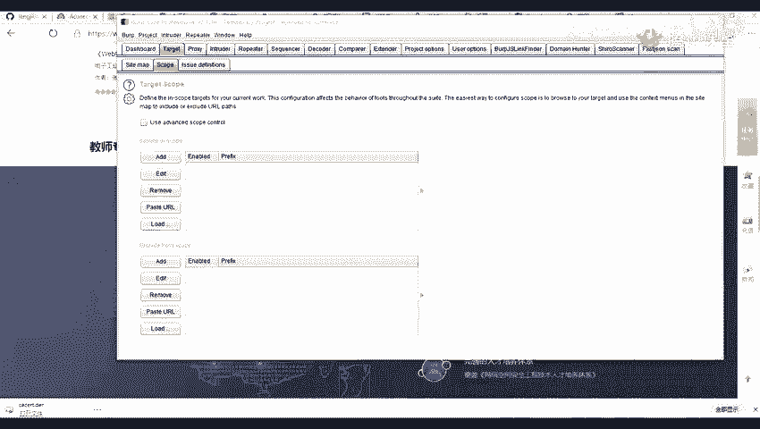
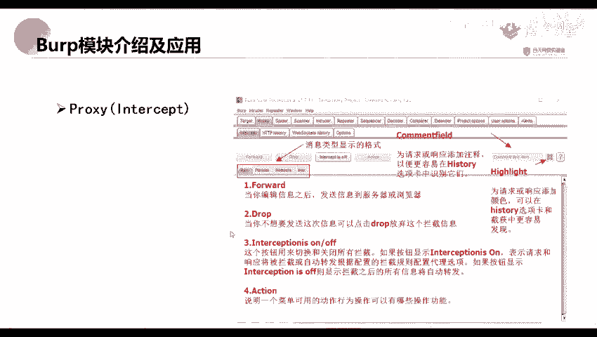
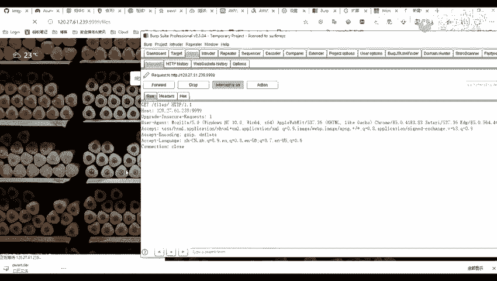
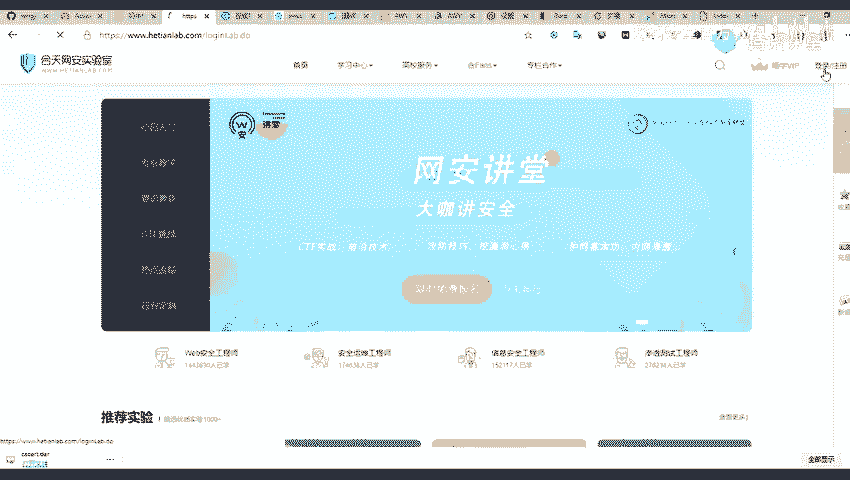
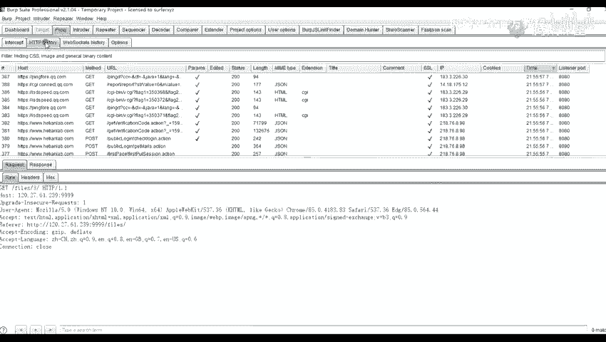
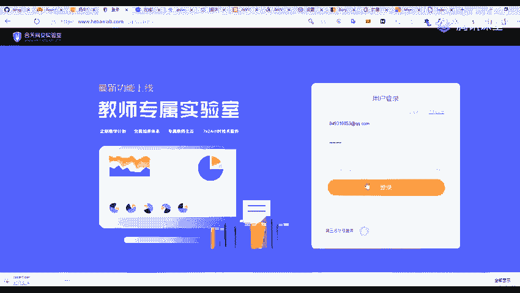
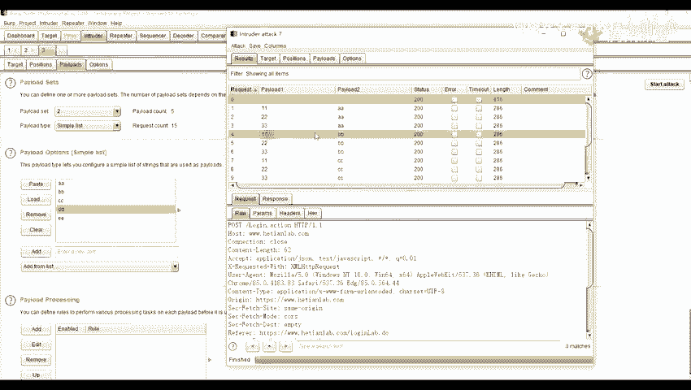
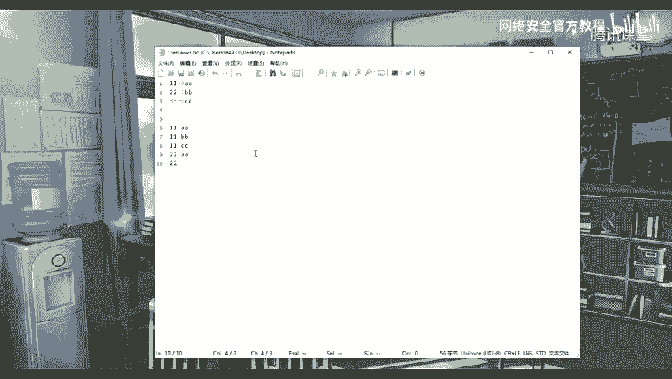
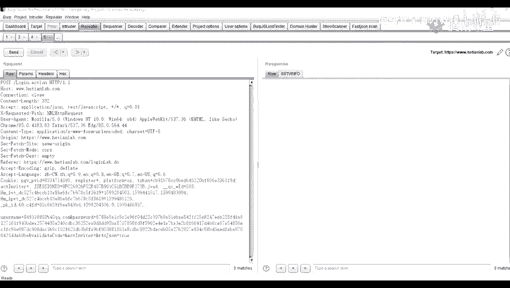

# 网络安全：P40：Burp Suite 模块介绍及应用 🛡️

在本节课中，我们将学习Burp Suite这一核心渗透测试工具的主要模块及其基本应用。我们将重点介绍仪表盘、目标、代理、爆破和重放这五个常用模块，并通过实例演示其基本操作。

## 仪表盘模块 📊

Burp Suite的仪表盘是启动后的主界面，它集成了多个功能区域，用于展示和控制扫描任务。

以下是仪表盘界面的主要组成部分：

*   **Target / Spider (爬虫设置)**：此区域用于配置爬虫。Burp Suite会对流经它的所有网络流量进行自动爬取，以发现目标站点的目录和文件结构。
*   **Live Audit (被动扫描)**：此功能对经过的流量进行被动审计，自动检测潜在的漏洞，而无需主动发送攻击载荷。
*   **Logger (日志界面)**：此面板记录所有活动的日志，包括启动的脚本、代理设置、站点访问失败原因等信息。
*   **Issue Activity (问题活动界面)**：这是漏洞展示界面。被动扫描所发现的所有漏洞都会在此处列出，并提供详细的描述、相关的请求包和响应包，方便分析。

## 目标模块 🎯

目标模块主要用于定义和管理测试范围，它帮助渗透测试人员专注于特定的资产。

以下是目标模块的核心功能：

*   **Site map (站点地图)**：此功能展示通过爬虫获取到的目标站点目录结构，是了解网站整体架构的视图。
*   **Scope (范围)**：此功能用于定义爬虫和扫描的边界。只有被纳入范围的目标，Burp Suite才会进行深入的测试，这有助于避免测试非授权系统。
*   **Issue definitions (问题定义)**：此部分列出了Burp Suite能够识别的所有漏洞类型及其详细描述，是学习和理解各类Web漏洞的参考资料。

上一节我们介绍了用于定义测试范围的目标模块，本节中我们来看看用于拦截和修改网络流量的核心模块。

## 代理模块 🔄

代理模块是Burp Suite最核心的功能之一，它作为浏览器和服务器之间的中间人，可以拦截、查看和修改所有的HTTP/HTTPS请求与响应。

代理模块包含几个关键子功能。以下是其功能介绍：

*   **Intercept (拦截)**：这是拦截功能的开关。当状态为 **`Intercept is on`** 时，Burp会拦截所有经过代理的请求；设置为 **`Intercept is off`** 时，则放行所有流量。
*   **Forward (放行)**：点击此按钮将当前拦截到的数据包发送给服务器。
*   **Drop (丢弃)**：点击此按钮将丢弃当前拦截的数据包，服务器不会收到此请求。
*   **HTTP history (HTTP历史)**：此面板记录所有流经代理的HTTP请求细节，无论拦截是否开启。记录的信息包括：
    *   目标服务器和端口
    *   HTTP方法 (GET/POST等)
    *   请求的URL及参数
    *   响应状态码 (如200, 404)
    *   响应包长度和MIME类型 (如HTML, JSON)
    *   来源IP和时间戳
*   **WebSockets history (WebSockets历史)**：此选项专门用于记录WebSocket通信的数据包。WebSocket是HTML5提供的全双工通信协议，能实现服务器与客户端的高效实时数据交换。

## 爆破模块 💣

爆破模块用于对Web应用程序进行自定义的攻击测试，例如暴力破解登录凭证、遍历标识符等。

该模块的核心是配置攻击方式和载荷。以下是其攻击类型的详解：

*   **Sniper (狙击手模式)**：对**单个或多个**变量**依次**进行破解。例如，标记了用户名和密码两个参数，它会先固定密码，遍历所有用户名；再固定用户名，遍历所有密码。
*   **Battering ram (攻城锤模式)**：对**所有**标记的变量**同时**使用**同一个**字典进行破解。例如，用户名和密码两个参数将始终被替换为字典中的同一行内容。
*   **Pitchfork (叉子模式)**：每个标记的变量**对应一个独立的字典**，攻击时取各字典的**同一行**进行组合尝试。例如，用户名字典A有3行，密码字典B有5行，则只尝试前3行组合（A1+B1, A2+B2, A3+B3）。
*   **Cluster bomb (集束炸弹模式)**：每个标记的变量**对应一个独立的字典**，并尝试所有可能的**排列组合**。例如，用户名字典A有3行，密码字典B有5行，则会尝试 3 x 5 = 15 次攻击。

在载荷设置 (**Payloads**) 中，可以添加自定义的字典列表。使用 **`Add`** 按钮手动添加，或使用 **`Clear`** 按钮清空。**`Payload Options`** 区域用于为每个标记的变量分别配置其对应的字典。

## 重放模块 ↩️

重放模块用于手动修改并重新发送单个HTTP请求，是测试漏洞和分析响应的必备工具。

我们可以从 **`Proxy history`**、**`Site map`** 或 **`Intruder`** 等模块，通过右键菜单的 **`Send to Repeater`** 选项将数据包发送到此模块。

以下是重放模块的主要操作：

*   **修改请求**：在左侧的请求窗口中，可以自由修改任何部分，如参数、请求头等。
*   **发送请求**：点击 **`Send`** 按钮，将修改后的请求发送给服务器。
*   **查看响应**：服务器的响应会显示在右侧的窗口中。
*   **历史记录**：使用 **`<`** 和 **`>`** 按钮可以在本次会话中发送过的不同请求版本之间切换，方便对比测试结果。
其快捷键通常是 **`Ctrl + R`**。

本节课中我们一起学习了Burp Suite的五大核心模块：用于总览的**仪表盘**、用于管理目标的**目标模块**、用于流量拦截的**代理模块**、用于自动化攻击测试的**爆破模块**以及用于手动测试分析的**重放模块**。掌握这些模块是进行Web渗透测试的基础。