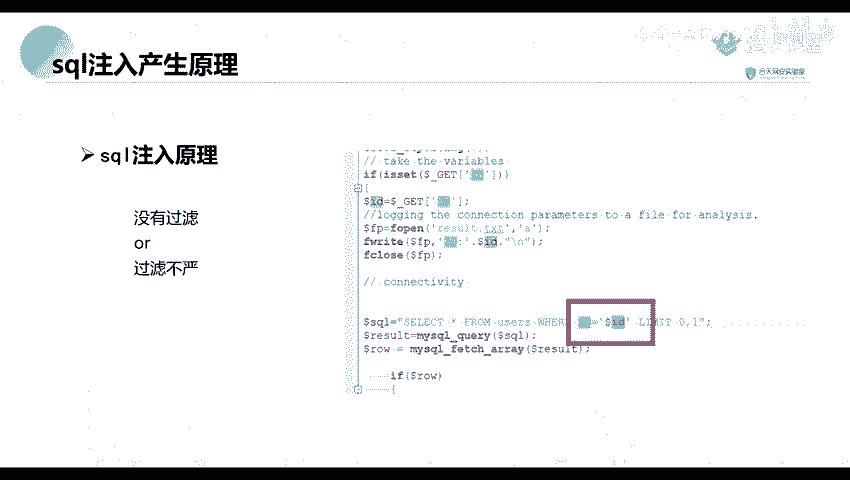
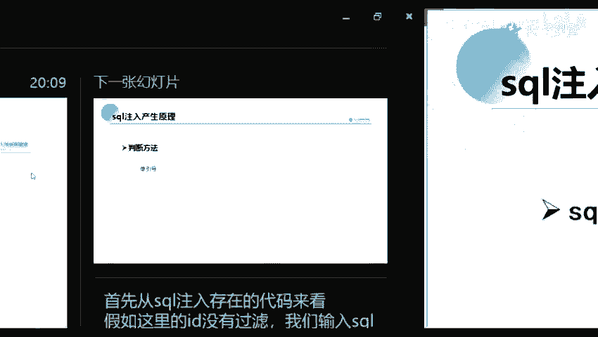
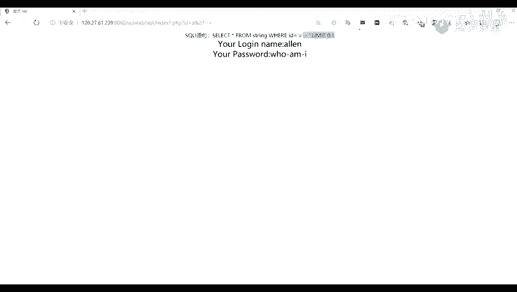

# 网络安全教程：P41：SQL注入产生原理

在本节课中，我们将要学习SQL注入漏洞的产生原理。这是理解后续渗透测试工具使用的基础。

## 第一部分：SQL注入产生原理

上一节我们介绍了课程的整体结构，本节中我们来看看SQL注入漏洞是如何产生的。





SQL注入漏洞自1998年圣诞节首次引起广泛关注以来，一直是一个长期存在且影响深远的安全问题。该漏洞至今仍频繁出现在各类Web应用中。

那么，什么是SQL注入漏洞呢？简单来说，SQL注入是一种攻击方式，攻击者将恶意的SQL查询语句或其他SQL命令，插入到应用程序的用户输入参数中。然后，这些参数会被传递给后台的SQL服务器进行解析和执行。这意味着，攻击者输入的数据可能被数据库服务器当作合法的SQL命令来执行。

为了更清晰地理解，下面我们从代码层面来分析其注入原理。

### 代码层面的原理

SQL注入漏洞的产生，通常是由于程序对用户输入的数据没有进行过滤，或者过滤不严格。攻击者可以利用这一点，构造特殊的SQL语句来执行非授权的数据库操作。

以下是SQL注入原理的代码示例：

```php
$id = $_GET['id'];
$sql = "SELECT * FROM users WHERE id = $id";
```

从上述代码中可以看到，程序通过`GET`方法获取参数`id`，但并未对`id`的值进行任何过滤或验证。因此，攻击者可以输入包含SQL语句的`id`值，例如`1 OR 1=1`，使得最终的SQL语句变为：

```sql
SELECT * FROM users WHERE id = 1 OR 1=1
```

这条语句会返回`users`表中的所有数据，因为`OR 1=1`这个条件永远为真。

### 判断SQL注入漏洞的方法

理解了原理后，我们来看看如何判断一个网站是否存在SQL注入漏洞。最常用的初步判断方法是使用单引号`'`进行测试。

以下是判断步骤：

1.  **正常访问**：首先，正常访问目标页面。例如，访问URL：`http://example.com/page?id=1`，观察返回的页面内容。
2.  **添加单引号**：在参数值后添加一个单引号，例如访问：`http://example.com/page?id=1'`。如果页面返回数据库错误信息，或者页面内容与正常访问时不同，则可能存在SQL注入漏洞。
3.  **验证漏洞**：为了进一步确认，可以尝试“闭合”这个单引号。对于字符型参数，通常的注入点SQL语句类似：`SELECT * FROM users WHERE name = '$input'`。当我们输入`admin'`时，语句变为：
    ```sql
    SELECT * FROM users WHERE name = 'admin''
    ```
    这会导致语法错误（多了一个单引号）。为了使其正常执行，我们可以使用注释符将后面的内容注释掉。在SQL中，可以使用`--`（两个减号加一个空格）或`#`进行注释。
    例如，输入`admin' -- `，SQL语句变为：
    ```sql
    SELECT * FROM users WHERE name = 'admin' -- '
    ```
    `--`之后的内容被注释，语句语法正确，如果页面返回正常，则基本可以确认存在SQL注入漏洞。

**数字型与字符型注入的区别**：
*   **数字型注入**：参数在SQL语句中不被引号包围，如`WHERE id = $input`。测试时直接拼接逻辑语句即可，如`1 OR 1=1`。
*   **字符型注入**：参数在SQL语句中被单引号包围，如`WHERE name = '$input'`。测试时需要先闭合前面的引号，再构造Payload，如`admin' OR '1'='1`。



本节课中我们一起学习了SQL注入漏洞的基本概念、从代码层面理解其产生原理（核心在于**未过滤的用户输入被拼接进SQL语句**），并掌握了使用**单引号**进行漏洞初步判断的方法。理解这些原理是后续学习利用工具进行自动化注入的基础。