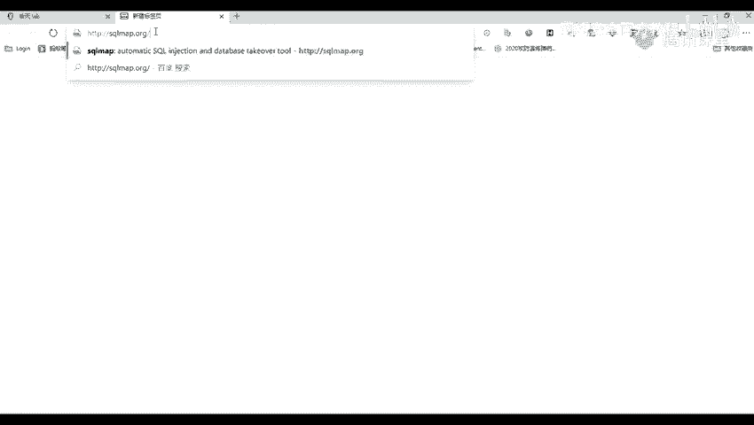
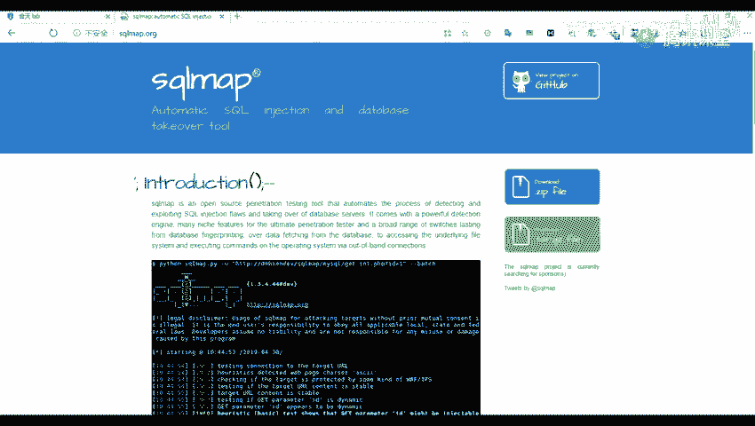
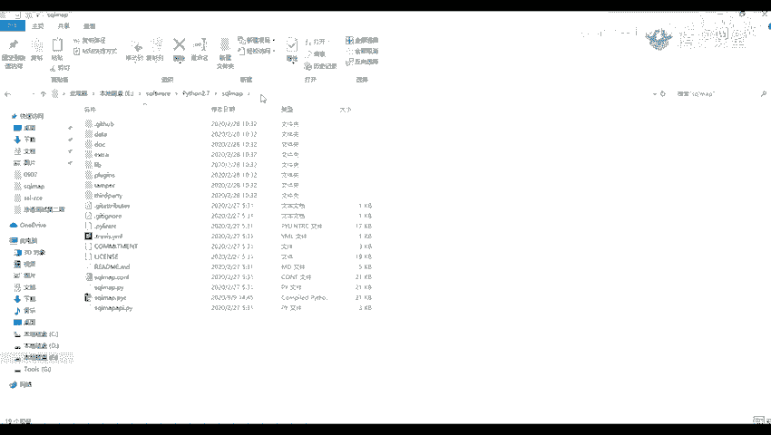
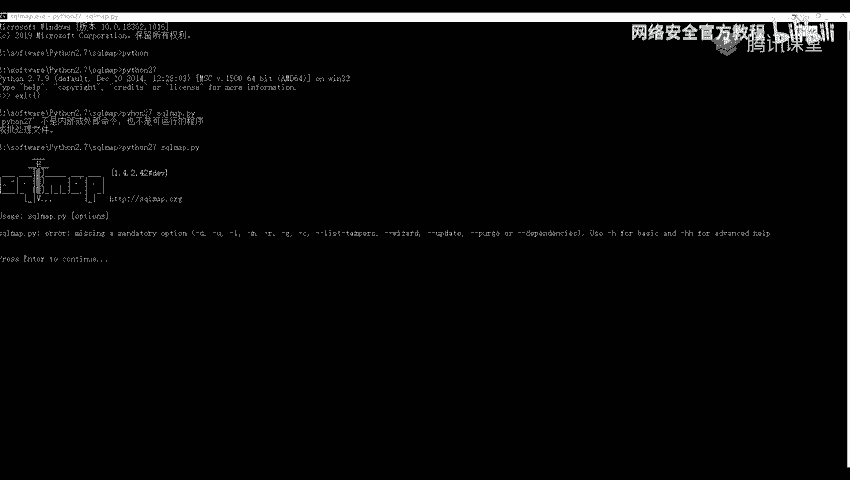
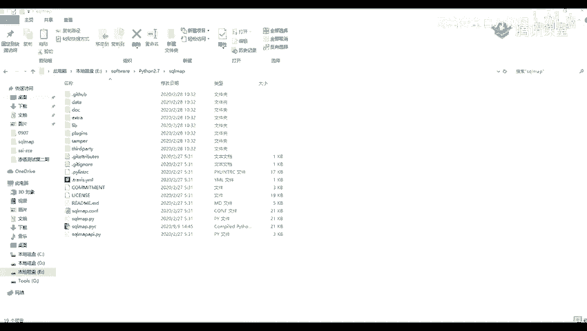
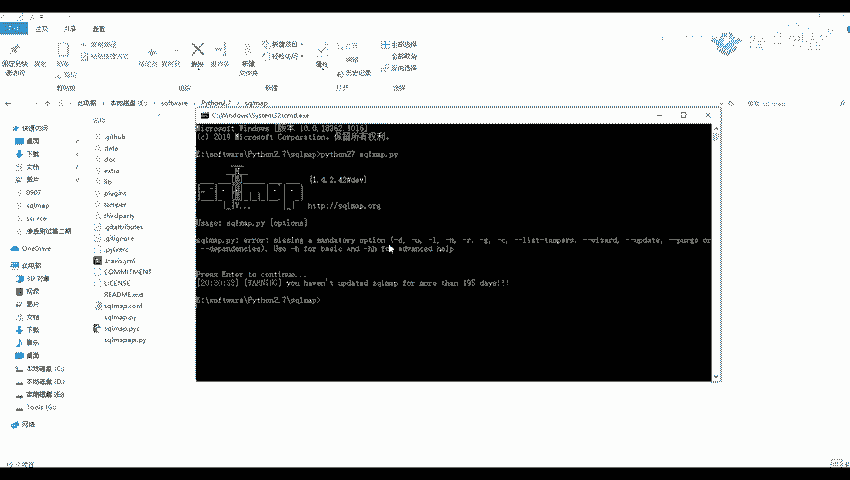
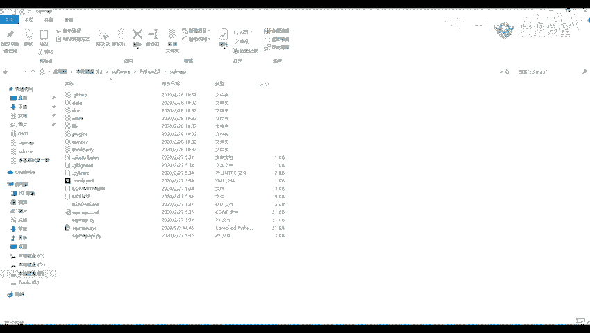

# 网络安全教程：P42：41.sqlmap介绍与安装 🛠️

在本节课中，我们将要学习一个强大的渗透测试工具——sqlmap。我们将了解它的基本概念、功能以及如何在你的计算机上完成安装和基本配置。

## 什么是sqlmap？

上一节我们介绍了SQL注入漏洞，本节中我们来看看如何利用自动化工具来检测和利用这类漏洞。

sqlmap是一个开源的渗透测试工具。它可以用来进行自动化的检测，并利用SQL注入漏洞获取数据库服务器的权限。也就是说，通过我们之前演示的SQL注入漏洞，来获取数据库服务器的权限。



这个工具是使用Python语言编写的。因此，如果要使用它，我们需要先安装一个Python环境。Python3的环境在前面的课程中已经安装过了，这里就不再演示。

## 如何获取sqlmap？

以下是获取sqlmap的两种主要方式：



1.  **官方网站**：这是sqlmap的官方发布网站。我之前在预习内容里也给大家写了这个网址。你们可以下载这个压缩包，然后进行解压就可以使用。并不需要像其他软件那样进行激活。

    

2.  **GitHub仓库**：这是它的官方代码仓库。这里也有一些安装方法、使用方法以及版本运行的说明。

    

我也在我的网盘里给大家放了一个下载链接，你们也可以从我这里下载。下载之后，解压出来是这样的一个文件夹。

## 安装与配置

解压之后，你会看到一个名为`sqlmap`的文件夹。我们可以看到里面带有一个运行脚本，实际上是使用`sqlmap.py`这个文件。但是，如果每次都需要进入到这个文件夹里面来运行，会有点麻烦。那么我们就可以为它创建一个快捷方式。

以下是创建桌面快捷方式的步骤：

1.  在桌面空白处右键，选择“新建” -> “快捷方式”。
2.  在“请键入对象的位置”中，我们需要填入`cmd`的路径，即`C:\Windows\System32\cmd.exe`。
3.  点击“下一步”，你可以随意命名，例如“sqlmap”。
4.  点击“完成”。
5.  右键点击这个新建的快捷方式，选择“属性”。
6.  在“起始位置”一栏，将我们的sqlmap文件夹的路径填写进去。

    

7.  点击“应用”即可。

应用之后，我们可以在桌面双击这个快捷方式使用。双击它，它会直接进入到我们设置的sqlmap路径下。


## 运行sqlmap

接下来，我们来看看如何运行sqlmap。

在打开的CMD窗口中，输入`python`命令来调用Python解释器。请注意，如果你的系统有多个Python版本，可能需要指定版本，例如输入`python2`或`python3`。

例如，输入：
```bash
python sqlmap.py --version
```
或者，如果你的主命令是`python3`：
```bash
python3 sqlmap.py --version
```
运行后，这里会显示sqlmap的版本信息。



关于环境变量，只要你的Python环境变量配置正确就行。我们也可以在sqlmap的目录里，直接打开CMD，然后运行它。




输入命令：
```bash
sqlmap.py
```
或者
```bash
python sqlmap.py
```
即可启动。






## 总结


本节课中我们一起学习了sqlmap的介绍与安装。我们了解到sqlmap是一个用Python编写的、用于自动化检测和利用SQL注入漏洞的工具。我们掌握了从官网或GitHub获取sqlmap的方法，并学会了通过创建桌面快捷方式来方便地运行它，最后成功验证了安装。