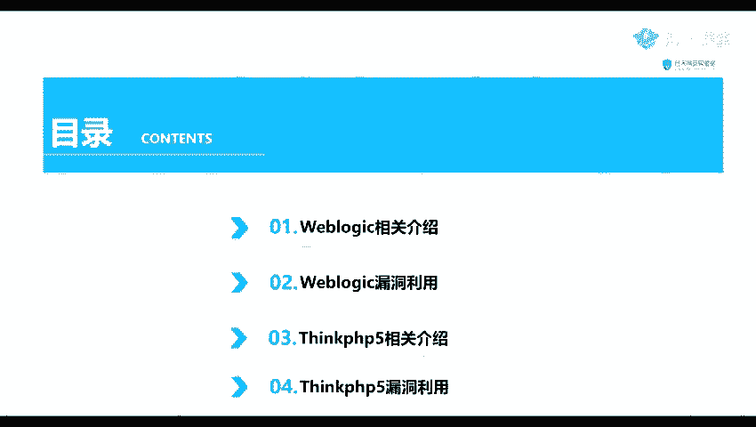
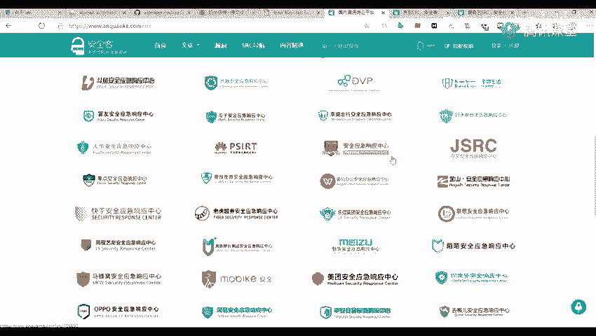
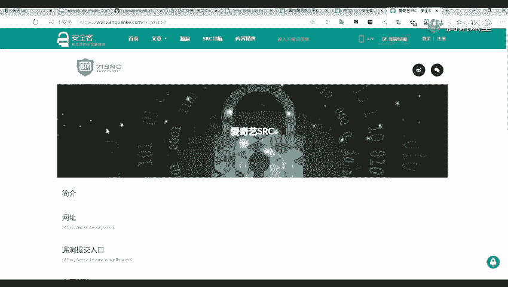
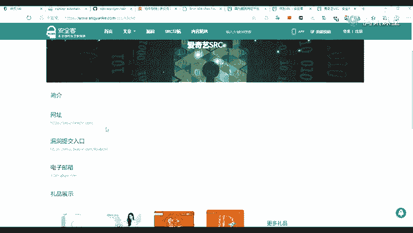
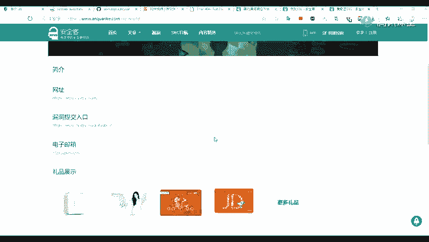
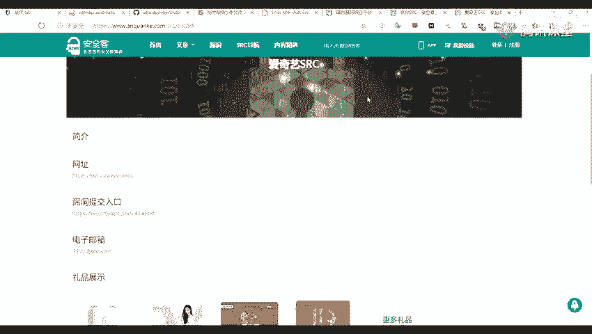
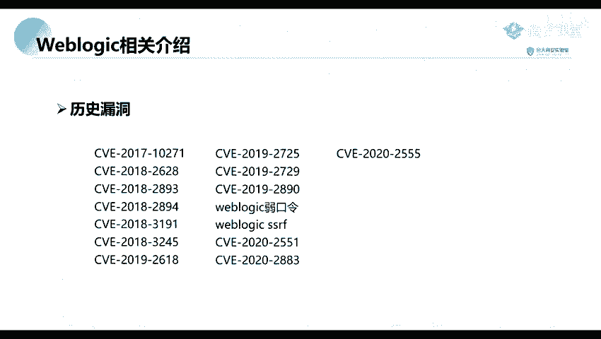

# 网络安全教程：P44：Weblogic相关介绍 🛡️

在本节课中，我们将学习两个在实际攻防对抗中经常遇到的漏洞：Weblogic中间件的相关漏洞以及ThinkPHP框架的漏洞。前面三节课程我们主要介绍了工具的使用，从本节开始，我们将深入探讨具体的漏洞原理与利用方法。课程内容主要分为两个部分，首先介绍Weblogic及其漏洞利用，然后介绍ThinkPHP及其漏洞利用。

## Weblogic是什么？🔍

上一节我们介绍了课程的整体结构，本节中我们来看看第一部分：Weblogic。

Weblogic是美国Oracle公司出品的一款Application Server（应用服务器）。具体来说，它是一个基于Java EE架构的中间件，也可以说是一个Web容器。如果你了解Apache或Tomcat，那么Weblogic的作用与之类似，它是用于将我们开发的Java应用程序运行起来并提供服务的一种程序。

以下是Weblogic的两个主要识别特征：

1.  **端口特征**：Weblogic服务默认开放在其**7001**端口上。在进行端口信息收集时，这个端口是一个重要的识别标志。
2.  **Web界面特征**：访问其7001端口，若服务存在，通常会返回一个特定的404错误页面。这个页面的样式是识别Weblogic的另一个关键点。在实际渗透测试或漏洞挖掘（例如在各大公司的SRC平台进行测试）时，看到这种特征的页面，通常可以判断目标使用了Weblogic中间件。

## 为什么学习Weblogic？🎯

我们之所以要重点学习Weblogic，主要有以下两个原因：

1.  **应用广泛**：Weblogic在企业内网中应用非常广泛，许多公司，特别是大型企业，都在使用它。
2.  **漏洞众多**：Weblogic拥有非常多的历史漏洞，例如CVE-2017-10271、CVE-2019-2890等，以及各种绕过漏洞和近年新爆出的漏洞。这些漏洞在实际渗透中具有很高的利用价值。

本节课中我们一起学习了Weblogic的基本概念、识别特征以及学习它的重要性。在接下来的课程中，我们将深入探讨其具体漏洞的利用方法。