# 网络安全教程：P45：Weblogic漏洞利用

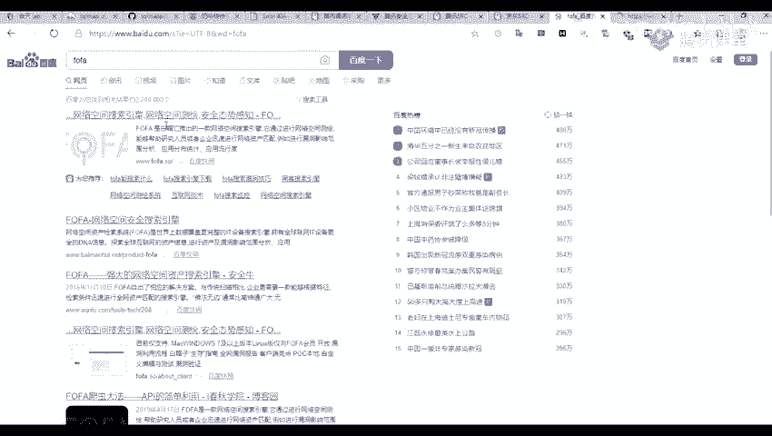

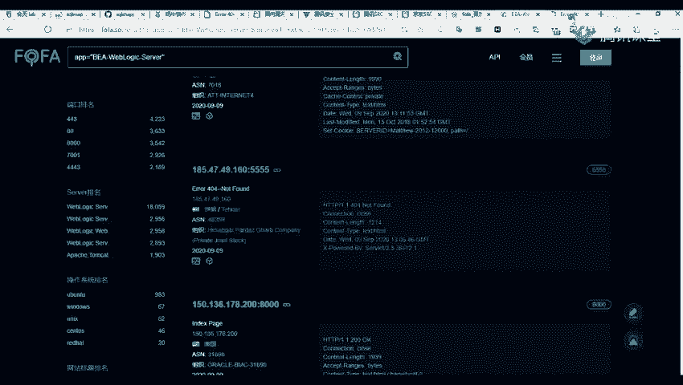

## 概述
在本节课中，我们将学习如何发现和利用Weblogic中间件的安全漏洞。课程内容涵盖资产发现、漏洞扫描以及具体的漏洞利用方法。

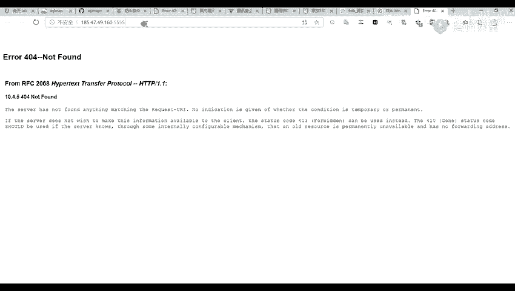

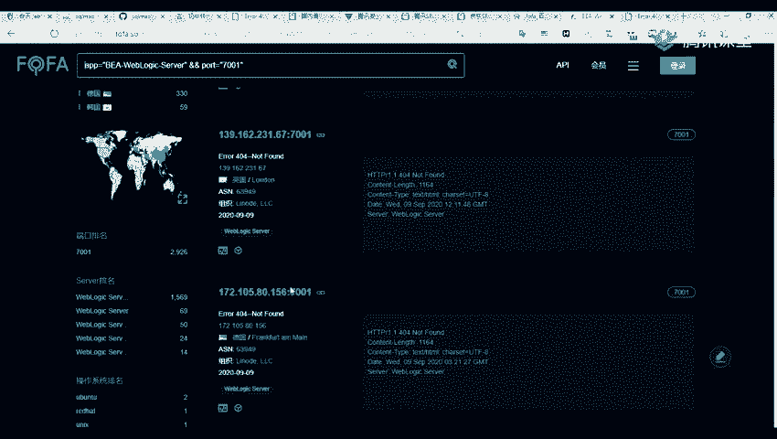

## 资产发现
上一节我们介绍了Weblogic的基本概念，本节中我们来看看如何寻找安装了Weblogic中间件的目标资产。


以下是几种常见的资产发现方法：

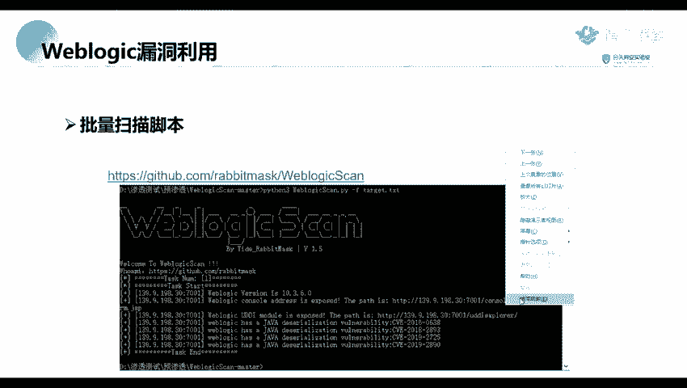


1.  **使用网络空间搜索引擎**：例如ZoomEye（钟馗之眼）、Shodan、Fofa（佛法等）。建议关注一些相对小众的漏洞，因为大众化漏洞的竞争通常更激烈。
2.  **使用扫描工具**：可以将收集到的子域名导入到AWVS等漏洞扫描工具中进行深度扫描。需要注意扫描强度，避免对目标网站造成过大影响。
3.  **利用搜索引擎语法（谷歌黑客）**：通过特定的搜索语法来定位目标。
    *   **`inurl`语法**：用于搜索URL中包含特定路径的网站。例如，如果漏洞常出现在 `/example/vulnpath` 路径下，可以使用 `inurl:/example/vulnpath` 进行搜索。
    *   **`intitle`语法**：用于搜索网页标题中包含特定关键词的网站。例如，`intitle:WebLogic` 可以找到标题中含有“WebLogic”的页面。

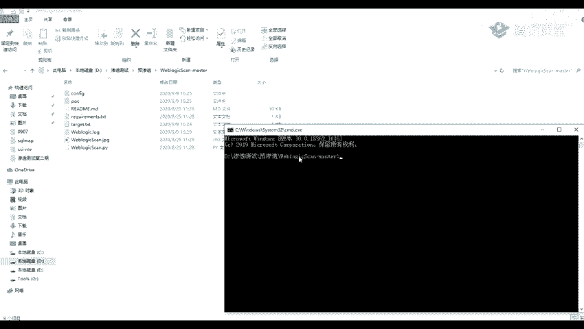


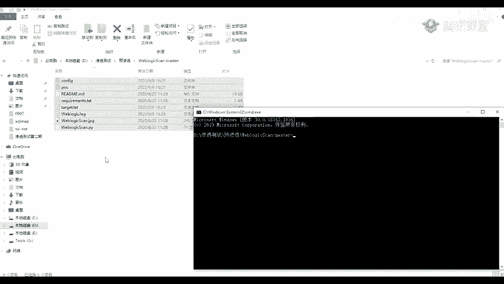


## 漏洞扫描与利用
在发现潜在目标后，下一步是验证其是否存在已知漏洞。

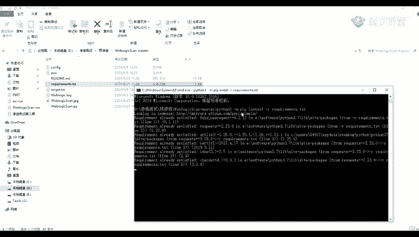

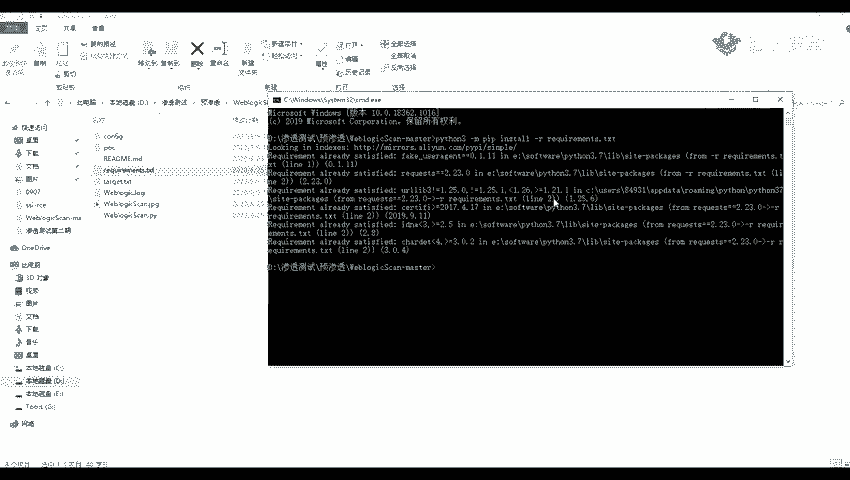


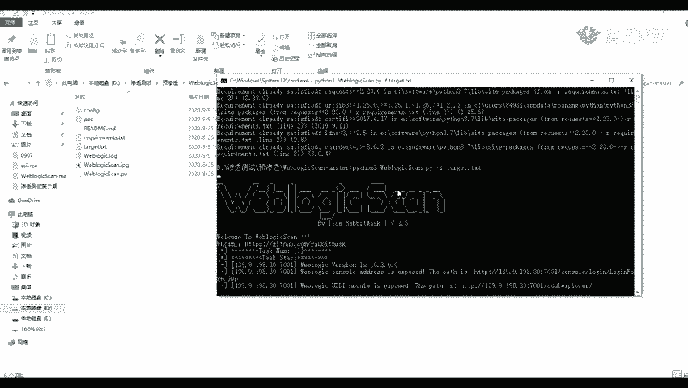

我们将使用一个集成了多个漏洞验证脚本（POC）的工具进行批量扫描。POC是用于检测特定漏洞是否存在的脚本。

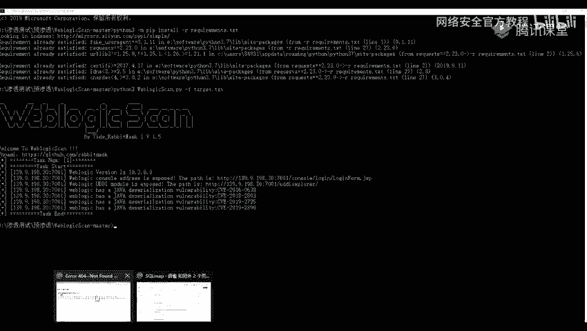

以下是使用该扫描脚本的步骤：


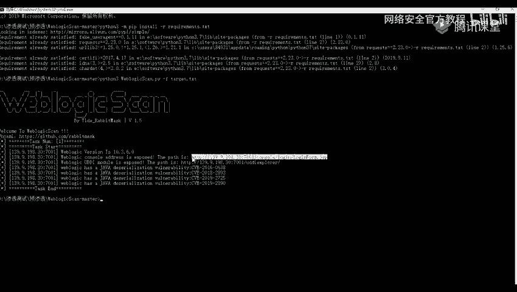

1.  **环境准备**：脚本通常依赖一些Python模块。需要先安装这些依赖。可以使用以下命令安装：
    ```bash
    python3 -m pip install -r requirements.txt
    ```
    其中 `requirements.txt` 文件列出了所有必需的模块。

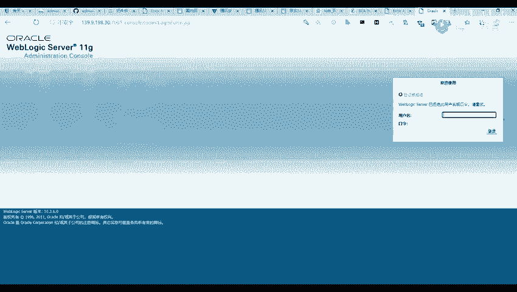

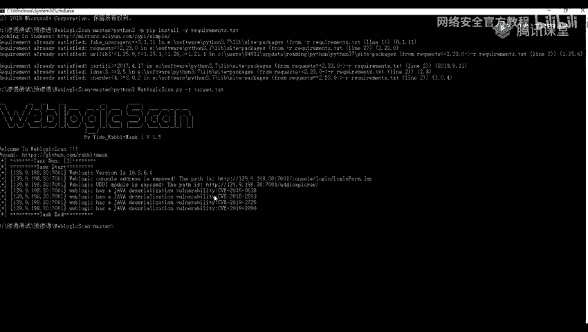

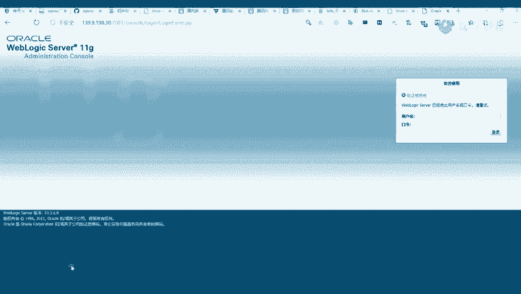

2.  **执行扫描**：运行脚本并指定目标URL进行扫描。基本命令格式如下：
    ```bash
    python3 weblogic_scanner.py -u http://target_ip:port
    ```
    扫描完成后，工具会列出目标可能存在的漏洞编号（如CVE-2019-2725）。

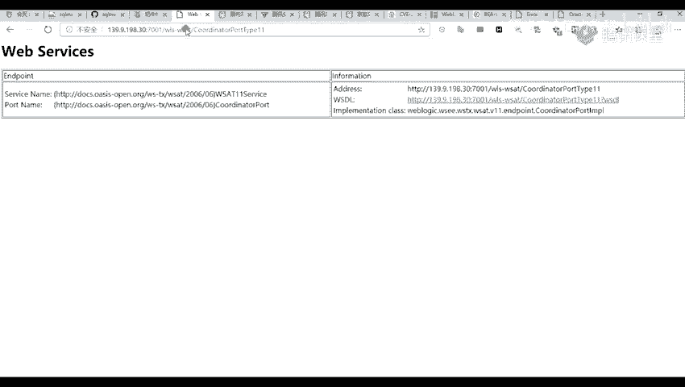

3.  **漏洞利用**：当扫描出漏洞后，需要寻找对应的利用方法（EXP）。
    *   可以通过搜索引擎（如百度、谷歌）搜索漏洞编号（如 `CVE-2019-2725 利用`），查找相关的技术文章和利用脚本。
    *   找到利用脚本（EXP）后，通常需要向特定的漏洞路径发送构造好的恶意数据包（Payload）来执行命令。

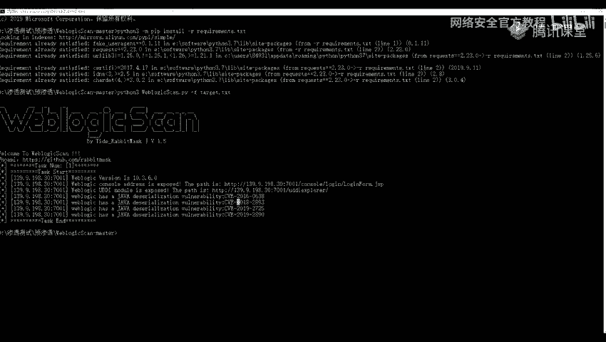

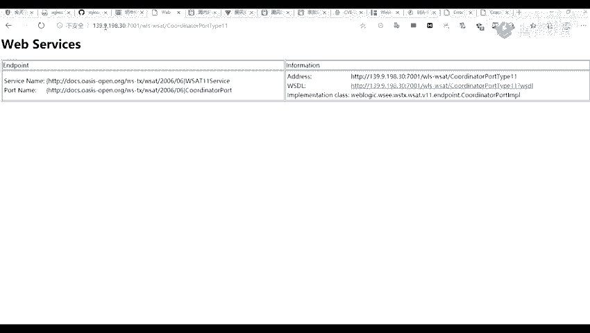

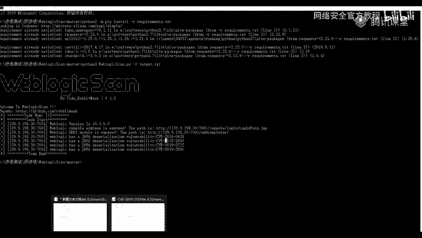

**漏洞利用示例**：
假设发现 `CVE-2019-2725` 漏洞，其利用过程可能如下：
1.  使用抓包工具（如Burp Suite）拦截向漏洞路径发送的请求。
2.  将找到的EXP生成的有效载荷（Payload）替换到原始请求的数据体中。
3.  将修改后的请求发送给目标服务器，即可在目标服务器上执行命令，例如查看系统文件 `cat /etc/passwd` 或查看网络配置 `ifconfig`。


## 总结
本节课中我们一起学习了Weblogic漏洞的完整利用流程。首先，我们掌握了通过网络空间搜索引擎、扫描工具和搜索引擎语法来发现Weblogic资产的方法。接着，我们学习了如何使用集成的POC脚本对目标进行漏洞扫描。最后，我们了解了在发现漏洞后，如何通过搜索利用脚本并构造恶意请求来实现命令执行。整个过程强调了信息收集、工具使用和漏洞利用的实践结合。