网络安全教程：P46：45.ThinkPHP5相关介绍

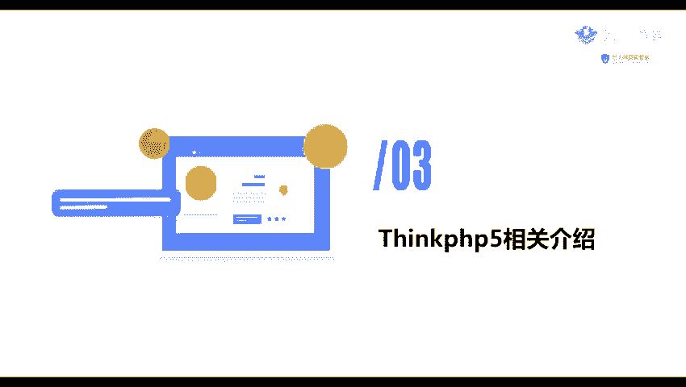

在本节课中，我们将要学习ThinkPHP5框架的基础知识，包括其定义、特征、识别方法以及它在实际应用中的重要性。

ThinkPHP是一个快速、兼容、轻量级且精炼的国产PHP开发框架。

上一节我们介绍了其他PHP框架，本节中我们来看看ThinkPHP5。

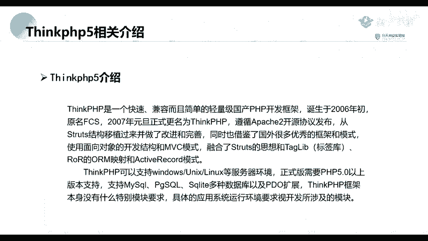

### ThinkPHP5的特征

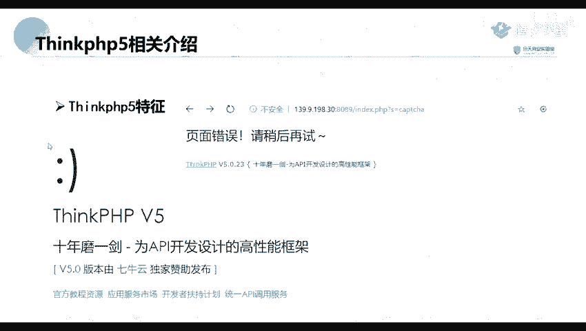

以下是ThinkPHP5框架的一些核心特征：

*   **快速开发**：提供了丰富的库和工具，简化开发流程。
*   **兼容性强**：支持多种运行环境和数据库。
*   **轻量级**：核心设计简洁，性能开销小。
*   **精炼的代码结构**：遵循MVC模式，代码组织清晰。

### 如何识别ThinkPHP5网站

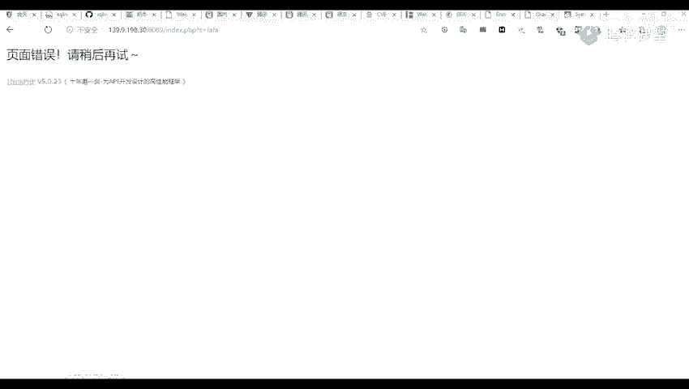

我们可以通过多种方式识别一个网站是否使用了ThinkPHP5框架。

以下是几种常见的识别方法：

1.  **页面特征**：访问网站时，其默认页面或特定页面可能包含ThinkPHP的标识或特征。
    

2.  **错误信息**：当访问不存在的页面或触发错误时，ThinkPHP会返回特定的错误页面，其中通常包含框架信息。
    

### ThinkPHP5的应用与影响

ThinkPHP5不仅是一个独立的框架，还是许多内容管理系统（CMS）的底层基础。

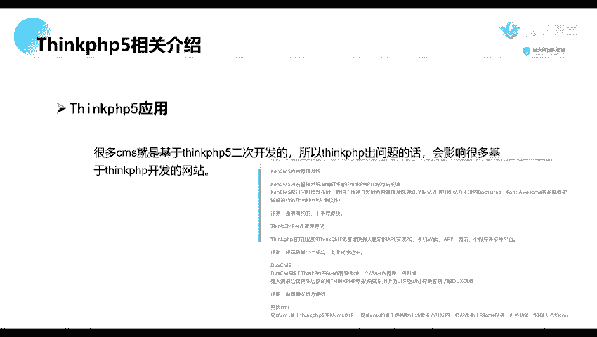

以下是基于ThinkPHP5二次开发的一些知名CMS：

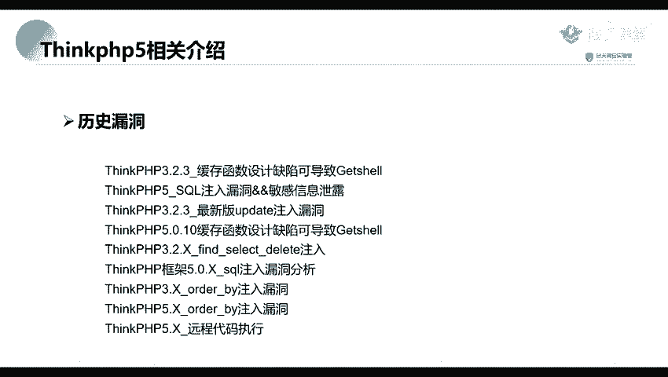

*   **KENCMS**：一个内容管理系统。
*   **Z-Blog**：一个博客系统。
*   **BU叉CMS/EUCMS**：其他类型的内容管理系统。

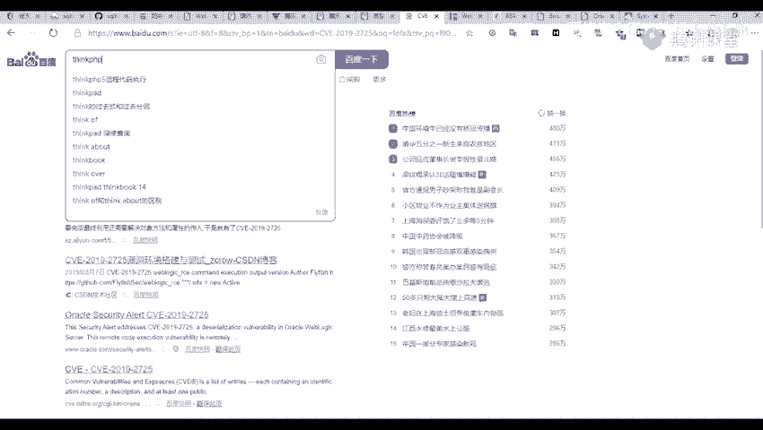

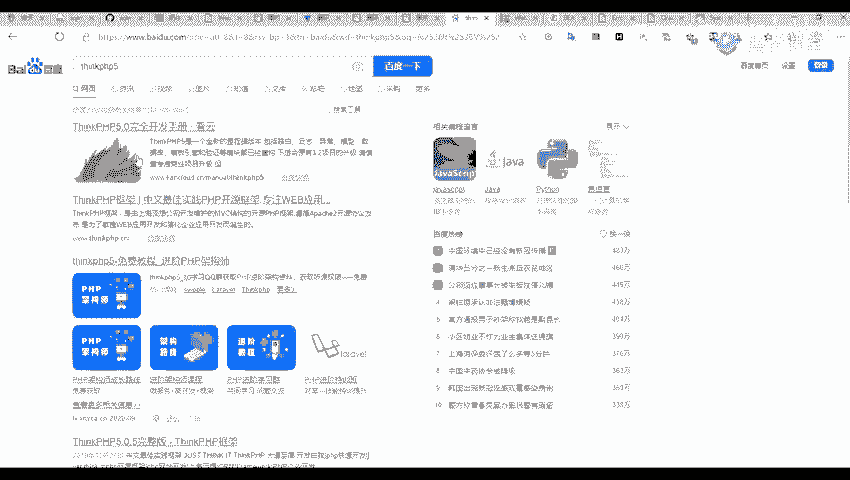

由于这些CMS都基于ThinkPHP5，因此当ThinkPHP5框架本身被发现存在安全漏洞时，所有基于它开发的CMS都可能受到影响。这类似于一个主应用出现问题，会波及到其上的所有子应用。

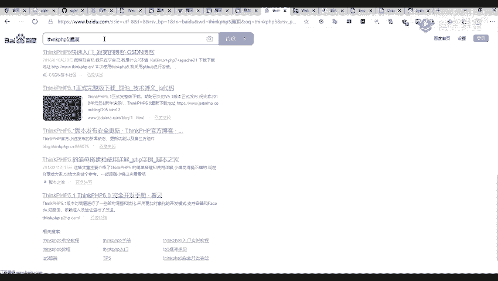

### ThinkPHP5的安全漏洞

与之前介绍的框架类似，ThinkPHP5在历史上也存在过多个安全漏洞。

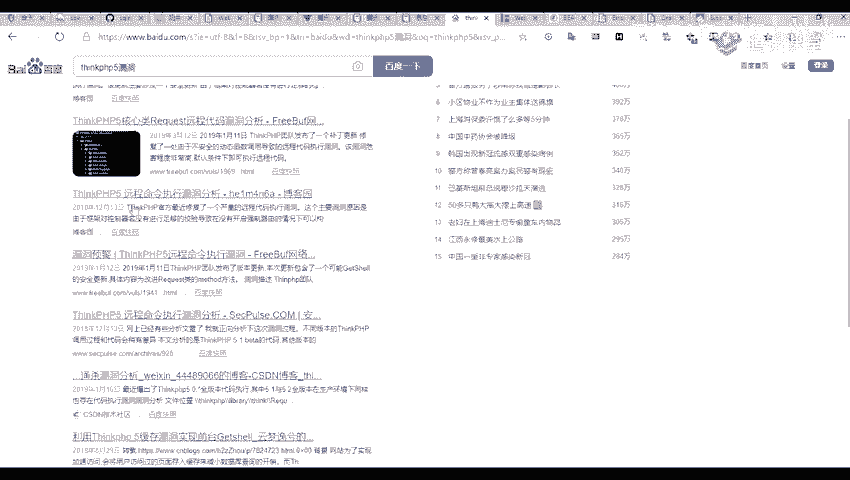

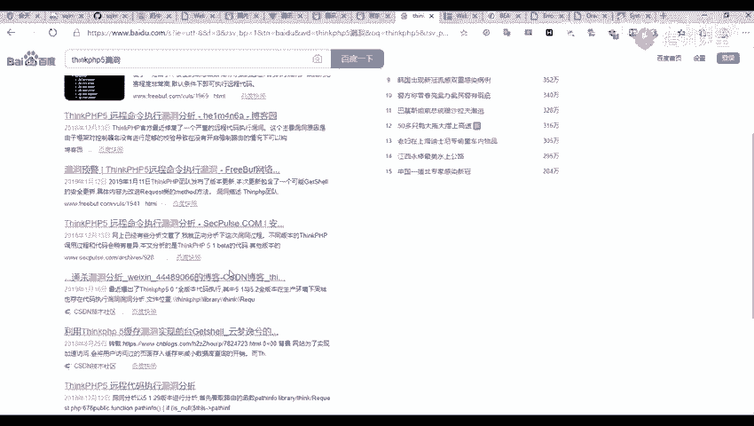

其中一个著名的例子是ThinkPHP5.x版本的远程代码执行漏洞。该漏洞允许攻击者在目标服务器上执行任意代码，危害极大。在互联网上可以搜索到大量关于此漏洞的分析和利用文章。

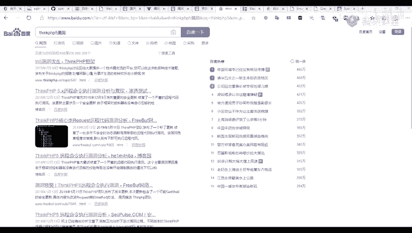

本节课中我们一起学习了ThinkPHP5框架的基本概念、识别方法、其广泛的应用生态以及历史上出现过的安全漏洞案例。理解这些是进行Web安全测试和渗透测试的基础。