# 网络安全教程：P47：ThinkPHP5漏洞利用 🛡️

在本节课中，我们将学习ThinkPHP5框架中两个特定版本的远程代码执行漏洞的成因、发现方法以及利用过程。课程内容将分为两个主要部分，分别对应ThinkPHP 5.0.23及以前版本和5.0.2版本。

## 概述

ThinkPHP是一款流行的PHP开发框架。本节课将分析其历史版本中的两个安全漏洞：一个存在于5.0.23及以前版本，另一个存在于5.0.2版本。我们将了解漏洞原理，并演示如何手动及使用工具进行漏洞检测与利用。

## ThinkPHP 5.0.23及以前版本漏洞

上一节我们概述了课程内容，本节中我们来看看第一个漏洞的具体情况。

该漏洞存在于5.0.23及以前版本中。由于框架在获取方法名时未进行正确处理，导致攻击者可以调用Request类的任意方法并构造利用链，最终造成远程代码执行漏洞。

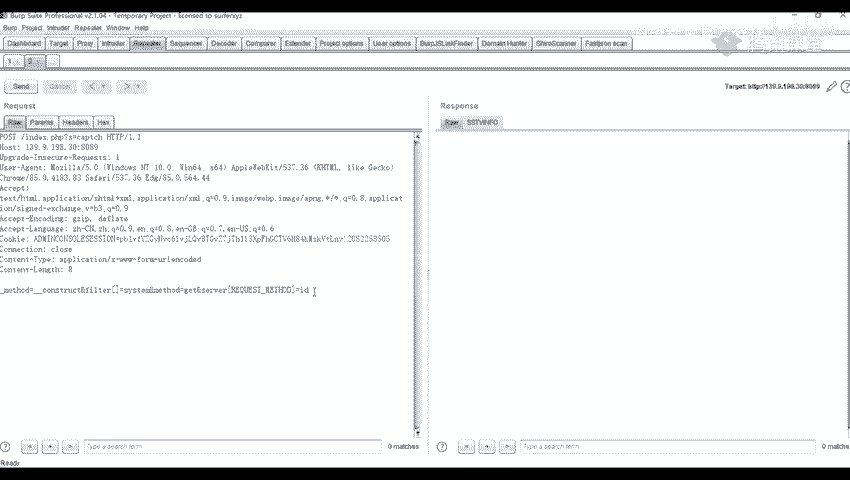

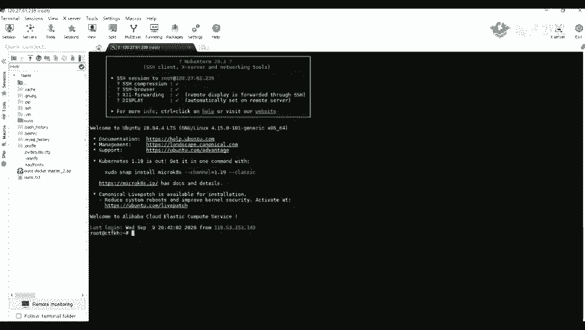

### 漏洞发现与手动利用

要判断目标网站是否存在此类漏洞，我们可以进行手动测试。以下是手动测试与利用的步骤。

首先，访问存在漏洞的站点，并在URL的`index.php`路径后附加特定参数`s`，其值为要执行的系统命令。例如，访问以下URL会尝试执行`cat /etc/passwd`命令：
```
http://target.com/index.php?s=index/think\app/invokefunction&function=call_user_func_array&vars[0]=system&vars[1][]=cat /etc/passwd
```

为了更灵活地发送攻击载荷，我们通常将GET请求改为POST请求，并使用抓包工具（如Burp Suite）进行操作。

以下是利用步骤：
1.  使用浏览器或工具访问上述构造的URL，并用抓包工具截获该HTTP请求。
2.  在抓包工具中，将截获的GET请求右键更改为POST请求。
3.  在POST请求体中，需要填入特定的参数来执行命令。原始的利用POC格式如下：
    ```
    _method=__construct&filter[]=system&method=get&server[REQUEST_METHOD]=id
    ```
    这段代码会尝试执行系统命令`id`。
4.  发送修改后的POST请求。如果漏洞存在，响应中会返回命令执行的结果，例如当前Web服务运行的用户信息（如`www-data`）。
5.  我们可以将命令替换为其他系统指令进行测试，例如`ifconfig`来查看网络配置。

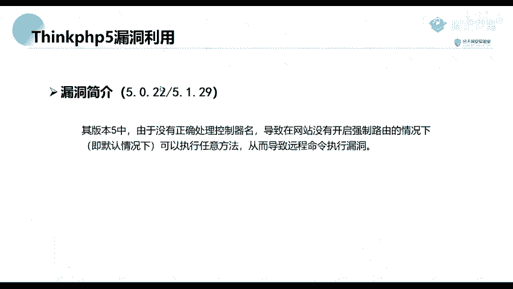

## ThinkPHP 5.0.2版本漏洞

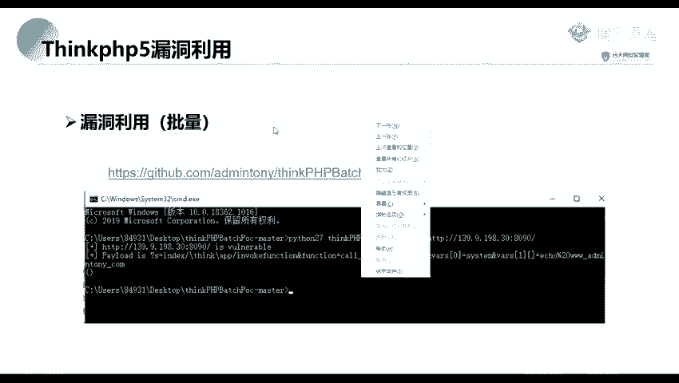

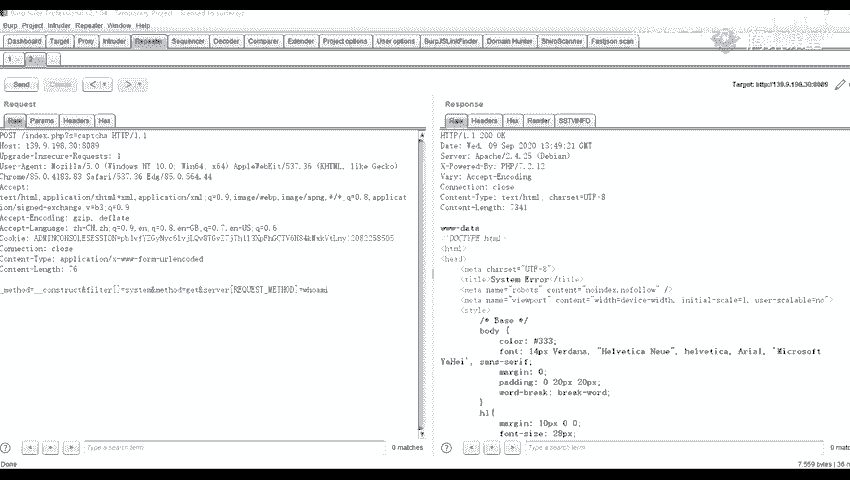

了解了5.0.23版本的漏洞后，我们接着分析5.0.2版本的漏洞。

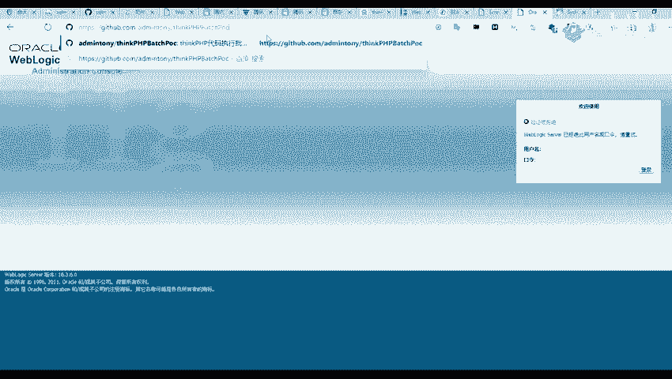

该漏洞的成因是框架未正确控制器名，在网站未开启强制路由的情况下（默认情况），攻击者可以调用任意方法，从而导致远程命令执行漏洞。

由于该漏洞的利用载荷存在多种变化形式，手动测试效率较低，因此我们通常使用自动化脚本进行批量检测。

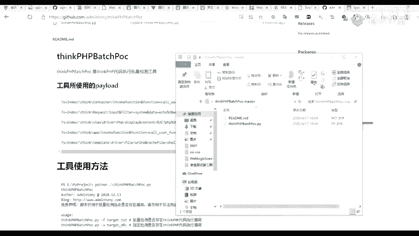

### 使用脚本进行自动化检测

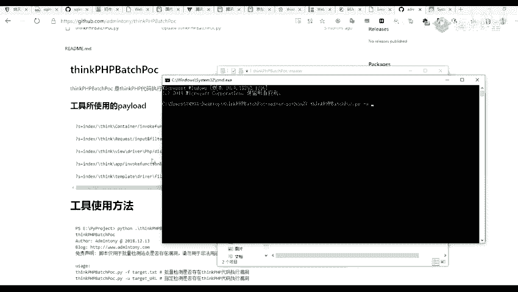

以下是使用Python脚本检测ThinkPHP 5.0.2版本漏洞的方法。

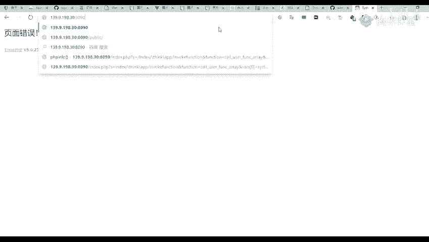

该脚本内置了多种针对不同版本ThinkPHP的测试载荷，可以高效地检测目标是否存在漏洞。

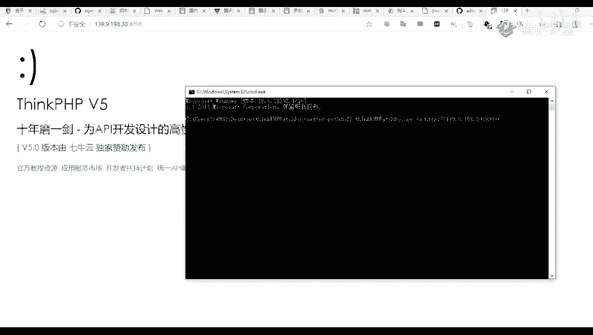

在命令行中，使用以下格式运行脚本：
```bash
python thinkphp_check.py -u http://target.com:port
```
其中，`http://target.com:port`需要替换为实际的目标地址和端口。

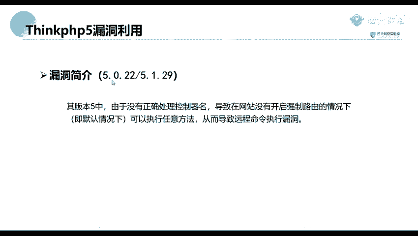

脚本运行后，如果发现漏洞，会输出可用的攻击载荷。例如，它可能会返回一个用于执行`echo test`的URL，证明命令执行成功。攻击者可以据此修改载荷，执行其他命令，例如`phpinfo()`来获取服务器信息。

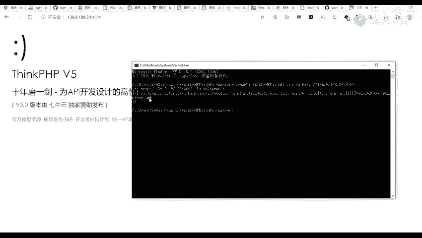

网络上存在许多公开的漏洞利用脚本和载荷集合，安全研究人员可以根据需要搜索和使用这些资源进行测试。

## 总结

本节课我们一起学习了ThinkPHP5框架两个历史版本的远程代码执行漏洞。
*   第一部分分析了5.0.23版本的漏洞，其根源在于方法名处理不当，我们演示了如何通过修改HTTP请求方法手动利用该漏洞。
*   第二部分分析了5.0.2版本的漏洞，其根源在于控制器名验证缺陷，我们介绍了使用自动化脚本进行高效检测的方法。

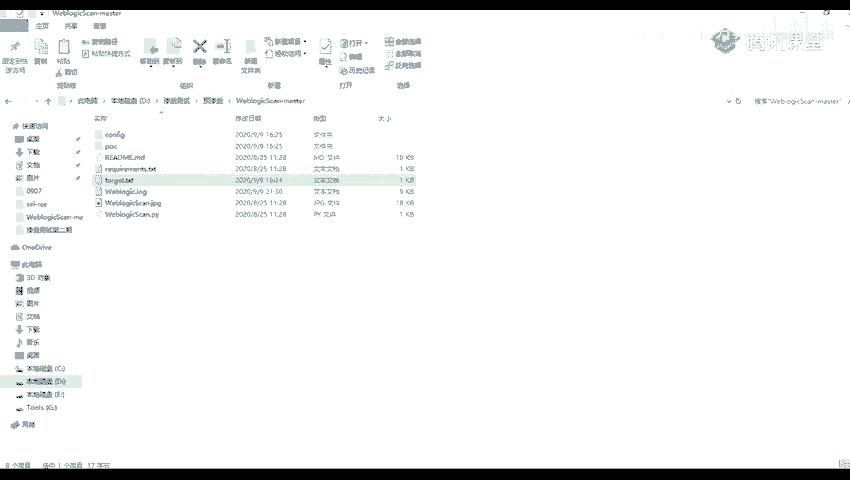

理解这些漏洞的原理和利用方式，有助于我们在渗透测试中识别相关风险，同时也提醒开发人员及时升级框架版本，修复安全漏洞。