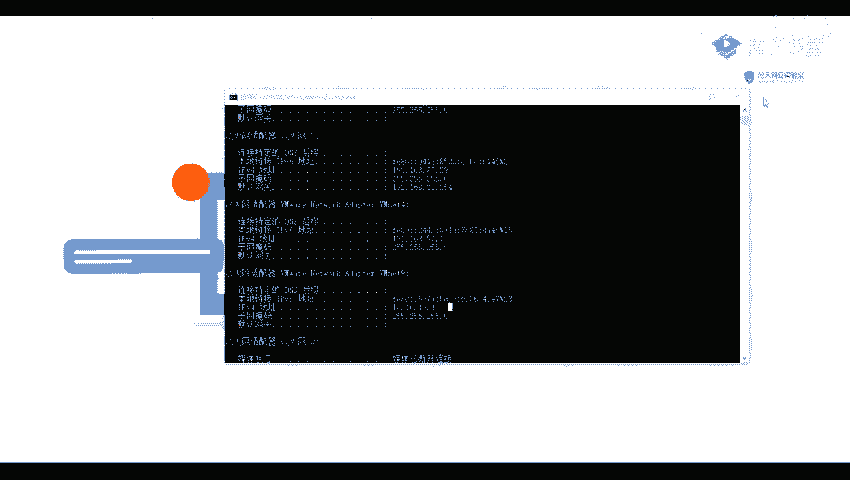
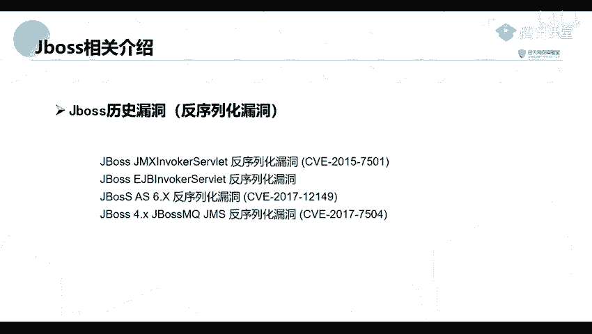

网络安全教程：P51：50. Jboss识别与漏洞利用

在本节课中，我们将要学习Jboss应用服务器的基本概念、识别方法以及历史上出现过的关键安全漏洞。通过学习，你将能够理解Jboss在网络安全评估中的潜在风险点。

## 什么是Jboss？🤔

上一节我们介绍了课程的整体背景，本节中我们来看看Jboss是什么。

Jboss是一个基于J2EE的开放源代码应用服务器。它的核心功能是作为管理EJB（Enterprise JavaBeans）的容器和服务器。

但是，Jboss的核心服务本身并不包含支持Servlet/JSP的Web容器。因此，它通常需要与一个外部的Web容器（例如Tomcat或Jetty）绑定使用。

## Jboss的历史安全漏洞🔓

了解了Jboss的基本定义后，我们来看看它在历史上出现过的各类安全漏洞。这些漏洞主要分为权限控制不严和反序列化两大类。

以下是历史上出现过的Jboss关键漏洞列表：

*   **权限控制不严导致的漏洞**：
    *   JMX控制台未授权访问漏洞。
    *   管理控制台安全验证绕过漏洞。
*   **弱口令或默认口令漏洞**：
    *   管理员或开发人员为网站设置了弱口令，攻击者可通过弱口令进入管理后台从而获取控制权。
*   **反序列化漏洞**：
    *   例如2017年出现的Jboss AS 6.X反序列化漏洞，其CVE编号为CVE-2017-12149。
    *   另一个同年的反序列化漏洞，CVE编号为CVE-2017-7504。

本节课中我们一起学习了Jboss应用服务器的定义、其典型架构特点，并梳理了它历史上存在的主要安全漏洞类型，包括权限控制、弱口令和反序列化漏洞。理解这些是进行Jboss安全测试的基础。