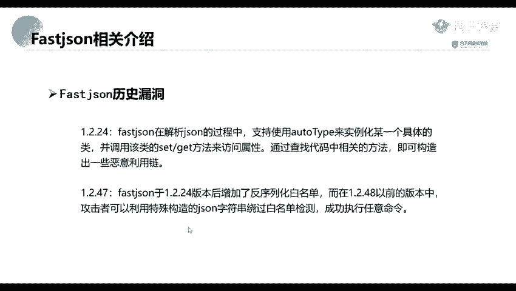
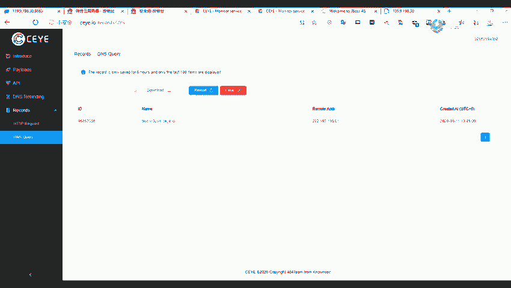

# 网络安全教程：P52：Fastjson相关介绍

在本节课中，我们将要学习Fastjson的基本概念、其漏洞产生的背景以及几个关键漏洞版本的核心原理。Fastjson是近年来网络安全领域一个备受关注的话题，理解其工作机制和潜在风险对于学习Web安全至关重要。

## Fastjson是什么？

上一节我们介绍了本节课的主题，本节中我们来看看Fastjson究竟是什么。

Fastjson是阿里巴巴公司开源的一款JSON解析器。它能够高效地将Java对象序列化为JSON字符串，也能将JSON字符串反序列化为Java对象。

## Fastjson漏洞背景

了解了Fastjson的基本定义后，我们来看看它为何会成为安全领域的焦点。

Fastjson的漏洞在最近几年比较流行。最早的漏洞可以追溯到2017年。其中，最为人熟知的两个漏洞版本是**1.2.24**和**1.2.47**。

以下是漏洞产生的核心原因：

1.  **根本原因**：Fastjson在解析JSON字符串的过程中，支持使用`@type`字段来指定反序列化时实例化的具体Java类，并会调用该类的setter或getter方法来访问属性。攻击者可以通过精心构造恶意类，利用这一机制执行任意代码。

2.  **1.2.24版本**：在该版本及之前，Fastjson没有对反序列化的类进行任何限制。

3.  **1.2.24之后**：从1.2.24版本开始，Fastjson增加了反序列化的白名单机制以增强安全性。

4.  **1.2.47版本**：在1.2.48版本之前（不包括1.2.48），攻击者可以利用特殊构造的JSON字符串绕过白名单检测，从而成功执行任意命令。

本节课中我们一起学习了Fastjson的定义、其在安全领域的重要性以及几个关键漏洞版本（如1.2.24和1.2.47）的基本原理。下一节课，我们将深入探讨这些漏洞的具体利用方式。