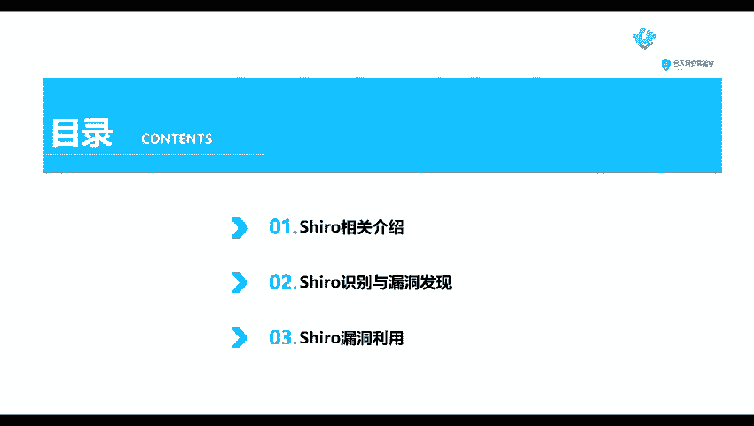
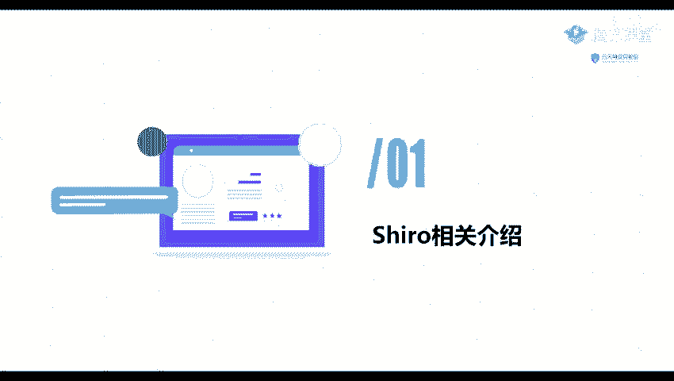
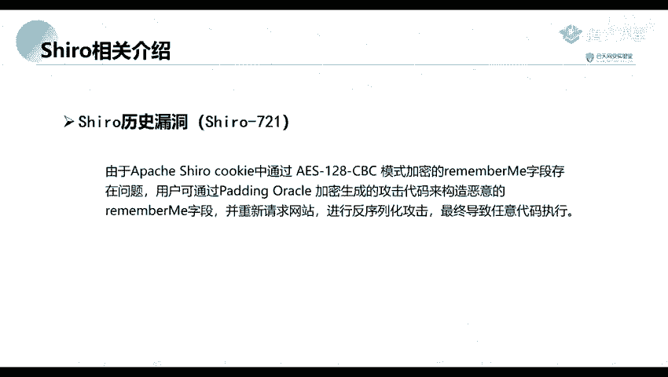

# 网络安全教程：P54：Shiro相关介绍

在本节课中，我们将学习Apache Shiro安全框架的基础知识、识别方法以及其历史上著名的安全漏洞。Shiro是一个在Java Web应用中广泛使用的安全组件，了解其原理与漏洞对网络安全学习至关重要。

## 第一部分：什么是Shiro？🔍

上一节我们概述了课程内容，本节中我们来看看Shiro究竟是什么。

Apache Shiro是一个强大且易用的Java安全框架。它提供了身份**验证**、**授权**、**加密**和**会话管理**等功能。该框架设计直观，易于集成到应用程序中，同时能提供健壮的安全性。

## 第二部分：如何识别Shiro？🕵️



了解了Shiro的基本定义后，接下来我们需要掌握如何发现一个网站或服务器是否使用了Shiro组件。



识别Shiro的主要方法是检查其HTTP响应特征。以下是常见的识别特征：

*   **Cookie特征**：查看HTTP响应头中的`Set-Cookie`字段，若存在`rememberMe=deleteMe`，则很可能使用了Shiro。
*   **URL路径特征**：部分Shiro应用在未授权访问时会重定向到特定的登录页面，如 `/login.jsp`。
*   **错误页面特征**：在某些错误情况下，页面可能包含 `shiro` 或 `org.apache.shiro` 等关键字。

## 第三部分：Shiro历史漏洞分析💥

识别出Shiro组件后，我们需要判断其是否存在已知漏洞。本节我们将回顾Shiro历史上两个影响广泛的核心漏洞。

### 1. Shiro-550 反序列化漏洞

此漏洞源于Shiro提供的“记住我”（Remember Me）功能。当用户登录时选择此功能，服务端会生成一个加密并编码的Cookie值。

攻击原理在于，服务端对`rememberMe`的Cookie值处理流程存在缺陷。其流程为：先进行Base64解码，然后使用AES解密，最后进行**反序列化**。由于早期版本使用了硬编码的AES加密密钥，攻击者可以构造恶意的序列化数据，加密后替换Cookie，从而触发**反序列化漏洞**，执行任意代码。

核心流程可用伪代码表示：
```java
cookie = request.getCookie(“rememberMe”);
decoded = Base64.decode(cookie);
decrypted = AES.decrypt(decoded, hardcoded_key);
deserialized = ObjectInputStream(decrypted); // 漏洞触发点
```

### 2. Shiro-721  Padding Oracle攻击漏洞

此漏洞是2019年披露的另一个高危漏洞。它同样发生在`rememberMe` Cookie的处理过程中。

与Shiro-550使用硬编码密钥不同，Shiro-721的漏洞成因在于其使用的**AES-128-CBC**加密模式存在问题。攻击者可以利用**Padding Oracle攻击**技术，在不知晓密钥的情况下，逐步构造出能够通过服务器解密验证的恶意`rememberMe`字段。一旦构造成功并发送给服务器，同样会触发反序列化操作，导致远程代码执行。

## 总结📝



本节课中我们一起学习了Apache Shiro安全框架。我们首先了解了Shiro是一个提供认证、授权等功能的Java安全框架。接着，我们学习了通过检查Cookie、URL等特征来识别Shiro组件的方法。最后，我们深入分析了Shiro-550和Shiro-721这两个经典反序列化漏洞的形成原理与攻击链，其中Shiro-550因硬编码密钥导致，而Shiro-721则与AES-CBC模式的Padding Oracle攻击有关。理解这些基础是后续进行Shiro漏洞探测与利用的前提。